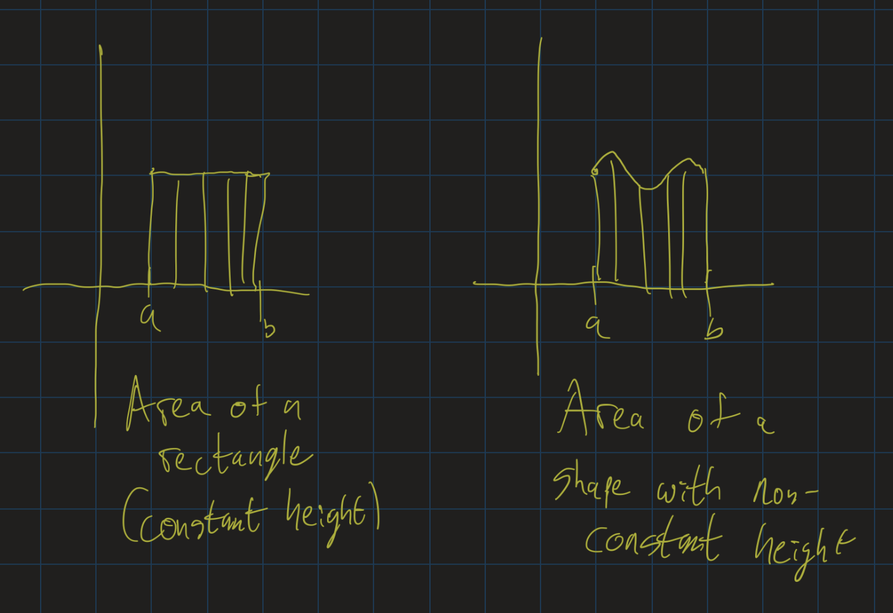

# Calculus I Lesson 22: Applications of Integrals and Substitution
{:.no_toc}

1. Table of Contents
{:toc}

Last time we learned about the Fundamental Theorem of Calculus. This taught us a convenient way to evaluate integrals: if $F(x)$ is any antiderivative of $f(x)$, then:

$$
\int_a^b f(x) dx = F(b) - F(a)
$$

For example, the area under $y = x^2$ from $x = 1$ to $x = 2$ is $\int\limits_1^2 x^2 dx = \left.\frac{x^3}{3} \right\|_1^2$, which is $\frac{8}{3} - \frac{1}{3}$, or $\frac{7}{3}$.

We will be this often to figure out areas under curves in applications problems.

# Application 1: Work

<iframe src="https://www.youtube.com/embed/Iy8Xy6Pw1AI" frameborder="0" allow="accelerometer; autoplay; clipboard-write; encrypted-media; gyroscope; picture-in-picture" allowfullscreen></iframe>

The first application I go through is work done when a force is applied to some object. This is an application from physics: if you apply a *constant* force $F$ to an object to push it a distance $d$, the "work done" to move that object is given by $W = Fd$. This measures how much energy is needed to push that object.

Follow along the example from [Paul's Online Math Notes](https://tutorial.math.lamar.edu/classes/calci/Work.aspx#IntApps_Work_Ex1), an excellent resource for this course. This website goes through many other challenging problems on this application, which involves some knowledge of physics. For those of you without much knowledge of physics, you should be able to follow along this first example at least.

**Example**: (Taken from Paul's Online notes). A spring has a natural length of 20 cm. A 40 N force is required to stretch (and hold the spring) to a length of 30 cm. How much work is done in stretching the spring from 35 cm to 38 cm?

# Application 2: Velocity

<iframe src="https://www.youtube.com/embed/vQGoPOdEexg" frameborder="0" allow="accelerometer; autoplay; clipboard-write; encrypted-media; gyroscope; picture-in-picture" allowfullscreen></iframe>

**Example**: A particle is moving horizontally at a velocity (speed), in meters per second, given by the following function:

$$
v(t) = \begin{cases} 2t - t^2 &\mbox{if } 0 \leq t < 1 \\
1 &\mbox{if } 1 \leq t < 3 \\
4 - t &\mbox{if } 3 \leq t \leq 4 \end{cases}
$$

Compute $\int\limits_0^4 v(t) dt$ and determine what this means, physically. As a hint: break up the integral into $\int\limits_0^1 v(t) dt + \int\limits_1^3 v(t) dt + \int\limits_3^4 v(t) dt$. (See the video above for a graph of the function).

    
Answers hidden:

    
We will compute each integral separately.

    
$$
        \begin{align}
        \int_0^1 v(t) dt &= \int_0^1 2t - t^2 dt \\
        &= \left.t^2 - \frac{t^3}{3}\right|_0^1 \\
        &= \frac{2}{3}
    \end{align}
    $$

    

    $$
    \begin{align}
        \int_1^3 v(t) dt &= \int_0^1 1 dt \\
        &= \left.t \right|_1^3 \\
        &= 2
    \end{align}
    $$
    

    

    $$
    \begin{align}
        \int_3^4 v(t) dt &= \int_3^4 4 - t dt \\
        &= \left.4t - \frac{t^2}{2} \right|_3^4 \\
        &= \frac{1}{2}
    \end{align}
    $$
    

    
Adding these values together we get $\frac{19}{6}$, or about 3.17.

    
The area under this curve represents the idea of adding up these infinitesimally small changes in distance. If we add up a bunch of small changes together, we get the total change. That is: the particle traveled a distance of about 3.17 meters in 4 minutes.

## Integration vs Multiplication

If you have been paying close attention, you may have noticed a pattern:

* Work done by a constant force over a distance: $F \times d$.
* Work done by a non-variable force over a distance: $\int_a^b F(x) dx$.
* Distance traveled by an object moving at constant velocity: $v \times t$.
* Distance traveled by an object moving at a non-constant velocity: $\int_a^b v(t) dt$.

This pattern actually hints at something deeper: many formulas (from physics or from geometry, or possibly other places as well) that use multiplication really assume that the quantities being multiplied are *constant*. But if one quantity can change with respect to another, then multiplication becomes an integral!

This is exactly the difference between the area of a rectangle, and the area under a curve.

This idea that integration is really a kind of generalization of multiplication is explored in depth in [this article from BetterExplained.com](https://betterexplained.com/articles/a-calculus-analogy-integrals-as-multiplication/). Please take the time to read it, as it will give you a really great insight into this phenomenon.

# Integration by Substitution

<iframe src="https://www.youtube.com/embed/HjUA-6K82s4" frameborder="0" allow="accelerometer; autoplay; clipboard-write; encrypted-media; gyroscope; picture-in-picture" allowfullscreen></iframe>

As we have seen, to evaluate definite integrals, it is important to be able to find antiderivatives. This is sometimes not quite easy, and so we need to learn some techniques to help us find antiderivatives. Some of these techniques are based on rules for derivatives. In this course, we will learn one of these techniques: integration by substituion. We can learn more techniques in Calculus 2.

Integration by substitution is based on the chain rule. Let's go through a chain rule example. What's the derivative of $\ln(x^2 + 1)$? Recall: one way to think about this is to make a substitution: let $u = x^2 + 1$, and then we are looking at the derivative of $\ln(u)$. So:

$$
\begin{align}
(\ln(x^2+1))^\prime &= \frac{d}{dx} (\ln(u)) \\
&= \frac{1}{u} \frac{du}{dx} \\
&= \frac{1}{x^2+1} (x^2+1)^\prime \\
&= \frac{2x}{x^2 + 1}
\end{align}
$$

This means that $\int \frac{2x}{x^2 + 1} dx = \ln(x^2 + 1) + C$. How would we figure this out? By making a substitution and working backward.

If we let $u = x^2 + 1$, we notice that this integral is just $\int \frac{1}{u} \cdot \frac{du}{dx} dx$. Notice that it looks like the dx "cancels out" and we are left with $\int \frac{1}{u} du$, which we know is $\ln(u) + C$. Now plug back in $u = x^2 + 1$ and get $\ln(x^2 + 1) + C$, which is exactly what we knew was the general antiderivative!

In other words, the strategy for integration by substitution involves letting $u$ be some expression that appears in the problem, and then replacing $dx$ by $du = \frac{du}{dx} dx$. At that point, we hope to have a simple expression in terms of $u$ and $du$ (no $x$ or $dx$ terms should be left!). Integrate, and then substitute back in for $u$ for your final answer.

**Example**: Find $\int \sin(x) \cos(x) dx$. Here, let $u = \sin(x)$, and $du = \cos(x) dx$. Then we are integrating $\int u du$, which is $\frac{u^2}{2} + C$. Now substitute back and our final answer is $\frac{(\sin(x))^2}{2} + C$.

Notice: we found a term, $\sin(x)$, and its derivative $\cos(x)$ in the formula we were integrating. A good piece of advice: look for a term whose derivative shows up in the problem. Moreover, look for a term whose derivative shows up in the **numerator** of the problem.

A bad example would be $\int \frac{x^2 + 1}{2x} dx$. Here we cannot let $u = x^2 + 1$, since $\frac{du}{dx}$ only shows up in the denominator of the problem, and then wouldn't cancel out with $dx$. In other words, we want to replace $\frac{du}{dx} dx$ by $du$. We can't replace $\frac{dx}{\frac{du}{dx}}$ by $du$.

**Exercises**: Find the following general antiderivatives:

1. $\int \tan(x) dx$. Hint: use $\tan(x) = \frac{\sin(x)}{\cos(x)}$.
2. $\int xe^{x^2} dx$. Hint: if you don't find $\frac{du}{dx}$ anywhere, but you find a constant multiple of $\frac{du}{dx}$, then can you figure out what $du$ would be in terms of $dx$? Maybe you need to multiply or divide by a constant.

    
Check your answers

    <ol>
        <li>Let $u = \cos(x)$, and then $du = -\sin(x) dx$. Pull out the negative and we are integrating $-\int \frac{du}{u}$, which is $-\ln(\cos(x)) + C$. One of the rules for logarithms tells us that $-\ln(\cos(x)) = \ln(\sec(x))$, and so the final answer is usually written as $\ln(\sec(x)) + C$.</li>
        <li>Let $u = x^2$. Then $du = 2x dx$, or $\frac{du}{2} = x dx$. Since we are integrating $e^{x^2} \cdot (x dx)$, when we make our substitution we get $\int \frac{e^u}{2} du$, which is $\frac{1}{2}e^u + C$. Substituting back, our final answer is $\frac{1}{2} e^{x^2} + C$.</li>
    </ol>

Next time, we will look at using substitution with definite integrals.

# Upcoming

* DeltaMath due **Thursday**.
* Exam 3 given out tomorrow, due **next Monday**.
* Final paper due in two weeks.
