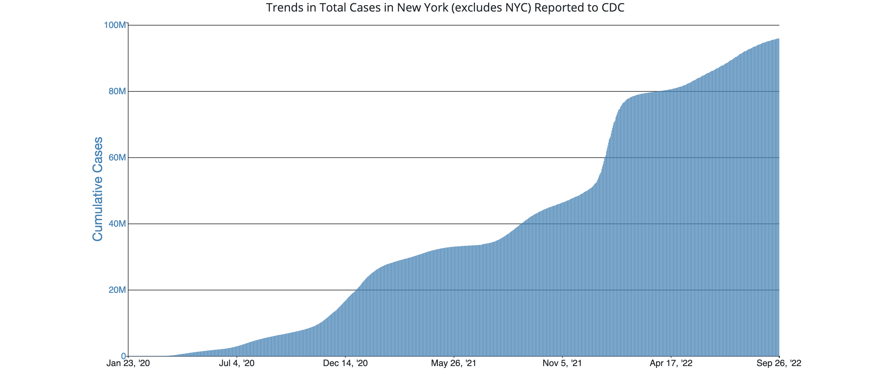
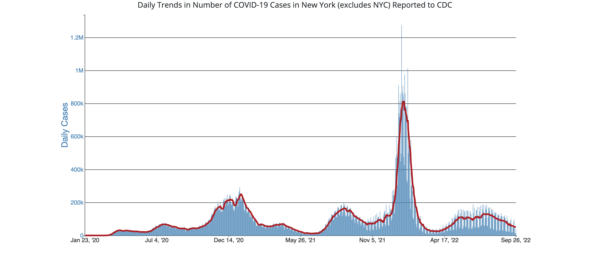

# Calculus I Lesson 8: Differentiability and Continuity
{:.no_toc}

1. Table of Contents
{:toc}

# Differentiability and Continuity

Let's look at some graphs of discontinuous functions. First, with a hole:

<iframe src="https://www.desmos.com/calculator/egipc2b0rh?embed" style="border: 1px solid #ccc" frameborder=0></iframe>

What do you notice about the secant lines to the right and left of 0?

Now let's look at a graph with a jump:

<iframe src="https://www.desmos.com/calculator/3bjmb1eah5?embed" style="border: 1px solid #ccc" frameborder=0></iframe>

Based on the graphs we've seen, which of the following statements are true?

* If the derivative exists at a point, the limit as we approach that point must exist.
* If the derivative exists at x = a, the limit as we approach x = a must equal f(a)
* The derivative can exist at x = a for a function that is not continuous at x = a.

Now let's look at a graph of a continuous function.

<iframe src="https://www.desmos.com/calculator/lvilouocru?embed" style="border: 1px solid #ccc" frameborder=0></iframe>

Based on the previous graphs, what conclusions can we draw? Explain your choices.

* If a function is continuous at a point, it must be differentiable at that point.
* If a function is differentiable at a point, it must be continuous at that point.
* A function can be continuous at a point but not differentiable at that point.
* A function can be differentiable but not continuous at that point.
* None of these can be true.

**Theorem**: Suppose $f(x)$ is differentiable at $x = a$. Then $f(x)$ is continuous at $x = a$.

Proof: The limit as $x \rightarrow a$ of $\dfrac{f(x)-f(a)}{x - a}$ must exist. Suppose it's equal to $L$. Then, as $x \rightarrow a$, $f(x) - f(a) \rightarrow (x - a)L$, which approaches $0$. That means, as $x \rightarrow a$, $f(x) \rightarrow f(a)$.

## Differentiable, Continuous, both, neither

$$
f(x) = \begin{cases}x^2 - 1 &\mbox{if } x < 1 \\
x - 1 &\mbox{if } x \geq 1 \end{cases}
$$

Is $f(x)$ differentiable, continuous, both, or neither at the following points:

* $x = 0$
* $x = 1$
* $x = 2$

## x = 0

$x^2 - 1$ is differentiable at $x = 0$. Therefore it is also continuous.

Answer: **Both**

## x = 1 Differentiable?

Need to check left and right hand limits of

$$
\lim_{x \rightarrow 1} \frac{f(x) - f(1)}{x - 1}
$$

From the left: $\dfrac{(x^2 - 1) - 0}{x - 1} \rightarrow x + 1 \rightarrow 2$.

From the right: $\dfrac{x -1 - 0}{x - 1} \rightarrow 1$. Not differentiable

## x = 1 Continuous?

Now we check if $f(x)$ is continuous at $x = 1$:

* $f(1) = 0$
* ${\displaystyle\lim_{x\rightarrow 1^-}} f(x) = {\displaystyle\lim_{x \rightarrow 1^-}} x^2 - 1 = 0$
* ${\displaystyle \lim_{x\rightarrow 1^+}} f(x) = {\displaystyle \lim_{x \rightarrow 1^+}} x - 1 = 0$.

So $f$ is **continuous** at $x = 1$.

## x = 2

$x - 1$ is differentiable, its derivative is $1$ near $x = 2$. Differentiable functions are continuous, so **both**.

## Graph

<iframe src="https://www.desmos.com/calculator/ark01rjrv4?embed" style="border: 1px solid #ccc" frameborder=0></iframe>

# Higher Order Derivatives
<!-- Start by 11 AM -->

Given a function $f$:

* $f^\prime$: first derivative of $f$ with respect to $x$
  * represents "How fast $f$ is changing at each $x$"
  * positive / negative / 0?
* $f^{\prime\prime}$?: **second** derivative
  * How fast is $f^\prime$ changing?
  * How fast is $f$ **accelerating**?
* $f^{\prime\prime\prime}$?
* $f^{(n)}$ ($n$-th derivative)?

## Physics Example

* Ball thrown straight in the air. $t$ = seconds, $h$ = meters
* $h(t) = -5t^2 + 20t + 2$ meters, $t$ seconds after it is thrown
* What does $h^\prime(t)$ mean?
* What does $h^{\prime\prime}(t)$ mean?

## Crime Example

This graph shows the US Violent Crime Rate over time.

* What does the derivative of this graph represent?
* What does the second derivative of this graph represent?

## COVID-19

Take a look at the following graphs.

**Graph 1**: total COVID cases in NY (excluding NYC) over time:

**Graph 2**: daily COVID cases in NY (excluding NYC) over time:

What does the derivative of each of these graphs represent? What stands out to you about these derivatives?

Sources:

* [Covid Graph 1: Total Cases in NY (excluding NYC) over Time, Jan 2020 - Sept 2022](https://covid.cdc.gov/covid-data-tracker/#trends_totalcases_select_36)
* [Covid Graph 2: Daily Cases in NY (excluding NYC) over Time, Jan 2020 - Sept 2022](https://covid.cdc.gov/covid-data-tracker/#trends_dailycases_select_36)

# Tangent Lines
<!-- Start by 11:40 -->

Recall that we defined the derivative to mean: "the slope of the tangent line". How do we actually figure out what that tangent line is?

**Problem**: Find the equation of the line tangent to $y = x^3 - 2x$ at $x = 1$.

Recall: point-slope form: $y - y_0 = m(x - x_0)$

* Point: $(x_0, y_0)$ is $(x, f(x))$
* Slope: $m = f^\prime(x)$

So how do we find the equation? First find the point. Since we're looking at $x = 1$, we plug in to find $y = 1^3 - 2(1) = -1$, so the point is $(1, -1)$.

Now let's find the slope by taking the derivative. We want the slope at $x = 1$, so we look for $f^\prime(1)$. First find the derivative: $y^\prime = 3x^2 - 2$. At $x = 1$: $3(1)^2 - 2 = 1$.

So our equation is: $y + 1 = 1(x - 1)$, or $y + 1 = x - 1$. Or $y = x- 2$

## Graph

<iframe src="https://www.desmos.com/calculator/cjl3dkoqtl?embed" style="border: 1px solid #ccc" frameborder=0></iframe>

## Meaning of "Tangent Line"

What does the "tangent line" even mean? The idea is that it's the best "linear approximation" of $f(x)$ at $x = a$. In other words: zoom in close to $x = a$ on the graph. The closer we get, the more accurate the tangent line appears.

# Reminders

* DeltaMath HW 4 due tonight.
* DeltaMath HW 5 due Monday.
* Take Home Exam 1 given on Monday, due the following Monday.
