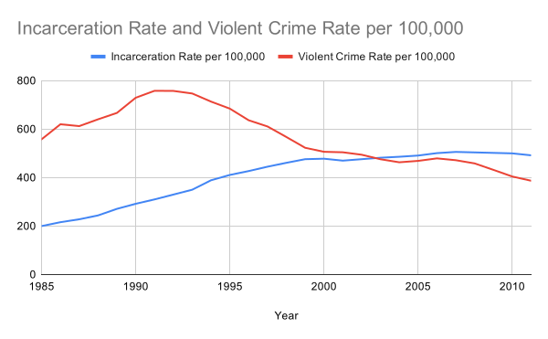
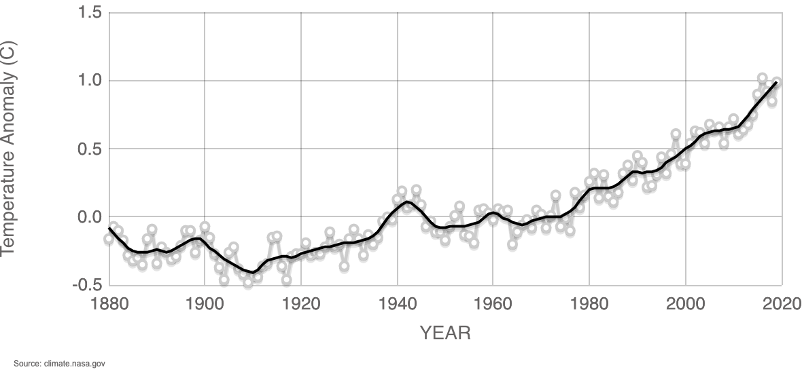

# Calculus I Warm Up

# Violent Crime and Incarceration

\
Sources: FBI (UCR) and Bureau of Justice Statistics

1. For each curve, identify the independent and dependent variables, and whether the curves are graphs of functions.
2. For each curve, identify where the graphs are increasing and decreasing (roughly).
3. Do changes in violent crime rates predict changes in incarceration rates? Put simply: do we imprison more people when more people are committing violent crimes?

# Global Average Temperatures

Go through the same questions 1 and 2 as above. What conclusions can be drawn from this graph?
