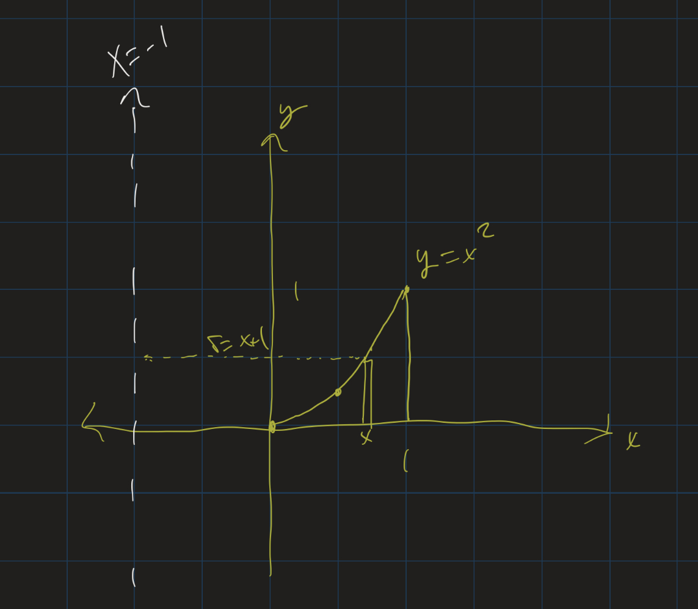
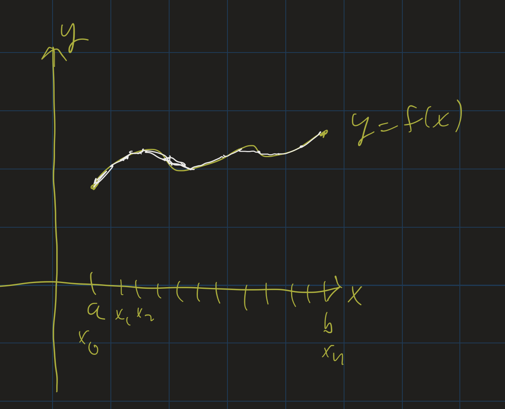

# Calculus II Lesson 10: Volumes (Shell Method) + Arc Length
{: .no_toc}

1. Table of Contents
{:toc}

# Warm Up

**Hand in**: Section 2.2 #78

# Solids of Revolution: Shell Method

Below is an animation of the "cylindrical shell" method: notice that when we revolve a region around the $y$-axis, each tiny vertical "strip" of the region revolves into a thin outer shell of a cylinder. This is why this method is called the "cylindrical shell" method.

<iframe src="https://www.youtube.com/embed/JrRniVSW9tg" frameborder="0" allow="accelerometer; autoplay; clipboard-write; encrypted-media; gyroscope; picture-in-picture" allowfullscreen></iframe>

## Formula

<iframe src="https://www.youtube.com/embed/XImO-sfH2XI" frameborder="0" allow="accelerometer; autoplay; clipboard-write; encrypted-media; gyroscope; picture-in-picture" allowfullscreen></iframe>    

In the above video, I go through and derive the formula for finding the volume of a region using the cylindrical shell method. Rather than copy that over here, I will point you to [Section 2.3](https://openstax.org/books/calculus-volume-2/pages/2-3-volumes-of-revolution-cylindrical-shells) of the textbook which has some nice illustrations as it goes through the steps of finding that formula.

The formula is as follows. Suppose we have a region bounded above by the graph of $y = f(x)$, below by the $x$-axis, to the left by $x = a$, and to the right by $x = b$. If we revolve this region around the $y$-axis, the volume of the solid formed is given by $V = \int_a^b 2\pi x f(x) dx$

## Example

<iframe src="https://www.youtube.com/embed/lFN98fEGw8o" frameborder="0" allow="accelerometer; autoplay; clipboard-write; encrypted-media; gyroscope; picture-in-picture" allowfullscreen></iframe>

In the above video, I go through the example of finding the volume of the solid formed by revolving the region bounded above by $y = x^2$, below by the $x$-axis, to the left by $x = 0$ and to the right by $x = 1$ around the $y$-axis. First, set up the integral:

$$
V = \int_0^1 2\pi x(x^2) dx
$$

We can pull out $2\pi$, and combine $x$ and $x^2$ to $x^3$, and get:

$$
V = 2\pi \int_0^1 x^3 dx
$$

Integrating:

$$
V = 2\pi \left. \frac{x^4}{4} \right|_0^1
$$

Plugging in the endpoints, our volume is $2\pi (\frac{1}{4}) - 2\pi (\frac{0}{4})$, or just $\frac{\pi}{2}$.

    <iframe src="https://www.youtube.com/embed/GfHThSOJjgI" frameborder="0" allow="accelerometer; autoplay; clipboard-write; encrypted-media; gyroscope; picture-in-picture" allowfullscreen></iframe>

In this example, we find the volume of the solid formed by revolving the region bounded above by $y = \sqrt{1 - x^2}$, below by the $x$-axis, to the left by $x = 0$ and to the right by $x = 1$ around the $y$-axis. Again, first set up the integral:

$$
V = \int_0^1 2\pi x \frac{1 - x^2} dx
$$

Here we can use a $u$-substitution. Let $u = 1 - x^2$, and $du = -2x dx$, or $-du = 2x dx$. Then since, when $x = 0$, $u = 1$, and when $x = 1$, $u = 0$, we get the following integral:

$$
V = -\int_1^0 \pi \sqrt{u} du
$$

We can remove the negative sign by switching the order of the bounds:

$$
V = \int_0^1 \pi \sqrt{u} du
$$

Now integrate by using the power rule:

$$
V = \pi \left.(\frac{2}{3} u^{3/2}) \right|_0^1
$$

Plugging in the endpoint, the volume is $\frac{2\pi}{3}$.

## Exercises

To practice, take a look at [Section 2.3](https://openstax.org/books/calculus-volume-2/pages/2-3-volumes-of-revolution-cylindrical-shells#fs-id1167794011626) problems 114-119.

## Revolving around other lines

What happens if we revolve a region around a line that's not the $x$ or $y$-axis? For example, what if we revolve the region bounded above by $y = x^2$, below by the $x$-axis, to the left by $x = 0$ and to the right by $x = 1$ around the line $x = -1$?

If we take any vertical slice of this region, revolving it around the line $x = -1$ will still give us a cylindrical shell, so our volume should still be $V = \int_a^b 2\pi r h dx$. In this case, however, the radius is given by $x + 1$, since the distance from a point $x$ and the line $x = -1$ is $x + 1$.

So we set up the integral:

$$
V = \int_0^1 2\pi (x+1) x^2 dx
$$

We can pull out the $2\pi$ and distribute:

$$
V = 2\pi \int_0^1 (x^3 + x^2) dx
$$

Now integrate:

$$
V = 2\pi \left.(\frac{x^4}{4} + \frac{x^3}{3})\right|_0^1
$$

Plugging in the endpoints, the volume of this region is $2\pi (\frac{7}{12})$, or $\frac{7\pi}{6}$.

**Exercise**: (Hand in): Section 2.3 #145
<!-- Section 2.3 #142, 146, 158  -->

# Arc Length

<iframe src="https://www.youtube.com/embed/vHcS6FDVV2w" frameborder="0" allow="accelerometer; autoplay; clipboard-write; encrypted-media; gyroscope; picture-in-picture" allowfullscreen></iframe>

Our next application of integration comes from arc length. The concept of arc length is fairly simple: if we follow along the path of a curve, how much are we actually moving? That is, if we are in a car, driving along a path, how many miles are we actually putting on our car? Not the "straight-line distance" between our starting and ending points, but the actual, total amount we are driving.

Suppose our path is the graph of a function $y = f(x)$ between two points $x = a$ and $x = b$. We can estimate the length of our path by splitting up that interval into $n$ equally spaced line segments, calling the endpoints $x_0, x_1, \ldots, x_n$.

The distance between two consecutive points on the curve is given by the distance formula: $d = \sqrt{(\Delta x)^2 + (\Delta y)^2}$. So the total length of the curve is approximated as

$$
s \approx \sum_{i=1}^n \sqrt{(\Delta x)^2 + (\Delta y)^2}
$$

(We use $s$ as our "arc length" variable.) As $n \rightarrow \infty$, these approximations become better and better. It's not clear, though, what the integral ends up being, so we need to do a bit more algebra first. If we want to end up with an integral, we need $\Delta x$ by itself (outside of the square root), so let's factor that out:

$$
\sqrt{(\Delta x)^2 + (\Delta y)^2} = \sqrt{(\Delta x)^2 (1 + (\frac{\Delta y}{\Delta x})^2)}
$$

Then we can take the square root of $(\Delta x)^2$, and we get:

$$
s \approx \sum_{i=1}^n \sqrt{1 + (\frac{\Delta y}{\Delta x})^2} \Delta x
$$

Now as $n \rightarrow \infty$, the $\sum \rightarrow \int$, $\frac{\Delta y}{\Delta x} \rightarrow f^\prime(x)$, and $\Delta x \rightarrow dx$, and so we get our integral:

$$
s = \int_a^b \sqrt{1 + (f^\prime(x))^2} dx
$$

## Example

    <iframe src="https://www.youtube.com/embed/Dyez7rPrCAo" frameborder="0" allow="accelerometer; autoplay; clipboard-write; encrypted-media; gyroscope; picture-in-picture" allowfullscreen></iframe>

Here we go through an example of finding the arc length of the "quarter circle" given by $y = \sqrt{1 - x^2}$ from $x = 0$ to $x = 1$.

First we need to compute $\sqrt{1 + (f^\prime(x))^2}$. So we compute $f^\prime(x)$ using the power rule and chain rule:

$$
f^\prime(x) = \frac{-2x}{2\sqrt{1 - x^2}} = -\frac{x}{1 - x^2}
$$

So $(f^{\prime}(x))^2 = \frac{x^2}{1 - x^2}$.

Then we need to see what $1 + (f^\prime)^2$ is. So we add 1 to the above:

$$
1 + \frac{x^2}{1 - x^2} = \frac{(1 - x^2) + x^2}{1 - x^2}
$$

which is just $\frac{1}{1 - x^2}$.

Now we can integrate:

$$
s = \int_0^1 \frac{1}{1 - x^2} dx
$$

If you don't recognize this (I don't blame you), it's an [Inverse Trig](https://openstax.org/books/calculus-volume-2/pages/1-7-integrals-resulting-in-inverse-trigonometric-functions) integral. This turns out to be $\left.\arcsin(x)\right\|_0^1$, or just $\arcsin(1) - \arcsin(0)$. Since $\sin(\pi/2) = 1$, $\arcsin(1) = \pi/2$. And since $\sin(0) = 0$, $\arcsin(0) = 0$. So our answer is $\frac{\pi}{2} - 0$, or just $\frac{\pi}{2}$.

## Exercises

Take a look at [Exercises 165-167, 171-175](https://openstax.org/books/calculus-volume-2/pages/2-4-arc-length-of-a-curve-and-surface-area#fs-id1167793432319) in the textbook to practice these. You may wish to use a calculator to estimate these integrals. There are several available online, including [WolframAlpha](https://www.wolframalpha.com) and [SymboLab](https://www.symbolab.com).

## Catenary Arches

<iframe src="https://www.youtube.com/embed/2VuG-hhgnvM" frameborder="0" allow="accelerometer; autoplay; clipboard-write; encrypted-media; gyroscope; picture-in-picture" allowfullscreen></iframe>    

In the above video, I go through an example of a curve that has a really fascinating property: the area below the curve, between any two points, divided by the length of the curve between those two points, is constant! That is, the area divided by the arc length does not depend on which two points you pick. You'll always get the same ratio of area over arc length.

This curve is called a **catenary** curve. Catenary curves are the curves formed by a hanging chain supported on its ends. Catenary curves are often found in suspension bridges.

If you ever go to Spain, you may see [catenary arches](https://mathstat.slu.edu/escher/index.php/The_Geometry_of_Antoni_Gaudi#Catenary_Arches_and_Catenoids) in some of the architecture of the Spanish architect Antoni Gaudi. Catenary arches have the ability to support large amounts of weight while being constructed from relatively light material.

The catenary curves I studied in the video above are of the form $f(x) = a \frac{e^\frac{x}{a} + e^{-\frac{x}{a}}}{2}$, where $a$ is some constant. I looked, specifically, at $a = 2$. The graph of $f(x) = e^{\frac{x}{2}} + e^{-\frac{x}{2}}$ is given below:

    <iframe src="https://www.desmos.com/calculator/hiko5dnf0p?embed" style="border: 1px solid #ccc" frameborder=0></iframe>

I encourage you to go through the video above and follow along the steps yourself. As an exercise, compute the arc length from $x = -1$ to $x = 1$ of the catenary curve given by:

$$
f(x) = 10 \frac{e^{\frac{x}{10}} + e^{-\frac{x}{10}}}{2}
$$

Use a calculator (graphing or online) to estimate your answer as well as the answer to the problem done in the video. You may be surprised to see that as $a$ increases, the arc length of the catenary curve decreases!

    <iframe src="https://www.desmos.com/calculator/pmmad6b1qj?embed" style="border: 1px solid #ccc" frameborder=0></iframe>

<!-- Section 2.4 #172 -->
