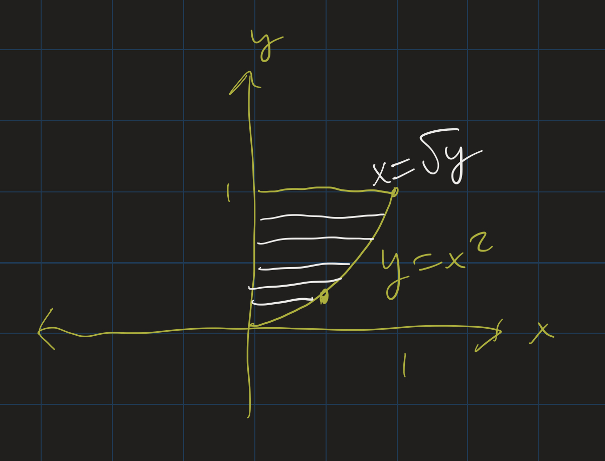

# Calculus II Lesson 11: Arc Length / Differential Equations Intro
{: .no_toc}

1. Table of Contents
{:toc}

# Upcoming

* Today:
  * wrap up volumes and arc length
  * Differential equations intro
* Monday: HW (MyOpenMath)
* Next Friday: Presentation 2 (VoiceThread)
* Next week: quiz
* Exam 2: 2 weeks

# Volumes

* Disk method
* Washer method
* Shell method

More complicated regions:

* Can convert from $y = f(x)$ to $x = g(y)$
* Then use disk / shell / washer?

So we have actually 6 possible formulas:

1. $V = \int_a^b \pi (f(x)^2) dx$.
2. $V = \int_a^b \pi (g(y)^2) dy$.
3. $V = \int_a^b 2\pi x f(x) dx$.
4. $V = \int_a^b \pi (f(x)^2 - g(x)^2) dx$.
5. $V = \int_a^b \pi (g(y)^2 - h(y)^2) dy$.
6. $V = \int_a^b 2\pi y g(y) dy$.

## Activity

Consider the following problems: 

1. Revolve the region bounded by $y = x$, $y = x^2$, $x = 0$ and $x = 1$ around the $x$-axis.
2. Revolve the region bounded by $y = x^2$, $x = 0$, $x = 2$ and $y = 4$ around the $y$-axis.
3. Revolve the region bounded by $y = x^2$, $x = 0$, $x = 2$ and $y = 0$ around the $y$-axis.

In small groups: For each problem:

* Pick the method you will use for this problem.
* Pick the formula you will use for the problem.
* Solve one of the problems.
* Pick one student to present your problem on one of the boards.

# Arc Length

Formula:

$$ s = \int_a^b \sqrt{1 + (f^\prime)^2 } dx $$

* These integrals are tricky.
* Know how to do the algebra to set it up
* Then use a calculator (graphing or online)

First: [review the notes / examples from last time](lesson10.html#arc-length).

* In particular, check out the [notes on catenary arches](lesson10.html#catenary-arches).

## Example

The path of a rock thrown off a 100 meter cliff (approximately) follows the curve $f(t) = 100 - 5t^2$, from $t = 0$ to $t = \sqrt{20}$ seconds. Find the length of the path the rock travels from $t = 0$ to $t = \sqrt{20}$. Round your answer to the nearest hundredth of a meter.

<iframe src="https://www.desmos.com/calculator/7dqbm9j7zs?embed" style="border: 1px solid #ccc" frameborder=0></iframe>

## Example

Arc length of $f(t) = 100 - 5t^2$ from $t = 0$ to $t = \sqrt{20}$. Round your answer to the nearest hundredth of a meter.

$$
\begin{align}
f^\prime(x) = -10x \\
(f^\prime(x))^2 = 100x^2 \\
\int_0^{\sqrt{20}} \sqrt{1 + 100x^2}dx
\end{align}
$$

[WolframAlpha](https://www.wolframalpha.com/input/?i=integral+from+0+to+sqrt%2820%29+of+sqrt%281+%2B+100x%5E2%29+dx): $\approx 100.25$ meters.

## Questions?

Before we move on:

* Questions about volumes?
* Questions about arc length?
* Catenary arch example?

# Differential Equations

* Scientific experiments: can be easier to observe *changes* to data
* Might not know the *actual* formula describing your data
* How a quantity changes may be related to the quantity itself
  * Ex: the more money you have, the more it earns in interest / investment

Sometimes:

* Can be easier to find the relationship between the change and the quantity
* Set up a *differential equation*

## Example

* Suppose we are growing a bacteria culture.
* The larger the culture, the bigger the growth of the culture at any given time.
* Let $m(t)$ be the mass of the culture at time $t$. (Can easily measure its mass.)
* We notice: at any given $t$ (in seconds?), the culture grows at a rate $.05m(t)$
  * Idea: take lots of measurements, compare mass to previous mass. Look for a pattern.
* Initial mass: 2 grams. Mass in 10 minutes?

We have a *differential equation*:

$$m^\prime(t) = .05 m(t)$$

What functions are proportional to their own derivatives? **Exponential functions!** Guess $m(t) = Ae^{kt}$, and use $m^\prime$ and $m(0)$ to find these constants $A$ and $k$.

## Solution (if time)

$$
\begin{align}
m(t) &= Ae^{kt} \\
m^\prime(t) &= Ake^{kt} \\
 &= .05 m(t) \\
 &= .05 Ae^{kt} \\
k &= .05
\end{align}
$$

So we have:

* $m(t) = Ae^{.05t}$
* $m(0) = 2$

Find $A$?

$$
\begin{align}
Ae^{0} = 2 \\
A = 2
\end{align}
$$

Solution:

* $m(t) = 2e^{.05t}$
* $m(10) = 2e^{.5} \approx 3.3$ grams.

# Overview

* Any equation involving the *derivative* of a quantity is known as a **differential equation**.
* Example: $y^\prime = x$.
* A function $y = f(x)$ satisfying that equation is called a **solution** to the differential equation.
* In general: differential equations do not have unique solutions:
  * $y = \frac{x^2}{2}$ is a solution to $y^\prime = x$.
  * $y = \frac{x^2}{2} + 1$ is another solution.

## Solutions to differential equations

* We look for a **general form** for a solution:
  * $y = \frac{x^2}{2} + C$.
* If we have an **initial condition**, we can find an exact solution.
  * Suppose $y^\prime = x$ and $y(0) = -1$.
  * Then $y = \frac{x^2}{2} + C$.
  * $-1 = \frac{0^2}{2} + C$
  * $C = -1$.
  * So: $y = \frac{x^2}{2} - 1$.

## Order

The **order** of a differential equation is the highest derivative that appears in the equation. **Exercise**: Identify the orders of the following:

1. $y^\prime = y + x$
2. $(y^\prime)^2 = (y - x)^2$
3. $y^{\prime\prime} = -y$
4. $y^{\prime\prime\prime} + (y^\prime)^5 = y$

We will mostly focus on first-order differential equations, but some simple higher order differential equations can be solved.

## Example

A ball is thrown straight into the air with an initial velocity of 5 meters per second. It is acted on by a constant, downward force of gravity, causing an acceleration of $-9.8$ $m/s^2$.

1. Find a formula $v(t)$ for the velocity at time $t$ seconds after the ball is thrown.
2. How many seconds after the ball is thrown does it reach its maximum height?
3. If the ball is thrown at a height of 2 meters above the ground, what is the maximum height reached?

## Solution 

Since $v^\prime(t) = a(t)$, and $a(t) = -9.8$, we know:

* $v^\prime(t) = -9.8$
* $v(0) = 5$.

So: $v(t) = -9.8t + C$. Since $v(0) = 5$, we can compute $5 = -9.8(0) + C$, so $C = 5$.

So our formula for the velocity is $v(t) = -9.8t + 5$. Going back to Calc I:

* the ball reaches its maximum height when its upward velocity is 0
* $v(t) = -9.8t + 5 = 0$
* Solve for $t$: $t = \frac{-5}{-9.8} \approx .51$ seconds.
* Derivative of height: velocity.
* $h^\prime(t) = -9.8t + 5$.
* So: $h(t) = -4.9t^2 + 5t + C$.
* $h(0) = 2$ means $-4.9(0) + 5(0) + C = 2$
* So $C = 2$

Therefore $h(t) = -4.9t^2 + 5t + 2$. Then $h(\frac{5}{9.8}) \approx 3.28$ meters. This is basically the exam 1 extra credit problem.

## Wrap-up

* We really solved a *second-order* differential equation:
* $h^{\prime\prime}(t) = -9.8$
* Initial condition: $h(0) = 2$ and $h^\prime(0) = 5$.
* We did this by splitting it up into two steps:
  * First find $h^\prime(t)$
  * Then find $h(t)$.
