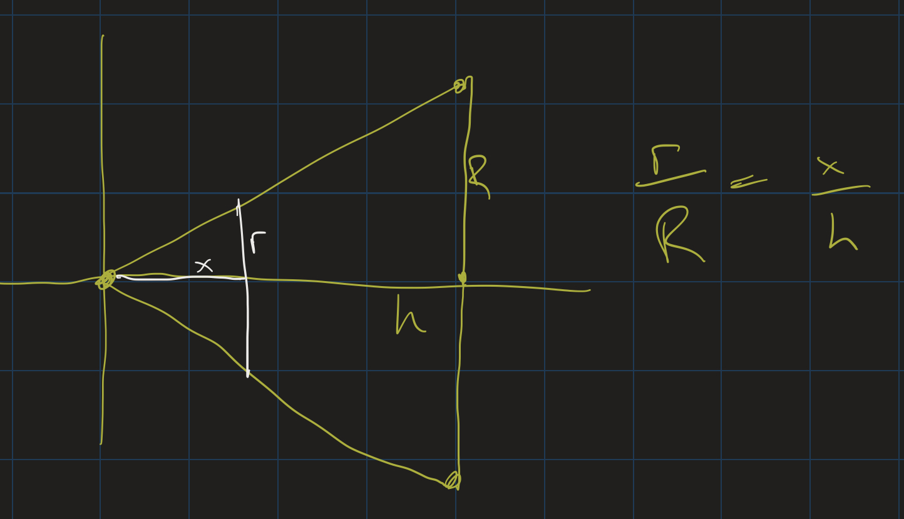
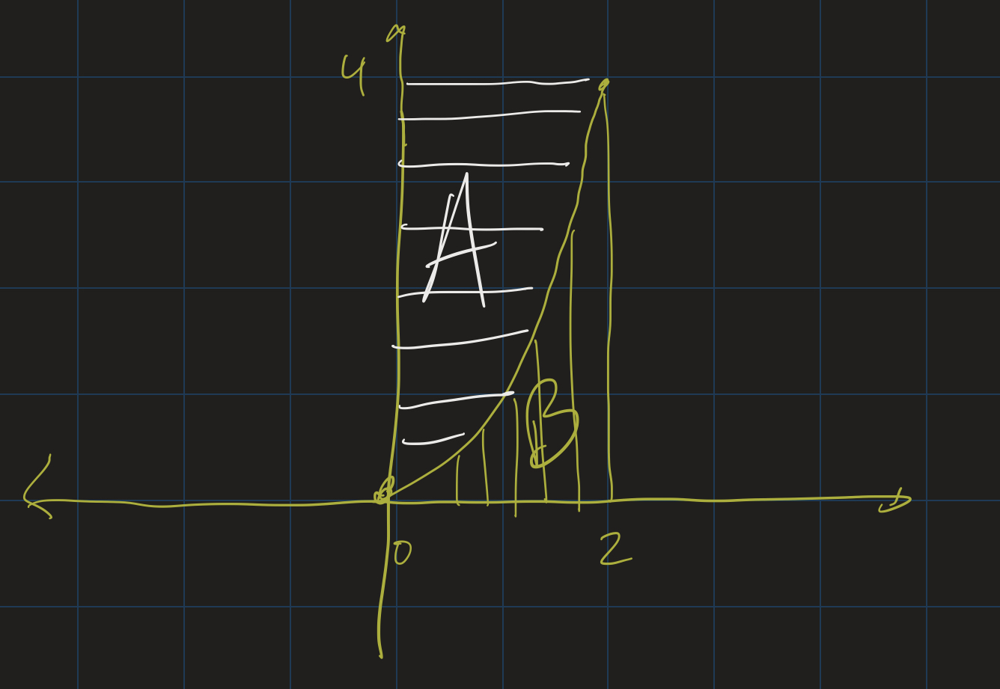

# Calculus II Lesson 9: Volumes
{: .no_toc}

1. Table of Contents
{:toc}

# Questions?

* Improper integrals?
* Areas between curves?
* Homework?

# Volumes

General strategy:

* Take thin slices of 3D figure
* Find formula for $A(x)$, the area of one cross-section
* $V = \int_a^b A(x) dx$

## Slicing a Sphere

**Problem**: Derive the formula for the volume of a sphere of radius $R$. ($R$ is a fixed constant.)

* What is the formula for the area of the "slice" that's $x$-units from the origin?
* $A = \pi(R^2 - x^2)$.
* Multiply that area by a small "thickness" $\Delta x$: $\pi (R^2 - x^2) \Delta x$.
* Add all of these up and take the limit as $\Delta x$ goes to 0?

The formula we get is $V = \int_0^R \pi (R^2 - x^2) dx$. Evaluate this integral?

## Slicing a Cone

**Problem**: Derive the formula for the volume of a (right-circular) cone whose base has a radius $R$ and whose height is $h$.

* Cross sections are circles
* Area of a circle: $\pi r^2$.
* Radius of circle at height $x$?

Notice the similar triangles: 

**Solution**: First we see that $r = \frac{Rx}{h}$, so the area of that slice is $\pi (\frac{Rx}{h})^2$. Set up the volume integral:

$$
\begin{align}
V &= \int_0^h \pi (\frac{Rx}{h})^2 dx \\
  &= \pi \frac{R^2}{h^2} \int_0^h x^2 dx \\
  &= \left. \pi \frac{R^2}{h^2} \frac{x^3}{3} \right|_0^3 \\
  &= \pi \frac{R^2}{h^2} \frac{h^3}{3} \\
  &= \frac{1}{3} \pi R^2 h
\end{align}
$$

# Revolution

Other three dimensional figures can be found by *revolving 2D regions around axes*.

<iframe src="https://www.youtube.com/embed/i4L5XoUBD_Q" frameborder="0" allow="accelerometer; autoplay; clipboard-write; encrypted-media; gyroscope; picture-in-picture" allowfullscreen></iframe>

## Notice

When we revolve an entire region bounded by a curve $y = f(x)$ around the $x$-axis:

* Cross sections are circle: $A(x) = \pi r^2$.
* $r = f(x)$: the radius of each circle is $f(x)$!
* $V = \int_a^b \pi (f(x))^2 dx$

## Example

Find the volume of the solid formed by revolving the region bounded above by $y = x^2$, below by the $x$-axis, between $x = 0$ and $x = 2$, around the $x$-axis.

[Geogebra demo](https://www.geogebra.org/m/z2ubhjru)

## Solution

$$
\begin{align*}
V &= \int_0^2 \pi (x^2)^2 dx \\
&= \pi \int_0^2 x^4 dx \\
&= \pi \left.\frac{x^5}{5} \right|_0^2 \\
&= \frac{32\pi}{5} \approx 20.1
\end{align*}
$$

## Exercise

1. Find the volume of the solid formed by revolving the region bounded by $f(x) = 1 - x^2$, $x = 0$, $x = 1$, and the $x$-axis around the $x$-axis.
2. Find the volume of solid formed by revolving the region bounded on the left by $x = 1$, and above by $y = \frac{1}{x}$, around the $x$-axis.

Try to sketch the 3D solids that are formed in each case.

## Gabriel's Horn

* "Gabriel's Horn" (Who is Gabriel?)
* Finite Volume
* Infinite length?
* 2D Projection: infinite area
* Infinite surface area

## Washer Method

What if we revolve a region bounded between two curves around the $x$-axis?

<iframe src="https://www.youtube.com/embed/3oAjcLD34kc?start=23" frameborder="0" allow="accelerometer; autoplay; clipboard-write; encrypted-media; gyroscope; picture-in-picture" allowfullscreen></iframe>

## Cross Sections

* Cross sections are *washers*, outer radius $R$, inner radius $r$
* Area of a washer: $\pi (R^2 - r^2)$
* $R = f(x)$, $r = g(x)$.
* $V = \int_a^b \pi [(f(x))^2 - (g(x))^2] dx$

## Example

Find the volume of the solid formed by revolving the region bounded by $y = \sin(x)$ and $y = \cos(x)$ from $x = 0$ to $x = \frac{\pi}{4}$ around the $x$-axis.

## Solution

$$
\begin{align}
V &= \int_0^{\pi/4} \pi (\cos^2(x) - \sin^2(x)) dx \\
&= \pi \int_0^{\pi/4} \cos(2x) dx \\
&= \left. \pi \frac{\sin(2x)}{2} \right|_0^{\pi/4} \\
&= \pi \cdot \frac{\sin(\pi/2)}{2} = \frac{\pi}{2}
\end{align}
$$

# Shells

\

* Revolving regions around the y-axis?
* Which region?
* A: disk method. Convert to an integral using $y$ and $dy$
* B? Something else.

<iframe src="https://www.youtube.com/embed/JrRniVSW9tg" frameborder="0" allow="accelerometer; autoplay; clipboard-write; encrypted-media; gyroscope; picture-in-picture" allowfullscreen></iframe>

## Shell Method

* Volume of one shell: $2\pi rh\Delta x$ (Why?)
* $r \approx x$
* $h \approx f(x)$.
* $V = \int_a^b 2 \pi x f(x) dx$

# Upcoming

* MyOpenMath homework will be posted and due next Friday.
* There will be another problem presentation soon.
  * I owe you grades on presentation 1, that's coming!
