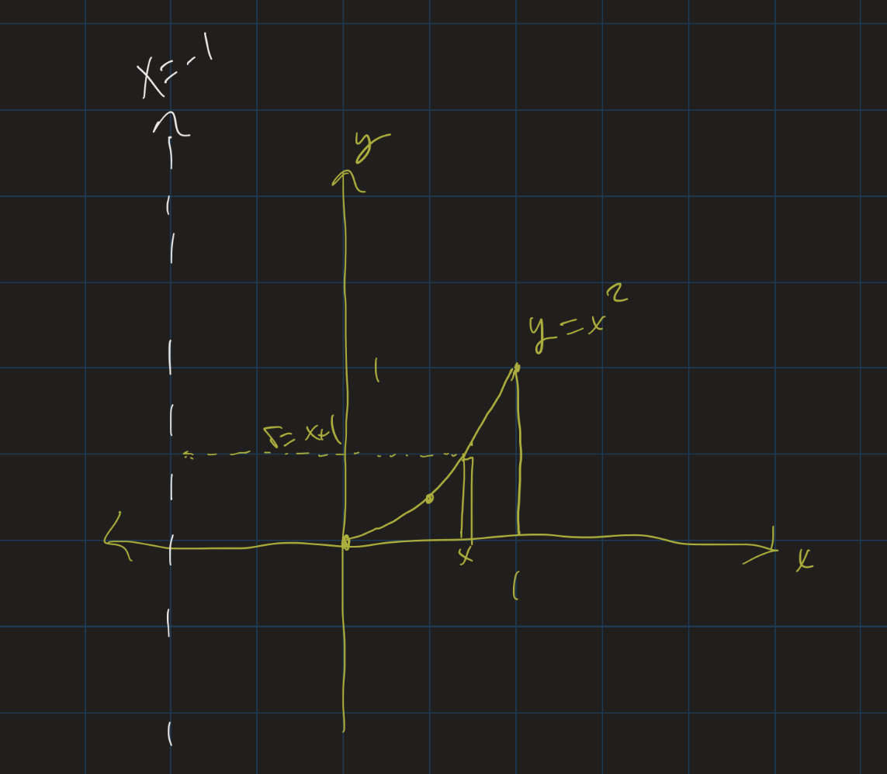

# Calculus II Lesson 10: Volumes (Disk, Washer, and Shell Methods)
{: .no_toc}

1. Table of Contents
{:toc}

# Presentations

We will start with our problem presentations.

# Solids of Revolution: Disk method

Other three dimensional figures can be found by *revolving 2D regions around axes*.

<iframe src="https://www.youtube.com/embed/i4L5XoUBD_Q" frameborder="0" allow="accelerometer; autoplay; clipboard-write; encrypted-media; gyroscope; picture-in-picture"></iframe>

## Notice

When we revolve an entire region bounded by a curve $y = f(x)$ around the $x$-axis:

* Cross sections are **disks**: $A(x) = \pi r^2$.
* $r = f(x)$: the radius of each disk is $f(x)$!
* $V = \int_a^b \pi (f(x))^2 dx$

## Example

Find the volume of the solid formed by revolving the region bounded above by $y = x^2$, below by the $x$-axis, between $x = 0$ and $x = 2$, around the $x$-axis.

[Geogebra demo](https://www.geogebra.org/m/z2ubhjru)

## Solution

$$
\begin{align*}
V &= \int_0^2 \pi (x^2)^2 dx \\
&= \pi \int_0^2 x^4 dx \\
&= \pi \left.\frac{x^5}{5} \right|_0^2 \\
&= \frac{32\pi}{5} \approx 20.1
\end{align*}
$$

## Exercise

1. Find the volume of the solid formed by revolving the region bounded by $f(x) = 1 - x^2$, $x = 0$, $x = 1$, and the $x$-axis around the $x$-axis.
2. Find the volume of solid formed by revolving the region bounded on the left by $x = 1$, and above by $y = \frac{1}{x}$, around the $x$-axis. (This region goes off to $\infty$ on the right.)

Try to sketch the 3D solids that are formed in each case.

## Gabriel's Horn

* "Gabriel's Horn" (Who is Gabriel?)
* Finite Volume
* Infinite length?
* 2D Projection: infinite area
* Infinite surface area

## Washer Method

What if we revolve a region bounded **between two curves** around the $x$-axis?

<iframe src="https://www.youtube.com/embed/3oAjcLD34kc?start=23" frameborder="0" allow="accelerometer; autoplay; clipboard-write; encrypted-media; gyroscope; picture-in-picture"></iframe>

## Cross Sections

* Cross sections are *washers*, outer radius $R$, inner radius $r$
* Area of a washer: $\pi (R^2 - r^2)$
* $R = f(x)$, $r = g(x)$.
* $V = \int_a^b \pi [(f(x))^2 - (g(x))^2] dx$

## Example

Find the volume of the solid formed by revolving the region bounded by $y = \sin(x)$ and $y = \cos(x)$ from $x = 0$ to $x = \frac{\pi}{4}$ around the $x$-axis.

## Solution

$$
\begin{align}
V &= \int_0^{\pi/4} \pi (\cos^2(x) - \sin^2(x)) dx \\
&= \pi \int_0^{\pi/4} \cos(2x) dx \\
&= \left. \pi \frac{\sin(2x)}{2} \right|_0^{\pi/4} \\
&= \pi \cdot \frac{\sin(\pi/2)}{2} = \frac{\pi}{2}
\end{align}
$$

# Solids of Revolution: Shell Method

Below is an animation of the "cylindrical shell" method: notice that when we revolve a region around the $y$-axis, each tiny vertical "strip" of the region revolves into a thin outer shell of a cylinder. This is why this method is called the "cylindrical shell" method.

<iframe src="https://www.youtube.com/embed/JrRniVSW9tg" frameborder="0" allow="accelerometer; autoplay; clipboard-write; encrypted-media; gyroscope; picture-in-picture" allowfullscreen></iframe>

## Formula

<iframe src="https://www.youtube.com/embed/XImO-sfH2XI" frameborder="0" allow="accelerometer; autoplay; clipboard-write; encrypted-media; gyroscope; picture-in-picture" allowfullscreen></iframe>    

In the above video, I go through and derive the formula for finding the volume of a region using the cylindrical shell method. Rather than copy that over here, I will point you to [Section 2.3](https://openstax.org/books/calculus-volume-2/pages/2-3-volumes-of-revolution-cylindrical-shells) of the textbook which has some nice illustrations as it goes through the steps of finding that formula.

The formula is as follows. Suppose we have a region bounded above by the graph of $y = f(x)$, below by the $x$-axis, to the left by $x = a$, and to the right by $x = b$. If we revolve this region around the $y$-axis, the volume of the solid formed is given by $V = \int_a^b 2\pi x f(x) dx$

## Example

<iframe src="https://www.youtube.com/embed/lFN98fEGw8o" frameborder="0" allow="accelerometer; autoplay; clipboard-write; encrypted-media; gyroscope; picture-in-picture" allowfullscreen></iframe>

In the above video, I go through the example of finding the volume of the solid formed by revolving the region bounded above by $y = x^2$, below by the $x$-axis, to the left by $x = 0$ and to the right by $x = 1$ around the $y$-axis. First, set up the integral:

$$
V = \int_0^1 2\pi x(x^2) dx
$$

We can pull out $2\pi$, and combine $x$ and $x^2$ to $x^3$, and get:

$$
V = 2\pi \int_0^1 x^3 dx
$$

Integrating:

$$
V = 2\pi \left. \frac{x^4}{4} \right|_0^1
$$

Plugging in the endpoints, our volume is $2\pi (\frac{1}{4}) - 2\pi (\frac{0}{4})$, or just $\frac{\pi}{2}$.

    <iframe src="https://www.youtube.com/embed/GfHThSOJjgI" frameborder="0" allow="accelerometer; autoplay; clipboard-write; encrypted-media; gyroscope; picture-in-picture" allowfullscreen></iframe>

In this example, we find the volume of the solid formed by revolving the region bounded above by $y = \sqrt{1 - x^2}$, below by the $x$-axis, to the left by $x = 0$ and to the right by $x = 1$ around the $y$-axis. Again, first set up the integral:

$$
V = \int_0^1 2\pi x \frac{1 - x^2} dx
$$

Here we can use a $u$-substitution. Let $u = 1 - x^2$, and $du = -2x dx$, or $-du = 2x dx$. Then since, when $x = 0$, $u = 1$, and when $x = 1$, $u = 0$, we get the following integral:

$$
V = -\int_1^0 \pi \sqrt{u} du
$$

We can remove the negative sign by switching the order of the bounds:

$$
V = \int_0^1 \pi \sqrt{u} du
$$

Now integrate by using the power rule:

$$
V = \pi \left.(\frac{2}{3} u^{3/2}) \right|_0^1
$$

Plugging in the endpoint, the volume is $\frac{2\pi}{3}$.

## Exercises

To practice, take a look at [Section 2.3](https://openstax.org/books/calculus-volume-2/pages/2-3-volumes-of-revolution-cylindrical-shells#fs-id1167794011626) problems 114-119.

## Revolving around other lines

What happens if we revolve a region around a line that's not the $x$ or $y$-axis? For example, what if we revolve the region bounded above by $y = x^2$, below by the $x$-axis, to the left by $x = 0$ and to the right by $x = 1$ around the line $x = -1$?

If we take any vertical slice of this region, revolving it around the line $x = -1$ will still give us a cylindrical shell, so our volume should still be $V = \int_a^b 2\pi r h dx$. In this case, however, the radius is given by $x + 1$, since the distance from a point $x$ and the line $x = -1$ is $x + 1$.

So we set up the integral:

$$
V = \int_0^1 2\pi (x+1) x^2 dx
$$

We can pull out the $2\pi$ and distribute:

$$
V = 2\pi \int_0^1 (x^3 + x^2) dx
$$

Now integrate:

$$
V = 2\pi \left.(\frac{x^4}{4} + \frac{x^3}{3})\right|_0^1
$$

Plugging in the endpoints, the volume of this region is $2\pi (\frac{7}{12})$, or $\frac{7\pi}{6}$.

**Exercise**: (Hand in): Section 2.3 #145
<!-- Section 2.3 #142, 146, 158  -->
