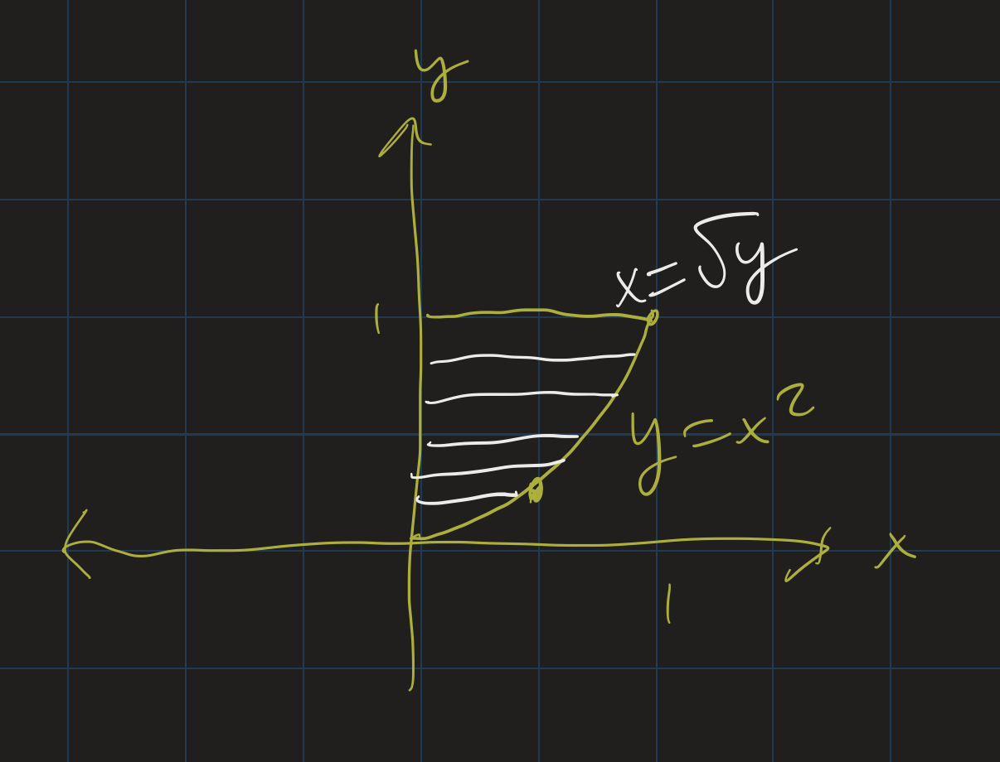
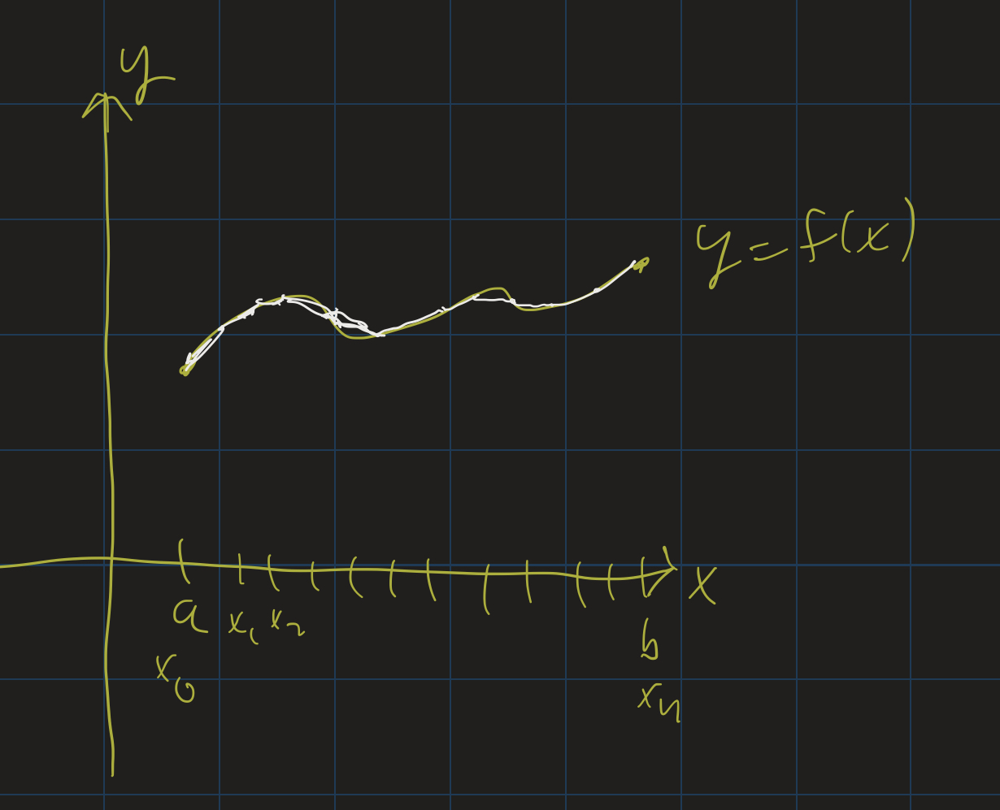

# Calculus II Lesson 11: Arc Length
{: .no_toc}

1. Table of Contents
{:toc}

# Presentations

# Upcoming

* Today:
  * wrap up volumes, start arc length
* Monday: HW (MyOpenMath)
* Next week: quiz
* Exam 2: 2 weeks (March 19)
  * Bring a **graphing calculator**!

# Volumes

* Disk method
* Washer method
* Shell method

More complicated regions:

* Can convert from $y = f(x)$ to $x = g(y)$
* Then use disk / shell / washer?

So we have actually 6 possible formulas:

1. $V = \int_a^b \pi (f(x)^2) dx$.
2. $V = \int_a^b \pi (g(y)^2) dy$.
3. $V = \int_a^b 2\pi x f(x) dx$.
4. $V = \int_a^b \pi (f(x)^2 - g(x)^2) dx$.
5. $V = \int_a^b \pi (g(y)^2 - h(y)^2) dy$.
6. $V = \int_a^b 2\pi y g(y) dy$.

## Activity

Consider the following problems: 

1. Revolve the region bounded by $y = x$, $y = x^2$, $x = 0$ and $x = 1$ around the $x$-axis.
2. Revolve the region bounded by $y = x^2$, $x = 0$, $x = 2$ and $y = 4$ around the $y$-axis.
3. Revolve the region bounded by $y = x^2$, $x = 0$, $x = 2$ and $y = 0$ around the $y$-axis.

In small groups: For each problem:

* Pick the method you will use for this problem.
* Pick the formula you will use for the problem.
* Solve one of the problems.
* Pick one student to present your problem on one of the boards.

# Arc Length

<iframe src="https://www.youtube.com/embed/vHcS6FDVV2w" frameborder="0" allow="accelerometer; autoplay; clipboard-write; encrypted-media; gyroscope; picture-in-picture"></iframe>

Our next application of integration comes from arc length. The concept of arc length is fairly simple: if we follow along the path of a curve, how much are we actually moving? That is, if we are in a car, driving along a path, how many miles are we actually putting on our car? Not the "straight-line distance" between our starting and ending points, but the actual, total amount we are driving.

Suppose our path is the graph of a function $y = f(x)$ between two points $x = a$ and $x = b$. We can estimate the length of our path by splitting up that interval into $n$ equally spaced line segments, calling the endpoints $x_0, x_1, \ldots, x_n$.

The distance between two consecutive points on the curve is given by the distance formula: $d = \sqrt{(\Delta x)^2 + (\Delta y)^2}$. So the total length of the curve is approximated as

$$
s \approx \sum_{i=1}^n \sqrt{(\Delta x)^2 + (\Delta y)^2}
$$

(We use $s$ as our "arc length" variable.) As $n \rightarrow \infty$, these approximations become better and better. It's not clear, though, what the integral ends up being, so we need to do a bit more algebra first. If we want to end up with an integral, we need $\Delta x$ by itself (outside of the square root), so let's factor that out:

$$
\sqrt{(\Delta x)^2 + (\Delta y)^2} = \sqrt{(\Delta x)^2 (1 + (\frac{\Delta y}{\Delta x})^2)}
$$

Then we can take the square root of $(\Delta x)^2$, and we get:

$$
s \approx \sum_{i=1}^n \sqrt{1 + (\frac{\Delta y}{\Delta x})^2} \Delta x
$$

Now as $n \rightarrow \infty$, the $\sum \rightarrow \int$, $\frac{\Delta y}{\Delta x} \rightarrow f^\prime(x)$, and $\Delta x \rightarrow dx$, and so we get our integral:

$$
s = \int_a^b \sqrt{1 + (f^\prime(x))^2} dx
$$

## Example

    <iframe src="https://www.youtube.com/embed/Dyez7rPrCAo" frameborder="0" allow="accelerometer; autoplay; clipboard-write; encrypted-media; gyroscope; picture-in-picture"></iframe>

Here we go through an example of finding the arc length of the "quarter circle" given by $y = \sqrt{1 - x^2}$ from $x = 0$ to $x = 1$.

First we need to compute $\sqrt{1 + (f^\prime(x))^2}$. So we compute $f^\prime(x)$ using the power rule and chain rule:

$$
f^\prime(x) = \frac{-2x}{2\sqrt{1 - x^2}} = -\frac{x}{1 - x^2}
$$

So $(f^{\prime}(x))^2 = \frac{x^2}{1 - x^2}$.

Then we need to see what $1 + (f^\prime)^2$ is. So we add 1 to the above:

$$
1 + \frac{x^2}{1 - x^2} = \frac{(1 - x^2) + x^2}{1 - x^2}
$$

which is just $\frac{1}{1 - x^2}$.

Now we can integrate:

$$
s = \int_0^1 \frac{1}{1 - x^2} dx
$$

If you don't recognize this (I don't blame you), it's an [Inverse Trig](https://openstax.org/books/calculus-volume-2/pages/1-7-integrals-resulting-in-inverse-trigonometric-functions) integral. This turns out to be $\left.\arcsin(x)\right\|_0^1$, or just $\arcsin(1) - \arcsin(0)$. Since $\sin(\pi/2) = 1$, $\arcsin(1) = \pi/2$. And since $\sin(0) = 0$, $\arcsin(0) = 0$. So our answer is $\frac{\pi}{2} - 0$, or just $\frac{\pi}{2}$.

## Exercises

Take a look at [Exercises 165-167, 171-175](https://openstax.org/books/calculus-volume-2/pages/2-4-arc-length-of-a-curve-and-surface-area#fs-id1167793432319) in the textbook to practice these. You may wish to use a calculator to estimate these integrals. There are several available online, including [WolframAlpha](https://www.wolframalpha.com) and [SymboLab](https://www.symbolab.com).

## Catenary Arches

<iframe src="https://www.youtube.com/embed/2VuG-hhgnvM" frameborder="0" allow="accelerometer; autoplay; clipboard-write; encrypted-media; gyroscope; picture-in-picture"></iframe>    

In the above video, I go through an example of a curve that has a really fascinating property: the area below the curve, between any two points, divided by the length of the curve between those two points, is constant! That is, the area divided by the arc length does not depend on which two points you pick. You'll always get the same ratio of area over arc length.

This curve is called a **catenary** curve. Catenary curves are the curves formed by a hanging chain supported on its ends. Catenary curves are often found in suspension bridges.

If you ever go to Spain, you may see [catenary arches](https://mathstat.slu.edu/escher/index.php/The_Geometry_of_Antoni_Gaudi#Catenary_Arches_and_Catenoids) in some of the architecture of the Spanish architect Antoni Gaudi. Catenary arches have the ability to support large amounts of weight while being constructed from relatively light material.

The catenary curves I studied in the video above are of the form $f(x) = a \frac{e^\frac{x}{a} + e^{-\frac{x}{a}}}{2}$, where $a$ is some constant. I looked, specifically, at $a = 2$. The graph of $f(x) = e^{\frac{x}{2}} + e^{-\frac{x}{2}}$ is given below:

    <iframe src="https://www.desmos.com/calculator/hiko5dnf0p?embed" style="border: 1px solid #ccc" frameborder=0></iframe>

I encourage you to go through the video above and follow along the steps yourself. As an exercise, compute the arc length from $x = -1$ to $x = 1$ of the catenary curve given by:

$$
f(x) = 10 \frac{e^{\frac{x}{10}} + e^{-\frac{x}{10}}}{2}
$$

Use a calculator (graphing or online) to estimate your answer as well as the answer to the problem done in the video. You may be surprised to see that as $a$ increases, the arc length of the catenary curve decreases!

    <iframe src="https://www.desmos.com/calculator/pmmad6b1qj?embed" style="border: 1px solid #ccc" frameborder=0></iframe>

**Classwork**: Hand in Section 2.4 #172.

Formula:

$$ s = \int_a^b \sqrt{1 + (f^\prime)^2 } dx $$

* These integrals are tricky.
* Know how to do the algebra to set it up
* Then use a calculator (graphing or online)

## Example

The path of a rock thrown off a 100 meter cliff (approximately) follows the curve $f(t) = 100 - 5t^2$, from $t = 0$ to $t = \sqrt{20}$ seconds. Find the length of the path the rock travels from $t = 0$ to $t = \sqrt{20}$. Round your answer to the nearest hundredth of a meter.

<iframe src="https://www.desmos.com/calculator/7dqbm9j7zs?embed" style="border: 1px solid #ccc" frameborder=0></iframe>

## Example

Arc length of $f(t) = 100 - 5t^2$ from $t = 0$ to $t = \sqrt{20}$. Round your answer to the nearest hundredth of a meter.

$$
\begin{align}
f^\prime(x) = -10x \\
(f^\prime(x))^2 = 100x^2 \\
\int_0^{\sqrt{20}} \sqrt{1 + 100x^2}dx
\end{align}
$$

[WolframAlpha](https://www.wolframalpha.com/input/?i=integral+from+0+to+sqrt%2820%29+of+sqrt%281+%2B+100x%5E2%29+dx): $\approx 100.25$ meters.
