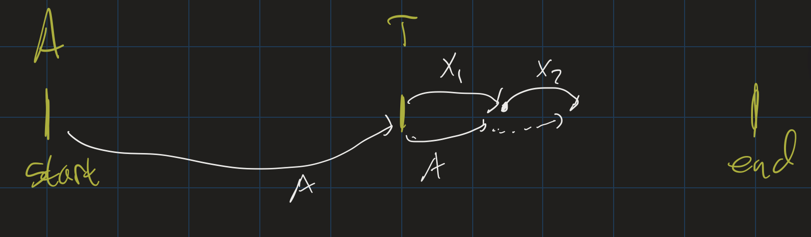
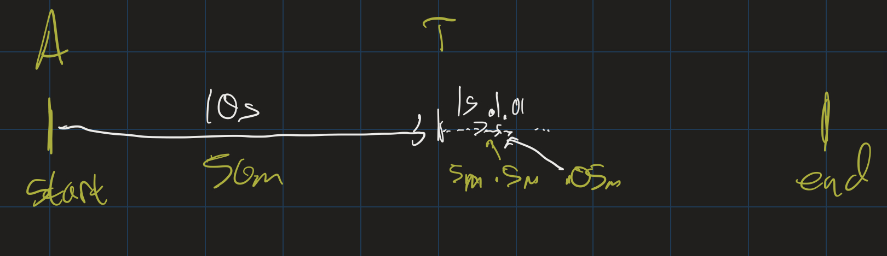

# Calculus II Lesson 19: Infinite Series
{: .no_toc}

1. Table of Contents
{:toc}

# Achilles and the Tortoise

<iframe src="https://www.youtube.com/embed/UCe7ftOhedc" title="YouTube video player" frameborder="0" allow="accelerometer; autoplay; clipboard-write; encrypted-media; gyroscope; picture-in-picture" allowfullscreen></iframe>

[Zeno of Elea](https://en.wikipedia.org/wiki/Zeno_of_Elea) was a Greek philosopher famous for his "Paradoxes of Motion". He posed several of these paradoxes, but I wanted to discuss the [paradox of Achilles and the Tortoise](https://plato.stanford.edu/entries/paradox-zeno/#AchTor):

> The [second] argument was called “Achilles,” accordingly, from the fact that Achilles was taken [as a character] in it, and the argument says that it is impossible for him to overtake the tortoise when pursuing it. For in fact it is necessary that what is to overtake [something], before overtaking [it], first reach the limit from which what is fleeing set forth. In [the time in] which what is pursuing arrives at this, what is fleeing will advance a certain interval, even if it is less than that which what is pursuing advanced …. And in the time again in which what is pursuing will traverse this [interval] which what is fleeing advanced, in this time again what is fleeing will traverse some amount …. And thus in every time in which what is pursuing will traverse the [interval] which what is fleeing, being slower, has already advanced, what is fleeing will also advance some amount. (Simplicius, *On Aristotle’s Physics*)

Suppose we have a $100m$ race between Achilles (a hero) who can run fast, and a Tortoise (a very slow animal). For the sake of argument, suppose Achilles can run at a speed of $5 m/s$, while the Tortoise can run at a speed of $0.5 m/s$. To make the race fair, we can have the Tortoise have a $50m$ head start. Zeno claims that Achilles will never catch up to the Tortoise!

* First, Achilles will need to run the $50m$ it was behind the Tortoise.
* In that time, the Tortoise will have moved some amount $x_1$.
* Then Achilles needs to run $x_1$ meters to catch up to where the Tortoise was.
* In that time, the Tortoise will have moved some amount $x_2$.
* Keep going: Achilles will *never* catch up to the Tortoise, because as soon as he catches up to where the Tortoise was, the Tortoise will have moved (albeit a small amount) forward.

Where does this argument go wrong? Let's do some actual math here, knowing that Achilles runs $5 m/s$, the Tortoise runs $0.5 m/s$, and the Tortoise is initially $50m$ ahead of Achilles:

* It takes $10s$ for Achilles to catch up to the Tortoise's starting position.
* In that time, the Tortoise moves $5m$.
* It takes $1s$ for Achilles to catch up to this position.
* In that time, the Tortoise moves $0.5m$.
* It takes $0.1s$ for Achilles to catch up to this position.
* In that time, the Tortoise moves $0.05s$.
* etc.

In other words, Achilles will catch up to the Tortoise after $10 + 1 + 0.1 + 0.01 + \ldots$ seconds! This is an infinite sum. But it is an actual number: it's just $11.111\ldots$. This number can be expressed as a mixed fraction: $11 \frac{1}{9}$. Certainly after 11.5 seconds, Achilles will have overtaken the Tortoise!

The key issue in this paradox is that the mathematical tool of being able to add up infinitely many numbers together, and still get a finite amount, was not known to the Ancient Greeks. What does $11.111\ldots$ even mean? What does it mean to add up infinitely many numbers? This is the topic we will explore in today's lesson.

# Infinite Series

<iframe src="https://www.youtube.com/embed/oc9RPZ8Tstk" title="YouTube video player" frameborder="0" allow="accelerometer; autoplay; clipboard-write; encrypted-media; gyroscope; picture-in-picture" allowfullscreen></iframe>

How do we define the notion of adding up infinitely many numbers? The sum of infinitely many numbers is called an **infinite series**, and we can make this notion rigorous using limits:

**Definition**: Let $(a_n)$ be an infinite sequence. For each $n$, let $s_n = \sum\limits_{i=0}^{n} a_i$, the "$n$-th partial sum". That is: $s_n = a_0 + a_1 + \ldots + a_n$. Then

$$\sum_{n=0}^{\infty} = \lim_{n \rightarrow \infty} s_n$$

If the limit exists, we say $\sum\limits_{n=0}^{\infty} a_n$ **converges**. Otherwise, it **diverges**.

## Geometric Series

A series $\sum\limits_{n=0}^{\infty} a_n$ is called a **geometric series** if the sequence $(a_n)$ is a geometric sequence. That is, if $a_n = a \cdot r^n$, for some constants $a$ and $r$. For example, the series $10 + 1 + 0.1 + 0.01 + \ldots$ we saw above is a geometric series: $\sum\limits_{n=0}^{\infty} 10 \cdot (\frac{1}{10})^n$.

Let's go through a few other examples. FIrst, we consider the geometric series where $a = 100$ and $r = \frac{1}{10}$. This series is $100 + 10 + 0.1 + 0.01 + \ldots$; we can see that it converges to $111.1111\ldots$

What if $a = 1, r = 2$? This series is $1 + 2 + 4 + 8 + \ldots$ Clearly, this sum goes off to infinity, so it *diverges*.

What if $a = 1, r = 1$? This is the series $1 + 1 + 1 + \ldots$, which also goes off to infinity.

What if $a = \frac{1}{2}, r = \frac{1}{2}$? This is the series $1 + \frac{1}{2} + \frac{1}{4} + \ldots$ Perhaps it's not obvious if this converges or not, so let's look at the sequence of *partial sums*: $\frac{1}{2}, \frac{3}{4}, \frac{7}{8}, \frac{15}{16}, \ldots$ We can find a closed form for this sequence. Notice that the denominators are powers of 2 (starting at $2^1$), so the sequence is:

$$s_n = \frac{2^{n+1} - 1}{2^{n+1}} = 1 - \frac{1}{2^{n+1}}$$

As $n \rightarrow \infty$, $s_n \rightarrow 1$, and so this *converges*.

# Geometric Series Test / Formula

<iframe src="https://www.youtube.com/embed/mZ3QaRuztMI" title="YouTube video player" frameborder="0" allow="accelerometer; autoplay; clipboard-write; encrypted-media; gyroscope; picture-in-picture" allowfullscreen></iframe>

We have seen that some geometric series converge and some don't. Let's look again at some of the ones that don't converge:

The series where $a = 1, r = 1$ does not converge because $1 + 1 + 1 + \ldots$ goes off to infinty. Similarly, if $a = 1, r = 2$, the series $1 + 2 + 4 + 8 + \ldots$ also goes off to infinity. Another series which does not converge is when $a = 1, r = -1$: this is the series $1 + (-1) + 1 + (-1) + \ldots$, which does not actually go off to infinity, but also does not settle down on an actual answer (sometimes the partial sums are 0, and sometimes they're 1). Similarly, if $a = 2, r = -1$, the series $2 + (-2) + 2 + (-2) + \ldots$ will also diverge.

Hopefully it is clear, then, that the key factor in determining if a geometric series will converge or not is the **common ratio**. If $\|r\| < 1$, then the series converges. Otherwise, it will diverge. This simple fact is known as the **Geometric Series Test**.

Moreover, geometric series are nice because if they do converge, we can determine exactly what they converge to. Let's suppose $a = 1$, and $r = x$. Then the $n$-th partial sum is $1 + x + \ldots + x^n$. It might not be obvious what this will converge to, but a bit of algebra will help. First, multiply $1 + x + \ldots + x^n$ by $\frac{1-x}{1-x}$. We get:

$$\frac{(1 + x + \ldots + x^n) - (x + x^2 + \ldots + x^{n+1})}{1 - x}$$

Now combine like terms and simplify, and we see:

$$s_n = \frac{1 - x^{n+1}}{1 - x}$$

As $n \rightarrow \infty$< then, since $\|x\| < 1$, $s_n \rightarrow \frac{1}{1 - x}$. In general, for a geometric series $\sum a \cdot r^n$, if $\| r \| < 1$, then the series converges to $\frac{a}{1 - r}$.

## $0.999\ldots$

As an application, let's try to understand what is going on with the infinite decimal $0.999\ldots$ What does this infinite decimal mean? We should think of this in terms of place value: we have one 9 at each place value after the decimal point. That means, the number $0.999\ldots$ is the result of adding $0.9 + 0.09 + 0.009 + \ldots$ This is a geometric series, with $a = 0.9$ and $r = \frac{1}{10}$. Therefore it converges to $\frac{a}{1 - r} = \frac{0.9}{1 - \frac{1}{10}} = 1$.

This is one reason why $0.999\ldots = 1$!

# Divergence Test

<iframe src="https://www.youtube.com/embed/ABSs3CqJOSk" title="YouTube video player" frameborder="0" allow="accelerometer; autoplay; clipboard-write; encrypted-media; gyroscope; picture-in-picture" allowfullscreen></iframe>

Geometric series are particularly nice, but there are other series as well. Let's look at the constant series $\sum\limits_{n = 0}^{\infty} \frac{1}{2}$. It should be clear that this diverges: the partial sums are $\frac{1}{2}, 1, \frac{3}{2}, 2 \frac{5}{2}, \ldots$ which continue to get bigger and bigger. Similarly, the series $\sum\limits_{n = 0}^{\infty} \frac{1}{1000000}$ also diverges, even if it grows pretty slowly. Moreover there is a nice theorem that generalizes both of these:

**Theorem**: If $\lim\limits_{n \rightarrow \infty} a_n \neq 0$, then $\sum\limits_{n=0}^{\infty} a_n$ diverges.

That is: if the limit of a sequence either does not exist, or exists but is not 0, then the sum of that sequence diverges. This is known as the **Divergence Test**.

For example, the series $0 + \frac{1}{2} + \frac{2}{3} + \frac{3}{4} + \frac{4}{5} + \ldots$ diverges, since the sequence can be written as $a_n = \frac{n}{n+1}$. This sequence approaches $1$, and so the series diverges.

## Converse?

The Divergence Theorem tells you directly which series diverge. But does it tell you anything about which series must converge? Not necessarily. For example, let's look at the "Harmonic Series" $\sum \frac{1}{n}$:

* $1 + \frac{1}{2} + \frac{1}{3} + \frac{1}{4} \geq 2$, since $\frac{1}{3} + \frac{1}{4} \geq \frac{1}{2}$.
* $1 + \frac{1}{2} + \ldots + \frac{1}{8} \geq 2.5$, since $\frac{1}{5} + \frac{1}{6} + \frac{1}{7} + \frac{1}{8} \geq \frac{1}{2}$
* $1 + \ldots + \frac{1}{16} \geq 3$, for similar reasons.

This series diverges! It goes off to infinity quite slowly, but it does, in fact, go off to infinity. How can we tell?

# Integral Test

<iframe src="https://www.youtube.com/embed/cmXIKn6A0Co" title="YouTube video player" frameborder="0" allow="accelerometer; autoplay; clipboard-write; encrypted-media; gyroscope; picture-in-picture" allowfullscreen></iframe>

One way to tell is by graphing the function $f(x) = \frac{1}{x}$ and drawing in the "Riemann sum" approximations.

Notice that the rectangles are all above the graph, and, therefore, we can see:

$$\sum_{n = 1}^{\infty} \frac{1}{n} \geq \int_1^{\infty} \frac{1}{x} dx$$

Further, we know how to compute this integral: since the antiderivative of $\frac{1}{x}$ is $\ln(x)$, this integral can be computed as the limit as $b \rightarrow \infty$ of $\ln(b) - \ln(1)$, which is $\infty$. Therefore, the series must also diverge.

Similarly, let's look at the series $\sum\limits_{n = 1}^{\infty} \frac{1}{n^2}$. We can similarly compare it to the integral of $f(x) = \frac{1}{x^2}$. In fact, there are two ways we can compare it:

<iframe src="https://www.desmos.com/calculator/iauoqi5fcb?embed" style="border: 1px solid #ccc" frameborder=0></iframe>

and

<iframe src="https://www.desmos.com/calculator/q8nhlmziwl?embed" style="border: 1px solid #ccc" frameborder=0></iframe>

Notice that this means that if

$$\int_1^\infty \frac{1}{x^2} dx$$

converges, then so does

$$\sum_{n=1}^{\infty} \frac{1}{n^2}$$

and if the integral diverges, then so does the series. And, again, we know how to compute the integral:

$$
\begin{align}
&\lim_{b \rightarrow \infty} \int_1^b \frac{1}{x^2} dx \\
&= \lim_{b \rightarrow \infty} (-\frac{1}{b} + 1) \\
&= 1
\end{align}
$$

Since the integral converges, the series also converges. This is known as the **Integral Test**: suppose $(a_n)$ is a sequence of positive terms, and $f(x)$ is a function with the following properties:

* $f(x)$ is decreasing,
* $f(x)$ is continuous, and
* there is some $N$ such that for all $n \geq N$, $a_n = f(n)$

Then either $$\int_N^{\infty} f(x) dx \textrm{ and } \sum_{n = 1}^{\infty} a_n$$ both converge or they both diverge. Note that this does not necessarily mean that they both converge to the same value: we can see that the integral of $\frac{1}{x^2}$ from $1$ to $\infty$ converged to $1$. But the series actually converges to $\frac{\pi^2}{6}$: this is known as the [Basel problem](https://en.wikipedia.org/wiki/Basel_problem).

# Homework

Due **Friday** April 23:

5.1 #4, 8

5.2 #74, 94, 96

5.3 #146, 160

In addition, find a closed form expression for the following sequences:

(a) 1, 1/4, 1/9, 1/16, 1/25, ...

(b) 1, -1/2, 1/24, -1/720, ...

(c) 1, -1/6, 1/120, ...
