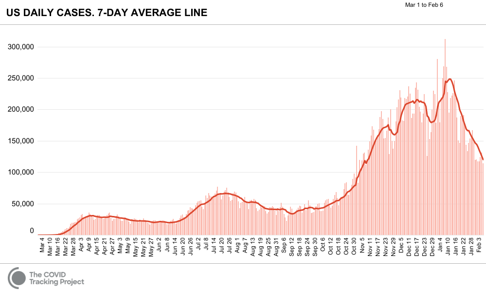

# Calculus II Lesson 2: Exponential and Logarithmic Functions
{: .no_toc}

1. Table of Contents
{:toc}

# Review

## Meaning of the definite integral

Take a look at the following chart that depicts the number of positive cases of COVID-19 per day (source: [Covid Tracking Project](https://covidtracking.com/)).

This "7-day average" curve is used to adjust for trends in testing frequency, but for our purposes we might as well treat the curve as representing the actual number of cases on that particular day. What does the area under this curve represent? In other words: what do you get if you add up all the number of cases on any given day?

In general, there is a relationship between a function and the area under the graph of that function. This relationship is given by the Fundamental Theorem of Calculus: if $f(x)$ is a function, then $F(x) = \int_a^x f(t) dt$ is an *antiderivative* of $f(x)$. In other words, $F^\prime(x) = f(x)$. Since $F(x)$ represents the area under the curve of $f(x)$, this says that the area under $f(x)$ changes at a rate equal to $f(x)$ itself. What does this mean in terms of the graph above?

## Integration by Substitution

Recall: integration by substitution is a technique whereby we try to simplify an integral problem by making an appropriate substitution. For example:

$$ \int x^2 e^{x^3} dx $$

This can be simplified by letting $u = x^3$. Then $\frac{du}{dx} = 3x^2$, or, treating $\frac{du}{dx}$ as a fraction, we have $du = 3x^2 dx$. Then notice that $e^{x^3}$ can be replaced by $e^u$, and $x^2 dx$ can be replaced by $\frac{du}{3}$, so our simplified integral is:

$$ \frac{1}{3} \int e^u du $$

This is simply $e^u + C$, or $e^{x^3} + C$. Some things to notice about this problem:

* After substituting, we want to obtain an expression only consisting of $u$ and $du$'s, with no more $x$'s.
* Pick a term whose derivative shows up in the problem. If the derivative does not show up, at least look for something where a constant multiple of the derivative shows up.
* At the end, substitute back to get your final answer in terms of $x$.

It takes practice to develop the right intuition for these kinds of problems. I encourage you to work through the exercises in [section 1.5](https://openstax.org/books/calculus-volume-2/pages/1-5-substitution) to get that practice. Try 3-5 from each of the following groups of problems:

* 261-270
* 271-287
* 271-287

We can review some of these in office hours and/or on Thursday.

## Definite Integrals with Substitution

In class, we went through one way of using substitution with definite integrals. Let's go through another method now.

**Example**: Compute the following definite integral:

$$ \int_{-\pi/2}^{\pi/2} (\cos(x))^2 \sin(x) dx $$

Our method for computing this integral involves updating the bounds from $x$-values to $u$-values. Let's see what this means. For this integral, an appropriate substitution would be $u = \cos(x)$. Then $du = -\sin(x) dx$, or $-du = \sin(x) dx$.

Now we have to update the bounds. When $x = \pi/2$, then $u = \cos(\pi/2)$, which is $0$. When $x = -\pi/2$, then $u = \cos(-\pi/2)$, which is also $0$. Putting it all together, we have:

$$ \int_0^0 -u^2 du $$

At this point, we know the answer must be 0: this is the area under a single point in the curve. In other words, it's the area of a line, which has no width. (A rectangle with width 0 must have area 0 as well.) If you want, you can compute the integral properly by using the reverse power rule: $-\frac{u^3}{3}$, and thne plugging in the endpoints, but we would still just get $0 - 0 = 0$.

Notice that at no point did we convert back to $x$ in this method. So in other words: once we've changed *everything* to $u$ and $du$ (including the bounds), we can forget about the original problem with $x$'s, and just compute the integral with respect to $u$.

**Exercises**: Find the following definite integrals, using any method.

1. $\int\limits_{-1}^1 x \sqrt{x^2 + 1} dx$
2. $\int\limits_0^{\pi} (\cos(x))^2 \sin(x) dx$
3. $\int\limits_0^1 x e^{x^2} dx$

  
Check your answers.

  <ol>
  <li>Let $u = x^2 + 1$ and $du = 2x dx$. Then when we update the bounds, if $x = 1$ then $u = 2$, and if $x = -1$, then $u = 2$. The integral becomes $\int\limits_2^2 \frac{1}{2} \sqrt{u} du = 0$.</li>
  <li> Let $u = \cos(x)$, $du = -\sin(x) dx$. Let's use method one here: the integral becomes $\int -u^2 du$. An antiderivative of $-u^2$ is $-\frac{u^3}{3}$. Substitute back in: $-\frac{(\cos(x))^3}{3}$, from $x = 0$ to $x = \pi$. So we get: $-\frac{(-1)^3}{3} - (-\frac{1^3}{3})$, which is $\frac{2}{3}$.</li>
  <li>Let $u = x^2$, $du = 2x dx$, or $\frac{1}{2} du = x dx$. We can update the bounds: if $x = 1$ then $u = 1$, and if $x = 0$ then $u = 0$, so actually our bounds don't even change! The integral becomes $\frac{1}{2} \int\limits_0^1 e^u du$, which is $\left.\frac{1}{2} e^u \right|_0^1$. Plugging in the endpoints, we get $\frac{1}{2} e - \frac{1}{2}$.</li>
  </ol>

Now try 2-3 problems for each of the following sets of questions from [Section 1.5](https://openstax.org/books/calculus-volume-2/pages/1-5-substitution):

* 292-297
* 306-312

# Exponential Functions

Recall that $\frac{d}{dx} e^x = e^x$. This means that $\int e^x dx = e^x + C$. We have done a few problems involving exponential functions already, let's try a couple more:

**Exercises**:

1. $\int\limits_0^{\ln(2)} e^{-x} dx$
2. $\int x e^{-x^2} dx$

Check your answers

<ol>
<li>An antiderivative of $e^{-x}$ is $-e^{-x}$, and so plugging in, we get $-e^{-\ln(2)} = -\frac{1}{2}$, and $-e^{-0} = -1$, and so our answer is $-\frac{1}{2} - (-1) = \frac{1}{2}$.</li>
<li> Let $u = -x^2$, and so $du = -2x dx$. Or: $-\frac{1}{2} du = x dx$. The integral simplifes to $-\frac{1}{2} \int e^u du = -\frac{1}{2} e^u + C$. Substitute back: $-\frac{1}{2} e^{-x^2} + c$.</li>

Interesting note: the function $f(x) = e^{-x^2}$ does not have an elementary antiderivative. In other words, $\int e^{-x^2}dx$ is not possible to compute, while $\int x e^{-x^2} dx$ is solvable using a simple substitution. Changing a function very slightly can cause a problem to go from being easy (or at least doable) to impossible!

Moreover, this is not just an academic concern! The function $f(x) = \frac{e^{-\frac{1}{2}x^2}}{\sqrt{2\pi}}$ is known in statistics as the "Gaussian curve" or the "normal distribution". Areas between points on this curve correspond to probabilities that events occur within a certain number of standard deviations of the mean of a normal distribution. If you haven't studied statistics, we won't be studying it here, but I just wanted to point out that this curve is extremely important in understanding distributions of data.

<iframe src="https://www.desmos.com/calculator/ly3qfxulzr?embed" width="500px" height="500px" style="border: 1px solid #ccc" frameborder=0></iframe>

## Bases other than $e$

What do we do with integrals of exponential functions whose bases are constants other than $e$? We use $e$ and $\ln$ to re-write those functions.

Recall that $\ln(x)$ is the inverse of $e^x$. That means: if $y = \ln(x)$, then $e^y = x$. In other words, $e^{\ln(x)} = x$. So, for example, $e^{\ln(2)} = 2$. We can use this to re-write the function $2^x$:

Since $2 = $e^{\ln(2)}$, then $2^x = e^{{\ln(2)}^x}$. Using exponent rules, we get $2^x = e^{\ln(2) \cdot x}$. Therefore:

$$\int 2^x dx = \int e^{\ln(2) \cdot x} dx = \frac{1}{\ln(2)} e^{\ln(2) \cdot x} + C= \frac{2^x}{\ln(2)} + C$$

**Exercise**: Use the same logic to find the following antiderivatives:

1. $\int 10^x dx$
2. $\int (\frac{1}{2})^x dx$
3. $\int 3^x dx$

Do you see the general pattern?
