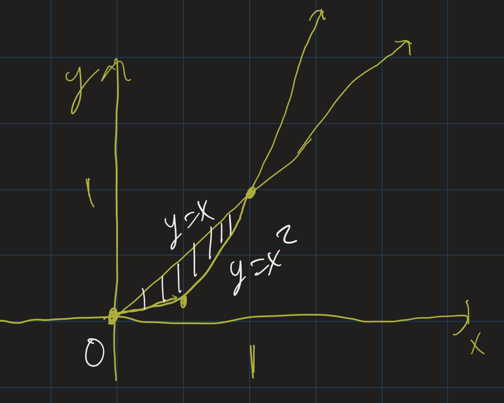
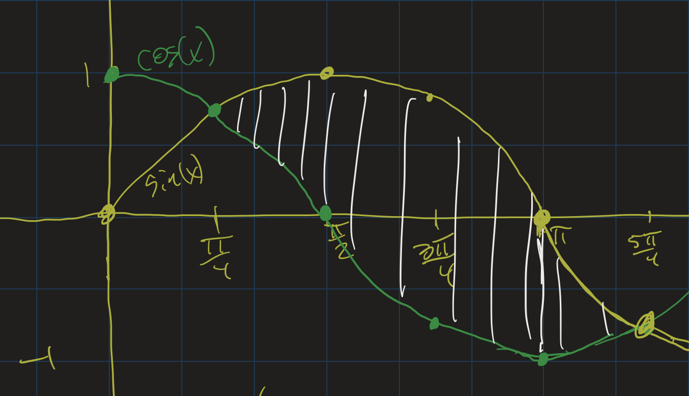
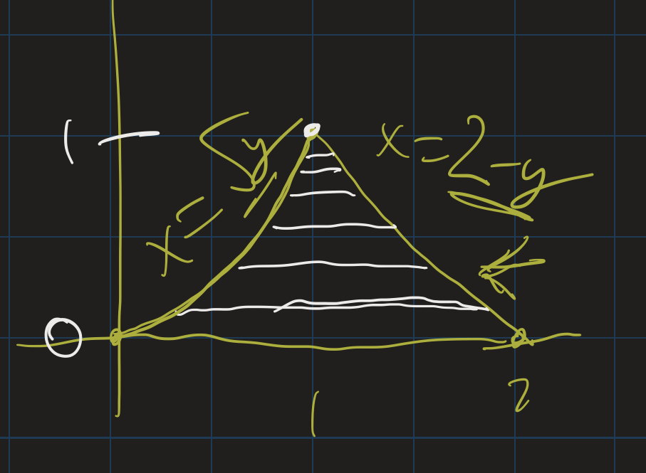
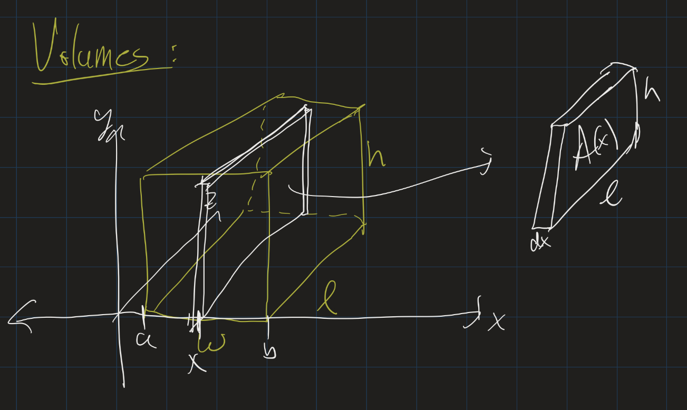

# Calculus II Lesson 8: Areas between curves

1. Table of Contents
{:toc}

# Overview

<iframe src="https://www.youtube.com/embed/shFZUj7-CrQ" frameborder="0" allow="accelerometer; autoplay; clipboard-write; encrypted-media; gyroscope; picture-in-picture" allowfullscreen></iframe>

Previously, we have seen how calculus can help us generalize ideas from geometry. In geometry, we know how to find the area of "flat" shapes, like rectangles. But in calculus, we know how to find areas of regions where the top side is curved:

Now we will learn about how to find areas of regions where the top and bottom sides are both curved:

The idea is to split the region into rectangles, the same way we do with areas under curves. When we split the region into rectangles, we approximate the area of the region as:

$$\sum_{i = 1}^n (f(x_i) - g(x_i)) \Delta x$$

As $n \rightarrow \infty$, the limit of these approximations becomes the *actual* area, and we get the definite integral $\int_a^b (f(x) - g(x)) dx$.

# Example

<iframe src="https://www.youtube.com/embed/qpHYa_g07eQ" frameborder="0" allow="accelerometer; autoplay; clipboard-write; encrypted-media; gyroscope; picture-in-picture" allowfullscreen></iframe>

Find the area of the region between the curves $y = x$ and $y = x^2$ from $x = 0$ to $x = 1$.

Since $x > x^2$ in this region, we set up the integral $\int_0^1 (x - x^2) dx$. Computing the integral, we get $\left. \frac{x^2}{2} - \frac{x^3}{3} \right\|_0^1$, which is $\frac{1}{2} - \frac{1}{3}$, or $\frac{1}{6}$.

As another example, let's find the area between $y = \sin(x)$ and $y = \cos(x)$ from $x = \frac{\pi}{4}$ to $x = \frac{5\pi}{4}$:

Since $\sin(x) > \cos(x)$ here, we compute the integral $\int_{\pi/4}^{5\pi/4} (\sin(x) - \cos(x)) dx$. This is $-\cos(x) - \sin(x)$, from $\pi / 4$ to $5\pi/4$. Plugging in the endpoints:

$$
\begin{align}
& (-\cos(5\pi/4) - \sin(5\pi/4)) - (-\cos(\pi/4) - \sin(\pi/4)) \\
&=(\frac{\sqrt{2}}{2} + \frac{\sqrt{2}}{2}) - (-\frac{\sqrt{2}}{2} - \frac{\sqrt{2}}{2}) \\
&= \sqrt{2} + \sqrt{2} \\
&= 2\sqrt{2}
\end{align}
$$

## Exercises

1. Find the area between the curves $y = x$ and $y = 2 - x$ from $x = 0$ to $x = 1$.
2. Find the area between $y = x$ and $y = x^3$ from $x = 0$ to $x = 1$.

# Steps

<iframe src="https://www.youtube.com/embed/rBAlrsmYsMw" frameborder="0" allow="accelerometer; autoplay; clipboard-write; encrypted-media; gyroscope; picture-in-picture" allowfullscreen></iframe>

What do we do if we have a region enclosed by curves, but we do not know the boundary points ahead of time? In that case, we first need to find the points where the curves intersect using algebra.

That is, in general, the steps to problems where we find the area of a region enclosed by two curves are as follows:

1. Find the points where the curves intersect. Call these points $x = a$ and $x = b$.
2. Determine which curve is above the other between $x = a$ and $x = b$. Call that one $f(x)$, and the other one $g(x)$.
3. Set up the integral and integrate: $\int_a^b (f(x) - g(x)) dx$.

## Example

As an example, find the area of the region enclosed by $y = x^2$ and $y = x + 2$.

The first step is to find where the curves intersect. We do this with algebra: $x^2 = x + 2$ means that $x^2 - x - 2 = 0$. Solve this by factoring: $(x - 2)(x + 1) = 0$, so $x = 2$ or $x = -1$.

Then graph and see which curve is above the other between $x = -1$ and $x = 2$.

<iframe src="https://www.desmos.com/calculator/izkvfhpaum?embed" style="border: 1px solid #ccc" frameborder=0></iframe>

We can see that $x + 2 \geq x^2$ here. So we set up the integral $\int_{-1}^2 (x+2 - x^2) dx$. We integrate, we get $\frac{x^2}{2} + 2x - \frac{x^3}{3}$. Plugging in the endpoints:

$$
\begin{align}
&(\frac{4}{2} + 4 - \frac{8}{3}) - (\frac{1}{2} - 2 + \frac{1}{3}) \\
&=(6 - \frac{8}{3}) - (\frac{3}{6} - \frac{12}{6} + \frac{2}{6}) \\
&=(\frac{10}{3}) - (-\frac{7}{6}) \\
&=\frac{27}{6} = \frac{9}{2} = 4.5
\end{align}
$$

## Exercises

1. Find the area of the region bounded by $y = 4$ and $y = x^2$.
2. Find the area of the region bounded by $y = x^2$ and $y = x^3$.

Please look at problems 1 and 2 in [section 2.1](https://openstax.org/books/calculus-volume-2/pages/2-1-areas-between-curves#fs-id1167793298894) of the textbook.

## Aside: Trig Substitution

Consider the region above $y = 4$ and below $y = \sqrt{25 - x^2}$. How might we find this area?

<iframe src="https://www.desmos.com/calculator/ybfp4rhulx?embed" style="border: 1px solid #ccc" frameborder=0></iframe>

Finding the points of intersectino, we see that the curves intersect when $x = 3$ and $x = -3$. Therefore, we set up the integral $\int_{-3}^3 (\sqrt{25 - x^2} - 4) dx$.

How do we integrate this? None of the techniques we've learned previously will help us. It turns out that there is yet another special technique to deal with integrals of this form: [Trigonometric Substitution](https://openstax.org/books/calculus-volume-2/pages/3-3-trigonometric-substitution). This is optional reading, but if you are interested, you can look into that section to learn how to work through problems of this type. *We will not be covering trig substitution in class, nor will I require it on exams.* At this point, it's worth knowing that this technique exists and you can look it up if you need to.

# Compound Regions

<iframe src="https://www.youtube.com/embed/p6-DF-dw_So" frameborder="0" allow="accelerometer; autoplay; clipboard-write; encrypted-media; gyroscope; picture-in-picture" allowfullscreen></iframe>

Some problems require us to split the region up into smaller regions, and set up integrals for each. For example: find the area between $y = \sin(x)$ and $y = \cos(x)$ from $x = 0$ to $x = \pi$.

We can see that from $x = 0$ to $x = \pi/4$, $\sin(x) \leq \cos(x)$, and from $x = \pi/4$ to $x = \pi$, $\sin(x) \geq \cos(x)$. So we set up two integrals:

$$\int_0^{\pi/4} (\cos(x) - \sin(x)) dx + \int_{\pi/4}^{\pi} (\sin(x) - \cos(x)) dx$$

Integrating:

$$
\begin{align}
&\left.[\sin(x) + \cos(x)]\right|_0^{\pi/4} + \left.[-\cos(x) - \sin(x)]\right|_{\pi/4}^\pi \\
&= [(\frac{\sqrt{2}}{2} + \frac{\sqrt{2}}{2}) - (0 + 1)] \\
&+ [ (-(-1) - 0) - (-\frac{\sqrt{2}}{2} - \frac{\sqrt{2}}{2})] \\
&= (\sqrt{2} - 1) + (1 + \sqrt{2}) \\
&= 2\sqrt{2}
\end{align}
$$

As another example, consider the region bounded by the $x$-axis, $y = x^2$ and $y = 2 - x$.

Notice that from $x = 0$ to $x = 1$, the region is bounded above by $y = x^2$, while from $x = 1$ to $x = 2$, it's bounded by $y = 2 - x$. So we set up the sum as $\int_0^1 x^2 dx + \int_1^2 (2 - x) dx$. This ends up being:

$$
\begin{align}
&\left. \frac{x^3}{3} \right|_0^1 + \left.(2x - \frac{x^2}{2})\right|_1^2 \\
&=\frac{1}{3} + [(4 - 2) - (2 - \frac{1}{2})] \\
&=\frac{1}{3} + (2 - \frac{3}{2}) \\
&= \frac{1}{3} + \frac{1}{2} \\
&= \frac{5}{6}
\end{align}
$$

# Using the y-axis

<iframe src="https://www.youtube.com/embed/Vr7usEwps8c" frameborder="0" allow="accelerometer; autoplay; clipboard-write; encrypted-media; gyroscope; picture-in-picture" allowfullscreen></iframe>

We can compute the area of that region in another way: using the $y$-axis instead of the $x$-axis. That is, we solve for $x$ in terms of $y$ for each of these curves, and then look at the area between these curves on the $y$-axis.

First we need to express each curve in terms of $y$. For $y = 2 - x$, if we solve for $x$ we get $x = 2 -y$. For $y = x^2$, if we solve for $x$, we either get $x = \sqrt{y}$ or $x = -\sqrt{y}$. Since $x \geq 0$ in this region, we know we use $x = \sqrt{y}$. Then we set up the integral: $\int_0^1 (2 - y - \sqrt{y}) dy$. Taking the antiderivative, this is $2y - \frac{y^2}{2} - \frac{2}{3} y^{3/2}$ from $y = 0$ to $y = 1$. Plugging in, we get $2 - \frac{1}{2} - \frac{2}{3}$, which is again $\frac{5}{6}$.

We can see that looking at this problem from a different perspective turns this from a "compound" region, with two parts to integrate, to a single integral.

# Volumes Preview

Our next geometric application of integration will be to find volumes of three-dimensional figures. Recall how we computed areas using integrals: first we approximate the area of the region with rectangles, then take more and more rectangles and, in the limit, we end up with an integral.

Similarly, we can approximate the volume of a three dimensional figure with thin slices of the figure, each of whose volume is $A \cdot \Delta x$, where $A$ is the area of one side of the thin slice, and $\Delta x$ is the thickness of that slice.

Adding up the volumes, you get a Riemann sum:

$$V \approx \sum_{i=1}^{n} A(x_i) \Delta x$$

As $n \rightarrow \infty$, this becomes an integral: $V = \int_a^b A(x) dx$, where $A(x)$ is the area of the "slice" at $x$. Take a look at [Example 2.6](https://openstax.org/books/calculus-volume-2/pages/2-2-determining-volumes-by-slicing#fs-id1167793579586) in the textbook which goes through the example of using this method to find the formula for the volume of a prism. I also cover this example in my video below:

<iframe src="https://www.youtube.com/embed/-soU5Hn7YLk" frameborder="0" allow="accelerometer; autoplay; clipboard-write; encrypted-media; gyroscope; picture-in-picture" allowfullscreen></iframe>

# Homework

Due **Friday, March 12** on Moodle:

Section 3.7 #347, 348, 352, 394, 396  
Section 2.1 #2, 6, 14, 30, 49
