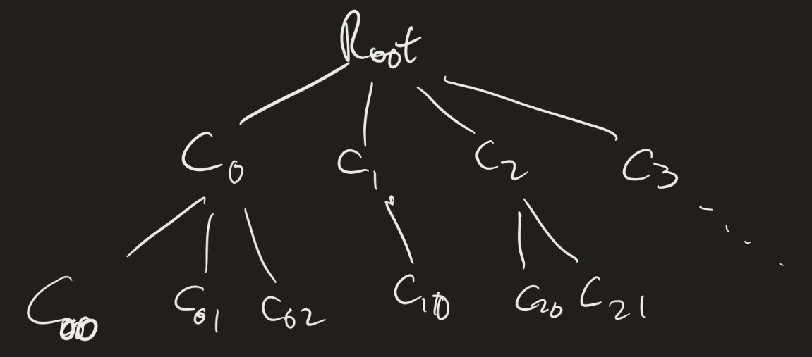

# Computability Lesson 14: Enumerators and Input/Output
{:.no_toc}

1. Table of Contents
{:toc}

<!--
12:30 - 12:45 NTMs
12:45 - 1:15 Enumerators
1:15 - 1:45 Input-Output
1:50 - 2:10 PS3 q's + presentation discussion
-->

# Nondeterministic TMs

A **nondeterministic Turing Machine** (NTM) is defined as you might expect, with $\delta$  modified so that $\delta : Q \times \Gamma \to \mathcal{P}(Q \times \Gamma \times \\{L, R \\})$. Computation is defined analagously: $N$ accepts a word $w$ if there is a sequence of configurations, starting with the "start" configuration, ending in the "accept" configuration, such that each element in the sequence *can* yield the next element (according to some of the nondeterministic rules).

We should think about computation on an NTM as a "tree" structure. The root would be the "start" configuration, and the child of each node would be the configurations we can get to in one step.

**Theorem**: Every nondeterministic TM has an equivalent deterministic TM.

If $N$ is an NTM, the idea for the proof of this result is to simulate $N$ with a deterministic TM that searches the tree of configurations for an accepting configuration. (Problem with this idea?)

We can simulate $N$ using a three-tape machine:

1. **Input tape**: Never change this.
2. **Simulation tape**: Simulate one branch of $N$'s computation on $w$.
3. **Address tape**: Use this to figure out which branch of the tree of configurations to check.

The idea is that, on the "address tape", a string "13142" would represent "Take the leftmost branch for the first non-deterministic choice, then the third branch for the second choice, the first (leftmost) branch for the third choice, the fourth branch for the fourth choice, and the second branch for the fifth choice." We simulate computation on $w$ on the simulation tape, using the address tape to help us make the nondeterministic choices. We only go up to the number of choices we have specified, so if the computation does not halt within the first five steps (using those choices), we start over again with the "next" address.

Since, at any given point, there are only finitely many "next" choices one can make, there is a canonical way to enumerate this!

## NTM Deciders

**Definition**: An NTM **decides** a language if every branch of its computation halts.

**Theorem**: A language is decidable if and only if it is decided by an NTM.

Proof? 

* If it is decidable, then it's decided by a deterministic TM. That is automatically an NTM. 
* And vice versa: if a language is "decided" by an NTM, then the "search for an accepting computation" process will always halt, since there will be no "infinite loops" on any branches.

These two results tell us that NTMs can solve the same exact problems as deterministic TMs.

**Open question**: I mentioned the "Millenium" prize problems earlier in the semester. The question of whether NTMs solve problems *more efficiently* than deterministic TMs is still open! That is: we can think about the notion of computational complexity. If every branch of an NTM's computation halts within $n$ steps, then the "search for an accepting configuration" simulation would halt within $O(2^n)$ steps (do you see why?). Can we do better?

# Exercise

Using the notion of an NTM, explain why context-free languages are decidable.

Click for the idea

Use two tapes. Keep the input $w$ on the first tape, and write $S$ on the second tape. Then non-deterministically pick a rule to replace $S$ with. Keep going until you no longer have any variables written on the second tape. If the two words are the same, accept, otherwise reject.

# Enumerators

An **enumerator** is a variant of a TM which does not have an accept or reject state, but just has an *output* state. An enumerator starts with an empty tape. If $E$ is an enumerator, we say $w \in \mathcal{L}(E)$ if $E$ enters the output state with $w$ on its tape. Notice that an enumerator *never halts*! It runs forever. We say $E$ **enumerates** $\mathcal{L}(E)$.

**Theorem**: $\mathcal{L}$ is computably enumerable (c.e.) if and only if it is enumerated by an enumerator.

(Hence the name.)

**Proof**:

There are two things to prove: if $\mathcal{L}$ is c.e., then there is an enumerator which enumerates $\mathcal{L}$, and if $E$ enumerates $\mathcal{L}$, then there is a TM which recognizes it. Let's do this second one first:

Suppose $\mathcal{L} = \mathcal{L}(E)$. Let $M$ be the following TM, described at a "high level":

"On input $w$:
1. Run $E$.
2. When $E$ outputs $w^\prime$, compare it with $w$. If $w = w^\prime$, **accept**.
3. If not, keep going."

Clearly $\mathcal{L}(M) = \mathcal{L}(E)$, since if $w \in \mathcal{L}(E)$, then $M$ accepts $w$, and vice versa.

Now suppose $\mathcal{L}$ is c.e. and $M$ recognizes $\mathcal{L}$. We can design an enumerator for $E$ as follows:

Consider all the strings in $\Sigma^\*$. For example, if $\Sigma = \\{0, 1 \\}$, then the strings are $\varepsilon, 0, 1, 00, 01, 10, 11, 000, \ldots$ We can list out all the strings in some predefined order. That is, we can list out all the strings of length 0, then all the strings of length 1, etc. (In other words, $\Sigma^\*$ is **countably infinite**, so there is a bijection between $\mathbb{N}$ and $\Sigma^\*$.)

So suppose $s_1, s_2, s_3, \ldots$ is a list of all the strings in $\Sigma^\*$. Then we design $E$ as follows:

"Repeat for $i = 1, 2, 3, \ldots$:

1. Run $M$ on the strings $s_1, s_2, \ldots, s_i$ for $i$ steps. (That is, up until the $i$-th configuration!)
2. If $M$ accepts any of these, output it."

## Decidability

**Definition**: $\mathcal{L}$ is co-c.e. if $\overline{\mathcal{L}}$ is c.e.

**Theorem**: $\mathcal{L}$ is computable if and only if it is c.e. and co-c.e.

**Proof**:

Suppose $\mathcal{L}$ is computable. Then there is a machine $M$ which decides it. Clearly $M$ recognizes $\mathcal{L}$, so it is c.e. Let $M_2$ be defined as the same TM as $M$, with the accept and reject states swapped. Then $M_2$ recognizes $\overline{\mathcal{L}}$!

Now for the other direction: suppose $\mathcal{L}$ is c.e. and co-c.e. Let $E_1$ enumerate $\mathcal{L}$ and $E_2$ enumerate $\overline{\mathcal{L}}$. We define a decider $D$ for $\mathcal{L}$ as follows:

"On input $w$:
1. Interleave computations of $E_1$ and $E_2$.
2. If $E_1$ ever outputs $w$, **accept**.
3. If $E_2$ ever outputs $w$, **reject**."

**Questions**: Why is this a legitimate description of a TM? What does "interleave computations" here mean? How do we know we are only doing finitely much work at each step?

# Input-Output TMs

An **input-output** TM has a state $q_{halt}$ and no accept or reject states. The **domain** of an IO TM $F$ is the set $D \subseteq \Sigma^\*$ consisting of all words $w \in \Sigma^\*$ such that $F$ halts on input $w$.

$F$ computes a function, which we will also refer to as $F : D \to \Gamma^\*$, where $F(w)$ is the word on the tape when $F$ halts on input $w$. Such a function is called a **partial computable function**. If $D = \Sigma^\*$, then $F$ is called a **total computable function**.

**Theorem**: Let $\mathcal{L}$ be a language, $\mathcal{L} \neq \emptyset$. The following are equivalent:

1. $\mathcal{L}$ is c.e.
2. $\mathcal{L}$ is the domain of a partial computable function.
3. $\mathcal{L}$ is the range of a total computable function.

**Proof**: We will prove these equivalencies in a cycle. We'll show $1 \implies 2$, $2 \implies 3$ and $3 \implies 1$. First: $1 \implies 2$ is easy. If $\mathcal{L}$ is c.e., then there is a TM $M$ which recognizes $\mathcal{L}$. Just modify $M$ to be an IO TM by getting rid of the reject state and turning $q_{accept}$ into $q_{halt}$. Then whenever $w \in \mathcal{L}$, $M$ will halt on input $w$. Who knows what $M$ outputs? Who cares; all that matters is that $w$ is in the domain of this partial computable function!

$2 \implies 3$ is a little harder, so we'll come back to that.

$3 \implies 1$ is simple as well, and basically what we did for enumerators. Suppose $F$ is a total computable function such that for every $w \in \mathcal{L}$, there is $s \in \Sigma^*$ such that $F(s) = w$. Then we can recognize $\mathcal{L}$ as follows:

"On input $w$,
For each string $s \in \Sigma^\*$:
1. Compute $F(s)$. If $F(s) = w$, accept.
2. If not, re-do Step 1 for the next string $s$."

Now for $2 \implies 3$. Let $F : \mathcal{L} \to \Gamma^\*$ be a partial computable function. Use the fact that $\mathcal{L} \neq \emptyset$, so that there is some specific word $y \in \mathcal{L}$.

We define a total computable function $G$ which does the following:

"On input $(w, n)$:
1. Run $F$ on $w$ for $n$ steps.
2. If $F$ halts within $n$ steps, output $w$.
3. If $F$ does not halt within $n$ steps, then output $y$."

How do we represent $(w, n)$? There are a few ways, but it's not really that important.

# Presentations

**Presentation 1**: due Sunday, March 24.

On the problem presentation, you are to go through a challenging problem. If you are unsure if your problem is considered "challenging" for you, then please let me know what you want to choose. It should be something that required some amount of thinking for you, before you were able to really figure it out. It could be a proof of a general theorem, an illuminating example we did in class, a problem from the quiz or problem set, or something else. I strongly encourage you to look for things that you did not understand at first!

Create a short set of slides (via PowerPoint, Google Slides, Keynote, LaTeX / Beamer, etc.). In the slides, describe the problem and outline a solution. Upload the slides to VoiceThread (this will be posted on BrightSpace), clicking "Add Media". "Comment" on each slide with an "audio" comment. Talk through the details of the solution, explain what's going on, etc. Keep the presentation short, to about 5 minutes or so.

You will be graded on a scale of 1-5. I will be looking for **correctness**, **clarity**, and **motivation**. You must clearly state the problem, clearly explain the solution to the problem and make sure to explain the motivation behind the solution. (As in, how did you know how to approach a problem like this? What was the strategy you used to figure out what to do?)

The general rubric is:

1. Presenter is very unclear about both the problem and the solution, the solution is incorrect in a very significant way, and little to no motivation is given.
2. Presenter either does not state the problem clearly, gives minimal motivation for the solution, or is able to start the problem but not able to fully explain the solution.
3. Presenter explains the problem adequately and gives a correct solution, with some allowance for minor mistakes. Presenter provides adequate motivation. This grade may be awarded for a good solution that is not accompanied by much motivation.
4. Presenter clearly explains the problem and gives a correct solution. Presenter provides some motivation and context for the solution. This grade made be awarded for a great solution that is not accompanied by a clear explanation of the method and why the method applies.
5. Presenter clearly explains the problem. Presenter gives motivation and context for the solution, explaining how particular theorems or rules applied, and gives a fully correct solution.

# Upcoming

* PS3 due Monday.
* Problem Presentation 1: due **Sunday**, March 24.
* Take home exam given next week, due after Spring Break
* Spring break 3/25 - 3/29
