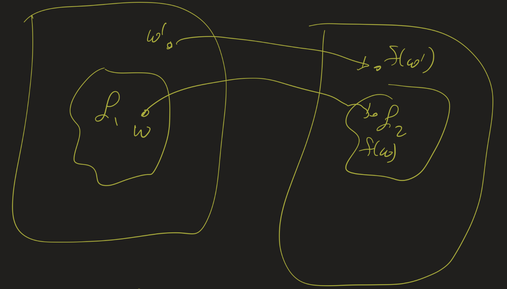

# Lesson 18: Reductions
{:.no_toc}

1. Table of Contents
{:toc}

# Reading

Sipser 5.1, 5.3 (skip 5.2), 6.3

# Exercise

Show that $EQ_{TM} = \\{ \langle M_1, M_2 \rangle : \mathcal{L}(M_1) = \mathcal{L}(M_2) \\}$ is undecidable by showing that if we could decide it, we would also be able to decide $E_{TM}$.

# Reductions

<iframe src="https://www.youtube.com/embed/8k-F4xU63e4" title="YouTube video player" frameborder="0" allow="accelerometer; autoplay; clipboard-write; encrypted-media; gyroscope; picture-in-picture" allowfullscreen></iframe>

Our general strategy for these examples has been to *reduce* one problem to another. We show that one problem $\mathcal{L}_1$ is "easier than (or at least as easy as)" another problem $\mathcal{L}_2$. If we already know that $\mathcal{L}_1$ is not decidable, then $\mathcal{L}_2$ would also be decidable.

**Definition**: An *oracle* for a problem $\mathcal{L}$ is a function $O : \Sigma^{\*} \to \\{ YES, NO \\}$ such that $O(w) = YES$ iff $w \in \mathcal{L}$, and $O(w) = NO$ iff $w \not \in \mathcal{L}$. An *oracle Turing Machine* is a regular Turing Machine augmented with an oracle.

The idea of this definition is to formalize the results from the previous section. For example, if we have an oracle for $E_{TM}$, we could decide $A_{TM}$.

**Definition**: Let $\mathcal{L}_1$ and $\mathcal{L}_2$ be languages. Then:

1. $\mathcal{L}\_1$ is **Turing-reducible** to $\mathcal{L}\_2$ if, given an oracle for $\mathcal{L}\_2$, we can decide $\mathcal{L}\_1$. We write $\mathcal{L}\_1 \leq\_{T} \mathcal{L}\_2$.
2. $\mathcal{L}_1$ is **Turing-equivalent** to $\mathcal{L}\_2$ if $\mathcal{L}_1 \leq_T \mathcal{L}_2$ and $\mathcal{L}_2 \leq_T \mathcal{L}_1$. We write $\mathcal{L}_1 \equiv_T \mathcal{L}_2$.

So far we have seen:

* $A_{TM} \leq_T E_{TM}$
* $E_{TM} \leq_T EQ_{TM}$
* $X_{TM} \leq_T A_{TM}$

All of these were Turing reductions, we just didn't use the term at the time! Note that $\leq_T$ is transitive, so, for example, $A_{TM} \leq_T EQ_{TM}$. To see this: notice that given an oracle for $EQ_{TM}$, we can decide $E_{TM}$. And then given a decider for $E_{TM}$, we can decide $A_{TM}$.

We can also prove this more directly. Consider the following oracle TM $A$ which uses an oracle for $EQ_{TM}$:

"On input $\langle M, w \rangle$:

1. Construct $M_1$ which accepts everything.
2. Construct $M_2$, which, on input $x$, does the following:
   * If $x \neq w$, accept.
   * If $x = w$, run $M$ on $w$. If $M$ accepts, accept.
3. Check if $\langle M_1, M_2 \rangle \in EQ_{TM}$. If so, **accept**. Otherwise, **reject**."

## Exercise

Show that $A_{TM} \equiv_T \overline{A_{TM}}$. In other words: $A_{TM}$ is Turing-equivalent to its complement. (This is actually easy!) Conclude the following:

**Theorem**: There are c.e. languages which are Turing-equivalent to languages that are *not* c.e.

## Harder exercise

Show that $REG_{TM} = \\{ \langle M \rangle : \mathcal{L}(M)$ is regular $\\}$ is undecidable.

Hint: try to decide $A_{TM}$. On input $\langle M, w \rangle$, construct a TM $M^\prime$ such that $\mathcal{L}(M^\prime) = \\{ a^n b^n : n \in \mathbb{N} \\}$ if $M$ does not accept $w$, and $\mathcal{L}(M^\prime) = \Sigma^{\*}$ if $M$ does accept $w$.

## EQ vs TOT

Recall that $EQ_{TM} = \\{ \langle M_1, M_2 \rangle : \mathcal{L}(M_1) = \mathcal{L}(M_2) \\}$. Consider the language $TOT = \\{ \langle F \rangle : F$ is a total computable function $\\}$.

**Exercise**: Show that $TOT \leq_T EQ_{TM}$.

Hint: Given $\langle F \rangle$, construct two TMs. One of them, $M_1$ should accept everything. What should the other, $M_2$ do? We want to be sure that if $M_1$ and $M_2$ have the same language, then $F$ should be a total function. But if $F$ ever does not halt on some input $w$, then the language of $M_2$ should not be everything.

See the solution in the video below:

<iframe src="https://www.youtube.com/embed/FQi1Bu7jUnY" title="YouTube video player" frameborder="0" allow="accelerometer; autoplay; clipboard-write; encrypted-media; gyroscope; picture-in-picture" allowfullscreen></iframe>

# m-reductions

<iframe src="https://www.youtube.com/embed/L8A0hIYWFuA" title="YouTube video player" frameborder="0" allow="accelerometer; autoplay; clipboard-write; encrypted-media; gyroscope; picture-in-picture" allowfullscreen></iframe>

Turing reducibility helps us determine if a language is undecidable. But we need a more fine-grained relation to show that a language is not c.e. or to show that language is not co-c.e.

**Definition**: $\mathcal{L}_1$ is $m$-reducible to $\mathcal{L}_2$, denoted $\mathcal{L}_1 \leq_m \mathcal{L}_2$, if there is a total computable $f : \Sigma^{\*} \to \Sigma^{\*}$ such that for each $w \in \Sigma^{*}$, $w \in \mathcal{L}_1$ if and only if $f(w) \in \mathcal{L}_2$. This relation is sometimes referred to as "many-one reducibility".

**Theorem**: Let $\mathcal{L}_1$ and $\mathcal{L}_2$ be languages.

1. If $\mathcal{L}_1 \leq_m \mathcal{L}_2$ and $\mathcal{L}_2$ is c.e., then $\mathcal{L}_1$ is c.e.
2. If $\mathcal{L}_1 \leq_m \mathcal{L}_2$ and $\mathcal{L}_1$ is not c.e., then $\mathcal{L}_2$ is not c.e.
3. $\mathcal{L}_1 \leq_m \mathcal{L}_2$ if and only if $\overline{\mathcal{L}_1} \leq_m \overline{\mathcal{L}_2}$.

**Proof**:

To prove (1), Let $M_2$ recognize $\mathcal{L}_2$ and $f : \Sigma^{\*} \to \Sigma^{\*}$ be the reduction. Then we can recognize $\mathcal{L}_1$ as follows:

"On input $w$:
1. Compute $f(w)$.
2. Run $M_2$ on $f(w)$. Output whatever $M_2$ outputs (accept or reject)."

To prove (2), just notice that this is the contrapositive of (1); every "if p then q" statement is logically equivalent to "if not q then not p". So "If $\mathcal{L}_2$ is c.e, then $\mathcal{L}_1$ is c.e." is equivalent to "If $\mathcal{L}_1$ is not c.e., then $\mathcal{L}_2$ is not c.e."

For (3), look at the following picture:

Suppose $f$ is the reduction. Let $w \in \overline{\mathcal{L}_1}$. Then $w \not \in \mathcal{L}_1$, so $f(w) \not \in \mathcal{L}_2$, but that means that $f(w) \in \overline{\mathcal{L}_2}$. Similarly, if $w \not \in \overline{\mathcal{L}_1}$, then $w \in \mathcal{L}_1$, so $f(w) \in \mathcal{L}_2$, which means $f(w) \not \in \overline{\mathcal{L}_2}$.

## Example: $EQ_{TM}$ is not c.e.

<iframe src="https://www.youtube.com/embed/8D4fRbsyJew" title="YouTube video player" frameborder="0" allow="accelerometer; autoplay; clipboard-write; encrypted-media; gyroscope; picture-in-picture" allowfullscreen></iframe>

**Theorem**: $EQ_{TM}$ is not c.e.

**Proof**: Recall that $A_{TM}$ is c.e. but not decidable. That means that $\overline{A_{TM}}$ is not c.e.; if it were. then $A_{TM}$ would be c.e. and co-c.e., which means it would be decidable.

Using the Theorem, we can show that $EQ_{TM}$ is not c.e. by showing that $\overline{A_{TM}} \leq_m EQ_{TM}$. This is equivalent (part 3 of the theorem) to showing that $A_{TM} \leq_m \overline{EQ_{TM}}$. Let $F$ be the following function:

"On input $\langle M, w \rangle$:
1. Construct $M_1$ which rejects everything.
2. Construct $M_2$ which, on any input $x$, ignores $x$ and runs $M$ on $w$. If $M$ accepts $w$, $M_2$ accepts $x$.
3. Output $\langle M_1, M_2 \rangle$."

Then, given $\langle M, w \rangle$:

* If $\langle M, w \in A_{TM}$, $F$ outputs a pair $\langle M_1, M_2 \rangle$ where $\mathcal{L}(M_1) = \emptyset$ and $\mathcal{L}(M_2) = \Sigma^{\*}$, so $\langle M_1, M_2 \rangle \not \in EQ_{TM}$.
* If $\langle M, w \not \in A_{TM}$, $F$ outputs $\langle M_1, M_2 \rangle$ where $\mathcal{L}(M_1) = \mathcal{L}(M_2) = \emptyset$, so $\langle M_1, M_2 \rangle \in EQ_{TM}$.

That is, $F$ is a reduction from $A_{TM}$ to $\overline{EQ_{TM}}$!

**Exercise**: Show that $EQ_{TM}$ is **not** co-c.e.

That is, show that $\overline{EQ_{TM}}$ is not c.e. To see this, we need a reduction $\overline{A_{TM}} \leq_m \overline{EQ_{TM}}$. By the third part of the theorem, this means we need a reduction $A_{TM} \leq_m EQ_{TM}$.

Hint: for the function $F$, make a small modification to $M_1$, so that if $\langle M, w \rangle \in A_{TM}$, then $\langle M_1, M_2 \rangle \in EQ_{TM}$, and vice versa.

## Strategy

These two results (the theorem we proved and the exercise) show that $EQ_{TM}$ is neither c.e. nor co-c.e. So that means there are languages which are neither. (We should have known this already, from cardinality arguments, but this is a more explicit proof.)

In general, to show a language is not c.e. or not co-c.e., we can show reductions from $A_{TM}$:

* $\mathcal{L}$ is not c.e. if $A_{TM} \leq_m \overline{\mathcal{L}}$, and
* $\mathcal{L}$ is not co-c.e. if $A_{TM} \leq_m \mathcal{L}$, and

If we can find both kinds of reductions, then $\mathcal{L}$ is neither c.e. nor co-c.e. If $\mathcal{L}$ is not decidable, then we should be able to find at least one of these reductions.

## Example

<iframe src="https://www.youtube.com/embed/Zzl7kIkcZHA" title="YouTube video player" frameborder="0" allow="accelerometer; autoplay; clipboard-write; encrypted-media; gyroscope; picture-in-picture" allowfullscreen></iframe>

Consider $E_{TM} = \\{ \langle M \rangle : \mathcal{L}(M) = \emptyset \\}$. Is it c.e., co-c.e., both, or neither? (It certainly cannot be both, as we proved, earlier, that it's not decidable.)

Let's look for a reduction from $A_{TM}$ to either $E_{TM}$ or $\overline{E_{TM}}$. We've seen a Turing reduction for these before, and it turns out to be similar.

Let $F$ be the following function:

"On input $\langle M, w \rangle$:
1. Construct $M^\prime$: on input $x$:
   * if $x \neq w$, reject.
   * if $x = w$, run $M$ on $w$ and output what $M$ does.
2. Output $\langle M^\prime \rangle$."

Then notice that if $\langle M, w \rangle \in A_{TM}$, $\mathcal{L}(M^\prime) \neq \emptyset$, but if $\langle M, w \rangle \not \in A_{TM}$, then $\mathcal{L}(M^\prime) = \emptyset$. So this is a reduction $A_{TM} \leq_m \overline{E_{TM}}$, showing that $E_{TM}$ is not c.e.!

Is there a reduction $A_{TM} \leq_m E_{TM}$? In fact: there isn't! Consider the following TM $T$, which I claim recognizes $\overline{E_{TM}}$:

"On input $\langle M \rangle$,  
For each $i = 0, 1, 2, \ldots$:  
Simulate $M$ on the first $i$ strings for $i$ steps.  If $M$ ever accepts, **accept**."

Do you see why, for each TM $M$, $T$ accepts $\langle M \rangle$ if and only if $\mathcal{L}(M) \neq \emptyset$?

## TOT

<iframe src="https://www.youtube.com/embed/zz-XVzL9Mng" title="YouTube video player" frameborder="0" allow="accelerometer; autoplay; clipboard-write; encrypted-media; gyroscope; picture-in-picture" allowfullscreen></iframe>

Recall $TOT = \\{ \langle F \rangle : F$ is a total computable function $\\}$.

**Theorem**: $TOT$ is neither c.e. nor co-c.e.

**Proof**:

First, we show a reduction from $A_{TM}$ to $TOT$:

"On input $\langle M, w \rangle$:

1. Construct $G$, which, on input $x$:
   * If $x \neq w$, **halt** and output 0.
   * If $x = w$, run $M$ on input $w$. If $M$ accepts, **halt** and output 0. If $M$ rejects $w$, loop forever (don't output anything).
2. Output $\langle G \rangle$."

Then notice that $G$ halts on all inputs other than $w$, and $G$ halts on $w$ if and only if $M$ accepts $w$. In other words, $G$ is total if and only if $M$ accepts $w$. So this is a reduction $A_{TM} \leq_m TOT$, showing that $TOT$ is not co-c.e.

Now let's find a reduction $A_{TM} \leq_m \overline{TOT}$. This is trickier. Given $\langle M, w \rangle$, we want a function $G$ which will halt on all outputs if and only if $M$ does not accept $w$. If $M$ does accept $w$, then $G$ should loop forever at some point.

The first part seems suspicious. How could $G$ possibly know if $M$ is never going to accept $w$? The point is that $G$ doesn't. $G$ can halt on *some* outputs, thinking that $M$ is not going to accept, and then if it ever figures out that $M$ does accept $w$, $G$ can change its mind and enter an infinite loop!

The idea is that $G$ should use its input as a way to bound the length of the computation it runs $M$ for. In other words, if $G$ takes in input $a^n$, $G$ should run $M$ on $w$ for $n$ steps. Since that's finite, $G$ can then check if $M$ has accepted by then. If it hasn't, $G$ will guess that $M$ is not going to accept, and so $G$ will halt. If $M$ ever does accept $w$, then for some $n$, there will be an input $a^n$ where $G$ knows that $M$ is accepting $w$, so $G$ should not halt on that input.

That is:

"On input $\langle M, w \rangle$:

1. Construct $G$, which, on input $a^n$:
   * Run $M$ on $w$ for $n$ steps.
   * If $M$ accepts $w$ within that many steps, loop forever.
   * If $M$ does not accept $w$ within that many steps, **halt** and output 0.
2. Output $\langle G \rangle$."

Now we have exactly what we wanted:

* If $M$ accepts $w$, then it will do so in $n$ steps for some $n$. Then $G$ will loop forever on $a^n$, so $G$ is not a total function.
* If $M$ does not accept $w$, then for each $n$, $G(a^n) = 0$, so $G$ is total!
