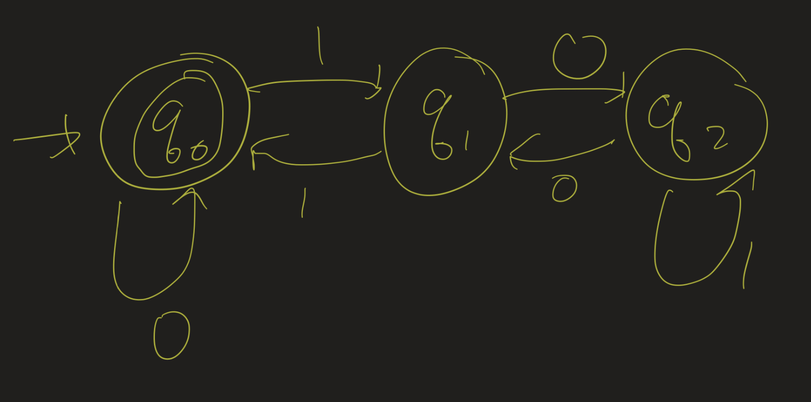
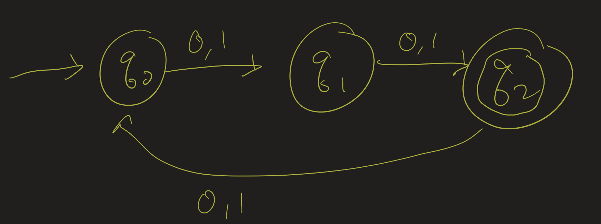
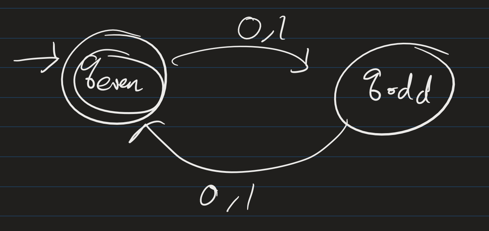
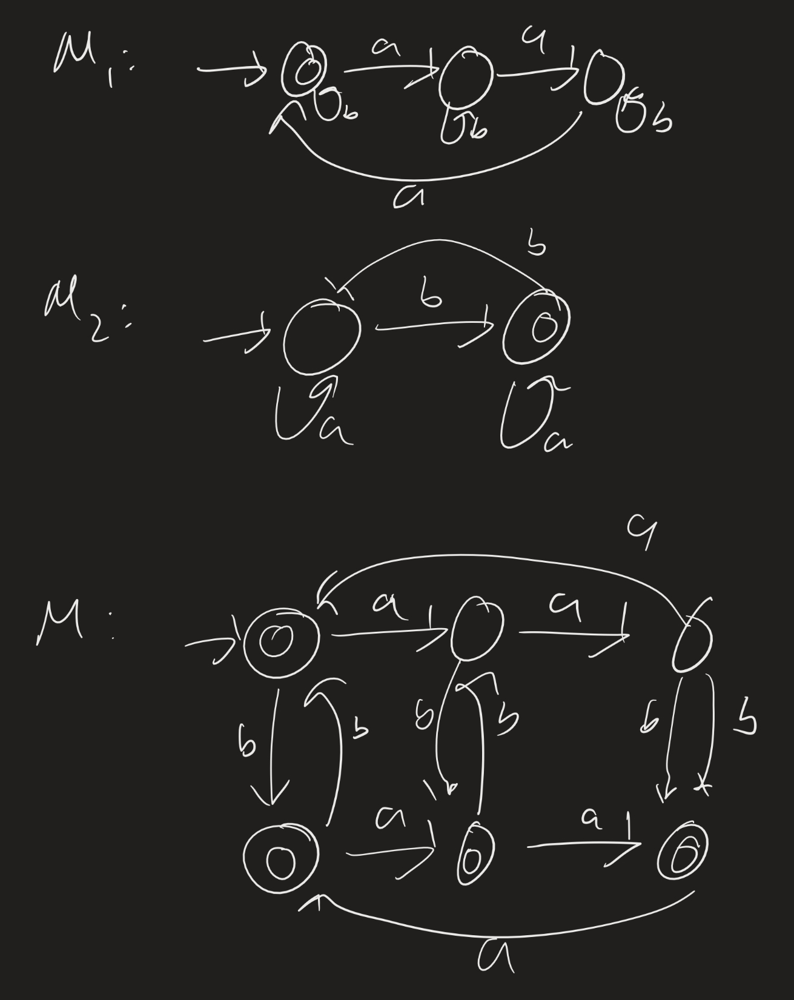
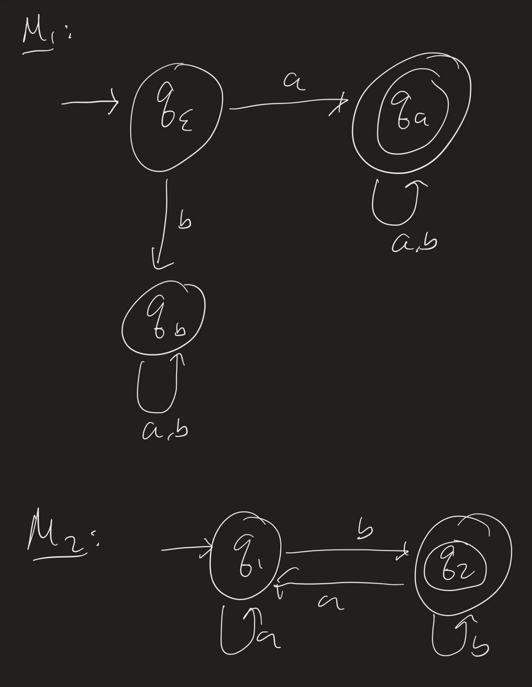
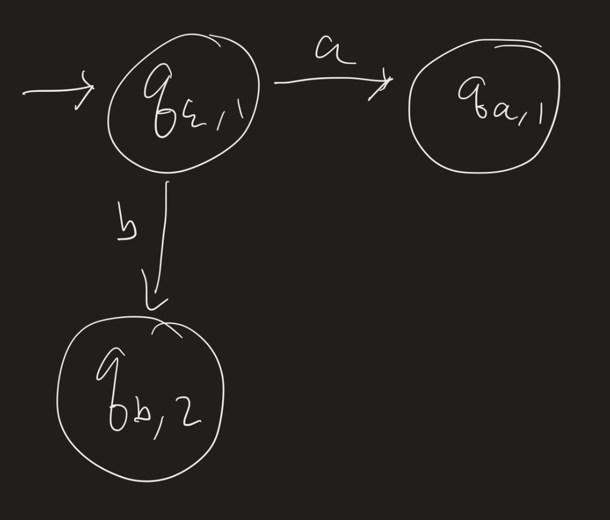
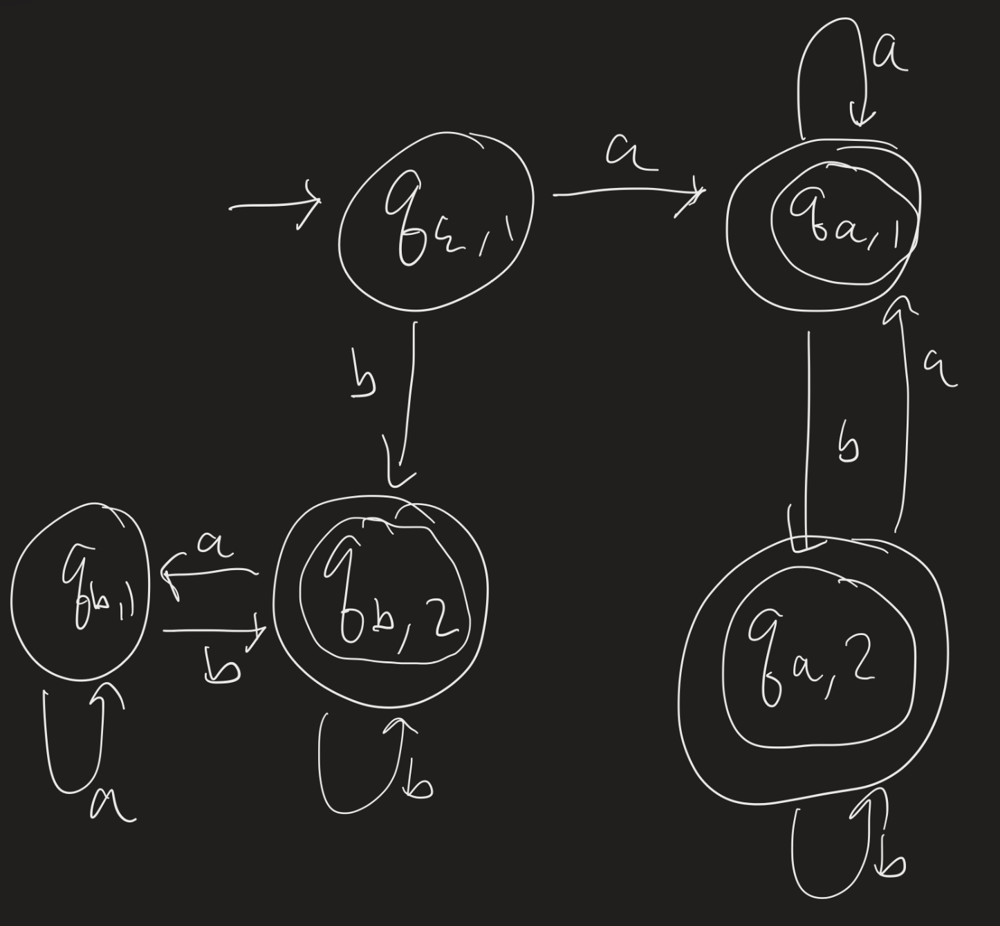

# Computability Lesson 2: Deterministic Finite State Automata
{:.no_toc}

1. Table of Contents
{:toc}

# Warm Up

1. Determine the language recognized by the following machine: 
2. Design a DFA that recognizes the language $\\{ w : w $ has an even number of 0s and an odd number of 1s $\\}$.
3. Design DFAs that recognize the following languages over $\Sigma = \\{ a, b \\}$:
  * $\mathcal{L}_1 = \\{ w : $ the number of $a$s in $w$ is a multiple of 3 $\\}$.
  * $\mathcal{L}_2 = \\{ w : $ the number of $b$s in $w$ is odd $\\}$.
  * $\mathcal{L}_3 = \mathcal{L}_1 \cup \mathcal{L}_2 = \\{ w : w \in \mathcal{L}_1$ or $w \in \mathcal{L}_2 \\}$.

Recall that the "union" of two sets is defined using "inclusive or": we are looking for a machine which recognizes all words which are either in $\mathcal{L}_1$ or in $\mathcal{L}_2$ or in both! For a hint on the last one: try to "simulate" going through "both" machines at the same time.

# Homework

What is the language of this machine?

# DFAs, Formally

To describe a Deterministic Finite Automaton, we need the following:

1. states (finitely many)
2. an alphabet (finite set of symbols)
3. transitions between the states
4. a start state
5. accepting state(s)

So, formally, a **deterministic finite automaton** (DFA) is a 5-tuple $(Q, \Sigma, \delta, q_0, F)$ (note: tuples are *ordered*, so we can refer to the first element of the tuple, second element, etc), where:

1. $Q$ is a finite set (called the **states**),
2. $\Sigma$ is a finite, non-empty set (the **alphabet**),
3. $\delta : Q \times \Sigma \to Q$ is a function (the **transition function**),
4. $q_0 \in Q$ (the **start state**), and
5. $F \subseteq Q$ (the set of **accept states**, or the **final states**).

Aside: what does $\delta : Q \times \Sigma \to Q$ mean?

* $\delta$ is a function
* $Q \times \Sigma$ is the set of all ordered pairs of the form $(q, a)$, where $q \in Q$ and $a \in \Sigma$,
* the **domain** of $\delta$ is $Q \times \Sigma$,
* the **codomian** of $\delta$ is $Q$.

That is: $\delta$ takes in, as input, a state and a symbol, and outputs a state. The meaning of $\delta(q, a) = q^\prime$ is that "if we are at state $q$ and see the symbol $a$ from the input, then we move to state $q^\prime$."

**Questions**: From the formal description:

1. Must there be a start state?
2. Must there be an accept state?
3. Can there be more than one start state?
4. Can there be more than one accept state?
4. Can all states be accept states?

## Example

Let's recall the "Even / Odd" example from last time:

How do we describe this formally?

* There are two states: $q_{\text{even}}$ and $q_{\text{odd}}$.
* The alphabet is $\\{ 0, 1 \\}$.
* Let's talk about the transition function, $\delta$, later.
* The start state is $q_{\text{even}}$.
* There is one accept state, $q_{\text{even}}$.

So formally, our machine is $M = \bigl(\\{q_{\text{even}}, q_{\text{odd}} \\}, \\{ 0, 1 \\}, \delta, q_{\text{even}}, \\{ q_{\text{even}} \\}\bigr)$.

How do we describe $\delta$? We could just give the diagram, or we could use the following table:

$$
\begin{array}{c | c | c}
\delta & 0 & 1 \\
\hline
q_{\text{even}} & q_{\text{odd}} & q_{\text{odd}} \\
\hline
q_{\text{odd}} & q_{\text{even}} & q_{\text{even}}
\end{array}
$$

## Computation

We previously defined "computation" for the "light switch machine" last week. We can define computation in pretty much the same way, using the formal definition of a DFA above. Suppose $M = (Q, \Sigma, \delta, q_0, F)$. We define what it means for $M$ to **accept** a string $w$:

Let $w = w_1 w_2 \ldots w_n$, where $w_i \in \Sigma$ for each $1 \leq i \leq n$. That is, $w$ is word of length $n$ over $\Sigma$. Then $M$ **accepts** $w$ if there is a sequence of states $r_0, r_1, \ldots, r_n$ such that:

1. $r_0 = q_0$ (the computation begins with the start state),
2. $\delta(r_i, w_{i+1}) = r_{i+1}$ for each $0 \leq i < n$, (each successive state in the computation is given by the transition function), and
3. $r_n \in F$ (we end in an accept state).

That is, the sequence $r_0, r_1, \ldots, r_n$ is the sequence of states $M$ enters as it reads $w$.

Recall that we say that $M$ **recognizes** $\mathcal{L}$ if $\mathcal{L} = \\{ w : M$ accepts $w \\}$.

**Definition**: $\mathcal{L}$ is a **regular language** if there is a DFA $M$ such that $M$ recognizes $\mathcal{L}$.

# Closure Properties

Previously we saw regular languages $\mathcal{L}_1$ and $\mathcal{L}_2$ such that their union $\mathcal{L}_1 \cup \mathcal{L}_2$ is also regular. How did this work?

It almost looks like we took 2 copies of $M_1$ and put them on top of each other; alternatively, you could think of it as putting three copies of $M_2$ next to each other.

We will show today that if $\mathcal{L}_1$ and $\mathcal{L}_2$ are both regular languages, then so is $\mathcal{L}_1 \cup \mathcal{L}_2$. That is, if we have two DFAs $M_1$ and $M_2$, we can construct a third DFA $M$ which accepts a word $w$ if and only if $M_1$ accepts $w$ or $M_2$ accepts $w$.

## Example

Let's do another warmup example.

1. Design a DFA which accepts $\mathcal{L}_1 = \\{ w : w$ starts with $a \\}$.
2. Design a DFA which accepts $\mathcal{L}_2 = \\{ w : w$ ends with $b \\}$.
3. Design a DFA which accepts $\mathcal{L}_1 \cup \mathcal{L}_2$. (What words do we need to accept here? What words do we reject here?)

So how do we design the third one? Again, try to design a machine which "runs" both machines at once. That is, if we see any symbol while we're in the start state, we move to a state that keeps track of where machine $M_1$ is in (after reading that symbol) and where machine $M_2$ is in.

Then keep going!

## Union

So the idea, again: keep track of **both** states at the same time. How do we do this? If $q$ is a state in $M_1$, and $q^\prime$ is a state in $M_2$, then make $(q, q^\prime)$ a corresponding state in our new machine $M$! Then we can use the transition functions from $M_1$ and $M_2$ to figure out the transition function for $M$.

**Theorem**: The class of regular languages is closed under unions.

What does this mean? If $\mathcal{L}_1$ and $\mathcal{L}_2$ are regular languages, so is $\mathcal{L}_1 \cup \mathcal{L}_2$.

This does *not* mean that if $\mathcal{L}_1$ is *not* regular and $\mathcal{L}_2$ is *not* regular, then $\mathcal{L}_1 \cup \mathcal{L}_2$ is not regular. That statement is false!

**Proof**: Suppose $M_1 = (Q_1, \Sigma, \delta_1, q_1, F_1)$ and $M_2 = (Q_2, \Sigma, \delta_2, q_2, F_2)$ recognize $\mathcal{L}_1$ and $\mathcal{L}_2$, respectively. We construct $M = (Q, \Sigma, \delta, q_0, F)$ as follows:

* Let $Q = Q_1 \times Q_2$. (One state for each pair $(q, q^\prime)$, where $q \in Q_1$ and $q^\prime \in Q_2$)
* $\Sigma$ is the same alphabet for all three machines.
* The start state $q_0 = (q_1,q_2)$: the start state of $Q_1$ along with the start state of $Q_2$.
* The accept states $F$ are all states of the form $(q, q^\prime)$ where either $q \in F_1$ or $q^\prime \in F_2$.

How do we define $\delta$? If $(q, q^\prime) \in Q_1 \times Q_2$ and $s \in \Sigma$, what is $\delta((q, q^\prime), s)$?

* Since $q \in Q_1$, we can check $\delta_1(q, s)$.
* Since $q^\prime \in Q_2$, we can check $\delta_2(q^\prime, s)$.

So we define $\delta((q, q^\prime), s)$ as $(\delta_1(q, s), \delta_2(q^\prime, s))$.

Now we have described our machine. We must show that this machine recognizes $\mathcal{L}_1 \cup \mathcal{L}_2$. That is, we have to show:

* If $w \in \mathcal{L}(M)$, then either $w \in \mathcal{L}_1$ or $w \in \mathcal{L}_2$, and,
* If $w \in \mathcal{L}_1$ or $w \in \mathcal{L}_2$, then $w \in \mathcal{L}(M)$.

Let $w = w_1 \ldots w_n$. Suppose $r_0, \ldots, r_n$ is the sequence of states that $M_1$ enters during its computation on $w$, and $s_0, \ldots, s_n$ is the sequence of states that $M_2$ enters during its computation on $w$.

That is, $\delta_1(r_i, w_{i+1}) = r_{i+1}$ and $\delta_2(s_i, w_{i+1}) = s_{i+1}$ (by definition of computation, given earlier today). This means that $\delta( (r_i, s_i), w_{i+1}) = (r_{i+1}, s_{i+1})$, as that is how we defined $\delta$ for $M$.

Suppose $M$ accepts $w$. That means $(r_n, s_n) \in F$. By definition of $F$, then, that means either $r_n \in F_1$ or $s_n \in F_2$. That is, either $M_1$ accepts $w$ or $M_2$ accepts $w$.

Now suppose $M_1$ accepts $w$. Then $r_n \in F_1$, so $(r_n, s_n) \in F$, and so $M$ accepts $w$. Similarly, if $M_2$ accepts $w$, then $s_n \in F_2$, so $(r_n, s_n) \in F$.

**Exercise**: Show that the class of regular languages is closed under intersection.

# Problem Set 1

**Due Thursday, February 8**:

For all of these problems, the alphabet $\Sigma = \\{ 0, 1 \\}$.

1. Let $\mathcal{L}_1 = \\{ w : w$ starts with a 0 and has odd length $\\}$.
  * Give a state diagram of a DFA that accepts $\mathcal{L}_1$.
  * Give the formal description of the DFA as well.
2. Consider the language $\mathcal{L}_2 = \\{ (01)^n : n \in \mathbb{N} \\}$.
  * Give two examples of words in $\mathcal{L}_2$ and two examples of words not in $\mathcal{L}_2$.
  * Give a state diagram of a DFA which accepts $\mathcal{L}_2$.
3. Show that if $\mathcal{L}_1$ and $\mathcal{L}_2$ are regular languages, then so is $\mathcal{L}_1 \cap \mathcal{L}_2$. That is: prove that the class of regular languages is closed under intersection.
4. (We haven't learned this yet) Let $\mathcal{L}_3 = \\{ xy : x$ and $y$ are words over $\Sigma$, $x$ starts with a $0$, and $y$ starts with a $1 \\}.$ Show that $\mathcal{L}_3$ is regular by giving a state diagram of an NFA which recognizes it.
5. Convert your NFA in question (4) to a DFA using the algorithm described in class.
