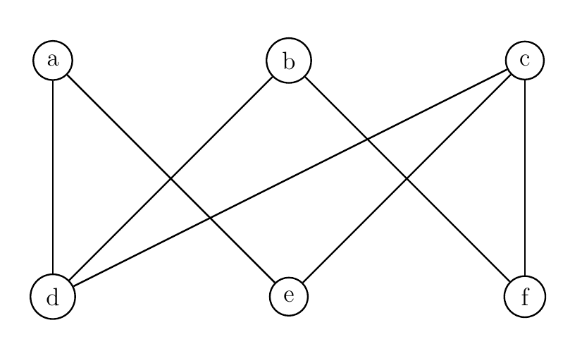

# Lesson 20: Introduction to Complexity
{:.no_toc}

1. Table of Contents
{:toc}

# Warm Up

The SUBSET-SUM problem is defined as follows: given a set $S \subseteq \mathbb{Z}$ (integers, positive and negative), and $n \in \mathbb{Z}$, determine if there is a subset $X \subseteq S$ such that the sum of all the elements of $X$ is equal to $n$.

For example, given $S = \\{1, 4, 9, 16, 25 \\}$, and $n = 13$, the answer is yes, since $4 + 9 = 13$. Similarly:

* If $n = 29$, $4 + 9 + 16 = 29$.
* If $n = 0$? The empty set is a subset of $S$, so yes!
* If $n = 2$? No!

1. Given $S = \\{1, 2, 4 \\}$, find all $n$ such that there is $X \subseteq S$ whose sum is $n$.
2. Devise an algorithm that determines if, given $S$ and $n$, there is $X \subseteq S$ whose sum is $n$.

"On input $(S, n)$,..."

What's the running time of your algorithm?

# Complexity

Reading: Sipser 7.1, 7.2; MS 6.1, 6.2

The goal of complexity theory is to attempt to classify problems by how hard they are to solve. In other words, all of these problems are decidable, but some are "harder" than others in terms of how efficiently an algorithm can solve them.

# Recap

Let $M$ be a deterministic, 1-tape TM. (We will talk about other models soon.) The **running time** of $M$ is the function $f: \mathbb{N} \to \mathbb{N}$ such that $f(n)$ is the maximum number of steps (configurations) $M$ takes to accept or reject any input of length $n$.

**Definition**: Let $f, g : \mathbb{N} \to \mathbb{R}^{\geq 0}$. We say $f(n) = O(g(n))$ if there are $c, N \in \mathbb{N}$ such that for all $n \geq N$, $f(n) \leq c g(n)$. We say $f$ is "Big Oh" of $g$.

The idea is that $\frac{f}{g}$ is eventually boudned by a constant.

In practice, coefficients don't matter, and only the highest order term mattesr. So some examples:

* $5n^4 - 300n^2 = O(n^4)$
* $37 \log_{10}(n) = O(\log_{10}(n)) = O(\log_2(n)) = O(\ln(n))$, We just call all of these $O(\log n)$.

**Definition**: Let $t : \mathbb{N} \to \mathbb{N}$ e any function. Then $TIME(t(n))$ is the collection of all languages which are decidable by a TM whose running time is $O(t(n))$.

**Definition**: The complexity class $P$ is defined as $P = \bigcup \limits_{k \in \mathbb{N}} TIME(n^k)$. This is the collection of all *polynomial-time* decidable problems.

## Questions?

Any questions from the notes from last time?

[Exercise solutions](solutions/lesson19.html)

## Example

Consider the problem $UNIQUE = \\{ L : L$ is a list of numbers without any duplicates $\\}$.

**Claim**: $UNIQUE \in P$. Why? What's the algorithm?

(Naively, there's an $O(n^2)$ algorithm. Using a hashtable / Set data structure, there's an $O(n)$ algorithm).

# Complexity Relationships between models

**Theorem**: Suppose a multitape TM $M$ has running time $t(n)$. Then there is an equivalent single tape TM whose running time is $O((t(n))^2)$.

The idea is really to just examine the proof that every multitape TM has an equivalent single-tape TM.

Suppose $M$ has $k$ tapes. Each tape has, at most, $O(t(n))$ cells that are actually used during the computation (otherwise, we wouldn't be able to even reach those). Convert this to a single tape TM $S$. The tape contents would then have length $k \times O(t(n))$, which is still $O(t(n))$ (constants don't matter).

(picture)

Recall that the algorithm for $S$ works by scanning the entire tape twice and updating the contents appropriately. So each step of $M$ corresponds to $2 \times O(t(n)) = O(t(n))$ steps for $S$.  That is:

* 1 step for $M$ is $O(t(n))$ steps for $S$
* $\vdots$
* $O(t(n))$ steps for $M$ is $O(t(n)) \times O(t(n)) = O((t(n))^2)$ steps for $S$

(We have to add one more $O(n)$ step at the beginning to get the input in the right form.) So running $S$ takes $O(n) + O((t(n))^2) = O((t(n))^2)$ steps.

**Corollary**: If a problem can be decided by a $k$-tape TM in polynomial time, then it is in $P$.

## Non-determinism

Next time we will talk about **non-deterministic** running times.

**Definition**: Let $N$ be an NTM. Its **running time** $f: \mathbb{N} \to \mathbb{N}$ is the function such that, for any input of size $n$, **every** branch of its computation tree halts in at most $f(n)$ steps.

**Definition**:

1. $NTIME(t(n))$ is the class of languages which can be decided by an NTM whose running time is $O(t(n))$.
2. $NP = \bigcup\limits_{k \in \mathbb{N}} NTIME(n^k)$

The Millenium Prize problem that we've mentioned a few times is the classic question of whether $P = NP$. We've seen that adding multiple tapes does not change the complexity class $P$; does adding non-determinism change this class?

**Example**: The graph isomorphism problem is in $NP$!

"On input $G_1 = (V_1, E_1), G_2 = (V_2, E_2)$:
1. Non-deterministically guess a function $f: V_1 \to V_2$.
2. For each $v_1, v_2 \in V_1$:
   * Check if $(v_1, v_2) \in E_1$ if and only if $(f(v_1), f(v_2)) \in E_2$.
   * If not, **reject**. If it is, continue on to the next pair.
3. If we never rejected on this branch after checking all pairs, **accept**."

**Exercise**:

1. Why does this non-deterministic algorithm work?
2. What's the non-deterministic running time of this?

# Problem Set 4

Due **Monday, April 22**.

1. Show that $A_{TM} \leq_T \overline{A_{TM}}$ and $\overline{A_{TM}} \leq_T A_{TM}$. That is, show that $A_{TM}$ is Turing-equivalent to its complement. (Note: These are *Turing reductions*, not $m$-reductions!)
2. Sketch a proof that the class $P$ is closed under intersection and complements.
3. Recall the language $FIN$ defined by: $$FIN = \{ \langle M \rangle : \mathcal{L}(M) \text{ is finite } \}.$$ Show that $A_\textrm{TM} \leq_\text{m} F$. (Hint: given $\langle M, w \rangle$, we construct a machine $M^\prime$ so that, on input $x$, $M^\prime$ should run $M$ on input $w$ for $|x|$ steps. What should $M^\prime$ then do if $M$ accepts in that many steps? What if $M$ does not accept in that many steps?)
4. Let $G = (V, E)$ be a finite graph. An *Eulerian path* is a path through the graph which visits every edge exactly once. An *Eulerian circuit* is an Eulerian path that begins and ends at the same vertex. A graph is called *Eulerian* if it has an Eulerian circuit. Let $E = \{ \langle G \rangle : G$ is an Eulerian graph $ \}$. Show that $E \in P$.

(Hint: Every time you visit a vertex, you have to enter it through one edge and leave it through another. What does that tell you? Is the following graph Eulerian? Why or why not? Is there an edge you can delete that makes it Eulerian?)

