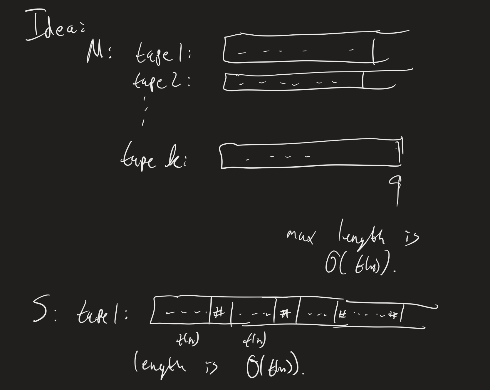

# Lesson 21: Complexity Relationships
{:.no_toc}

# Presentations

(If there were any volunteers to present today.)

## PS4 questions?

LaTeX file is on BrightSpace / website.

## Final Projects

* Groups? (Finalize them today.)
* Topics? Finalize them this week!

# Example

Consider the problem $UNIQUE = \\{ L : L$ is a list of numbers without any duplicates $\\}$.

**Claim**: $UNIQUE \in P$. Why? What's the algorithm?

(Naively, there's an $O(n^2)$ algorithm. Using a hashtable / Set data structure, there's an $O(n)$ algorithm).

# Complexity Relationships between models

**Theorem**: Suppose a multitape TM $M$ has running time $t(n)$. Then there is an equivalent single tape TM whose running time is $O((t(n))^2)$.

The idea is really to just examine the proof that every multitape TM has an equivalent single-tape TM.

Suppose $M$ has $k$ tapes. Each tape has, at most, $O(t(n))$ cells that are actually used during the computation (otherwise, we wouldn't be able to even reach those). Convert this to a single tape TM $S$. The tape contents would then have length $k \times O(t(n))$, which is still $O(t(n))$ (constants don't matter).

Recall that the algorithm for $S$ works by scanning the entire tape twice and updating the contents appropriately. So each step of $M$ corresponds to $2 \times O(t(n)) = O(t(n))$ steps for $S$.  That is:

* 1 step for $M$ is $O(t(n))$ steps for $S$
* $\vdots$
* $O(t(n))$ steps for $M$ is $O(t(n)) \times O(t(n)) = O((t(n))^2)$ steps for $S$

(We have to add one more $O(n)$ step at the beginning to get the input in the right form.) So running $S$ takes $O(n) + O((t(n))^2) = O((t(n))^2)$ steps.

**Corollary**: If a problem can be decided by a $k$-tape TM in polynomial time, then it is in $P$.

# Nondeterminism

**Definition**: Let $N$ be an NTM. Its **running time** $f: \mathbb{N} \to \mathbb{N}$ is the function such that, for any input of size $n$, **every** branch of its computation tree halts in at most $f(n)$ steps.

**Definition**:

1. $NTIME(t(n))$ is the class of languages which can be decided by an NTM whose running time is $O(t(n))$.
2. $NP = \bigcup\limits_{k \in \mathbb{N}} NTIME(n^k)$

The Millenium Prize problem that we've mentioned a few times is the classic question of whether $P = NP$. We've seen that adding multiple tapes does not change the complexity class $P$; does adding non-determinism change this class?

**Example**: The graph isomorphism problem is in $NP$!

"On input $G_1 = (V_1, E_1), G_2 = (V_2, E_2)$:
1. Non-deterministically guess a function $f: V_1 \to V_2$.
2. For each $v_1, v_2 \in V_1$:
   * Check if $(v_1, v_2) \in E_1$ if and only if $(f(v_1), f(v_2)) \in E_2$.
   * If not, **reject**. If it is, continue on to the next pair.
3. If we never rejected on this branch after checking all pairs, **accept**."

**Exercise**: Why does this non-deterministic algorithm work? What's the non-deterministic running time of this?

**Exercise**: Find a similar non-deterministic algorithm for SUBSET-SUM (check [Lesson 20](lesson20.html) for the definition).

## Equivalent definition of NP

Given a language $L$, a **verifier** for $L$ is a TM $M$ such that for each $w$, $w \in L$ if and only if there is a string $c$ such that $M$ accepts the pair $\langle w, c \rangle$. $c$ is called the *certificate* (or "witness") for $w$.

We measure the time complexity of a verifier in terms of the length of $w$ (not $c$!).

**Theorem**: $L \in NP$ if and only if it has a polynomial-time verifier.

We would have to prove two directions: If $L$ has a polynomial time NTM $N$, then it has a has a polynomial time verifier $V$, and vice versa.

**Exercise**: Suppose $N$ is a polynomial-time NTM for a language $L$. Since $N$ is a polynomial time NTM, that means that every branch of $N$ ... (fill in the blank here). Morever, since $w \in L$, that means that when $N$ runs on input $w$, there is at least one branch $b$ such that ... (filli n the blank here).

So a verifier for $L$ would work as follows. Use the computational branch $b$ as your "certificate".

"On input $\langle w, b \rangle$:  
1. Simulate $N$ on $w$ using $b$ to determine which nondeterministic choices to make.
2. If $N$ accepts, accept.
3. If $N$ rejects, reject."

**Exercise**: Why does this $V$ run in polynomial time? (This should relate to your answers in exercise 2).

Now we show the reverse direction.

**Exercise**: Suppose $V$ is a polynomial-time verifier for $L$, and so its running time is $O(n^k)$ for some $k$. Explain why, for each $w \in L$, the certificate $c$ which works (so that $V$ accepts $\langle w, c \rangle$) must have length at most $n^k$ for some $k$.

Based on this exercise then, if we have a verifier $V$ for $L$ that runs in time $O(n^k)$, an NTM for $L$ might work as follows:

"On input $w$:  
1. Non-deterministically guess a string $c$ of length at most $n^k$.
2. Check if $V$ accepts $\langle w, c \rangle$. If so, accept, otherwise reject."

**Exercise**: Why does this non-deterministic algorithm work? Why does it run in $O(n^k)$ steps?

## Millenium Prize Problem

As mentioned a few times, the classic Millenium Prize Problem asks whether $P = NP$. The class $P$ is considered the class of problems that are "easy to solve". Similarly, NP is the class of problems that are "easy to verify" (or "easy to check"). The question, then, is if being easy to check a solution implies that it's easy to come up with a solution.

A classic example of this duality between something being easy to verify, but possibly hard to check is the factoring problem used in RSA encryption. (This is not a "yes/no" problem, so it's stated differently, but it's similar in spirit): given a number $N$, factor $N$ into primes.

* Any *solution* is easy to check: the "c" would just be the prime factors of $N$.
* Given $N$, there is currently no known algorithm which outputs the prime factors of $N$ is time polynomial in the length of $N$ (which is $O(\log(N))$).

This is the math behind public-key encryption (RSA):

* Given $p, q$ as "private" keys, you can easily compute $pq$.
* Given $p \times q$ (public), there is no known algorithm which efficiently computes $p$ and $q$.