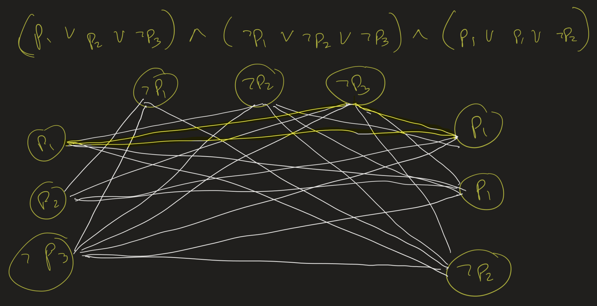

# Lesson 25: NP-Completeness proofs, Decision / Search, Turing Jumps
{:.no_toc}

1. Table of Contents
{:toc}

# Quiz

# Aside on Reductions

1. If $A \leq_T B$ and $A$ is computable, what does that mean for $B$?
2. If $A \leq_m B$ and $A$ is c.e., what does that mean for $B$? What if $A$ is computable?
3. If $A \leq_P B$ and $A \in P$, what does that mean for $P$?

In all of these instances the answer is the same: **nothing**! Intuitively, $A \leq B$ means that $B$ is "at least as hard" as $A$.

Examples:

1. Let $A = CLIQUE$ and $B = A_{TM}$. Then $A \leq_{T} B$ because, given a graph $G$ and a number $k$, if we have an oracle for $A_{TM}$, we can decide if $G$ has a k-clique by simply ignoring the oracle and just brute-force searching for a $k$-clique.
2. Let $A = A_{TM}$ and $B = FIN$. Then we actually saw this before: $A \leq_m B$! (This was a homework question. On input $\langle M, w \rangle$, construct a TM $M^\prime$ which, on input $x$, runs $M$ on $w$ for $\|x\|$ steps steps...).
   * What if $A$ is computable? Suppose $A = CLIQUE$ and $B = FIN$. Then, given a graph $G$ and integer $k$, construct two TMs, $M_1$ which accepts nothing, and $M_2$ which accepts nothing. Brute force search for a $k$-clique in $G$, and depending on your answer, output $\langle M_1 \rangle$ or $\langle M_2 \rangle$.
3. Let $A = \\{ w : w$ represents a power of 2 in binary $\\}$ and $B = CLIQUE$. Similar idea: on input $w$, construct two graphs: one that's a triangle, and one that is just three vertices (disconnected). Check if $w$ is a power of 2 in binary (in polynomial time!) and then output either the triangle (a 3-clique) or the disconnected vertices (not a 3-clique) depending on your answer!

# CLIQUE is NP-Complete

Given a graph $G$ and a number $k$, a $k$-clique is a subset of vertices of size $k$ which are all connected to one another. For example the following graph has a 3-clique:

The problem $CLIQUE$ is, given a graph $G$ and a number $k$, determine if $G$ contains a $k$-clique.

**Theorem**: $CLIQUE \in NP$.

(Exercise). How do we show it's NP-complete though?

**Theorem**: $3-SAT \leq_P CLIQUE$.

**Proof**:

Suppose $\phi(p_1, \ldots, p_n)$ is a formula with $n$ variables and $m$ clauses. We build a graph $G$ with $m$ groups of triples (three vertices); the triples correspond to the clauses of $\phi$. For example, if we have a clause $p_1 \vee p_1 \vee \lnot p_2$, we put three nodes labeled $p_1$, $p_1$ and $\lnot p_2$ in our graph.

We put edges between all vertices except if they are in the same triple (if they correspond to two literals from the same clause), or if they are contradictory (if one corresponds to $p$ and one to $\lnot p$, for some variable $p$).

For example, if we start with the formula
$$
\begin{align}
(p_1 \vee p_2 \vee \lnot p_3) \wedge (\lnot p_1 \vee \lnot p_2 \vee \lnot p_3) \\
\wedge (p_1 \vee p_1 \vee \lnot p_2),
\end{align}
$$ we get a graph with 9 vertices (3 triples). A satisfying assignment for $\phi$ would correspond to a 3-clique in this graph.

**Claim**: $\phi$ is satisfiable if and only if $G$ has an $m$-clique.

# Decision vs Search

**Decision problem**: Given a graph $G$ and number $k$, dtermine if $G$ has a $k$-clique.

**Search problem**: Given a graph $G$ and number $k$, **find** a subset $S \subseteq V$ of size $k$ such that $S$ is a $k$-clique, or output "no $k$-clique" if not found.

**Claim**: If the *decision* version of CLIQUE is solvable in polynomial time, so is the *search* version.

Idea:

"On input $G = (V, E), k$:  
1. Check if $G$ has a $k$-clique. If not, output "no $k$-clique" and halt.  
2. Set $G_0 = G$, enumerate the vertices $V = \\{ v_0, v_1, \ldots, v_{n-1} \\}$.
3. For each $i < n$:
   * Construct the graph $H$, by taking $G_i$ and deleting vertex $v_i$ (and all its edges).
   * Check if $H$ has a $k$-clique. If so, set $G_{i+1} = H$ and continue. If not, set $G_{i+1} = G_i$ and continue.
4. When we get here, there should be exactly $k$ vertices left. Output those $k$ vertices: they form our $k$-clique."

# P vs NP, Philosophically

> If P=NP, then the world would be a profoundly different place than we usually assume it to be. There would be no special value in “creative leaps,” no fundamental gap between solving a problem and recognizing the solution once it’s found. Everyone who could appreciate a symphony would be Mozart; everyone who could follow a step-by-step argument would be Gauss; everyone who could recognize a good investment strategy would be Warren Buffett.

[Scott Aaronson, "Reasons to Believe"](https://scottaaronson.blog/?p=122)

Aaronson also wrote an interesting article about philosophy and complexity theory: [Why Philosophers Should Care About Computational Complexity](https://www.scottaaronson.com/papers/philos.pdf).

Readings: skim 6.1 and read 6.2 (Sipser)

# Enumeration of Partial Computable Functions

Recall that a function $f$ is called a "partial computable function" if there is an input-output TM $F$ such that, on input $w$, $F(w)$ halts and outputs $f(w)$ if $w$ is in the domain of $f$.

For now, we will talk about functions whose domains are subsets of $\mathbb{N}$, the natural numbers. We will say that $f : \mathbb{N}^k \to \mathbb{N}$ is a partial computable function if there is an input output TM $F$ which, on input $a^{n_1} \\# a^{n_2} \\# \ldots \\# a^{n_k}$, halts and outputs $a^n$ if and only if $(n_1, n_2, \ldots, n_k)$ is in the domain of $f$ and $f(n_1, n_2, \ldots, n_k) = n$.

Recall that there is a notion of a "Universal TM". That is, a TM which, given input $\langle F, w \rangle$ will halt and output $F(w)$ if and only if $F$ halts on input $w$. Similarly, there is a kind of **universal partial-computable function**: a partial computable function $f : \mathbb{N}^2 \to \mathbb{N}$ such that the following two properties hold:

1. For every $e$, the function defined by $\phi(n) = f(e, n)$ is a partial computable function (that is, $\phi$ halts on input $n$ if and only if $f$ halts on $(e, n)$, and $\phi(n)$ outputs the same thing as $f(e, n)$, and 
2. For every partial computable function $\phi : \mathbb{N} \to \mathbb{N}$, there is *some* $e$ such that for every $n$, $\phi(n) = f(e, n)$.

We write $f_e$ to refer to the function defined by $f(e, \cdot)$.  Then $f_0, f_1, f_2, \ldots$ is a computable enumeration of all partial computable functions!

(Why does there exist such a computable enumeration? On input $e$, one can try to construct the first $e$ input-output TMs which use some fixed alphabet. The $e$-th one you construct is, essentially, the function $f_e$.)

More notation:

1. Write $f(n) \downarrow$ to mean that $f(n)$ halts.
2. Write $f(n) \downarrow = y$ to mean that $f(n)$ halts and outputs $y$.
3. Write $f(n) \uparrow$ to mean that $f$ does not halt on input $n$. 

**Definitions**: 

1. A *partial computable* function $f$ is called *total computable* if $f(n) \downarrow$ for every $n \in \mathbb{N}$.
2. A set $A \subseteq \mathbb{N}$ is called **computable** if its characteristic function is computable.

That is, if $$\chi_{\mathbb{A}}(n)= \begin{cases} 1 & \text{if } n \in A \\ 0 & \text{if } x \notin A \end{cases}$$ is a total computable function.

**Theorem**: The set $X = \\{ e : f_e(e) \downarrow = 0 \\}$ is not computable.

Proof?

**Theorem**: The **halting set** $H = \\{ e : f_e(e) \downarrow \\}$ is not computable.

**Proof**: Suppose it is. Then we can compute $X$: 

On input $e$:
1. Check if $\chi_H(e) = 0$. (ie, $e \notin H$. If so, output $0$, since $X \subseteq H$.
2. If $\chi_H(e) = 1$, then compute $f_e(e)$. If $f_e(e) = 0$, then output 1.

# Oracles

Recall that an "oracle-TM" is a TM which has access to querying an oracle. One can think of it as a program which takes in two inputs: a number ($n$), and a set $X$. The program, then, can do the normal operations on $n$, but it can also ask (finitely many) questions of the form "Is $x \in X$?"

This is a very general set-up. That is, given the "source code" for an oracle TM, we could "plug in" different sets as oracles, and end up solving different problems. For example, consider the following code for an oracle TM:

"On input $\langle e, n \rangle$, with oracle $X$:

1. Find the code $e^\prime$ of a function $f_{e^\prime}$, which, on any input, ignores it and compute $f_e(n)$.
2. Check if $e^\prime \in X$.
   * If not, output 0 (reject).
   * If so, compute $f_e(n)$ and output whatever it outputs."

* If we plug in to this oracle with $X$ being the empty set, this will reject every input.
* If we plug in to this oracle with $X$ being the halting set $H = \\{ e : f_e(e) = 1 \\}$, then this computes an analogue of the "acceptance problem", translated to this number-theoretic setup.

That is, this computes a total oracle-computable function $\Phi^X$ such that if $X = H$, $\Phi^X(e, n) = f_e(n)$ if $f_e(n)$ halts, and $\Phi^X(e, n) = 0$ otherwise. This function is *not* a total computable function, but it *is* a total $H$-computable function.

## Enumeration of Partial Oracle-Computable Functions

Recall that there is a computable enumeration $f_0, f_1, f_2, \ldots$ of all partial computable functions. What does this mean?

* For each $e$, one can determine what the $e$-th partial computable function is. (The idea: if $e = 0$, figure out what the smallest valid IO TM over the alphabet $\\{0, 1 \\}$ is. Then if $e = 1$, figure out the second smallest, etc.)
* For each IO TM $F$, one can find an $e$ (maybe many $e$'s, but you can find at least one) such that $f_e$ and $F$ compute the same function (halt on the same inputs, and for those inputs that they both halt on, output the same number). The idea is to think of $e$ as the "source code" for $F$.

How did we obtain such a computable enumeration? By, more or less, describing a universal TM. That is, describing a TM $M$ such that, on input $\langle M^\prime, w \rangle$, $M$ simulates $M^\prime$ on $w$. Translating this to the language of functions on natural numbers, this describes a function $f$ which, on input $(e, n)$, "decodes" $e$ (figures out what the $e$-th TM is), and runs that on input $n$.

Similarly, we can describe a universal oracle TM $M$ in the exact same way: on input $\langle M^\prime, w \rangle$, just "decode $M^\prime$" and run it on input $w$. But of course, if $M^\prime$s code queries an oracle, then the only way $M$ can simulate that is by asking the same oracle.

In other words, there is a partial oracle computable function $F$, which, for any oracle set $X$ and any input $(e, n)$, runs the $e$-th partial $X$-computable function ("decodes" this) on input $n$. So again, we obtain an $X$-computable enumeration of all partial $X$-computable functions $\Phi^X_0, \Phi^X_1, \ldots$.

(Moreover, there is a strong universality to this algorithm: the same "oracle" algorithm works for any oracle, just depending on what set you plug in as the oracle.)

This allows us to define, for any set $X$, the **halting problem relativized to $X$**:

**Definition**: Let $X \subseteq \mathbb{N}$ be any set. Then $X^\prime$, the **Turing jump of $X$**, is the set $\\{ e : \Phi^X_e(e)$ halts $\\}$.

**Theorem**: For any set $X$, $X <_T X^\prime$.

**Proof**: There are two things to show here. First, that $X \leq_T X^\prime$. Then, that $X^\prime$ is not $X$-computable. We will skip the first (it actually takes a bit more work than you might expect.)

The second part, though, is essentially the same proof that the halting problem is not computable. The exact same proof relativizes. That is, assume that $X^\prime$ is $X$-computable. Then we would also be able to $X$-compute the set $\\{ e : \Phi^X_e(e)$ halts and equals $0 \\}$. But if this is $X$-computable, then its characteristic function $\chi$ is equal to $\Phi^X_e$ for some $e$. Then one checks that $\chi(e) = 1$ iff $\Phi^X_e(e) = 0$, and vice versa.

## Turing Jumps

A Turing jump, then, is a "strictly harder" problem than the original problem.

* The sets that can be decided from no oracle, ie the $\emptyset$-computable sets, are just the computable sets.
* The halting problem, then, is the jump of the empty set$: $\emptyset^\prime$ (usually referred to as "0-jump")
* The sets that can be computed from $\emptyset^\prime$ are the c.e. and co-c.e. sets.
* Then there is $\emptyset^{\prime\prime}$, $\emptyset^{\prime\prime\prime}$, etc.

The theorem above says that each of these is strictly harder than the one that came before it! That means, there is no set $X \subseteq \mathbb{N}$ that computes everything! That is, there is no $X$ such that for every $A \subseteq \mathbb{N}$, $A \leq_T X$.

This is actually a profound statement because this is saying that there is no "universal set". I aim to show that there is a natural example of what one might hope would be a universal set: the set of all codes of true statements about numbers!

# Logic

Recall that a **term** in arithmetic is:

* 0,
* 1,
* $x_i$, for some $i \in \mathbb{N}$ (a variable)
* $t_1 + t_2$, if $t_1$ and $t_2$ are arithmetic terms, or
* $t_1 \cdot t_2$, if $t_1$ and $t_2$ are arithmetic terms.

Previously you showed that $L_{terms} = \\{ t : t$ is a term $\\}$ is context-free. Therefore, it's computable.

A **formula** is:

* $t_1(x_1, \ldots, x_n) = t_2(x_1, \ldots, x_n)$, where $t_1$ and $t_2$ are terms,
* $t_1(x_1, \ldots, x_n) < t_2(x_1, \ldots, x_n)$, where $t_1$ and $t_2$ are terms,
* $(\phi(x_1, \ldots, x_n) \wedge \psi(x_1, \ldots, x_n))$, where $\phi$ and $\psi$ are formulas,
* $\lnot (\phi(x_1, \ldots, x_n))$, where $\phi$ is a formula,
* $\exists x_i (\phi(x_1, \ldots, x_n))$, where $\phi$ is a formula and $x_i$ is a variable ($i \in \mathbb{N})$

Similarly we showed that $L_{formulas} = \\{ \phi : \phi$ is a formula $\\}$ is computable.

**Examples**:

1. $\exists \exists x_1$ is not a formula.
2. $\exists x_1$ is not a formula.
3. $\lnot (\exists x_1 (\lnot (x_1 + x_1 = x_1)))$ is a formula.

A **statement** is a formula with no free variables.

For example, $\phi(x_0, x_1, x_2) = \exists x_3 (x_3 + x_3 = (x_0 + x_1) \cdot (x_0 + x_1 + 1) \wedge x_2 = (x_3 + x_1))$ is a formula. If we plug in, $\phi(0, 1, 2)$ is a statement. (Technically, "2" isn't in our language, but $1 + 1$ is, and so there is a "closed term" that represents 2).

## Truth and Definability

**Statements** are either true or false. **Formulas** *define* a set of numbers (or of tuples of numbers).

For example, the statement $t_1(a_1, \ldots, a_n) = t_2(b_1, \ldots, b_n)$ if those terms arithmetic terms really are equal. So for example, the expression $(1 + 1) \cdot (1 + 1) = (1 + (1 + (1 + 1)))$ is true, since both sides of the equation really are equal to 4. We write $\mathbb{N} \models (1 + 1) \cdot (1 + 1) = (1 + (1 + (1 + 1)))$.

(Notice that it's possible to write a program that would verify if terms are equal to one another. It might require some amount of recursion and/or data structures, but in principle it's just figuring out what the "expression trees" are for both terms and plugging in the numbers.)

Similarly, $\mathbb{N} \models 1 + 1 < 1 + (1 + 1)$, since $2$ really is less than 3. It is similarly possible to write a program that determines if one term is less than another term, given inputs to those terms.

Inductively, if $\phi$ and $\psi$ are both true, then $\mathbb{N} \models \phi \wedge \psi$. And if $\phi$ is true, then $\mathbb{N} \not \models \lnot \phi$, that is, $\lnot \phi$ is false. And vice versa: if $\phi$ is false, then $\mathbb{N} \models \lnot \phi$.

Lastly, $\mathbb{N} \models \exists x_0 \phi(x_0, a_1, \ldots, a_n)$ if there is some number $b \in \mathbb{N}$ such that $\mathbb{N} \models \phi(b, a_1, \ldots, a_n)$. That is, if you can plug in something for $x_0$ in the formula that makes the resulting statement true.

A formula $\phi(x_1, x_2, \ldots, x_n)$ defines the set of $n$-tuples $\\{ (x_1, \ldots, x_n) : \mathbb{N} \models \phi(x_1, \ldots, x_n) \\}$. So for example, the formula $\phi(x) = \exists y (x = y \cdot y)$ defines the set of all perfect squares $\\{ 0, 1, 4, 9, \ldots \\}$.

Much of the study of logic boils down to the question: which sets are definable? This is an interesting question to logicians because definability is some way of saying that we "understand" an object. We can define the set of even numbers, the set of prime numbers, the set of perfect squares, etc. Most (all?) sets we can describe in number theory we can define using first order logic.

## Expressibility

Arithmetic is *deceptively expressive*.

We can "code" some set theory using numbers. We say $x \in a$ if the $x$-th bit of $a$, written in binary, is a 1. That is, there is a formula $\phi(x, a)$ that expresses exactly that the $x$-th bit of $a$ is equal to 1. (Exactly how to write this formula is not so important; what's more important is that this relation is actually *computable*: on input $x$ and $a$, how would you check if the $x$-th bit of $a$ is equal to $1$?)

We can "define" finite sequences: that is, the sequence $(a_1, a_2, \ldots, a_n)$ can be represented by the single number $2^{a_1} \cdot 3^{a_2} \cdots p_n^{a_n}$, where $p_n$ is the $n$-th prime number. (This is not quite accurate, as one would first need to code the length of the sequence $n$, but this is a technicality that I'll ignore. If you care about gory details, take a look at *Models of Peano Arithmetic*, by Richard Kaye).

Putting these two together: we can express that the number $x$ represents the finite sequence $(Q, \Sigma, \Gamma, \delta, q_0, q_{halt})$ that represnts an IO TM! That is:

* Each of $Q$, $\Sigma$, and $\Gamma$ are finite sets
* $\delta$ is a finite function, which can be represented as a finite set
* $q_0$ and $q_{halt}$ are elements of $Q$

And so each of these can be represented by numbers. There is a formula $\phi(x)$ that expresses: "$x$ represents a finite sequence $(x_1, x_2, x_3, x_4, x_5, x_6)$, where $x_1$, $x_2$ and $x_3$ are sets, $x_5 \in x_1$ and $x_6 \in x_1$, and $x_4$ is a function with domain $x_1 \times x_3$ and codomain $x_1 \times x_3 \times \\{ L , R \\}$".

(That's a mouthful, and the formula would be very long, but it's possible). In fact, this shouldn't be too surprising since there is a TM which recognizes whether a sequence is a valid description of a TM. Since the description of a TM can be thought of as a string, and that string can then be thought of as its ASCII code (or Unicode encoding), we can think of this description of a TM as a number!

So the conclusion is: there is a formula $\phi(x)$ which defines the set of codes of TMs.

**Question**: What's the relationship between definability and computability? Are all computable sets definable? Vice versa? 
