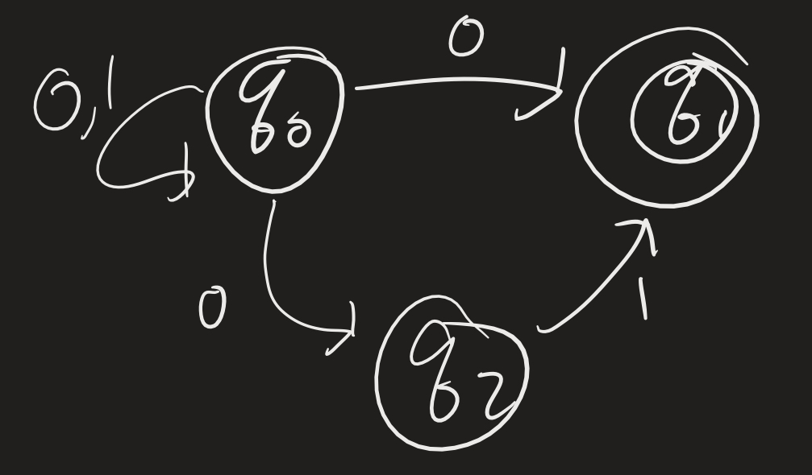
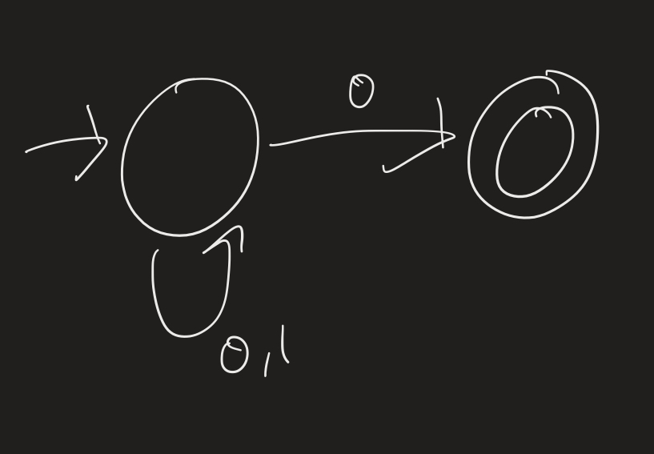
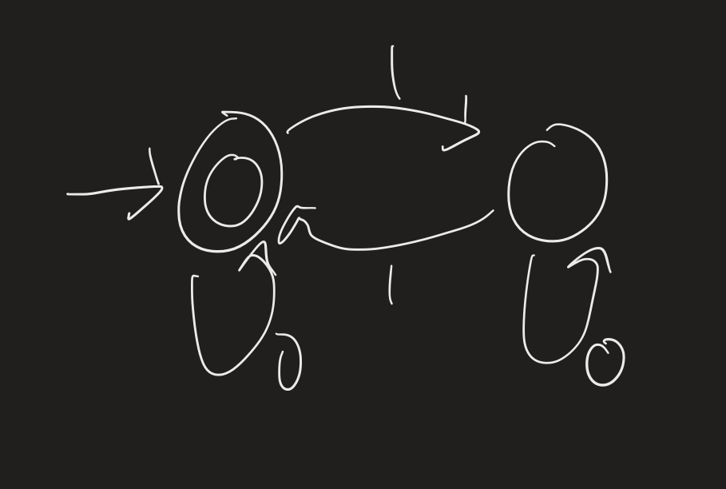
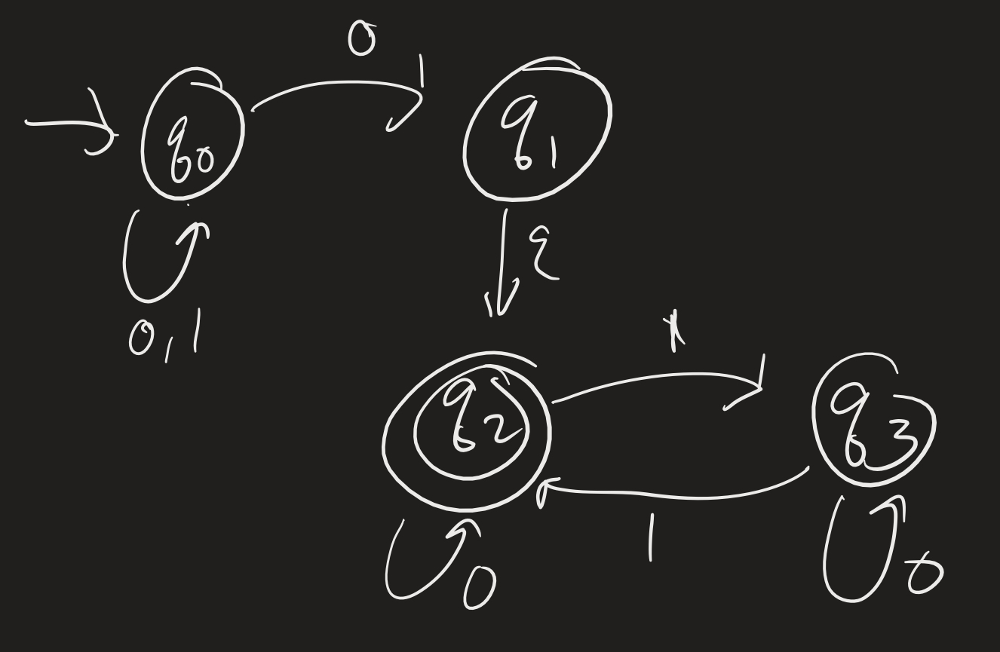
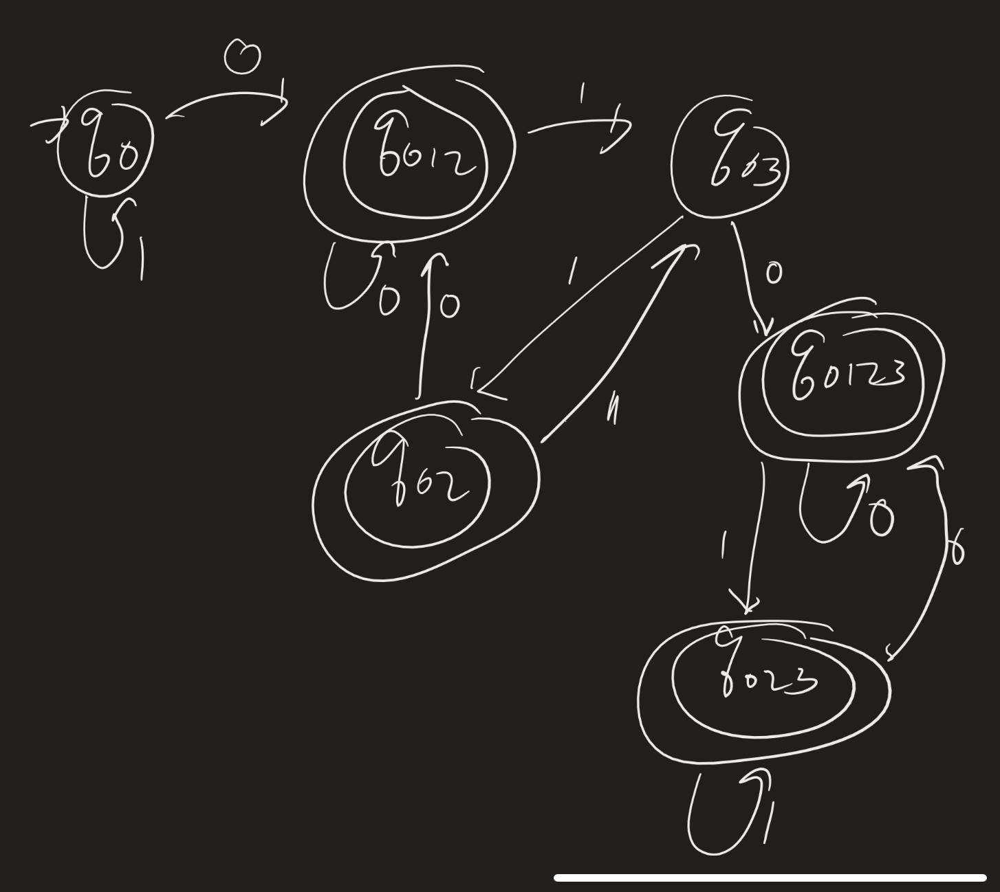
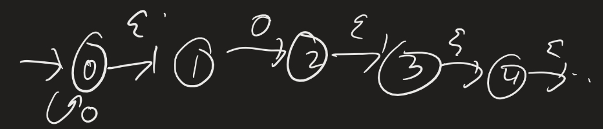
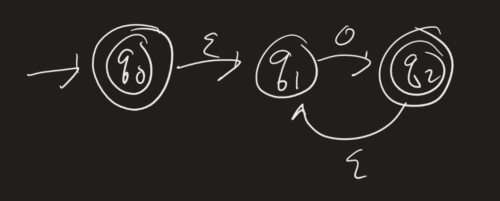
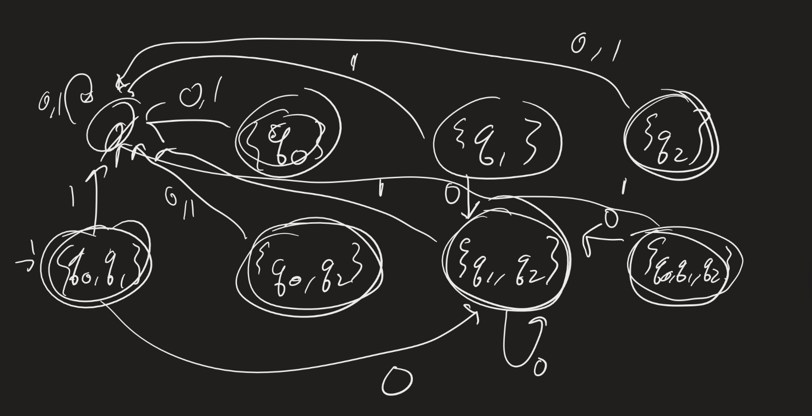
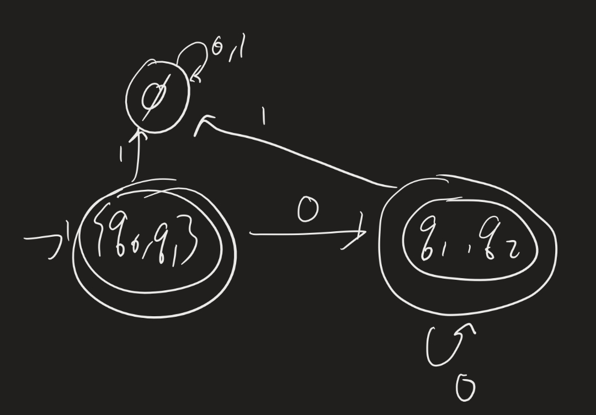
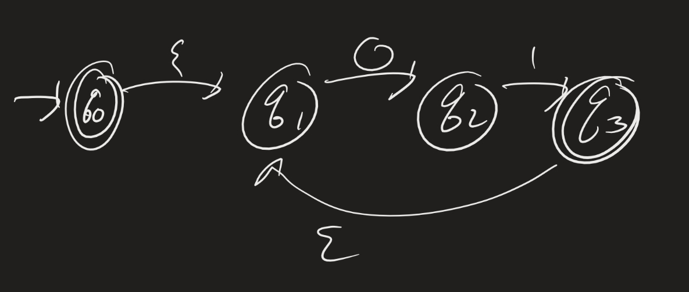

# Computability Lesson 4: Equivalence between NFAs and DFAs
{:.no_toc}

1. Table of Contents
{:toc}

# Reminders

* Problem Set 1 due **next Monday**, 2/11 (date change).
* [Register to vote in NYS](https://elections.ny.gov/register-vote)
  * [Check if you are registered to vote](https://voterlookup.elections.ny.gov/)
  * [Deadlines](https://elections.ny.gov/registration-and-voting-deadlines)
    * Must be registered by March 23 to vote in Presidential primary (April 2)
    * By June 15 to vote in Congressional primaries (June 25)
    * (If changing party designation? By **Feb 14**)
    * By October 26 to vote in general election (Nov 5)

# Epsilon Transitions

NFAs are allowed to have "$\varepsilon$-transitions". In the above, if you are at state $q_1$, you can immediately jump to state $q_2$ without reading any symbol. This gives us many more ways to parse the input. (It can complicate things a lot, but also, when we design NFAs, it can make that process easier!)

Let's see how we can parse a few words. Again, we will *try* to get to an accept state ($q_2)$ if we can:

* $w = 011$. We can parse this as $q_0 \xrightarrow{0} q_1 \xrightarrow{\varepsilon} q_2 \xrightarrow{1} q_3 \xrightarrow{1} q_2$.
* $w = 1110$. These first three 1s have to be processed deterministically (why?): $q_1 \xrightarrow{1} q_0 \xrightarrow{1} q_0 \xrightarrow{1} q_0 \xrightarrow{0} q_1 \xrightarrow{\varepsilon} q_2$.

What about $w = 1001$? There are two ways to parse this:

* $q_0 \xrightarrow{1} q_0 \xrightarrow{0} q_1 \xrightarrow{\varepsilon} q_2 \xrightarrow{0} q_2 \xrightarrow{1} q_3$ (rejects)
* $q_0 \xrightarrow{1} q_0 \xrightarrow{0} q_1 \xrightarrow{0} q_0 \xrightarrow{1} q_0$ (rejects).

There is no way to parse this while ending up in $q_2$. Why not?

* In order to get to $q_2$, we first have to get to $q_1$.
* To get to $q_1$, we need an *odd number of 0s*!
* If we then get to $q_2$, we need an *even number of 1s* to stay at $q_2$!

So: $\mathcal{L}(N) = \\{ w : w = xy$, where $x$ has an odd number of 0s and $y$ has an even number of 1s $\\}$!

So $1001 \not \in \mathcal{L}(N)$, because there is no way to break up $1001$ into two strings where the first has an odd number of 0s and the second has an even number of 1s.

## Exercise

Design an NFA which accepts the language $\mathcal{L} = \\{ xy : x $ has an even number of 0s and $y$ has an odd number of 1s $ \\}$.

# Equivalence

**Theorem**: Let $\Sigma$ be an alphabet and $\mathcal{L}$ a language of words over $\Sigma$. Then $\mathcal{L}$ is regular if and only if there is an NFA which recognizes it.

What does "if and only if" mean? We need to prove two things:

1. If $\mathcal{L}$ is regular, there is an NFA which recognizes it.
2. If an NFA recognizes a language $\mathcal{L}$, it is regular.

Let's examine this a bit deeper. What does it mean for a language to be regular? Recall: $\mathcal{L}$ is regular if there is a DFA (deterministic!) which recognizes it. This definition makes one of the two statements above obvious. (Which one?)

## Exercise

**Definition**: Let $\mathcal{L}_1$ and $\mathcal{L}_2$ be two languages. The **concatenation** of $\mathcal{L}_1$ and $\mathcal{L}_2$ is given by $$\mathcal{L}_1 \cdot \mathcal{L}_2 = \{ w : w = w_1 w_2 \text{ for some } w_1 \in \mathcal{L}_1, w_2 \in \mathcal{L}_2 \}$$. Suppose the theorem stated above is true. (It is, we just haven't proved it yet.) Use this theorem to prove the following statement:

**Exercise**: Prove that the class of regular languages is closed under concatenation.

**Idea**: What do we need to prove here? First suppose we have two regular languages $\mathcal{L}_1$ and $\mathcal{L}_2$. By definition, there are DFAs which recognize those two languages. We need to construct a DFA which recognizes the concatenation.

But wait: we have a new tool we can use. The theorem above says that if we can actually just construct an NFA which recognizes the concatenation, then we are done, because if an NFA recognizes the language, then the language is regular!

(So: any idea on how to construct an NFA which recognizes the concatenation? Again, start with two DFAs, $M_1$ and $M_2$. Then design an NFA $N$, giving its states, alphabet, transition function, start state, and final states.)

# Formal Definition

Before we can proceed with the Theorem, we need to formally define NFAs and computation. Notice that there are two main differences between DFAs and NFAs:

1. We are allowed to read $\varepsilon$ as a symbol (so this should change the inputs to $\delta$), and
2. The transition function does not need to pick out exactly one state (this should change the *outputs* of $\delta$).

The first change is easy to make. Instead of making the domain of $\delta$ be $Q \times \Sigma$, we let $\Sigma_{\varepsilon} = \Sigma \cup \\{ \varepsilon \\}$ and make the domain of $\delta$ $Q \times \Sigma_{\varepsilon}$.

The second change may be a little harder to reason about. What does the transition function actually output now? Now, instead of saying $\delta(q, a) = q^\prime$, we have to be able to answer: "What are all the possible states that we can transition to from $q$ when we read the symbol $a$?" In other words, the outputs of $\delta$ need to be *subsets* of $Q$, not just elements of $Q$!

**Definition**: Let $X$ be any set. We say $A \subseteq X$ if every element of $A$ is an element of $X$. The collection of all possible subsets of $X$ is called the **power set** of $X$, denoted $\mathcal{P}(X)$.

So in other words: the main change is that we modify the definition of $\delta$. Now the transition function is $\delta : Q \times \Sigma_{\varepsilon} \to \mathcal{P}(Q)$. Note that $\emptyset \in \mathcal{P}(Q)$, which means it's possible that $\delta(q, a)$ is the empty set. What would that mean?

**Definition**: A **non-deterministic finite automaton** (NFA) is a 5-tuple $(Q, \Sigma, \delta, q_0, F)$, where:

1. $Q$ is a finite set (of state),
2. $\Sigma$ is a finite, non-empty set (symbols), and $\varepsilon \not \in \Sigma$,
3. $\delta : Q \times \Sigma_{\varepsilon} \to \mathcal{P}(Q)$ is a function (transition function),
4. $q_0 \in Q$ (start state), and
5. $F \subseteq Q$ (accepting states)

Notice that every DFA is automatically an NFA. Why is that? Suppose we have a DFA, with transition function $\delta_1$. We can define an NFA with the same states, alphabet, start state and accepting state by defining a new transition function $\delta_2$ by $\delta_2(q, \varepsilon) = \\{ q \\}$ (add $\varepsilon$-transitions from each state to itself) and $\delta_2(q, a) = \\{ \delta_1(q, a) \\}$ (make the outputs of $\delta$ "singleton" sets).

## Computation

We can define computation similarly to how we define it for DFAs. The issue, of course, is that there may be many ways to parse the input.

**Definition**: Let $N = (Q, \Sigma, \delta, q_0, F)$ be an NFA and $w$ a word over $\Sigma$. Then $N$ **accepts** $w$ if there are $w_1, \ldots, w_n \in \Sigma_{\varepsilon}$ and states $r_0, \ldots, r_n \in Q$ such that:

1. $w = w_1 \ldots w_n$,
2. $r_0 = q_0$,
3. $r_{i+1} \in \delta(r_i, w_{i+1})$ for each $0 \leq i < n$, and
4. $r_n \in F$

Then $\mathcal{L}(N) = \\{ w : N$ accepts $w \\}$ is the **language** of $N$. We say that $N$ **recognizes** (or **accepts**) $\mathcal{L}(N)$.

## Proof Idea

**Exercise**: Given the following NFA, find a DFA which accepts the same language.

Idea: start at $q_0$, and keep track of all the states you could possibly transition to.

**Example 2**: Design a DFA which accepts the language $\mathcal{L} = \\{ xy : x$ ends in 0 and $y$ has an even number of 1s $\\}$.

First, here is an NFA which accepts $\mathcal{L}_1 = \\{ x : x$ ends in 0 $\\}$:

Here is one which accepts $\mathcal{L}_2 = \\{ y : y$ has an even numer of 1s $\\}$.

Here is an NFA which accepts the concatenation:

Now again, start at $q_0$. If we see a $0$, we can end up in either $q_0, q_1$, or $q_2$. So we need a state $q_{0,1,2}$ which represents being in any of those three. If we see a 1? We stay at $q_0$.

Now check what states we can go to if we are in any of $q_0, q_1$, or $q_2$, and we see a 0. Similarly, where could we go if we see a 1? Then keep going. Eventually we have to stop. Why?

**Question**: Why does this process have to stop?

Since there are only finitely many states in $Q$, there are only finitely many *subsets* of $Q$. In fact, we know exactly how many subsets of $Q$ there are (maybe we'll do this next time): if a set $X$ has $n$ elements, then $\mathcal{P}(X)$ has $2^n$ elements! (This can be proved by induction).

## Proof

In fact, we will prove:

**Theorem**: Let $N = (Q, \Sigma, \delta, q_0, F)$ be an NFA. There is a DFA $M = (Q^\prime, \Sigma, \delta^\prime, q_0^\prime, F^\prime)$ which recognizes the same language.

This in fact proves the earlier theorem, since then it shows that $\mathcal{L}(N)$ is regular for any NFA $N$.

**Proof**: The idea is to keep track of all the states that $N$ could possibly be in at once. We can do this, since $N$ has finitely many states, if we keep track of one state for each possible *set* of states there are in $N$. That is:

Let $Q^\prime = \mathcal{P}(Q)$ be the *power set* of $Q$!

We will let a state be accepting if it represents any subset of $Q$ which contains any accepting state from $N$. That is:

$F^\prime = \\{ A \subseteq Q : $ there is $q \in A$ such that $q \in F \\}$.

In order to define $q_0^\prime$ and $\delta^\prime$, we need to first define "$\varepsilon$-reachability." For example, in the following NFA, what if we read a 0?

If we see a 0 at the start, we could possibly be in states 0, 1, 2, 3, 4, ...

**Definition**: Given a set $A \subseteq Q$, let $E(A) = \\{ q : $ there are states $r_0, \ldots, r_n$ such that $r_0 \in A$ and, for each $i < n$, $r_{i+1} \in \delta(r_i, \varepsilon) \\}$.

Then we can let $\delta^\prime(A, a) = E(\\{ q : $ there is $q^\prime \in A$ such that $q \in \delta(q^\prime, a) \\})$, and $q_0^\prime = E(\\{ q_0 \\})$.

**Claim**: If $M = (Q^\prime, \Sigma, \delta^\prime, q_0^\prime, F^\prime)$ (as described above), then $\mathcal{L}(M) = \mathcal{L}(N)$. (Try to justify this to yourself.)

## Example

Suppose the alphabet is $\Sigma = \\{ 0, 1 \\}$. Build an equivalent DFA using the method in the theorem. First, we need 8 states, since there are 8 subsets of $\\{ 0, 1, 2 \\}$:

Nothing points to $\\{ q_0 \\}$, $\\{ q_1 \\}$, $\\{ q_2 \\}$, $\\{ q_0, q_2 \\}$, or $\\{ q_0, q_1, q_2 \\}$, so we can simplify this:

What is the language of the machine?

## Observations

In general, it can be easier to construct an NFA for a language than a DFA. The theorem gives us an algorithm to construct an equivalent DFA, but the number of states can get very large. How large?

If we have an NFA with 1 state $q_0$, how many states would the equivalent DFA have? ($q_{\emptyset}$ and $q_{\\{ 0 \\}}$).

* With 2 states $q_0, q_1$?
* 3 states?
* 4 states?
* 10 states?
* 20 states? (about 1 million!)
* 30 states? (about 1 billion!)

**Exercise**: Convert the following to a DFA, and then get rid of the extra states. Determine the language recognized by this machine as well.

# Regular Operations

We have shown, so far, that the class of regular languages is closed under the union and concatenation operations.

**Definition**: Let $\mathcal{L}$ be a language. The **Kleene star** operation is defined as

$\mathcal{L}^* = \\{ w_1 \ldots w_n : n \geq 0$ and $w_i \in \mathcal{L}$ for each $1 \leq i \leq n \\}$.

Two quick observations:

* For an alphabet $\Sigma$, the language $\Sigma^*$ is the set of all possibly words over $\Sigma$.
* The empty word $\varepsilon$ is always in $\mathcal{L}^*$. To see this, just let $n = 0$ in the definition above.

**Definition**: The *regular operations* are union, concatenation, and Kleene star.

## Kleene Star

**Theorem**: The class of regular languages is closed under the Kleene star operation.

The idea is that if $\mathcal{L}$ is a regular language, and N is an NFA recognizing L, we construct a new machine $N^\prime$ which adds in $\varepsilon$ transitions back to the start state of $N$ (from each of the accepting states).

How do we make sure that $\varepsilon \in \mathcal{L}(N^\prime)$? Just add a new start state, make that accepting, and add in a $\varepsilon$-transition to the old start state.

**Exercise**: Fill in the details of this proof.

## Next Time

**Theorem**: Given an alphabet $\Sigma$, the class of regular languages is the *smallest* class of languages containing $\\{ a \\}$, for each $a \in \Sigma$, and which is closed under the regular operations.

How would we prove this?

1. Clearly, the class of regular languages satisfies this property.  
2. We need to show that if a language is regular, it can be constructed using a finite number of regular operations. This can be hard, but the main idea behind it is the notion of *regular expressions*.

# Quiz Practice Problems

Planning to have a quiz on Thursday. You will be allowed to bring **one page** of notes (double sided). Some practice problems:

1. Give the definitions of DFAs, NFAs, and computation for each.  
2. Design a DFA which recognizes a language. Justify that your DFA actually does recognize that language. For example, design a DFA which recognizes the language $\mathcal{L}_1 = \\{ (ab)^{3n + 2} : n \in \mathbb{N} \\}$, over the alphabet $\Sigma = \\{ a, b \\}$.  
3. Design an NFA which recognizes a language. For example, consider the langauge $\mathcal{L}_2 = \\{ xy : x$ starts with a 0 and $y$ starts with a $1 \\}$.  
4. Convert an NFA to a DFA which recognizes the same language.  
5. Show that the class of regular languages is closed under unions / interesections / concatenations / complementations.  
