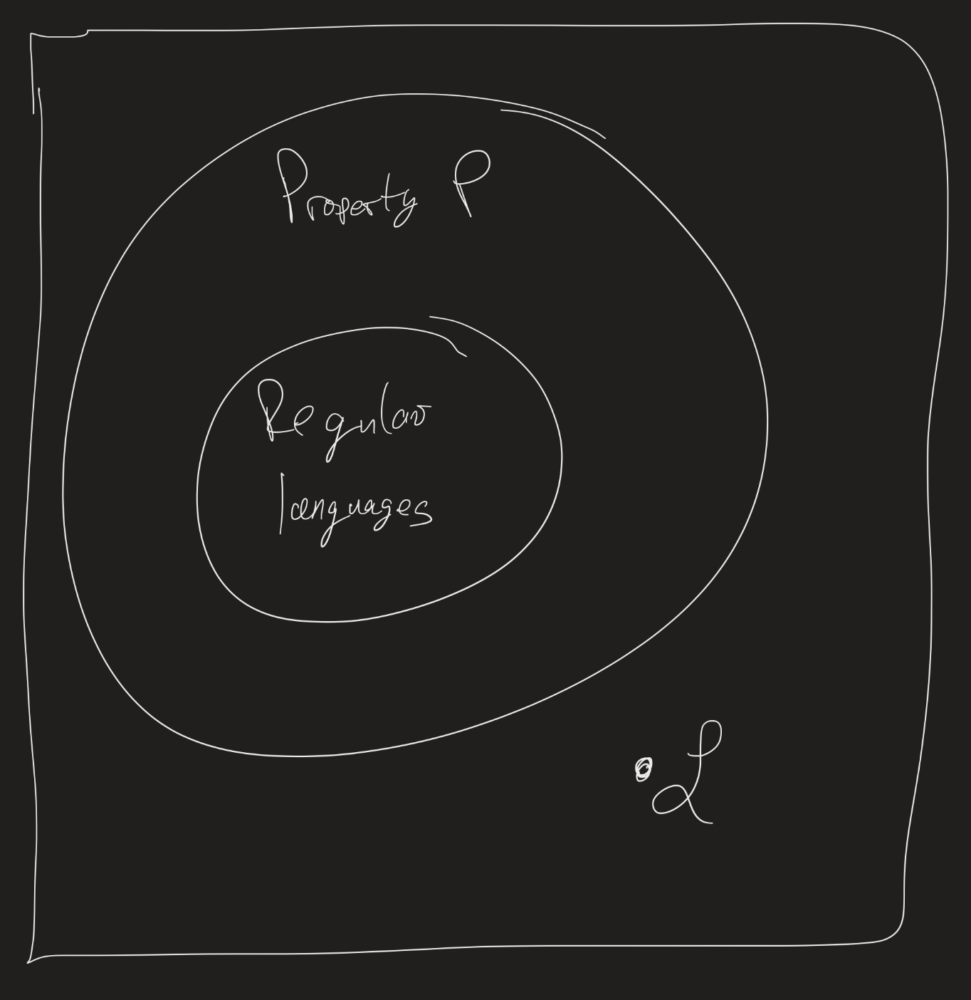

# Computability Lesson 8: Context-free grammars
{:.no_toc}

1. Table of Contents
{:toc}

# Closure Properties

> Many constructions are like getting olives out of a jar: the first takes some effort, and the rest just pour out.

(Roman Kossak and James Schmerl, *The Structure of Models of Peano Arithmetic.*)

Once we have shown that *some* languages are not regular, it becomes easier to show that others are not as well! (This will be a common theme in this course.)

**Example**: Show that $\mathcal{L} = \\{ w : w$ has the same number of 0s as it has 1s $\\}$ is not regular.

We could prove this using the pumping lemma; in fact, the idea of $0^p 1^p$ would probably work. But there is an easier solution: use the fact that regular languages are closed under intersections!

**Proof**: Assume $\mathcal{L}$ is regular. Then $\mathcal{L} \cap 0^\* 1^\*$ is also regular, since regular languages are closed under intersections (and $0^\* 1^\*$ is regular since it's a regular expression). But then $\mathcal{L} \cap 0^\* 1^\* = \\{ 0^n 1^n : n \in \mathbb{N} \\}$, which we have already proven is not regular. Therefore, $\mathcal{L}$ cannot be regular either!

## Exercise

Show that $\mathcal{L} = \\{ w :$ the length of $w$ is a perfect square $\\}$ is not regular. (Use closure properties).

## Example

Sometimes we may need to use both closure properties and the pumping lemma. We use a closure property to get to a language for which it is easier to apply the pumping lemma to.

**Example**: Show that $\mathcal{L} = \\{ 0^i 1^j : i > j \\}$ is not regular.

What can we do here? If we look at $0^p 1^{p-1}$, and we pump, we stay in the language. So this is not helpful. Instead, consdier $\overline{\mathcal{L}} \cap 0^\* 1^\*$. What is this language? Since we're intersecting with $0^\* 1^\*$, we must get that words in this language consist of 0s and then 1s (no 1s before any 0s), and since words in this language cannot be in $\mathcal{L}$, we get that the number of 0s has to be less than or equal to the number of 1s!

That is, $\overline{\mathcal{L}} \cap 0^\* 1^\* = \\{ 0^i 1^j : i \leq j \\}$. Now we can apply the pumping lemma: let $p$ be the pumping length, and suppose $w = 0^p 1^p$. Then $w \in \mathcal{L}$. Now show that no matter what $x, y$ and $z$ are, if $\|y\| > 0$ and $\|xy\| \leq p$, then $xy^2z \not \in \overline{\mathcal{L}} \cap 0^\* 1^\*$.

# Warning

In general, it is not true that all non-regular languages can be proven non-regular using the pumping lemma.

For example: $\mathcal{L} = \\{ a b^i c^i : i \in \mathbb{N} \\} \cup \\{ a^i b^j c^k : i \neq 1, j, k \geq 0 \\}$ is not regular.  You can prove this by looking at $\mathcal{L} \cap a b^\* c^\*$, which is $\\{ a b^i c^i : i \in \mathbb{N} \\}$, then use the pumping lemma.

But: $\mathcal{L}$ does satisfy the pumping lemma with $p = 2$! It's not obvious to see why, but check:

* If $w$ starts with at least one $a$, just let $y = a$, and pump that $a$. Then you end up in $\\{ a^i b^j c^k : i \neq 1, j \geq 0, k \geq 0 \\}$
* If $w$ does not start with an $a$, let $y$ be the first character of $w$ (either a $b$ or a $c$) and pump, and you still end up in $\\{ a^i b^j c^k : i \neq 1, j \geq 0, k \geq 0 \\}$, since $i = 0$ in this case.

# Exercises

Determine if the following languages are regular or not. Prove your answer. Let $\Sigma = \\{ a, b \\}$ for each of these:

1. $\mathcal{L}_1 = \\{ w : $ the length of $w$ is a multiple of 2 $\\}$.
2. $\mathcal{L}_2 = \\{ w : $ the length of $w$ is a power of 2 $\\}$.

(Discuss this with each other. What are your intuitions for each of these?)

## Another non-regular language

Let $\Sigma = \\{ (, ) \\}$, and $\mathcal{L} = \\{ w : w$ is a string of perfectly nested parentheses $\\}$.

For example: $() \in \mathcal{L}$, $()() \in \mathcal{L}$, $(())() \in \mathcal{L}$, but $)()( \not \in \mathcal{L}$.

**Claim**: $\mathcal{L}$ is not regular.

**Proof**: Assume ([BWOC](https://twitter.com/virtualcourtney/status/1369655632916148232)) it is. Then it has a pumping length $p$. Let $w = (^p)^p$. Since $w \in \mathcal{L}$, there are $x, y, z$ such that $w = xyz$, $\|y\| > 0$ and $\|xy\| \leq p$. Then $y = (^n$ for some $n > 0$. Therefore $xy^2z = (^{p+n})^p$, which is no longer a perfectly nested string of parentheses.

**Alternate proof**: Notice that $\mathcal{L} \cap (^* )^* = \\{ (^n )^n : n \in \mathbb{N} \\}$. This language is not regular, since, if there were a DFA which recognized it, by replacing $($ with $0$ and $)$ with $1$ everywhere in that DFA, we would have a DFA which recognized $\\{ 0^n 1^n \\}$, which we already know is not regular. (This argument can be made more formal, but we won't require that for now.)

# Problem Set Questions

# Grammars

Reading: Sipser 2.1 / M-S 3.1 - 3.3

Informally, a **grammar** is a set of rules for combining words together to form "sentences". A grammar naturally corresponds to a language: if $G$ is a grammar, the $\mathcal{L}(G)$ is the set of valid strings according to the grammar $G$.

**Example**: Consider $\Sigma = \\{ (, ) \\}$, and let $G$ be the grammar given by the following rules:

$$
\begin{align}
S \rightarrow SS | ( S ) | \varepsilon
\end{align}
$$

$S$ is a **variable** (the "start variable"). '(' and ')' are **terminals**. $S \rightarrow SS$ is a **production rule** (one of the rules of the grammar). A string is **valid** according to the grammar (ie, a string is in the language $\mathcal{L}(G)$) if there is some way of "deriving" that string from the start variable, using those production rules. For example:

$$S \implies SS \implies (S) S \implies ((S))S \implies (()) S \implies (()) (S) \implies (()) () \in \mathcal{L}(G)$$

## Examples

$G_1$:

$$
\begin{align}
S \rightarrow TTS | \varepsilon \\
T \rightarrow a | b
\end{align}
$$

For example, we can see the derivation:

$$
\begin{align}
S &\implies TTS \implies aTS \implies aaS \implies aaTTS \\
&\implies aabTS \implies aabaS \implies aabaTTS \\
&\implies aabaaTS \implies aabaaaS \implies aabaaa
\end{align}
$$

What is $\mathcal{L}(G_1)$?

$G_2$: Let $\Sigma = \\{ 0, 1 \\}$.

$$
\begin{align}
S \rightarrow a S b | \varepsilon
\end{align}
$$

For example:

$$
\begin{align}
S &\implies a S b \implies aa S bb \implies aaa S bbb \\
 &\implies aaaa S bbbb \implies aaabbbb
\end{align}
$$

What is $\mathcal{L}(G_2)$?

In fact, these two examples show us important properties:

1. Grammars can generate regular languages (like $\mathcal{L}(G_1)$)!
2. Grammars can generate non-regular languages (like $\mathcal{L}(G_2)$)!

## Formal Description

Formally, a **context-free grammar** (CFG) $G$ is a 4-tuple $G = (V, \Sigma, R, S)$, where:

1. $V$ is a (non-empty) finite set (**variables**),
2. $\Sigma$ is a non-empty, finite set (the **terminals**),
3. $R \subseteq V \times (V \cup \Sigma)^*$ is a non-empty, finite set (the production **rules**), and
4. $S \in V$ (the *start* variable).

What does (3) mean? First, $(V \cup \Sigma)^\*$ is a word consisting of terminals and variables. $V \times (V \cup \Sigma)^\*$ is the set of ordered pairs of the form $(A, w)$, where $A$ is a variable, and $w$ is such a word. So (3) just means that the rules are ordered pairs of this form.

Normally, though, we won't write $(A, w) \in R$. Instead, we write $A \rightarrow w$, as we did above.

**Definitions**:

1. Let $u, v, w \in (V \cup \Sigma)^*$, $A \in V$, and $A \rightarrow w \in R$. Then we say $uAv$ **yields** $uwv$, written $uAv \implies uwv$.
2. We say $u$ **derives** $v$, written $u \overset{*}{\implies} v$ if $u = v$, or if there is $k \geq 0$ and a sequence $u \implies u_1 \implies u_2 \implies \ldots \implies u_k \implies v$.
3. The **language** of a grammar $G$ is $\mathcal{L}(G) = \\{ w \in \Sigma^* : S \overset{*}{\implies} w \\}$.
4. $\mathcal{L}$ is a **context-free language** if there is a CFG G such that $\mathcal{L}(G) = \mathcal{L}$.

# Design Examples

**Example**: Design a CFG over $\Sigma = \\{ 0, 1 \\}$ which recognizes $\mathcal{L} = \\{ w : w$ is a palindrome $\\}$.

Often the idea behind designing grammars is to think recursively. So first, what are some base cases?

1. $\varepsilon$ is a palindrome.
2. 0 is a palindrome.
3. 1 is a palindrome.

Recursively, if $w$ is a palindrome, then so are $0w0$ and $1w1$. So we can use all of this to determine our production rules:

$$S \rightarrow \varepsilon | 0 | 1 | 0S0 | 1S1$$

For example, the word $w = 101101$ is a palindrome. What is the derivation for $w$?

**Next time**: There are two ways to think about "derivations". One is, as we've done, just applying rules one by one. But in fact, it often makes sense to think of derivations as "parse trees"; in particular, this may be helpful if we have more than one variable in a derivation, and hence more than one rule one could use at a particular time.

**Exercise**: Design CFG's for the following languages:

1. $\mathcal{L}_1 = \\{ a^i b^i c^j : i, j \in \mathbb{N} \\}$
2. $\mathcal{L}_2 = \\{ a^i b^j c^j : i, j \in \mathbb{N} \\}$
3. $\mathcal{L} = \mathcal{L}_1 \cup \mathcal{L}_2$.

Hint: we saw a CFG for $a^i b^i$ earlier. How might it change to add in $c^j$ after that?
