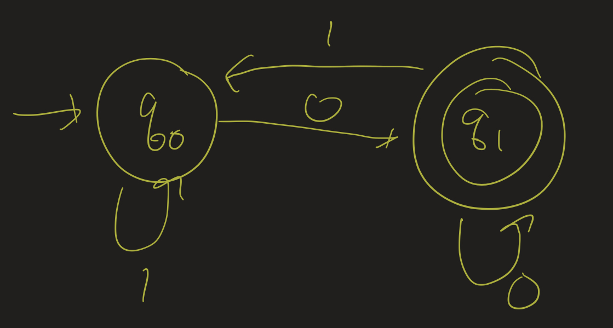
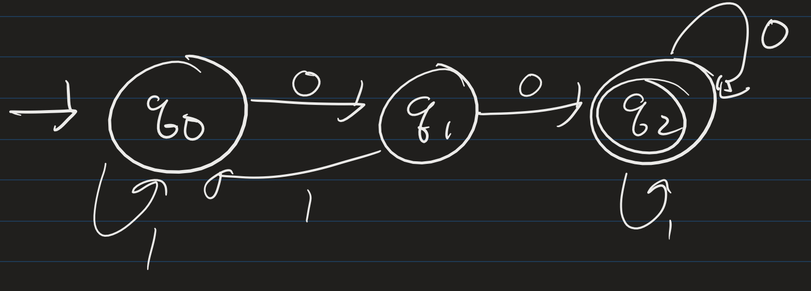

# Computability Lesson 1: Finite State Machines Exercise Solutions
{:.no_toc}

1. Table of Contents
{:toc}

<!--
# Light switch

**Exercise**: Define, precisely, the set of words accepted by the machine.

The language of this machine is the set of those strings of F's that have **odd** length.

To see this, notice that every two flips "cancel out". So if we start at the off state, we need an odd number of F's in order to end up in the on state.

In set-theoretic notation, we say that the language of the machine is { $w : w$ is a string consisting entirely of an odd number of $F$'s }.

# Alphabets

Example: Here we use the alphabet $\Sigma = \\{ 0, 1 \\}$.

1. $\mathcal{L}_1 = \emptyset$. The set of no words.
2. $\mathcal{L}_2 = \Sigma^*$. The set of **all** possible words.
3. $\mathcal{L}_3 = \\{ 0, 1, 00, 01 \\}$. This is a finite language. ($\mathcal{L}_2$ is not!)
4. $\mathcal{L}_4 = \\{ w \in \Sigma^* : w$ has more 0s than 1s $\\}$.

**Exercise**: Give 3 examples of strings in $\mathcal{L}_4$, and one example of a string not in $\mathcal{L}_4$.

**Possible answers**:

$w_1 = 0$, $w_2 = 010$, $w_3 = 00101$ are all in $\mathcal{L}_4$, and $w_4 = 1100 \notin \mathcal{L}_4$.

# DFA 1

**Question**: What are all the strings accepted by this machine?

**Answer**: This machine accepts **all strings that end in a 0**. To show this, we need to answer two questions:

1. If $w$ ends in a 0, then why does the machine accept it?
2. If the machine accepts $w$, then why must $w$ end in a 0?

Both of these questions need to be answered to ensure that we are able to *completely* classify the set of all strings accepted by this machine.

To show (1): suppose $w$ ends in a 0. Then in the second to last step, it is either in state $q_0$ or $q_1$. Then the machine reads in a 0. Whether it is at $q_0$ or $q_1$, the machine transitions to $q_1$, which is an accepting state, and therefore the machien accepts $w$.

To show (2): suppose the machine accepts $w$. Then the computation on the machine ended in state $q_1$. The only transitions coming in to $q_1$ are 0s, and therefore the string must have ended in a 0.

# DFA 2

Determine the following:

1. Is $1 \in \mathcal{L}(M)$?
2. Is $00 \in \mathcal{L}(M)$?
3. $0101 \in \mathcal{L}(M)$?
4. $1001 \in \mathcal{L}(M)$?
5. Describe $\mathcal{L}(M)$ as precisely as possible.

Answers:

1. No.
2. Yes.
3. No.
4. Yes.
5. $\mathcal{L}(M) = \\{ w : w$ contains the string 00 $ \\}$.

-->