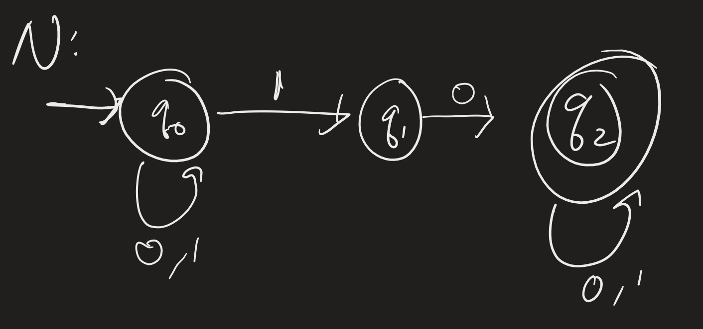
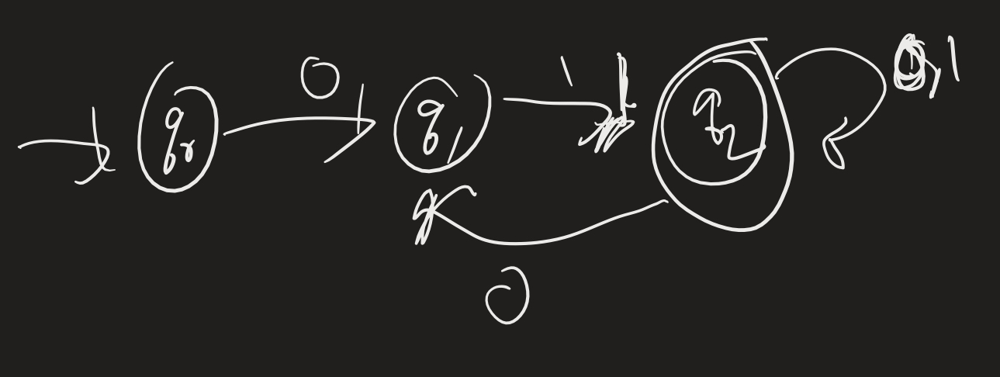

# Computability Lesson 3: Non-Deterministic Finite State Automata (Solutions)

# NFA 1

**Exercise**:

1. Find two strings *not* accepted by $N$.
2. Describe $\mathcal{L}(N)$ as precisely as possible. (Hint: how do you get to $q_2$?)

**Solutions**:

1. 00 is not accepted. 011 is also not accepted.
2. { $w$ : $w$ contains "10" as a substring }.

# Designing

