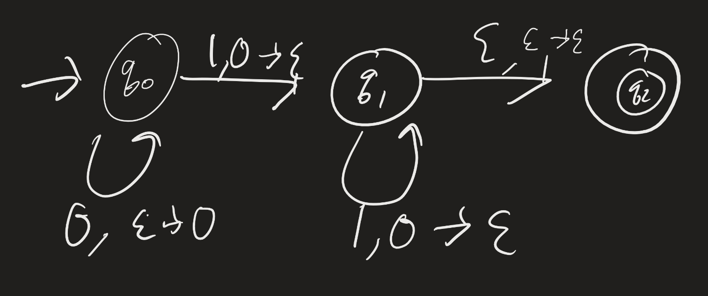
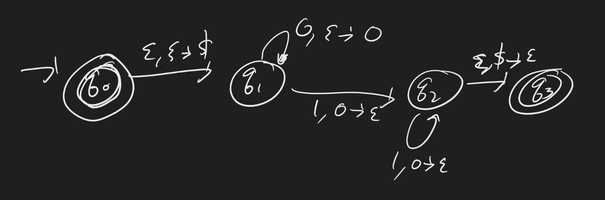
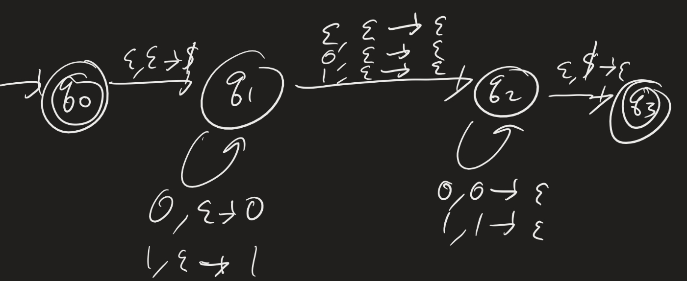
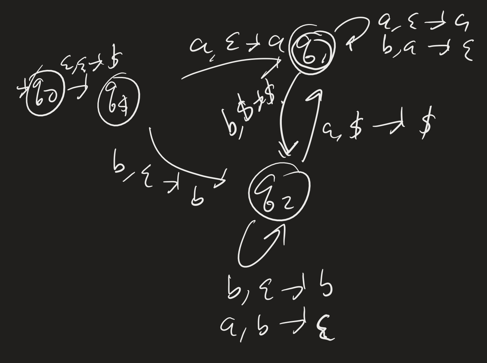

# Computability Lesson 10: Ambiguity and Pushdown
{:.no_toc}

1. Table of Contents
{:toc}

# Quiz

# Ambiguity

Last time we discussed ambiguity. For example, let's consider the following grammar (answer to one of the exercises from last time):

$$
\begin{align}
S &\rightarrow AC | A^\prime B \\
A &\rightarrow aAb | \varepsilon \\
C &\rightarrow cC | \varepsilon \\
A^\prime &\rightarrow a A^\prime | \varepsilon \\
B &\rightarrow bBc | \varepsilon
\end{align}
$$

Consider the word $abc$. We can derive this in a few ways:

1. $S \implies AC \implies aAbC \implies abC \implies abcC \implies abc$.
2. $S \implies AC \implies AcC \implies aAbcC \implies abcC \implies abc$.

These are basically the same derivations: each application of a rule replaced the same variable with the same string. The only difference is the order of the variables we chose to resolve first. But there is a truly *different* derivation that these two:

3: $S \implies A^\prime B \implies aA^\prime B \implies aB \implies abBc \implies abc$.

What is the difference here? To explain the difference between true ambiguities like 1/3 instead of 1/2, we use **parse trees** or **leftmost derivations**.

In the image below, the left is the parse tree for (1) and (2), and the right is the parse tree for (3):

**Definitions**:

1. A derivation of a string $w$ in a grammar $G$ is a **leftmost derivation** if at each step, the leftmost variable is the one replaced.
2. A string $w$ is derived **ambiguously** in a grammar G if it has more than one leftmost derivation.
3. A grammar $G$ is **ambiguous** if there is a string $w \in \mathcal{L}(G)$ that is derived ambiguously.

As we defined it, ambiguity is a property of a grammar, rather than of the language of that grammar. (Do you see the subtle difference?) Some languages that are generated by an ambiguous grammar might also be generated by an unambiguous grammar. In fact: if you are designing a compiler / interpreter for a programming language, you might start by designing the grammar for that language to parse the syntax, and if you're unlucky, your grammar might be ambiguous (it is very easy to design an ambiguous grammar by mistake). But then, you would likely try to introduce precedence rules (among other modifications) to make your grammar unambiguous.

However: there **are** some languages which are **inherently ambiguous**. ([We saw that English is one.](https://twitter.com/Browtweaten/status/1481341755870138368))

## Ambiguity Examples

Consider the following grammar (with EXPR being the start variable):

$$
\begin{align}
EXPR \rightarrow EXPR + EXPR | EXPR \times EXPR | (EXPR) | a
\end{align}
$$

The string $a + a \times a$ is generated ambiguously.

Let's introduce some precedence rules:

* Parentheses should bind most tightly.
* Then multiplication.
* Then addition.

How would this look in a grammar?

$$
\begin{align}
EXPR &\rightarrow EXPR + TERM | TERM \\
TERM &\rightarrow TERM \times FACTOR | FACTOR \\
FACTOR &\rightarrow (EXPR) | a
\end{align}
$$

What does the parse tree for $a + a \times a$ look like here?

# Pushdown Automata

Today we will have a mini-lesson on a model of computation that is powerful enough to recognize context-free languages. We will not prove anything, or even describe anything formally. This model is called the **pushdown automata** (PDA).

Reading: Section 2.2.

The idea of a pushdown automata is to use an NFA and add in "stack" memory. **Question**: what is a stack? A stack is a "data structure" which allows you to insert and remove from that data structure in LIFO (last-in, first-out) order. We call "inserting" into the stack "pushing", and "removing" from the stack we call "popping".

**Example**: $\mathcal{L} = \\{ 0^n 1^n : n \in \mathbb{N} \\}$.

Informally: as we read 0s, **push** onto the stack. As you read 1s, pop from the stack. If the stack is empty, we accept.

Does this actually work? No: the $\varepsilon$-transitions mess this up. For example, $001$ is accepted here, but it shouldn't be. So to get around this, we can use a special "start" marker on the stack.

## Example

$\mathcal{L} = \\{ w : w$ is a palindrome $\\}$ over the alphabet $\Sigma = \\{ 0, 1 \\}$.

The idea is to use non-determinism to *guess* when you are in the middle of the string. Before the middle of the string, we can "push" onto the stack, and then if we guess the middle correctly, we will be able to pop off the elements in reverse order, checking to see if they match with the input.

## Exercise

Design a PDA which recognizes $\mathcal{L} = \\{ a^n b^m : n \leq m \\}$.

## Another Example

Design a PDA which recognizes $\mathcal{L} = \\{ w : w$ has at least as many $a$s as $b$s $\\}$.

Idea: After the start state, push the "start marker". Then keep track of two states: one where you have at least as many a's, and one where you have more b's.

How would we use the stack to figure out when to transition between these?

* In the "more bs" state:
  * If you see a $b$, add it to the stack.
  * If you see an $a$ and you can pop a $b$, pop it.
  * If you see an $a$ and you can pop the start symbol, pop that, and go to the "more a's" state.
* In the "more a's" state?

## Questions

How would we need to change the formal definition of an NFA to get a PDA? What, specifically, do we need to change, and how would they change?

# Next Time

We will start discussing our main model of computation, called **Turing Machines**. These will be deterministic finite-state automata, plus infinite "tape" memory. This turns out to also be more powerful than PDAs (in fact, PDAs with two stacks turn out to be equivalent to this model).
