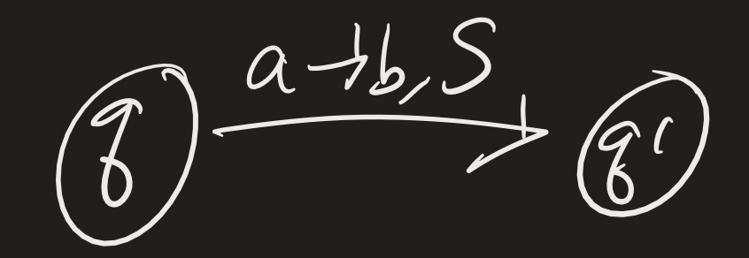
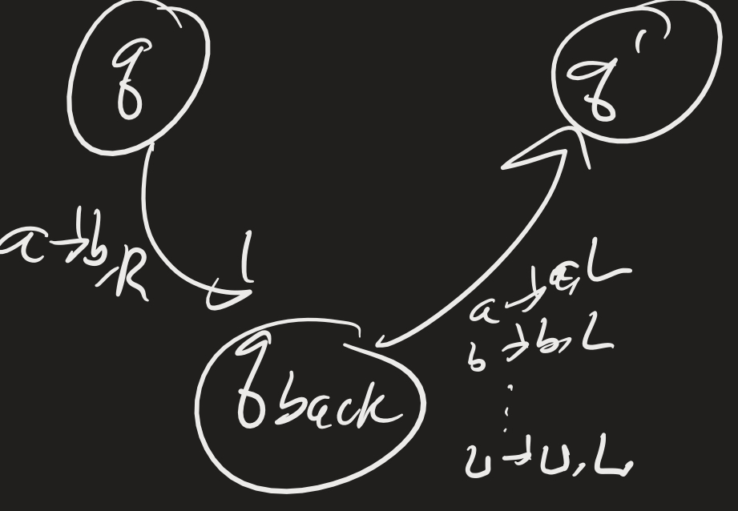
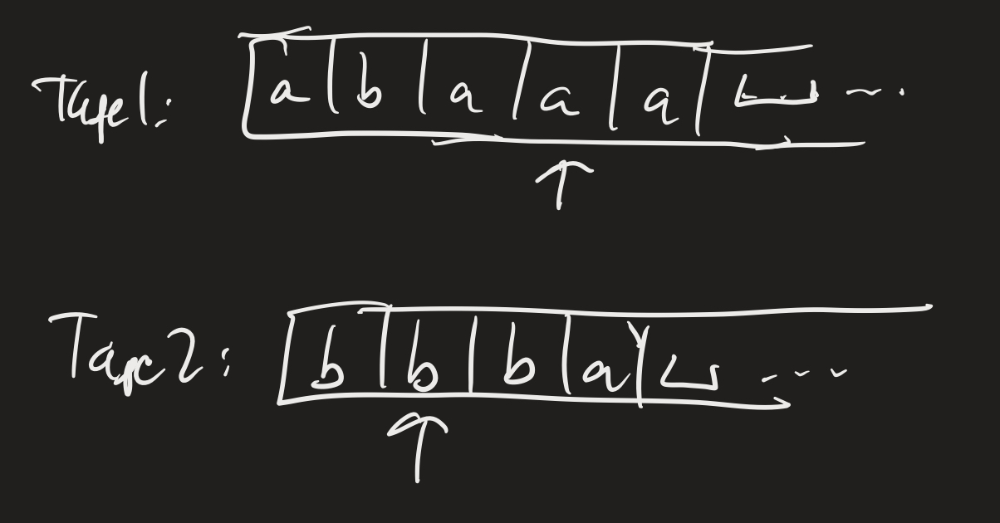
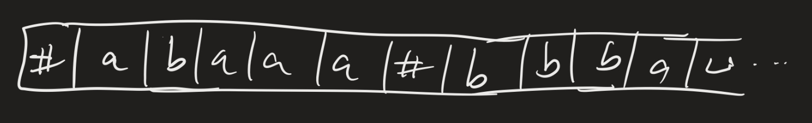

# Computability Lesson 13: Variants of Turing Machines
{:.no_toc}

1. Table of Contents
{:toc}

# Variants of TMs

## Stay-put Turing Machine

**Definition**: A "stay-put" TM is similar to a TM with the transition function changed to $\delta : Q \times \Gamma \to Q \times \Gamma \times \\{ L, R, S \\}$. If $\delta(q, a) = (q^\prime, b, S)$, then the machine will move from state $q$ to $q^\prime$, write a "b" in the cell the read-write head is pointing to, and keep the read-write head pointing to the same location.

(We would similarly need to modify the definition of computation, but I will omit those details.)

**Theorem**:

1. A language is computably enumerable if and only if it is recognized by a stay-put TM.
2. A language is computable (decidable) if and only if it is decided by a stay-put TM.

**Proof**:

If $M$ is a TM, then it automatically satisfies the definition of a "stay-put" TM. So, in particular, if a language is c.e., there is a TM which recognizes it, and so there is a stay-put TM which recognizes it. Similarly, if a language is computable, there is a TM which decides it, and so that TM is also a stay-put TM which decides the language.

Conversely, we need to show that given a stay-put TM $M$, we can convert it to a regular TM $M^\prime$ which would recognize (and/or decide) the same language. We can do this, simply, by replacing every transition of the form

with:

We would need to do add such a new state for each transition of this form. But since $M$ has finitely many transitions, there would only be finitely many new states we'd need to add to get $M^\prime$. We won't give a full description of this, but this should be enough to convince ourselves of the following facts:

* $M$ accepts a string $w$ if and only if $M^\prime$ accepts $w$.
* $M$ rejects a string $w$ if and only if $M^\prime$ rejects $w$.

This then proves the theorem. (Do you see why? Convince yourself.)

## Other variations

It turns out that this notion of Turing Machine is very robust. They are equivalent to many other notions. We will consider a few variations: multitape TMs, non-deterministic TMs, and enumerators. First, we will look at multitape TMs. Specifically, we will think about TMs which have two tapes (and can move the read-write heads on both of them simultaneously). The argument for general $k$-tape TMs is similar.

## 2-tape TMs

**Definition**: A 2-tape Turing Machine is a TM with two tapes, with the transition function modified to be $\delta : Q \times \Gamma^2 \to Q \times \Gamma^2 \times \\{ L, R, S \\}^2$.

For example, $\delta(q, a, b) = (q^\prime, c, d, L, S)$ means that at state $q$, if we see an $a$ on tape 1 and $b$ on tape 2, we transition to state $q^\prime$, write $c$ on tape 1, $d$ on tape 2, move left on tape 1, and stay put on tape 2.

**Theorem**: Every 2-tape TM has an equivalent 1-tape TM.

**Proof**: The idea is to keep track of both tapes and their read-write head positions. That is:

To simulate this with just one tape, write the contents of both tapes on the one tape, separated by some delimeter. We will use the \# character for this purpose:

We also need to mark off the symbols that are currently under the read-write heads:

We do this by enlarging the alphabet to have these "marked" symbols as well. Then the TM should scan through the tape, keep track of the "marked" symbols, figure out what to do, and then do another scan to update the tape contents.

**Question**: Since the tapes are "infinite", how do we know where to put the "delimeter"? What if we move past what we think is the "edge" of one tape?

In such a case, we would need to add a blank space and shift the contents to the right.

How would we do this? Can you figure out how to implement a "shift" operation on a TM?

# Nondeterministic TMs

A **nondeterministic Turing Machine** (NTM) is defined as you might expect, with $\delta$  modified so that $\delta : Q \times \Gamma \to \mathcal{P}(Q \times \Gamma \times \\{L, R \\})$. Computation is defined analagously: $N$ accepts a word $w$ if there is a sequence of configurations, starting with the "start" configuration, ending in the "accept" configuration, such that each element in the sequence *can* yield the next element (according to some of the nondeterministic rules).

We should think about computation on an NTM as a "tree" structure. The root would be the "start" configuration, and the child of each node would be the configurations we can get to in one step.

(picture)

**Theorem**: Every nondeterministic TM has an equivalent deterministic TM.

If $N$ is an NTM, the idea for the proof of this result is to simulate $N$ with a deterministic TM that searches the tree of configurations for an accepting configuration. (Problem with this idea?)

We can simulate $N$ using a three-tape machine:

1. **Input tape**: Never change this.
2. **Simulation tape**: Simulate one branch of $N$'s computation on $w$.
3. **Address tape**: Use this to figure out which branch of the tree of configurations to check.

The idea is that, on the "address tape", a string "13142" would represent "Take the leftmost branch for the first non-deterministic choice, then the third branch for the second choice, the first (leftmost) branch for the third choice, the fourth branch for the fourth choice, and the second branch for the fifth choice." We simulate computation on $w$ on the simulation tape, using the address tape to help us make the nondeterministic choices. We only go up to the number of choices we have specified, so if the computation does not halt within the first five steps (using those choices), we start over again with the "next" address.

Since, at any given point, there are only finitely many "next" choices one can make, there is a canonical way to enumerate this!

## NTM Deciders

**Definition**: An NTM **decides** a language if every branch of its computation halts.

**Theorem**: A language is decidable if and only if it is decided by an NTM.

Proof? 

* If it is decidable, then it's decided by a deterministic TM. That is automatically an NTM. 
* And vice versa: if a language is "decided" by an NTM, then the "search for an accepting computation" process will always halt, since there will be no "infinite loops" on any branches.)

These two results tell us that NTMs can solve the same exact problems as deterministic TMs.

**Open question**: I mentioned the "Millenium" prize problems earlier in the semester. The question of whether NTMs solve problems *more efficiently* than deterministic TMs is still open! That is: we can think about the notion of computational complexity. If every branch of an NTM's computation halts within $n$ steps, then the "search for an accepting configuration" simulation would halt within $O(2^n)$ steps (do you see why?). Can we do better?

# Enumerators

An **enumerator** is a variant of a TM which does not have an accept or reject state, but just has an *output* state. An enumerator starts with an empty tape. If $E$ is an enumerator, we say $w \in \mathcal{L}(E)$ if $E$ enters the output state with $w$ on its tape. Notice that an enumerator *never halts*! It runs forever. We say $E$ **enumerates** $\mathcal{L}(E)$.

**Theorem**: $\mathcal{L}$ is computably enumerable (c.e.) if and only if it is enumerated by an enumerator.

(Hence the name.)

**Proof**:

There are two things to prove: if $\mathcal{L}$ is c.e., then there is an enumerator which enumerates $\mathcal{L}$, and if $E$ enumerates $\mathcal{L}$, then there is a TM which recognizes it. Let's do this second one first:

Suppose $\mathcal{L} = \mathcal{L}(E)$. Let $M$ be the following TM, described at a "high level":

"On input $w$:
1. Run $E$.
2. When $E$ outputs $w^\prime$, compare it with $w$. If $w = w^\prime$, **accept**.
3. If not, keep going."

Clearly $\mathcal{L}(M) = \mathcal{L}(E)$, since if $w \in \mathcal{L}(E)$, then $M$ accepts $w$, and vice versa.

Now suppose $\mathcal{L}$ is c.e. and $M$ recognizes $\mathcal{L}$. We can design an enumerator for $E$ as follows:

Consider all the strings in $\Sigma^\*$. For example, if $\Sigma = \\{0, 1 \\}$, then the strings are $\varepsilon, 0, 1, 00, 01, 10, 11, 000, \ldots$ We can list out all the strings in some predefined order. That is, we can list out all the strings of length 0, then all the strings of length 1, etc. (In other words, $\Sigma^\*$ is **countably infinite**, so there is a bijection between $\mathbb{N}$ and $\Sigma^\*$.)

So suppose $s_1, s_2, s_3, \ldots$ is a list of all the strings in $\Sigma^\*$. Then we design $E$ as follows:

"Repeat for $i = 1, 2, 3, \ldots$:

1. Run $M$ on the strings $s_1, s_2, \ldots, s_i$ for $i$ steps. (That is, up until the $i$-th configuration!)
2. If $M$ accepts any of these, output it."

## Decidability

**Definition**: $\mathcal{L}$ is co-c.e. if $\overline{\mathcal{L}}$ is c.e.

**Theorem**: $\mathcal{L}$ is computable if and only if it is c.e. and co-c.e.

**Proof**:

Suppose $\mathcal{L}$ is computable. Then there is a machine $M$ which decides it. Clearly $M$ recognizes $\mathcal{L}$, so it is c.e. Let $M_2$ be defined as the same TM as $M$, with the accept and reject states swapped. Then $M_2$ recognizes $\overline{\mathcal{L}}$!

Now for the other direction: suppose $\mathcal{L}$ is c.e. and co-c.e. Let $E_1$ enumerate $\mathcal{L}$ and $E_2$ enumerate $\overline{\mathcal{L}}$. We define a decider $D$ for $\mathcal{L}$ as follows:

"On input $w$:
1. Interleave computations of $E_1$ and $E_2$.
2. If $E_1$ ever outputs $w$, **accept**.
3. If $E_2$ ever outputs $w$, **reject**."

**Questions**: Why is this a legitimate description of a TM? What does "interleave computations" here mean? How do we know we are only doing finitely much work at each step?
