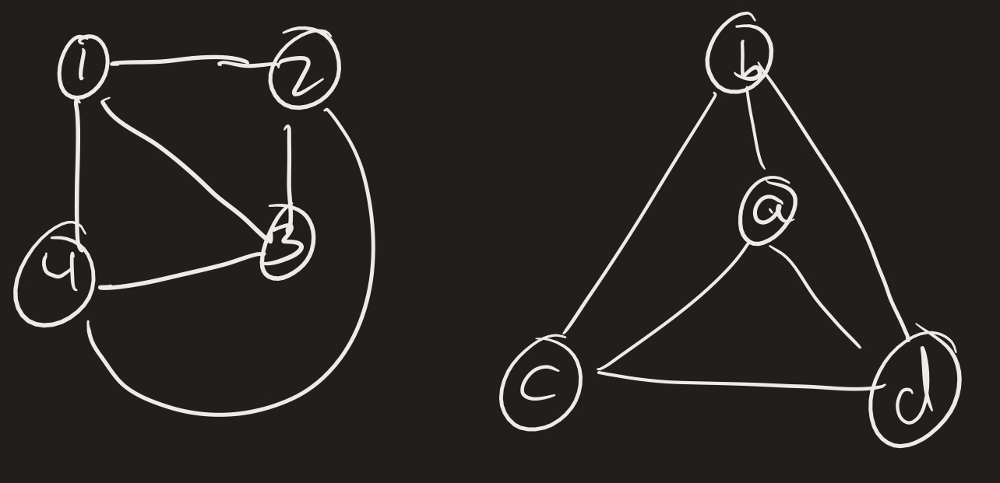

# Lesson 18: Reductions, Quantifiers, and Intro to Complexity
{:.no_toc}

1. Table of Contents
{:toc}

# Halting Problem

From the exam: $H = \\{ \langle M \rangle : M $ halts on input $\langle M \rangle \\}$. This is the **halting problem**.

Show $H$ is c.e. by showing $H \leq_m A_{TM}$:

F: "On input $\langle M \rangle$:  
1. Construct TM $A$:   
'On input $x$:  
  * Run $M$ on $\langle M \rangle$. Ignore its output.
  * If we get here, accept.'
2. Output $\langle A, \langle M \rangle \rangle$."

If $\langle M \rangle \in H$, then $A$ accepts all inputs. If $\langle M \rangle \not \in H$, $A$ loops forever on all inputs. Hnece, $\langle M \rangle \in H \leftrightarrow F(\langle M \rangle) \in A_{TM}$.

Next we can show that $H$ is not co-c.e. by showing $A_{TM} \leq_m H$:

F: "On input $\langle M, w \rangle$:
1. Construct $M^\prime$:  
  'On input $x$:  
  * Run $M$ on $w$.
  * If $M$ accepts, accept.
  * If $M$ rejects, enter an infinite loop.'
2. Output $\langle M^\prime \rangle$."

Then if $M$ accepts $w$, $M^\prime$ halts and accepts all inputs. If $M$ does not accept $w$, then $M^\prime$ will loop forever. Therefore $\langle M, w \rangle \in A_{TM} \leftrightarrow M^\prime \in H$.

Since $H$ is not co-c.e., it cannot be decidable, as decidable languages are both c.e. and co-c.e.!

In fact, what we showed is that $H \leq_m A_{TM} \leq_m H$, which means that $H$ and $A_{TM}$ are "$m$-equivalent".

# Logic / Quantifiers

One of the more fascinating results in computability theory is that it turns out that there is a tight connection between computability / decidability and the notion of expressibility in first-order logic. In first-order logic, we are allowed to "quantify" over elements of a set:

* $\exists x \in S \: P(x)$ means "There is some element $x$ in the set $S$ such that the predicate $P(x)$ is true" (this is referred to as the *existential quantifier*)
* $\forall x \in S \: P(x)$ means "$P(x)$ is true for **every** elements $x \in S$." (this is referred to as the *universal quantifier*)

The set $A_{TM} = \\{ \langle M, w \rangle : M$ accepts $w \\}$ can be described, in first-order logic, as: $\exists s \in \mathbb{N}$ "$M$ accepts $w$ in $s$ steps."

That last part, "$M$ accepts $w$ in $s$ steps", is a decidable predicate in terms of $M$, $w$, and $s$. In order to decide this, we just run $M$ on input $w$ for $s$ steps (if we have the description of $M$, we can do this!) and see what happens.

Similarly, $H = \\{ \langle M \rangle : M$ halts on $\langle M \rangle \\}$ can be described as $\exists s \in \mathbb{N}$ "$M$ halts (accepts or rejects) on $\langle M \rangle$ in $s$ steps". Again, if we have the description of $M$ and we have the number $s$, we can run $M$ on $\langle M \rangle$ for $s$ steps and check if the computation has finished.

Remember that both of these languages are computably enumerable, but **not** decidable! It turns out that if $\mathcal{L}$ is a language such that $\mathcal{L} = \\{ w : \exists s \in \mathbb{N} P(w, s) \\}$ for some "decidable predicate" $P$, then $\mathcal{L}$ is c.e. Similarly, if $\mathcal{L} = \\{ w : \forall s \in \mathbb{N} P(w, s) \\}$, for some decidable predicate $P$, then $\mathcal{L}$ is co-c.e.!

So a language is decidable if it can be expressed in both "existential" and "universal" forms! Alternatively, a language is decidable if both the language $\mathcal{L}$ and its complement $\bar{\mathcal{L}}$ can be expressed in existential form!

Let's look at some examples of "decidable" predicates and "undecidable" predicates:

Consider the language $A_{DFA} = \\{ \langle D, w \rangle : D$ is a DFA and $D$ accepts $w \\}$. It turns out that this language is decidable, since we can write a TM which, on input $\langle D, w \rangle$, simulates $D$ on $w$ and accepts if the computation ends in an accept state, and rejects otherwise.

We can express that exact sentence in terms of logic: $\exists n \in \mathbb{N}$ "The computation of $D$ on $w$ enters into the sequence of states $r_0, \ldots, r_n$ and $r_n \in F$" (where $F$ is the set of accept states in the description of $D$).

We were able to express this problem in terms of an existential quantifier, so that means this problem is c.e. But we can also express its complement in terms of an existential quantifier: $\exists n \in \mathbb{N}$ "The computation of $D$ on $w$ enters into the sequence of states $r_0, \ldots, r_n$ and $r_n \not \in F$". So that means the complement of this language is c.e., in other words, this is co-c.e.!

**Exercise**: Can you express $A_{DFA}$ in "universal" terms?

"$\forall n \in \mathbb{N}$ if the computation of $D$ on $w$ takes $n$ steps $r_0, \ldots, r_n$, then $r_n \in F$."

## Undecidable languages

Recall the language $E_{TM} = \\{ \langle M \rangle: \mathcal{L}(M) = \emptyset \\}$. How might we describe this using quantifiers?

$\langle M \rangle \in E_{TM}$ if **for every** word $w$, $M$ does not accept $w$. Of course, "$M$ does not accept $w$" is not computable, so we need to break this down even more: "For every $s \in \mathbb{N}$, $M$ doe snot accept $w$ in $s$ steps." Now we have two universal quantifiers:

$\langle M \rangle \in E_{TM} \iff \forall w \in \Sigma^\* \forall s \in \mathbb{N}$ "$M$ does not accept $w$ in $s$ steps."

**Exercise**: Describe the following languages using quantifiers and decidable predicates:

1. TOT = $\\{ \langle F \rangle : F$ is a total computble function $\\}$.
2. FIN = $\\{ \langle M \rangle : \mathcal{L}(M)$ is finite $\\}$.

It turns out that the quantifier complexity of these languages is higher than the quantifier complexity of $E_{TM}$, and so while $E_{TM}$ is co-c.e. but not c.e., TOT and FIN are neither c.e. nor co-c.e.

We will return to logic later on in the semester. For now, we turn our focus to decidable problems.

# Complexity

Reading: Sipser 7.1, 7.2; MS 6.1, 6.2

The goal of complexity theory is to attempt to classify problems by how hard they are to solve. In other words, all of these problems are decidable, but some are "harder" than others in terms of how efficiently an algorithm can solve them.

## Graph Isomorphisms

A **graph** is given by a set of vertices $V$ and a set of edges $E \subseteq V \times V$ (the edges are ordered pairs). Graphs can be *directed* or *undirected*; if a graph is *undirected*, then if there is an edge from $v$ to $w$, we also have an edge from $w$ to $v$ (ie, the edge relation is symmetric). Two graphs $G_1 = (V_1, E_1)$ and $G_2 = (V_2, E_2)$ are called **isomorphic** if there is a bijection $f : V_1 \to V_2$ such athat for all vertices $v, w \in V_1$, there is an edge $(v, w) \in E_1$ if and only if there is an edge $(f(v), f(w)) \in E_2$.

Claim: the function $f$ which maps:

* $1 \mapsto a$
* $2 \mapsto b$
* $3 \mapsto c$
* $4 \mapsto d$

is an isomorphism.

**Claim**: The graph isomorphism problem is decidable!

On input $G_1 = (V_1, E_1), G_2 = (V_2, E_2)$:

1. Check if $\|V_1\| = \|V_2\|$. If not, reject.
2. Repeat for each function $f : V_1 \to V_2$:
   * Check if $f$ is a bijection.
   * Check if $f$ satisfies $\forall v_i \forall v_j (v_i, v_j) \in E_1 \leftrightarrow (f(v_i), f(v_j)) \in E_2$. (There are only finitely many pairs if the graph is finite, so this is okay.)
   * If it does, halt and **accept**.
3. If we get through all the steps of 2 without accepting, **reject**.

This is a "brute force" algorithm. But it does decide the isomorphism problem.

**Question**: How many *steps* does this take? Suppose $\|V_1\| = \|V_2\| = n$. How many functions are there from $V_1$ to $V_2$?

* If $n = 2$: $\\{0, 1 \\} \to \\{0, 1 \\}$?
  * 2 choices for $f(0)$.
  * 2 choices for $f(1)$.
  * $2 \times 2 = 4$.
* $n = 3$: $\\{0, 1, 2 \\} \to \\{0, 1, 2 \\}$?
  * 3 choices for $f(0)$
  * 3 choices for $f(1)$
  * 3 choices for $f(2)$
  * $3 \times 3 \times 3 = 27$
* In general?
  * $n$ choices for $f(0)$
  * $n$ choices for $f(1)$
  * $\vdots$
  * $n$ choices for $f(n - 1)$
  * $n \times n \times \ldots n = n^n$

So that second step repeats $n^n$ times! There is an obvious improvement: instead of looking at all functions, just look at all the bijections. How many of those are there?

* If $n = 2$:
  * 2 choices for $f(0)$
  * 1 choices for $f(1)$ (since it's one-to-one)
  * $2 \times 1 = 2$
* $n = 3$:
  * 3 choices for $f(0)$
  * 2 choices for $f(1)$
  * 1 choices for $f(2)$
  * $3 \times 2 \times 1 = 6$
* $n = 4$:
  * 4 choices for $f(0)$
  * 3 choices for $f(1)$
  * 2 choices for $f(2)$
  * 1 choices for $f(3)$
  * $4 \times 3 \times 2 \times 1 = 4!$

In general, the number of bijections between two sets of size $n$ is $n!$

So to analyze the number of steps:

"For each bijection ($n!)$:
  * For each pair $(v_1, v_2)$ (how many? about $n^2$)
  * Check if $(v_1, v_2) \in E_1$ if and only if $(f(v_1), f(v_2)) \in E_2$"

That is, this takes about $n^2 \cdot n!$ steps.

## Time complexity

Let $M$ be a deterministic, 1-tape TM. (We will talk about other models soon.) The **running time** of $M$ is the function $f: \mathbb{N} \to \mathbb{N}$ such that $f(n)$ is the maximum nubmer of steps $M$ takes to accept or reject any input of length $n$.

Here, by "steps", we mean the number of configurations $M$ enters in its computation on the input. This of course only makes sense for deciders: if $M$ loops forever on some input of size $n$, then $f(n)$ would not be defined.

This gives us a notion of the running time of a machine, but we really want to talk about *problems*, rather than machines. We really want to define the running time of a language $\mathcal{L}$ to be the "smallest" running time of any TM $M$ which decides $\mathcal{L}$. Of course, this begs the question of how do we compare functions? When is one function "smaller" than another? We use "Big Oh" notation.

## Comparing Functions

**Definition**: Let $f, g : \mathbb{N} \to \mathbb{R}^{\geq 0}$. We say $f(n) = O(g(n))$ if there are $c, N \in \mathbb{N}$ such that for all $n \geq N$, $f(n) \leq c g(n)$. We say $f$ is "Big Oh" of $g$.

The idea is that $\frac{f}{g}$ is eventually boudned by a constant.

In practice, coefficients don't matter, and only the highest order term mattesr. So some examples:

* $5n^4 - 300n^2 = O(n^4)$
* $37 \log_{10}(n) = O(\log_{10}(n)) = O(\log_2(n)) = O(\ln(n))$, We just call all of these $O(\log n)$.

This is a strange notation as it's not symmetric. So technically $n^2 = O(n^3)$, but $n^3 \neq O(n^2)$. There is also a notion called "little oh"; I won't get into that here.

According to Big Oh:

* $O(\sqrt{n}) < O(n) < O(n^2) < O(n^3) < \ldots$
* Moreover, these are all less than $O(2^n) < O(n!) < O(n^n)$.
* Where does $O(\log n)$ sit? $O(\log n) < O(n^\varepsilon)$ for every $\varepsilon > 0$.
* $O(n \log n)$ sits between $O(n)$ and $O(n^2)$.

So there are lots of functions "in between" any two functions in this "Big Oh" ordering.

## Back to time complexity

**Definition**: Let $t : \mathbb{N} \to \mathbb{N}$ e any function. Then $TIME(t(n))$ is the collection of all languages which are decidable by a TM whose running time is $O(t(n))$.

**Definition**: The complexity class $P$ is defined as $P = \bigcup \limits_{k \in \mathbb{N}} TIME(n^k)$. This is the collection of all *polynomial-time* decidable problems.

# Coming up

* Presentation 2: Sunday, May 1.
* Quiz 3: next Thursday
* PS 4: given this Thursday, due next Thursday.
* Final Project Groups / Topics
