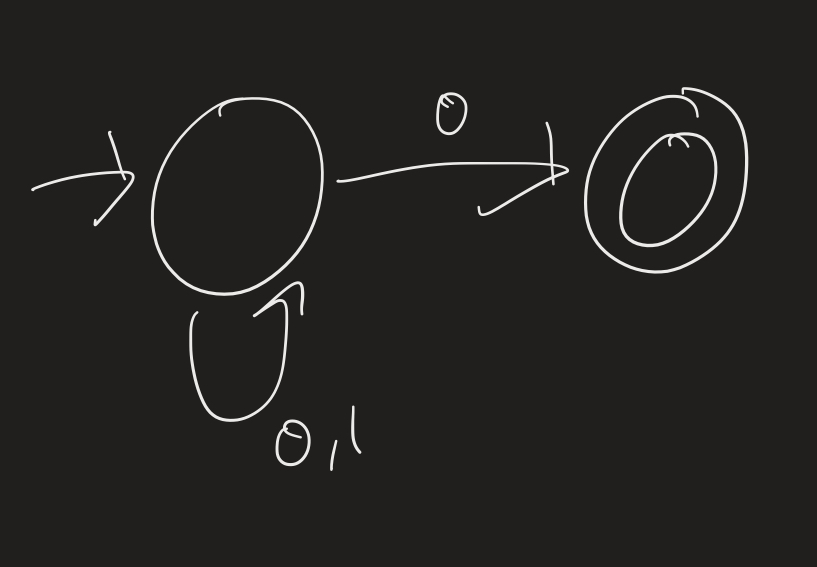
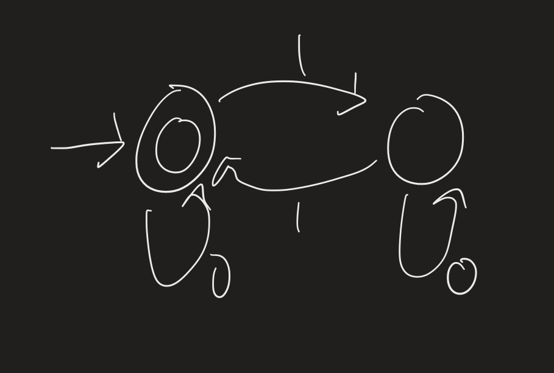
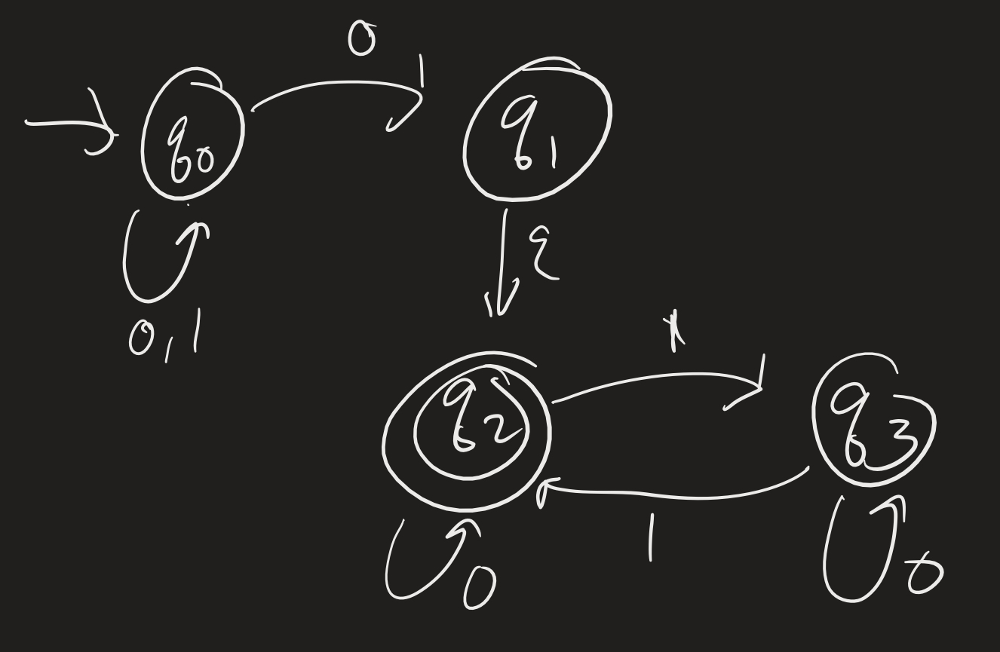
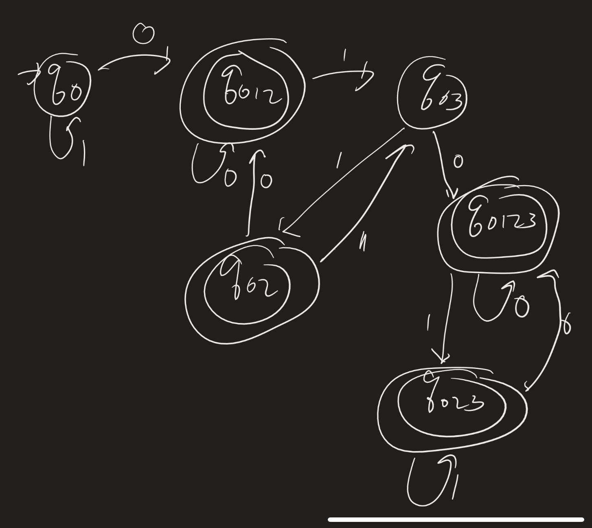
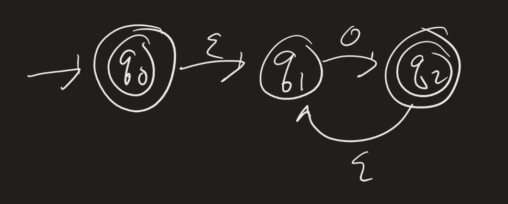
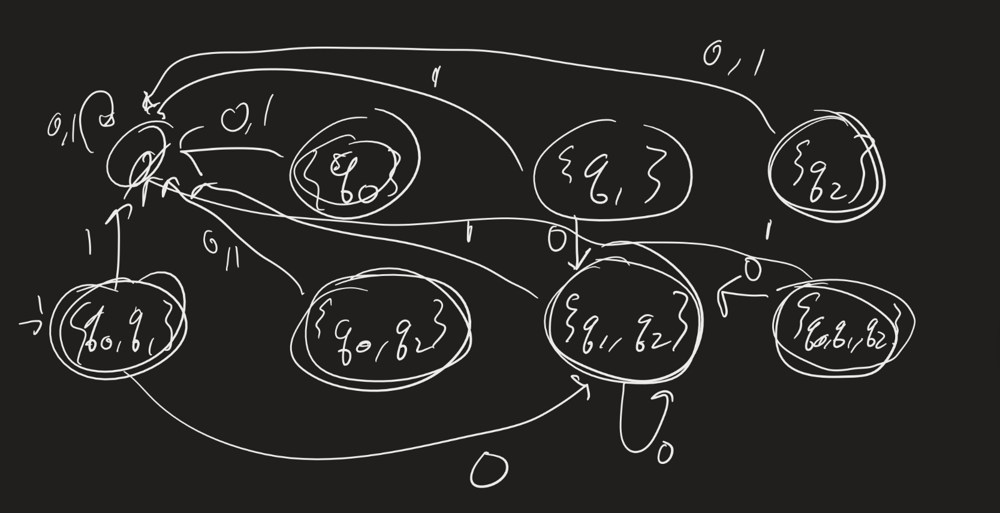
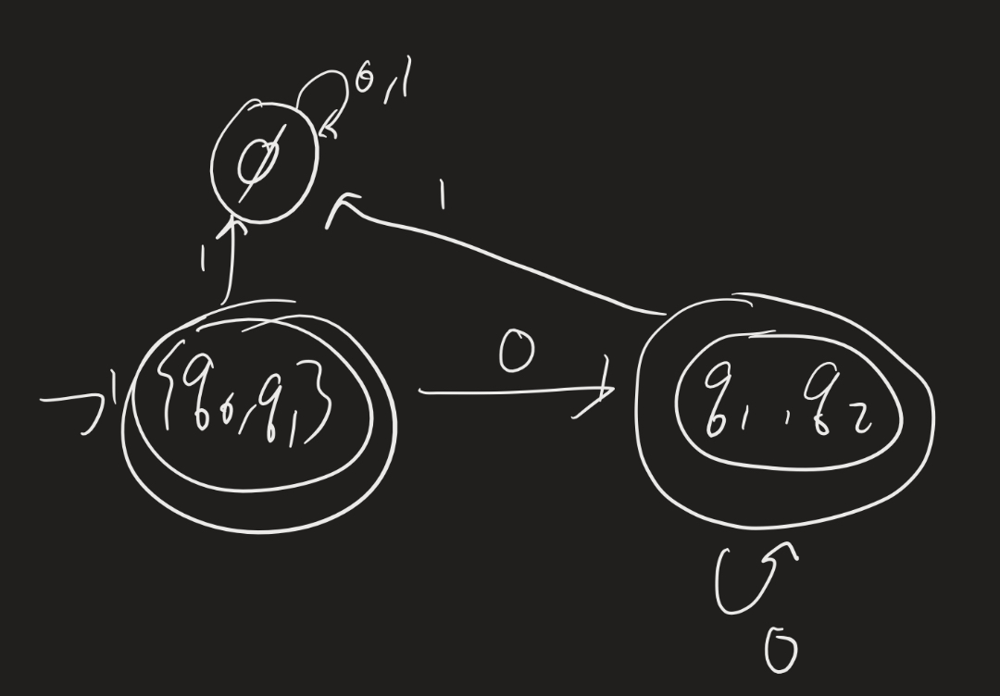
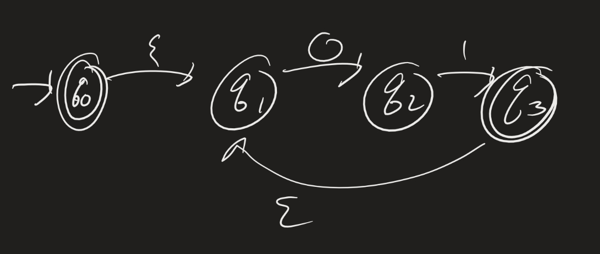

# Computability Lesson 5; NFA / DFA Proof
{:.no_toc}

1. Table of Contents
{:toc}

<!--
1. 4:30 - 4:50 quiz
2. 4:50 - 5:05 warm up
3. 5:05 - 5:25 power set proof
4. 5:25 - 5:50 main theorem proof
5. 5:50 - 6:10 regular operations + regular expressions intro
-->

# Quiz

# Warm up

Design a DFA which accepts the language $\mathcal{L} = \\{ xy : x$ ends in 0 and $y$ has an even number of 1s $\\}$.

First, here is an NFA which accepts $\mathcal{L}_1 = \\{ x : x$ ends in 0 $\\}$:

Here is one which accepts $\mathcal{L}_2 = \\{ y : y$ has an even numer of 1s $\\}$.

Here is an NFA which accepts the concatenation:

Now again, start at $q_0$. If we see a $0$, we can end up in either $q_0, q_1$, or $q_2$. So we need a state $q_{0,1,2}$ which represents being in any of those three. If we see a 1? We stay at $q_0$.

Now check what states we can go to if we are in any of $q_0, q_1$, or $q_2$, and we see a 0. Similarly, where could we go if we see a 1? Then keep going. Eventually we have to stop. Why?

**Question**: Why does this process have to stop?

Since there are only finitely many states in $Q$, there are only finitely many *subsets* of $Q$. In fact, we know exactly how many subsets of $Q$ there are: if a set $X$ has $n$ elements, then $\mathcal{P}(X)$ has $2^n$ elements! (This can be proved by induction).

## Aside

**Theorem**: Let $X$ be a finite set with $n$ elements. Then $\mathcal{P}(X)$ has $2^n$ elements (and therefore is finite).

**Idea**: We use a strategy called "Proof by induction". The idea is that we show that this statement holds for $n = 0$ (the **base case**), and then we show that *if* the theorem were true for sets with $n$ elements, then it must be true for sets with $n + 1$ elements (the **inductive step**).

What does it mean for the statement to be true for $n = 0$? It means: "Let $X$ be a finite set with 0 elements. Then $\mathcal{P}(X)$ has 1 element." The set with 0 elements is the empty set, $\emptyset$, and so we really just have to reason about that one set.

What does it m ean to show that *if* the theorem is true for sets of size $n$, then it's also true for sets of size $n + 1$? The idea is that we assume that we've already demonstrated that this statement is true up until some number $n$ (maybe $n$ is just 0, which we showed above). Then we let $X$ be a set of size $n + 1$ and find some argument (using the assumption that sets of size $n$ have $2^n$ subsets) to show that $X$ has $2^{n+1}$ subsets.

**Proof**: We prove the theorem by induction on $n$.

**Base case**: $n = 0$. If $n = 0$, then $X$ has 0 elements, so $X = \emptyset$. Suppose $A \subseteq \emptyset$. Then if $x \in A$, then $x \in \emptyset$. If $A \neq \emptyset$, this is impossible, so $A$ must be the empty set. Therefore the only subset of $\emptyset$ is $\emptyset$, so $\mathcal{P}(\emptyset)$ has 1 element.

**Inductive step**: Suppose the theorem is true for all sets of size $n$. Let $X$ be a set of size $n + 1$. Let $a \in X$, and consider the set $Y = X \setminus \\{ a \\}$. Then $Y$ is a set of size $n$, and so $Y$ has $2^n$ subsets (by our inductive assumption). Let $A_1, \ldots, A_{2^n}$ be all the subsets of $Y$. Then for each $i$, let $B_i = A_i \cup \\{ a \\}$. I claim that each of $A_1, \ldots, A_{2^n}$ and $B_1, \ldots, B_{2^n}$ are subsets of $X$, and that these are all the subsets of $X$.

**Claim 1**: Each of the $A_i$ and $B_i$ are subsets of $X$. Notice that since $A_i \subseteq Y$, then if $x \in A_i$, then $x \in X \setminus \\{ a \\}$, and therefore $x \in X$. That shows that $A_i \subseteq X$. Now to show that $B_i \subseteq X$, we suppose $x \in B_i$. Then either $x \in A_i$, or $x = a$. In the first case, we already saw that $x \in X$, and in the second case, $x \in X$ since $a \in X$.

**Claim 2**: Suppose $A \subseteq X$. Then either $A = A_i$ for some $1 \leq i \leq 2^n$, or $A = B_i$ for some $1 \leq i \leq 2^n$. To see this, let's break this into two cases: either $a \in A$ or $a \not \in A$. If $a \not \in A$, then $A \subseteq X \setminus \\{ a \\} = Y$, and so $A$ must be one of the $A_i$ (by induction, since $Y$ has size $n$). Otherwise, if $a \in A$, consider the set $A \setminus \\{ a \\}$. Notice that $A \setminus \\{ a \\} \subseteq X \setminus \\{ a \\}$, and so $A \setminus \\{ a \\} = A_i$ for some $i$. Then $A = A_i \cup \\{ a \\}$, since the only difference between $A$ and $A_i$ is the element $a$. But that's just the definition of $B_i$!

Therefore, all the subsets of $X$ are the $2^n$ sets $A_1, \ldots, A_{2^n}$ and the $2^n$ sets $B_1, \ldots, B_{2^n}$. Adding, we get that there are $2^n + 2^n = 2^{n+1}$ subsets of $X$, proving the theorem.

# Proof

Back to our main theorem:

**Theorem**: A language is regular if and only if it is recognized by an NFA.

In fact, we will prove:

**Theorem**: Let $N = (Q, \Sigma, \delta, q_0, F)$ be an NFA. There is a DFA $M = (Q^\prime, \Sigma, \delta^\prime, q_0^\prime, F^\prime)$ which recognizes the same language.

This in fact proves the earlier theorem, since then it shows that $\mathcal{L}(N)$ is regular for any NFA $N$.

**Proof**: The idea is to keep track of all the states that $N$ could possibly be in at once. We can do this, since $N$ has finitely many states, if we keep track of one state for each possible *set* of states there are in $N$. That is:

Let $Q^\prime = \mathcal{P}(Q)$ be the *power set* of $Q$!

We will let a state be accepting if it represents any subset of $Q$ which contains any accepting state from $N$. That is:

$F^\prime = \\{ A \subseteq Q : $ there is $q \in A$ such that $q \in F \\}$.

In order to define $q_0^\prime$ and $\delta^\prime$, we need to first define "$\varepsilon$-reachability." For example, in the following NFA, what if we read a 0?

If we see a 0 at the start, we could possibly be in states 0, 1, 2, 3, 4, ...

**Definition**: Given a set $A \subseteq Q$, let $E(A) = \\{ q : $ there are states $r_0, \ldots, r_n$ such that $r_0 \in A$ and, for each $i < n$, $r_{i+1} \in \delta(r_i, \varepsilon) \\}$.

Then we can let $\delta^\prime(A, a) = E(\\{ q : $ there is $q^\prime \in A$ such that $q \in \delta(q^\prime, a) \\})$, and $q_0^\prime = E(\\{ q_0 \\})$.

**Claim**: If $M = (Q^\prime, \Sigma, \delta^\prime, q_0^\prime, F^\prime)$ (as described above), then $\mathcal{L}(M) = \mathcal{L}(N)$. (Try to justify this to yourself.)

## Example

Suppose the alphabet is $\Sigma = \\{ 0, 1 \\}$. Build an equivalent DFA using the method in the theorem. First, we need 8 states, since there are 8 subsets of $\\{ 0, 1, 2 \\}$:

Nothing points to $\\{ q_0 \\}$, $\\{ q_1 \\}$, $\\{ q_2 \\}$, $\\{ q_0, q_2 \\}$, or $\\{ q_0, q_1, q_2 \\}$, so we can simplify this:

What is the language of the machine?

## Observations

In general, it can be easier to construct an NFA for a language than a DFA. The theorem gives us an algorithm to construct an equivalent DFA, but the number of states can get very large. How large?

If we have an NFA with 1 state $q_0$, how many states would the equivalent DFA have? ($q_{\emptyset}$ and $q_{\\{ 0 \\}}$).

* With 2 states $q_0, q_1$?
* 3 states?
* 4 states?
* 10 states?
* 20 states? (about 1 million!)
* 30 states? (about 1 billion!)

**Exercise**: Convert the following to a DFA, and then get rid of the extra states. Determine the language recognized by this machine as well.

# Regular Operations

We have shown, so far, that the class of regular languages is closed under the union and concatenation operations.

**Definition**: Let $\mathcal{L}$ be a language. The **Kleene star** operation is defined as

$\mathcal{L}^* = \\{ w_1 \ldots w_n : n \geq 0$ and $w_i \in \mathcal{L}$ for each $1 \leq i \leq n \\}$.

Two quick observations:

* For an alphabet $\Sigma$, the language $\Sigma^*$ is the set of all possibly words over $\Sigma$.
* The empty word $\varepsilon$ is always in $\mathcal{L}^*$. To see this, just let $n = 0$ in the definition above.

**Definition**: The *regular operations* are union, concatenation, and Kleene star.

## Kleene Star

**Theorem**: The class of regular languages is closed under the Kleene star operation.

The idea is that if $\mathcal{L}$ is a regular language, and N is an NFA recognizing L, we construct a new machine $N^\prime$ which adds in $\varepsilon$ transitions back to the start state of $N$ (from each of the accepting states).

How do we make sure that $\varepsilon \in \mathcal{L}(N^\prime)$? Just add a new start state, make that accepting, and add in a $\varepsilon$-transition to the old start state.

**Exercise**: Fill in the details of this proof.

# Regular Expressions

**Theorem**: Given an alphabet $\Sigma$, the class of regular languages is the *smallest* class of languages containing $\\{ a \\}$, for each $a \in \Sigma$, and which is closed under the regular operations.

How would we prove this?

1. Clearly, the class of regular languages satisfies this property.  
2. We need to show that if a language is regular, it can be constructed using a finite number of regular operations. This can be hard, but the main idea behind it is the notion of *regular expressions*.
