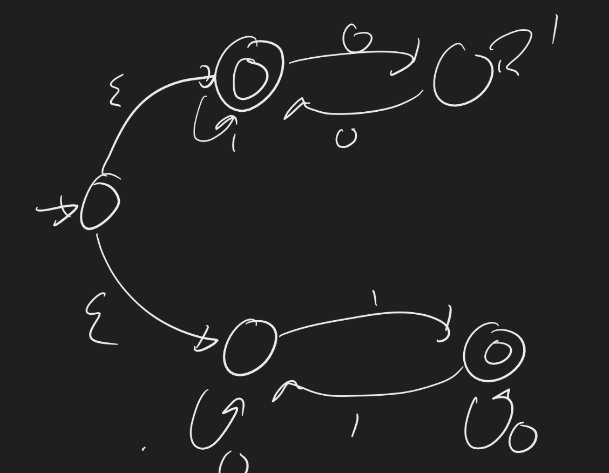

# Computability Lesson 6: Regular Expressions
{:.no_toc}

1. Table of Contents
{:toc}

<!--
1. 4:30 - 4:45 quiz comments
2. 4:45 - 5:00 Problem set questions
3. 5:00 - 5:20 Reg. expr. intro + exercise
4. 5:20 - 5:35 Theorem one dir.
4. 5:35 - 5:55 Other dir examples
5. 5:55 - 6:10 Exercises
-->

# Quiz Comments

# Problem Set Questions

# Regular Expressions

Readings: Sections 1.3 and 1.4.

Recall: last time we ended with the following statement:

**Theorem**: The class of regular languages is the smallest class of languages containing all languages of the form $\\{ a \\}$, for each $a \in \Sigma_{\varepsilon}$, $\emptyset$, and which is closed under the regular operations.

That is: every regular language can be built up from the symbols using the regular operations finitely many times. Intuitively, that means that there should be some simple, finite way to describe each regular language using these operations. There is: called *regular expressions*.

**Definition**: Fix an alphabet $\Sigma$. $R$ is a **regular expression** if $R$ is:  
1. $a$, for some $a \in \Sigma$,
2. $\varepsilon$,
3. $\emptyset$,
4. $(R_1 \cup R_2)$, where $R_1$ and $R_2$ are regular expressions,
5. $(R_1 \circ R_2)$, where $R_1$ and $R_2$ are regular expressions, or
6. $(R_1^*)$, where $R_1$ is a regular expression.

**Questions**: 1) What is the difference between $\varepsilon$ and $\emptyset$?

Consider the following machines. Which one recognizes $\mathcal{L} = \emptyset$, and which one recognizes $\mathcal{L} = \\{ \varepsilon \\}$?

2) A regular expression $R$ is defined using regular expressions $R_1$ and $R_2$. Isn't this definition circular?

In fact, we use **induction**: assume $R_1$ and $R_2$ are constructed already, then $R_1 \circ R_2$ is a regular expression.

Regular expressions represent *languages*. That is, a regular expression represents the set of all possible words, over the alphabet $\Sigma$, that can be generated using the expression given. For example, the expression $1^* (00)$ represents the set of all words that start with a sequence of just 1s, and then have two zeros (and that's it). For example, if $R$ is the language represented by $1^* (00)$, then $11100 \in R$ and $1001 \not \in R$.

**Example**: What is the language represented by $1^* \cup 0^*$? Can you find a DFA which recognizes this language?

## Exercises

Describe the languages represented by the following regular expressions:

1. $(00)^*$
2. $( (00)^* \cup (11)^*)^*$

# Theorem

**Theorem**: A language is regular if and only if it can be represented by a regular expression.

Notice that this is equivalent to the theorem mentioned last time. Why? Because if a language is regular, it can be represented by a regular expression, and so it can be built up from the symbols of $\Sigma$ using finitely many operations (by definition)!

One of the directions of this theorem is easy: if $R$ is a regular expression, it represents a regular language.

**Example**: Let $R = ((00)^* \cup (11)^*)^*$. Find an NFA which recognizes the same language.

The idea: first build NFAs for $(00)^*$ and $(11)^*$.

Now build an NFA for their union:

Now take the Kleene star of that:

**Idea**: Given a regular expression, use the algorithms we came up with earlier (that proved the closure properties) to find an NFA recognizing the same language.

## One direction

**Lemma**: If $R$ is a regular expression, then it represents a regular language.

**Idea**: We prove this by induction on the construction of $R$. What does this mean? Every *inductive* proof has one or more "base cases" and an "inductive step". The "inductive step" is where we assume that the result is true for some "smaller" cases, and we prove it for "one more step". For example, in the definition of regular expressions, we know that if $R_1$ and $R_2$ are regular expressions, then $R_1 \cup R_2$ is a regular expression. So the idea for an inductive proof would be to assume that we know that the languages represented by $R_1$ and $R_2$ are regular, and show that $R_1 \cup R_2$ is also regular. But we already know this: if $\mathcal{L}_1$ and $\mathcal{L}_2$ are regular languages, then $\mathcal{L}_1 \cup \mathcal{L}_2$ is regular since regular languages are closed under unions!

**Proof**: We prove this by induction on $R$. For the base cases, we consider $R = a$, $R = \varepsilon$, or $R = \emptyset$. The following NFAs recognize these languages:

By induction, assume that $R_1$ and $R_2$ are regular languages. Then $R_1 \cup R_2$ is regular, since regular languages are closed under unions. Moreover, $R_1 \circ R_2$ is regular, since regular languages are closed under concatenation. Lastly, $(R_1)^*$ is regular since regular languages are closed under the Kleene star operation.

## Exercise

Convert the following regular expression to an NFA: $R = (0 \cup (10^* 1))^*$.

Hint: first convert $(10^*1)$, then $0 \cup (10^1)$, then add in the "star" operator.

What is the language of this machine?

## Examples in the other

We will not prove the other direction, but we will do some examples to get the idea for it.

**Example**: Convert the following machine to a regular expression.

First, add a new start state, and add a new "accept" state, and put epsilon transitions as appropriate (from the old accept states).

Then the idea is to get rid of states, one by one, and relabel using regular expressions. For each pair of states $q$ and $q^\prime$ left, we compute *all* the ways of getting from $q$ to $q^\prime$, including by using a state you just removed. So for example, if we remove $q_2$, we look at how to get from $q_1$ to $q_1$: we can first go to $q_2$ with a 0, then take the self-loop with a 1, then come back to $q_1$ with a 0:

Now we remove $q_1$:

Now if we remove $q_0$, we can go from the start to the end immediately with $(0 \cup (101^*01))^*$

# Exercises

Come up with regular expressions that recognize the same languages as the following machines:

and

(There may be more than one answer.)

# Problem Set 2

Due **Thursday, March 3** at 11:59 PM on Moodle:

1. Fill in the details for the proof, mentioned in lecture, that the class of regular languages is closed under the Kleene star operation. That is: Let $M = (Q, \Sigma, \delta, q_0, F)$ be a DFA. Find an NFA $N$ which accepts $\mathcal{L}(M)^*$.
2. Find a regular expression for the language $\mathcal{L}_2 = \\{ w: w$ has even length $\\}$, over the alphabet $\Sigma = \\{ 0, 1 \\}$.
3. For the following regular expressions, give the state diagram of an NFA recognizing the same language. In all of the following, the alphabet is $\Sigma = \\{ a, b \\}$:  
   * $(a \cup b)^* ((ab)b^* )$  
   * $((a \cup b)(aa))^*$  
   * $(a \cup b^*)a^*b^*$.  
4. Show that $\mathcal{L}_4 = \\{ a^i b^j : i \neq j \\}$ is not a regular language. (This will likely use methods discussed on Thursday and/or next Monday.)
