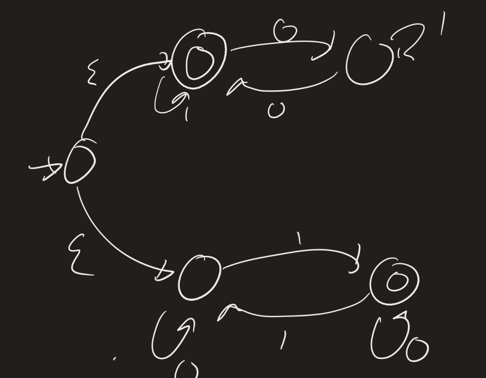
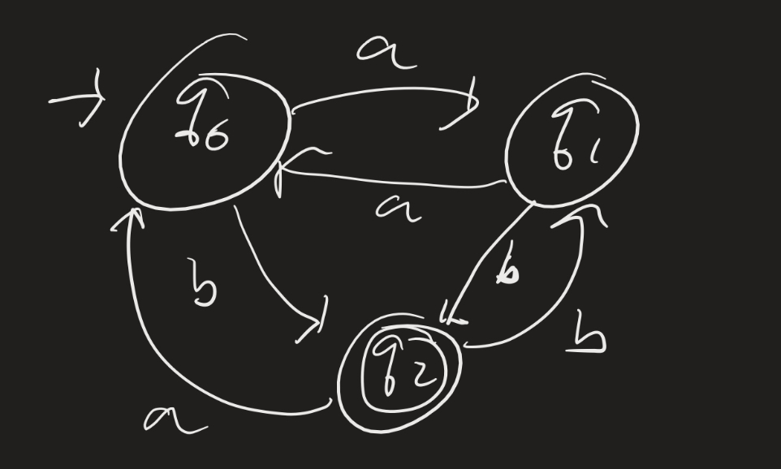
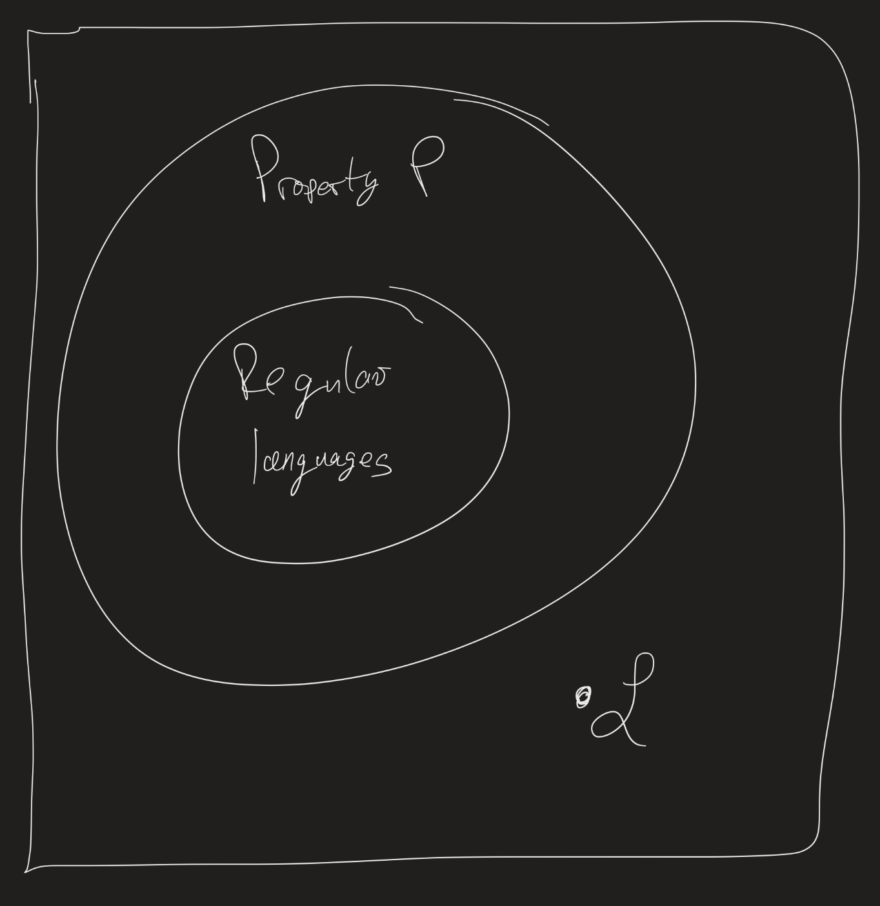
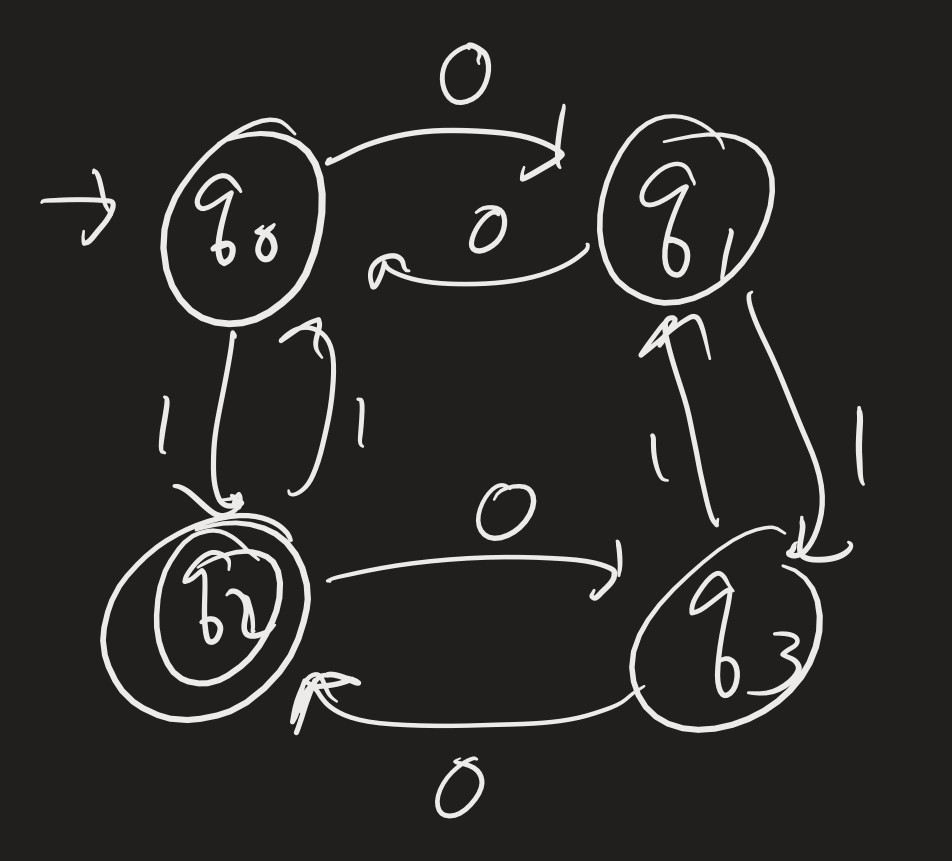

# Computability Lesson 7: Non-regular languages
{:.no_toc}

1. Table of Contents
{:toc}

<!--
4:30 - 4:45 Warm up
4:45 - 5:15 Pumping lemma
5:15 - 5:35 exercise
5:35 - 5:55 closure properties
5:55 - 6:10 exercise
-->

# Warm-up

Come up with regular expressions that recognize the same languages as the following machines:

and

(There may be more than one answer.)

## Reading

Make sure you read through sections 1.3 and 1.4 of Sipser, or everything up through 2.9 of Maheshwari-Smid.

# Pumping Lemma

**Example**: Find an NFA which recognizes $\\{ 0^{n^2} : n \in \mathbb{N} \\}$.

How might we do this? It's not obvious. In fact, it might not even be possible, since there's no obvious way to "count" squares if we only have finitely many states. But, just because there is no obvious way to do this, does not mean there isn't a smarter way to do it. (Recall: a natural idea to check if a string has even length is to count and then divide by 2.  But we can do this without "counting", just by swapping back and forth between "even" and "odd" parity.)

So we need to find a way to **prove** that there is no possible NFA or DFA (or regular expression) which could recognize this language. How can we do this?

**Idea**: Find a *property* of languages that is shared by **all** regular languages. Then show that this particular language does not have this property.

This is the point of the **Pumping Lemma**.

**Lemma**: ("Pumping Lemma") Suppose $\mathcal{L}$ is a regular language. Then there is a number $p \geq 1$ (called the *pumping length*) such that for all $w \in \mathcal{L}$, if $\|w\| \geq p$, then there are strings $x$, $y$, and $z$ such that $w = xyz$ and:

1. for each $i \geq 0$, $xy^i z \in \mathcal{L}$,
2. $\|y\| > 0$, and
3. $\|xy\| \leq p$.

Let's look at an example:

For this language, $p = 4$ (I'm just telling you that, we don't really care *how* we know at this point.) The pumping lemma says that any word of length at least 4 in this language can be broken down into $xyz$ satisfying the three conditions above. Let's give a few examples of words in this language:

1. $w = 0011010$. In this case, we can break this down into $x = 00$, $y = 11$, and $z = 010$. (There are other ways to break it down, but we only need one.) Notice that if we replace $y$ by $y^i$ for any $i \in \mathbb{N}$, we still enter the same states!
2. $w = 10101$. In this case, we can break this down into $x = \varepsilon$, $y = 1010$, and $z = 1$. Again notice that repeating $(1010)$ over and over again just ends up in state $q_0$, and then the last $z = 1$ transitions us to state $q_2$.

Let's look at the seqeuence of states visited in the computation of $w = 10101$: $q_0 \xrightarrow{1} q_2 \xrightarrow{0} q_3 \xrightarrow{1} q_1 \xrightarrow{0} q_0 \xrightarrow{1} q_2$. Notice that the sequence of computation *looped* around (in fact I spot two possible loops: do you?). In general, this will always happen: if a DFA has $n$ states, then for any word $w$ of length $\geq n$, at least one state must be visited more than once during the computation. This is due to the [Pigeonhole principle](https://en.wikipedia.org/wiki/Pigeonhole_principle), a fundamental result used to prove things in number theory / combinatorics. This result allows us to prove the pumping lemma (which we won't do, but the jist of it is exactly what we discussed here).

For now, let's *use* the pumping lemma to show that certain languages are not regular.

## Example

The classic example of a language that is not regular is $\mathcal{L} = \\{ 0^n 1^n : n \in \mathbb{N} \\}$.

**Proof**: We prove this by contradiction. Suppose $\mathcal{L}$ is regular. Then, by the Pumping Lemma, it has a pumping length $p$. Let $w = 0^p 1^p$. Then $w \in \mathcal{L}$ (look at the definition of $\mathcal{L}$).

Now since $\|w \| \geq p$, there are $x$, $y$, and $z$ such that $w = xyz$, $\|y\| > 0$ and $\|xy\| \leq p$. In particular, this last point means that $y$ must be a string of all $0$s (why?). That is, there is an $1 \leq n \leq p$ such that $y = 0^n$. So, for example, $x y^0 z = 0^{p - n} 1^{p}$, since the only thing we did was remove the $n$ 0s that were in $y$. But since $0^{p - n} 1^p \not \in \mathcal{L}$, this contradicts the statement of the Pumping Lemma that $x y^i z \in \mathcal{L}$ for **every** $i \in \mathbb{N}$!

Since we arrived at a contradiction, and every step of our argument was justified by previous steps of our arguments, our assumption cannot be true. Therefore, the language cannot be regular!

## Commentary on the proof

Let's think about how we proved that a language was not regular for a little bit.

1. Assume that the language $\mathcal{L}$ is regular (with the goal of, eventually, arriving at a contradiction). Therefore we are given this pumping length $p$. (We don't know what it is! We just know that it exists.)
2. Come up with a specific word $w \in \mathcal{L}$ whose length is at least $p$ that cannot possibly be "pumped".
   * This part takes some clever thinking!
   * The trick is to use property (3) of the pumping lemma, to somehow have some control over what $y$ will be.
   * You won't ever "know" exactly what $y$ is, but you'll be able to say ""$y$ must be of the form..."
   * Then show that, no matter what $y$ we choose that fit the parameters above, $x y^0 z \not \in \mathcal{L}$ or $x y^2 z \not \in \mathcal{L}$ or ...
3. Having arrived at a contradiction, we can conclude that $\mathcal{L}$ is not regular.

## Exercise

A **palindrome** is a word read the same forwards and backwards. Some examples include $\varepsilon$, $0$, $1$, $010$, etc. Show that if $\Sigma = \\{ 0, 1 \\}$, then $\mathcal{L} = \\{ w : w$ is a palindrome $\\}$ is not regular.

Hint: Assume the language is regular and let $p$ be the pumping length. Can you come up with a word, whose length is longer than $p$, so that if we pump anything in the beginning part of the word, we end up "breaking" the symmetry inherent in the definition?

## Together

Prove that $\mathcal{L} = \\{ 0^{n^2} : n \in \mathbb{N} \\}$ is not regular.

**Proof**: Suppose it is, and let $p$ be the pumping length. Then let $w = 0^{p^2}$. By the pumping lemma, there are $x$, $y$, and $z$ so that $w = xyz$, and since $\|y\| > 0$ and $\|xy \| \leq p$, we can assume $y = 0^n$ for some $1 \leq n \leq p$. Therefore, $xy^2z = 0^{p^2 + n}$.

Notice that $p^2 + n \leq p^2 + p$. But $p^2 + p$ is not a perfect square! To see this, just recognize that $(p + 1)^2 = p^2 + 2p + 1$, and $p^2 < p^2 + p < p^2 + 2p + 1$, and so it sits between two consecutive perfect squares. Hence $xy^2 z$ is not of the form $0^{x^2}$ for any $x \in \mathbb{N}$!

# Closure Properties

> Many constructions are like getting olives out of a jar: the first takes some effort, and the rest just pour out.

(Roman Kossak and James Schmerl, *The Structure of Models of Peano Arithmetic.*)

Once we have shown that *some* languages are not regular, it becomes easier to show that others are not as well! (This will be a common theme in this course.)

**Example**: Show that $\mathcal{L} = \\{ w : w$ has the same number of 0s as it has 1s $\\}$ is not regular.

We could prove this using the pumping lemma; in fact, the idea of $0^p 1^p$ would probably work. But there is an easier solution: use the fact that regular languages are closed under intersections!

**Proof**: Assume $\mathcal{L}$ is regular. Then $\mathcal{L} \cap 0^\* 1^\*$ is also regular, since regular languages are closed under intersections (and $0^\* 1^\*$ is regular since it's a regular expression). But then $\mathcal{L} \cap 0^\* 1^\* = \\{ 0^n 1^n : n \in \mathbb{N} \\}$, which we have already proven is not regular. Therefore, $\mathcal{L}$ cannot be regular either!

## Exercise

Show that $\mathcal{L} = \\{ w :$ the length of $w$ is a perfect square $\\}$ is not regular. (Use closure properties).

## Example

Sometimes we may need to use both closure properties and the pumping lemma. We use a closure property to get to a language for which it is easier to apply the pumping lemma to.

**Example**: Show that $\mathcal{L} = \\{ 0^i 1^j : i > j \\}$ is not regular.

What can we do here? If we look at $0^p 1^{p-1}$, and we pump, we stay in the language. So this is not helpful. Instead, consdier $\overline{\mathcal{L}} \cap 0^\* 1^\*$. What is this language? Since we're intersecting with $0^\* 1^\*$, we must get that words in this language consist of 0s and then 1s (no 1s before any 0s), and since words in this language cannot be in $\mathcal{L}$, we get that the number of 0s has to be less than or equal to the number of 1s!

That is, $\overline{\mathcal{L}} \cap 0^\* 1^\* = \\{ 0^i 1^j : i \leq j \\}$. Now we can apply the pumping lemma: let $p$ be the pumping length, and suppose $w = 0^p 1^p$. Then $w \in \mathcal{L}$. Now show that no matter what $x, y$ and $z$ are, if $\|y\| > 0$ and $\|xy\| \leq p$, then $xy^2z \not \in \overline{\mathcal{L}} \cap 0^\* 1^\*$.

# Warning

In general, it is not true that all non-regular languages can be proven non-regular using the pumping lemma.

For example: $\mathcal{L} = \\{ a b^i c^i : i \in \mathbb{N} \\} \cup \\{ a^i b^j c^k : i \neq 1, j, k \geq 0 \\}$ is not regular.  You can prove this by looking at $\mathcal{L} \cap a b^\* c^\*$, which is $\\{ a b^i c^i : i \in \mathbb{N} \\}$, then use the pumping lemma.

But: $\mathcal{L}$ does satisfy the pumping lemma with $p = 2$! It's not obvious to see why, but check:

* If $w$ starts with at least one $a$, just let $y = a$, and pump that $a$. Then you end up in $\\{ a^i b^j c^k : i \neq 1, j \geq 0, k \geq 0 \\}$
* If $w$ does not start with an $a$, let $y$ be the first character of $w$ (either a $b$ or a $c$) and pump, and you still end up in $\\{ a^i b^j c^k : i \neq 1, j \geq 0, k \geq 0 \\}$, since $i = 0$ in this case.
