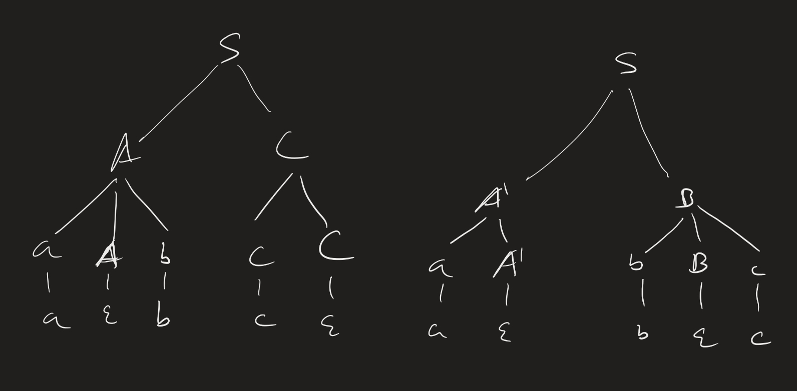
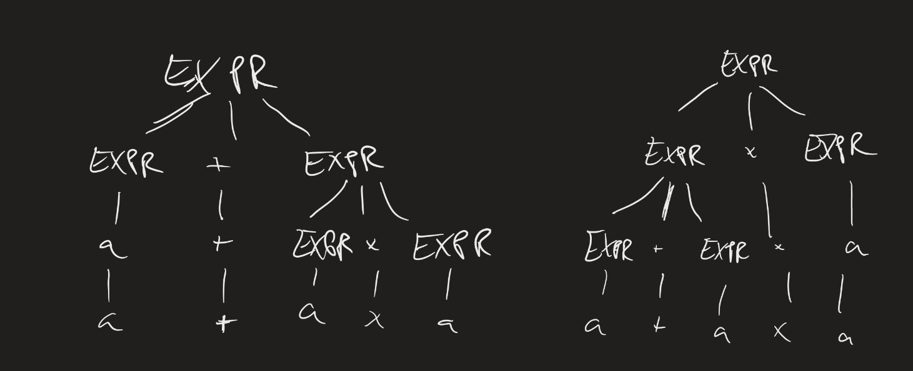

# Computability Lesson 9: Context-free Grammars (Formally)
{:.no_toc}

1. Table of Contents
{:toc}

# Warm Up

Let $G$ be the following grammar. Find some examples of words that are in $\mathcal{L}(G)$, by doing a few derivations from the start state, and determine, as best as you can, $\mathcal{L}(G)$.

$$
\begin{align}
S \rightarrow 0 S 1 | \varepsilon
\end{align}
$$

# Problem Set Questions

# Formal Description

Formally, a **context-free grammar** (CFG) $G$ is a 4-tuple $G = (V, \Sigma, R, S)$, where:

1. $V$ is a (non-empty) finite set (**variables**),
2. $\Sigma$ is a non-empty, finite set (the **terminals**),
3. $R \subseteq V \times (V \cup \Sigma)^*$ is a non-empty, finite set (the production **rules**), and
4. $S \in V$ (the *start* variable).

What does (3) mean? First, $(V \cup \Sigma)^\*$ is a word consisting of terminals and variables. $V \times (V \cup \Sigma)^\*$ is the set of ordered pairs of the form $(A, w)$, where $A$ is a variable, and $w$ is such a word. So (3) just means that the rules are ordered pairs of this form.

Normally, though, we won't write $(A, w) \in R$. Instead, we write $A \rightarrow w$, as we did above.

**Definitions**:

1. Let $u, v, w \in (V \cup \Sigma)^*$, $A \in V$, and $A \rightarrow w \in R$. Then we say $uAv$ **yields** $uwv$, written $uAv \implies uwv$.
2. We say $u$ **derives** $v$, written $u \overset{*}{\implies} v$ if $u = v$, or if there is $k \geq 0$ and a sequence $u \implies u_1 \implies u_2 \implies \ldots \implies u_k \implies v$.
3. The **language** of a grammar $G$ is $\mathcal{L}(G) = \\{ w \in \Sigma^* : S \overset{*}{\implies} w \\}$.
4. $\mathcal{L}$ is a **context-free language** if there is a CFG G such that $\mathcal{L}(G) = \mathcal{L}$.

# Design Examples

**Example**: Design a CFG over $\Sigma = \\{ 0, 1 \\}$ which recognizes $\mathcal{L} = \\{ w : w$ is a palindrome $\\}$.

Often the idea behind designing grammars is to think recursively. So first, what are some base cases?

1. $\varepsilon$ is a palindrome.
2. 0 is a palindrome.
3. 1 is a palindrome.

Recursively, if $w$ is a palindrome, then so are $0w0$ and $1w1$. So we can use all of this to determine our production rules:

$$S \rightarrow \varepsilon | 0 | 1 | 0S0 | 1S1$$

For example, the word $w = 101101$ is a palindrome. What is the derivation for $w$?

**Next time**: There are two ways to think about "derivations". One is, as we've done, just applying rules one by one. But in fact, it often makes sense to think of derivations as "parse trees"; in particular, this may be helpful if we have more than one variable in a derivation, and hence more than one rule one could use at a particular time.

**Exercise**: Design CFG's for the following languages:

1. $\mathcal{L}_1 = \\{ a^i b^i c^j : i, j \in \mathbb{N} \\}$
2. $\mathcal{L}_2 = \\{ a^i b^j c^j : i, j \in \mathbb{N} \\}$
3. $\mathcal{L} = \mathcal{L}_1 \cup \mathcal{L}_2$.

Hint: we saw a CFG for $a^i b^i$ earlier. How might it change to add in $c^j$ after that?

## General Hints

Abstractly: if $G_1$, with start variable $S_1$ is a grammar for $\mathcal{L}_1$, and $G_2$, with start variable $S_2$, is a grammar for $\mathcal{L}_2$, how would we find grammars for:

1. $\mathcal{L}_1 \cup \mathcal{L}_2$?
2. $\mathcal{L}_1 \circ \mathcal{L}_2$?

Harder: Kleene Star? (Homework, eventually.)

**Theorem**: Every regular language is context-free.

Proof? (Use the fact that context-free languages are closed under the regular operations.)

## Example

Find a CFG generating $\mathcal{L} = \\{ a^n b^m : n < m \\}$.

Hint: Consider the languages $\mathcal{L}_1 = \\{ a^n b^n : n \in \mathbb{N} \\}$ and $\mathcal{L}_2 = b^\*$. Can you build CFGs for those? Then can you build a CFG for $\mathcal{L}$?

## Exercise

Find a CFG for $\mathcal{L} = \\{ 0, 1, 10, 11, 100, 101, \ldots \\}$, the set of all binary strings with no leading zeros.

Hints:

1. Can you find a CFG for the set of all binary strings?
2. Once you've done that, put a 1 in front.
3. Exactly one string will be missing from that. So find a CFG for that one string, and take a union.

# Ambiguity

Last time we saw that there can be multiple ways to derive the same word, even in the grammar of "natural language". For example, let's consider the following grammar (answer to one of the exercises above):

$$
\begin{align}
S &\rightarrow AC | A^\prime B \\
A &\rightarrow aAb | \varepsilon \\
C &\rightarrow cC | \varepsilon \\
A^\prime &\rightarrow a A^\prime | \varepsilon \\
B &\rightarrow bBc | \varepsilon
\end{align}
$$

Consider the word $abc$. We can derive this in a few ways:

1. $S \implies AC \implies aAbC \implies abC \implies abcC \implies abc$.
2. $S \implies AC \implies AcC \implies aAbcC \implies abcC \implies abc$.

These are basically the same derivations: each application of a rule replaced the same variable with the same string. The only difference is the order of the variables we chose to resolve first. But there is a truly *different* derivation that these two:

3: $S \implies A^\prime B \implies aA^\prime B \implies aB \implies abBc \implies abc$.

What is the difference here? To explain the difference between true ambiguities like 1/3 instead of 1/2, we use **parse trees** or **leftmost derivations**.

In the image below, the left is the parse tree for (1) and (2),a nd the right is the parse tree for (3):

**Definitions**:

1. A derivation of a string $w$ in a grammar $G$ is a **leftmost derivation** if at each step, the leftmost variable is the one replaced.
2. A string $w$ is derived **ambiguously** in a grammar G if it has more than one leftmost derivation.
3. A grammar $G$ is **ambiguous** if there is a string $w \in \mathcal{L}(G)$ that is derived ambiguously.

As we defined it, ambiguity is a property of a grammar, rather than of the language of that grammar. (Do you see the subtle difference?) Some languages that are generated by an ambiguous grammar might also be generated by an unambiguous grammar. In fact: if you are designing a compiler / interpreter for a programming language, you might start by designing the grammar for that language to parse the syntax, and if you're unlucky, your grammar might be ambiguous (it is very easy to design an ambiguous grammar by mistake). But then, you would likely try to introduce precedence rules (among other modifications) to make your grammar unambiguous.

However: there **are** some languages which are **inherently ambiguous**. ([We saw that English is one.](https://twitter.com/Browtweaten/status/1481341755870138368))

## Ambiguity Examples

Consider the following grammar (with EXPR being the start variable):

$$
\begin{align}
EXPR \rightarrow EXPR + EXPR | EXPR \times EXPR | (EXPR) | a
\end{align}
$$

The string $a + a \times a$ is generated ambiguously.

Let's introduce some precedence rules:

* Parentheses should bind most tightly.
* Then multiplication.
* Then addition.

How would this look in a grammar?

$$
\begin{align}
EXPR &\rightarrow EXPR + TERM | TERM \\
TERM &\rightarrow TERM \times FACTOR | FACTOR \\
FACTOR &\rightarrow (EXPR) | a
\end{align}
$$

What does the parse tree for $a + a \times a$ look like here?
