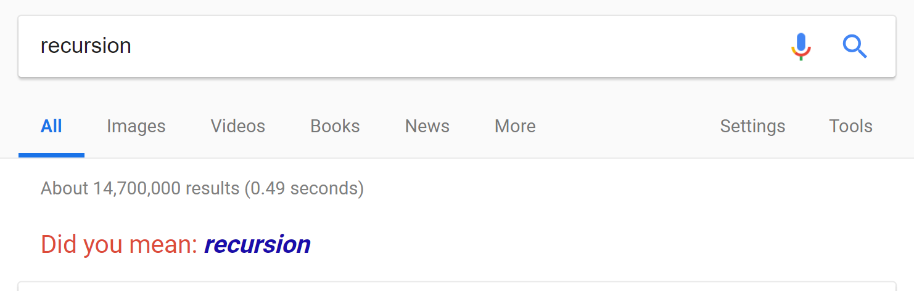

# CS2 Lesson 19: Recursion
{:.no_toc}

1. Table of Contents
{:toc}

# Project 3 Hints

* Implement the smaller pieces first: Player interface, HumanPlayer, SimplePlayer
* Maybe a class for a "Move"?
* Make sure they all work on their own.
* Then try to put things together.
  * Keep track of which player's turn it is.
  * As long as there are any stones left on any row:
    * Get a move $(r, n)$ from the player.
    * Remove $number$ stones from row $r$.
    * Change to the other player's turn.
  * After there are no more stones left: check who took the last one, and declare a winner.

# Recursion

<a href="https://www.google.com/search?q=recursion" target="_blank"></a>

**Warning**: Today most of our examples will be **static methods**. This does not mean you should be using static methods on project 3! Most things (Player types, Game, etc) should be non-static. Maybe just the main method, some helper methods in the main class, can be static.

## Example

Look at the RecursionExample code on replit:

```java
public static int add(int x, int y) {
    System.out.println("Calling add(" + x + ", " + y + ")");
    if (y == 0) {
        return x;
    }
    if (y > 0) {
        return add(x + 1, y - 1);
    }
    if (y < 0) {
        return add(x - 1, y + 1);
    }
	// this shouldn't happen
	return -1;
}
```

A method which invokes itself is called **recursive**. The `add` method invokes itself (as long as $y \neq 0$). Recursive methods have a **base case**: a condition which leads to an actual answer, rather than recursively calling the same method again.

1. What is the need for a base case?
2. What is the base case in the `add` method?

**Exercise**:

1. Run the RecursionExample program. What is output?
2. Change the parameters and see what happens.
3. Given any input $x$ and $y$, if we invoke `add(x, y)`, how "deep" does the recursion go?

# Leap of Faith

Remember the idea of "modular design":

* Break up a large problem into smaller components.
* Implement each component on its own (**once**!), and test each one.
* Re-use the components as needed -- trusting that they were implemented correctly the first time!

If we implemented a component once, we can re-use it. That's pretty much what we're doing when we use recursion!  If we **know** that a method has been implemented correctly, we don't need to know how it works, we can just call it and use it. Similarly, when we see a recursive call, assume it works! Then we can just use it. Importantly, the assumption is that the recursive call works on *smalller* inputs.

That means that to implement a recursive method, we attempt to *reduce* the problem to a smaller problem. That is: given a problem with input $n$, we ask: if I knew how to solve this problem for inputs *smaller* than $n$, how would I then solve it for input $n$?

## Recursive Factorial

```java
public int recursiveFactorial(int n) {
	if (n <= 0) {
		return 1;
	}

	return n * recursiveFactorial(n - 1);
}
```

Assume that `recursiveFactorial(n-1)` correctly returns $(n-1)!$. Then $n \times$ `recursiveFactorial(n-1)` is, in fact, equal to $n!$ (Do you see why?)

## Exercise

Implement a recursive Fibonacci method. Remember:

* `fib(0)` should return $0$
* `fib(1)` should return $1$. (You have two base cases!)
* `fib(n)` should return `fib(n-1) + fib(n-2)` if $n > 1$. (This is your recursive step!)
* For the purposes of this method, if $n < 0$, return $-1$

You do not need to submit this, but you should attempt to complete this in the replit space.

# Sum the digits

**Problem**: Given a (positive) integer, add up its digits.

We can solve this with recursion. (There are other ways to solve this as well). In order to solve this problem, we have to think about:

1. What is the base case?
2. If we know how to solve the problem for a number with *fewer* digits, how can we use that to solve the problem for a bigger number?

For example, if I have the number 321, I know that the ones digit is 1. I also can divide this number by 10, to get 32. Then, recursively, I can use the fact that the sum of the digits of 32 is 5, and then add that to the 1 I had in my ones digit, to get 6!

**Exercise**: Implement the sumDigits method recursively. Hint: to get the ones digit of a number, use $num % 10$. To remove the ones digit from the number, use $num / 10$.

```java
public static int sumDigits(int num) {
    if (num < 0) {
        return sumDigits(-num);
    }
    if (num < 10) {
        return num;
    }
	// implement the rest...
}
```

Implement this in the `sumDigits` method on replit.

# Recursive Prints

```java
public static void printBeforeRecursion(ArrayList<String> list, int i) {
    if (i == list.size()) {
        return;
    }
    System.out.println(list.get(i));
    printBeforeRecursion(list, i+1);
}

public static void printAfterRecursion(ArrayList<String> list, int i) {
    if (i == list.size()) {
        return;
    }
    printAfterRecursion(list, i+1);
    System.out.println(list.get(i));
}
```

**Exercise**: What do you think that each of these methods prints out if you call them with the list ["a", "b", "c", "d", "e"], and $i = 0$? Predict what you think each method will do. Then run the RecursivePrints code (on Replit) and see what each one actually does, and see if your prediction was right. Can you explain what's going on?

**Record your response on Moodle.**

# Reading

Read [Chapter 8](https://books.trinket.io/thinkjava2/chapter8.html) on recursive methods.
