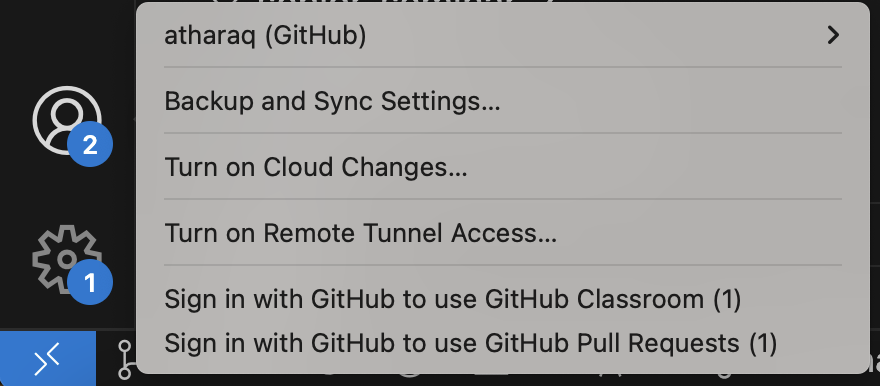

# CS2 Lesson 1: Variables / Operators, Input / Output
{:.no_toc}

1. Table of Contents
{:toc}

# Overview Videos
{:.no_toc}

<div class="youtube-container">
<iframe src="https://www.youtube.com/embed/g3Jx1kIo-H0" frameborder="0" allow="accelerometer; autoplay; clipboard-write; encrypted-media; gyroscope; picture-in-picture" allowfullscreen></iframe>
</div>

<div class="youtube-container">
<iframe src="https://www.youtube.com/embed/wCugzvxeDK4" frameborder="0" allow="accelerometer; autoplay; clipboard-write; encrypted-media; gyroscope; picture-in-picture" allowfullscreen></iframe>
</div>

For this lesson, you will *review* chapter 1 from the textbook, work through chapter 2, and *preview* chapter 3. For the most part, early in the semester we will stick closely to the textbook. Each chapter ends with several exercises. You should attempt as many of them as possible, but there are specific ones that I will highlight that I think everyone should do to practice their basic coding skills.

Next Monday, we will look at these exercises as well as some supplementary material about variables, data types, and input / output.

# Chapter 1

Please read [ThinkJava Chapter 1](https://books.trinket.io/thinkjava2/chapter1.html). This section shows the basic structure of a Java program. I encourage you to work through **all** of the exercises in this chapter.

## Homework

At this point, you should be able to run a simple program. I'd like to you submit a program ([via GitHub Classroom](https://classroom.github.com/a/P6j-i4Xt)) just to make sure you can. The program should output your name. (*This is the homework you were already assigned from last time, just reminding you to do this.*)

In addition, make sure you are doing all of the exercises at the end of chapter 1. In particular, **Exercise 3** is a good way to see what symbols / words / etc are important and what is not, at least to the Java compiler. Spend some time on that: you can play around with it in the same file that your homework is in, but please make sure you submit **working** code that just outputs your name after you are done with all of that.

## GitHub Issues

I recognize that several students had issues opening the assignment from GitHub Classroom. Here are some possible fixes:

First: open Visual Studio Code and click the "accounts" icon on the bottom left.



If you click on it, it should say your GitHub user name, or it could ask you to sign in to GitHub to use GitHub Classroom. Click that and follow the instructions to sign in. Once you've signed it, go back to the [GitHub Classroom assignment](https://classroom.github.com/a/P6j-i4Xt) and try to click the "Open in VSCode" button again, this should work now.

Secondly: if you are having trouble "committing" your changes after you have successfully gotten it to open, there may be one of a couple of issues:

1. Verify that `git` is intalled. This should have happened automatically via VSCode, but to check, open a Terminal ([instructions here](https://code.visualstudio.com/docs/terminal/basics)) in VSCode, and type in the command `git --version`. You might see something like `git version 2.21.0 (Apple Git-122.2)` or you might see a message that says that the `git` command is not found. If it's not found, you can [download git here](https://git-scm.com/downloads), pick the OS you use.
2. If `git` was already installed, or you installed it, closed and re-opened VSCode, but still cannot commit anything, it's possible that your git user name / email address is not set. To fix this, open a Terminal in VSCode and type in the following commands: `git config --global user.email "email@example.com"` (replace that email with your actual email address that you used when you created your account) and `git config --global user.name "username"` (replace that with your actual user name).

At this point, you should be able to finally commit. Reminder: when you're done working, you can do the following:

1. Save your work (in every file that you made changes, including in the README file where you are supposed to answer some questions about variables / data types.)
2. Commit your changes. (Again, in every file that you made changes.) You can do this by clicking on the "source control" icon on the top left side of VSCode.
3. Push / sync your changes.

# Chapter 2: Variables and Operators

Please read [Chapter 2: Variables and Operators](https://books.trinket.io/thinkjava2/chapter2.html). Some highlights:

* Make sure you know what a **memory diagram** is. Often times, I will ask you what some code does. The best way to do this is to make a memory diagram, keeping track of what the values of each variable is after you have executed each line of code.
* Pay attention to the different *arithmetic operators*, in particular that "/" defaults to "integer division", unless at least one of the *operands* is a floating-point type (**double**). Constant numbers are stored in memory as **int**s if they don't have a decimal point, and **double**s if they do. That is: "3" in Java is an int, but "3.0" is a double.
* Be ware of floating point errors! Numbers in computers are stored in binary, not decimal, and a decimal number like 0.8 might have an infinite, repeating binary expansion. This leads to strange errors like one I mention below.

## Exercise

What does the following code do? Make a memory diagram.

```java
int a, b;
a = 1234;
b = 99;
int t = a;
a = b;
b = t;
```

<details>
  <summary>Explanation:</summary>
  <p>This code <strong>swaps</strong> the values of the variables a and b.</p>
  <p>The first line declares the two variables. The next two lines are used to initialize the values of a and b to 1234 and 99, respectively.</p>
  <p>The last three lines swap a and b. This is done by creating a third variable named t, setting it to a. That means t is 1234. Then the value of a is changed to 99. Then the value of b is changed to 1234.</p>
</details>

---

What does the following output?

```java
double x = 0.7;
double y = 0.9;
double a = x + 0.1;
double b = y - 0.1;
System.out.println(a);
System.out.println(b);
```

<details>
<summary>Check your answer</summary>
<p>I suggest you try this out on your own machine.</p>
<p>When I try this out myself, I get the following:
<pre>
0.7999999999999999
0.8
</pre>
</p>
<p>This is because the decimal number 0.1 takes infinitely many bits to represent it in binary. So in the computer, we just get a "really good estimate" of the number.</p>
</details>

## Exercises

Work on exercises 2 and 3 from [Chapter 2](https://books.trinket.io/thinkjava2/chapter2.html#sec32). These do not need to be submitted anywhere, so just work on them on IntelliJ or VSCode.

## Exercise (discuss next time)

This exercise starts off similarly to exercise 3:

1. Write a program that creates variables named hour and minute. Assign them values that roughly correspond to the current time. Use a 24-hour clock so that 2:00 PM should be "14:00".
2. Output the current time in one line,  including a message. For example:  
    The current time is 15:10.
3. Modify the program so that it also displays the time 55 minutes from now. (Hint: you may need to use the **remainder** operator %.)  For example:  
    The current time is 15:10.  
    In 55 minutes, it will be 16:05.

# Preview: Chapter 3: Input / Output

We've see how to "output" numbers and strings to the console. This is done using the System.out.println method. It's worth spending some time figuring out what "System", "out", and "println" even mean, and I think the book does a decent job explaining these things. In short:

* System is the name of a **class**. All of Java code is organized into classes, and this tells your program which class to look for.
* out is the name of a **variable** inside the System class. So "System.out" tells Java to go to the System class and look at the out variable.
* println is the name of a **method** that the out variable can access. Depending on the data type of the variable, there are different methods that may be available to different variables.

Moreover, once we know how to output information to the screen, we may wish to ask the user to **input** data to the program. That way, we can respond to the user's choices intelligently. Take a look at [Chapter 3](https://books.trinket.io/thinkjava2/chapter3.html) to see how to use the **Scanner** class to get input from the user. There are some strange issues that come up with the Scanner class, and we will be sure to look at this on Monday!
