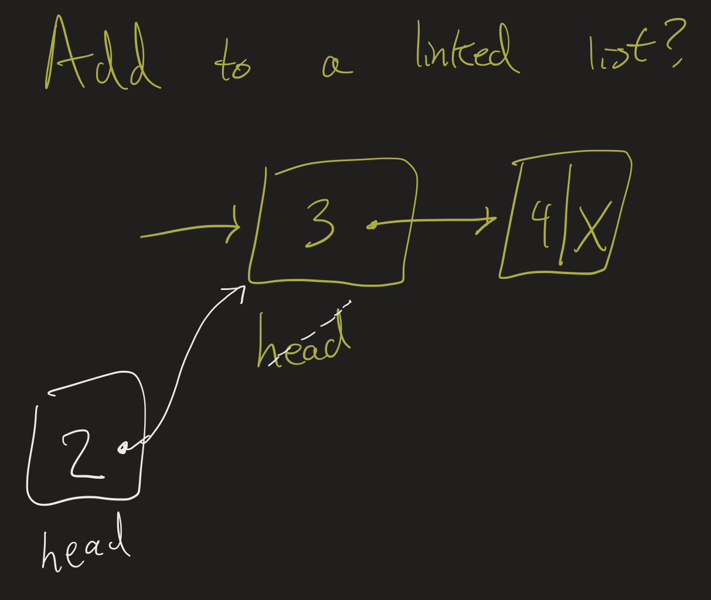
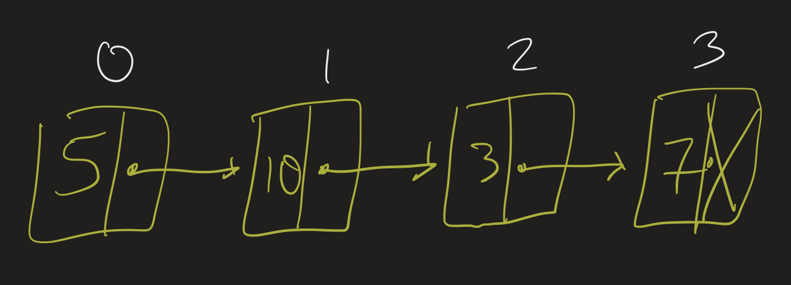

# CS2 Lesson 24: Data Structures
{:.no_toc}

1. Table of Contents
{:toc}

# Linked Lists

<iframe src="https://www.youtube.com/embed/DZ21H6nq-Zo" title="YouTube video player" frameborder="0" allow="accelerometer; autoplay; clipboard-write; encrypted-media; gyroscope; picture-in-picture" allowfullscreen></iframe>

A **data structure** is a way of organizing data in memory. We have seen two important kinds of data structures already: arrays and ArrayList.

* Arrays store a *fixed* amount of data contiguously.
* ArrayLists store data using arrays, but allow for dynamically resizing the array if necessary.

A **linked list** is another kind of list structure.

In a linked list, data is organized into **nodes**. Each node has a *data* item and a *link* to the next node. (The last node links to `null`.)

## Exercise

<iframe src="https://www.youtube.com/embed/hWKcyIT-5GM" title="YouTube video player" frameborder="0" allow="accelerometer; autoplay; clipboard-write; encrypted-media; gyroscope; picture-in-picture" allowfullscreen></iframe>

On CodingRooms, create a "singly" linked list class using the `Node` class. It should store a reference to the "head" node. First just implement the following operations:

* `addFirst`: add to the beginning of the list
* `size`: find the size of the list
* `getFirst`: get the first element of the list (the integer in the "head" node).

How do we do these things? To add a data element to the beginning of the list: create a new Node (with the correct data value), have it link to the old `head` variable, and update that head variable to the new node.

For example, in this picture, we created a new node with data item 2, had it point to the old head, and changed `head` to point to the 2 node.

What about size? We can figure out the size of a linked list by counting. Using a while loop, keep track of a "current" node and, as long as the node we're looking at is not null, advance to the next node and increment a counter.

Test out your class using the main method provided.

## Running Time

* What is the running time of the `addFirst` method?
* What is the running time of the `size` method?

For `size`, recall our algorithm before: keep track of a current node, and, as long as the node we look at is not null, advance to the next node and increment a counter. How many steps does this take if there are $N$ elements in the linked list?

If we design the class well, we can support this operation in **constant time** ($O(1)$). How? In addition, if we design the class well, we can also add to the end of the list in constant time. How?

    
Hints:

    
The idea, for both of these, is to store extra information in the Linked List class. Instead of just storing the first Node, what else could we store?

    

        
Still stuck?

        
Keep track of the "size" of the list (starting at 0, and adding to it every time you add to the list), and the "end" of the list (usually called the "tail").

    

<iframe src="https://www.youtube.com/embed/m1iK1BGYC5E" title="YouTube video player" frameborder="0" allow="accelerometer; autoplay; clipboard-write; encrypted-media; gyroscope; picture-in-picture" allowfullscreen></iframe>

## Exercise (Part 2)

Implement the following methods. They should run in $O(1)$ time:

* `addLast` (adds an integer to the end of the list)
* `getLast` (gets the last integer in the list)

In addition, update your `size` method written previously to run in $O(1)$ time.

# `get` method

<iframe src="https://www.youtube.com/embed/BPcLuOb_SVc" title="YouTube video player" frameborder="0" allow="accelerometer; autoplay; clipboard-write; encrypted-media; gyroscope; picture-in-picture" allowfullscreen></iframe>

To truly have a list structure, we should be able to access any element of the list. For example, if I add $5, 10, 3, 7$ to my list, I should be able to call `list.get(1)` and it should return $10$.

 10 -> 3 -> 7" />

* What is the running time (in terms of Big Oh) of the `get` method in the `ArrayList` class?
* What is the best running time we can have for the `get` method in our linked list class? Write pseudocode for this method. Record this in your **response on Moodle**.

In general, a structure in which we can access the $i^{\text{th}}$ element in constant time is said to support **random access**. Arrays and ArrayLists support random access, while LinkedLists support *sequential* access.

# Tree Structures

LinkedLists are usually used as an introduction to how data can be organized in ways other than in an array. A more useful data structure is a tree. A **tree** is a structure with a **root** node, so that all the nodes have links to **child** nodes, but there are **no cycles**. That is, you can't have a situation where Node A has a child B, and B has a child A. A tree where every node has at most $2$ children is called a **binary tree**.

"

Many of the ideas we used today to think about nodes can be used to similarly study trees. An example is provided on the practice final exam, which will be up on Moodle by this weekend.
