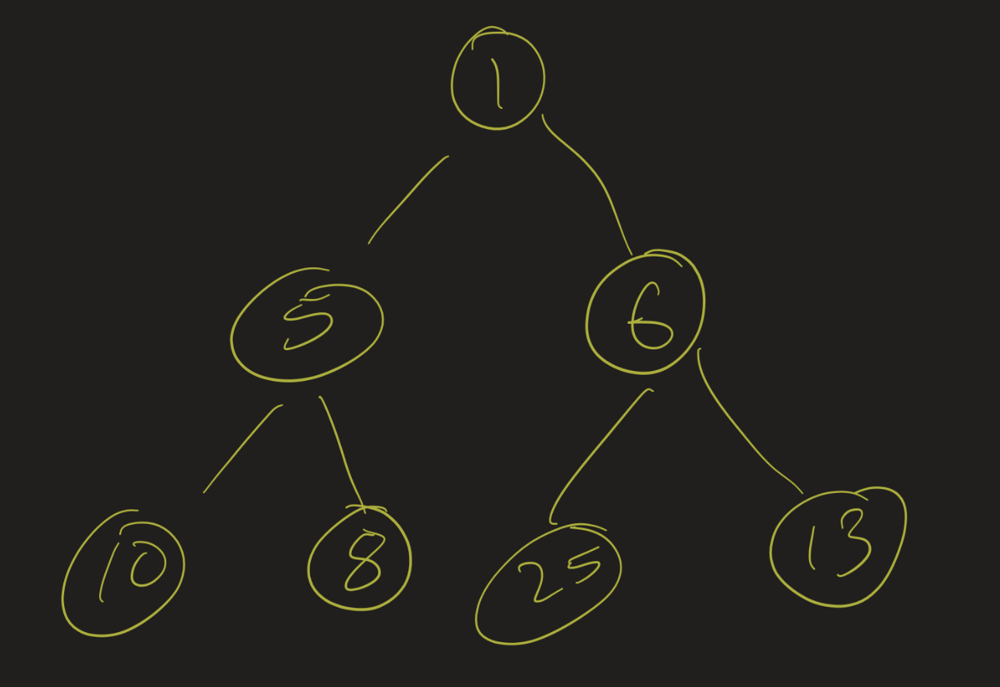
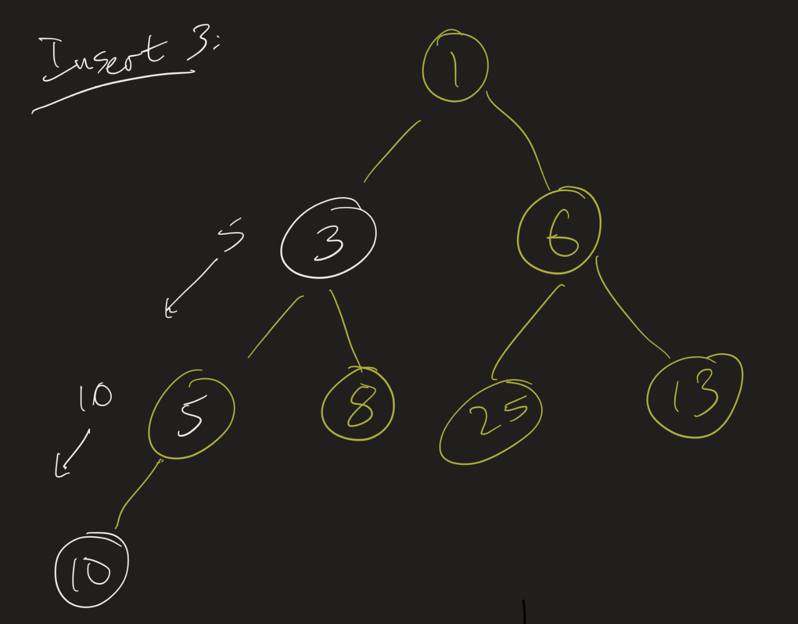
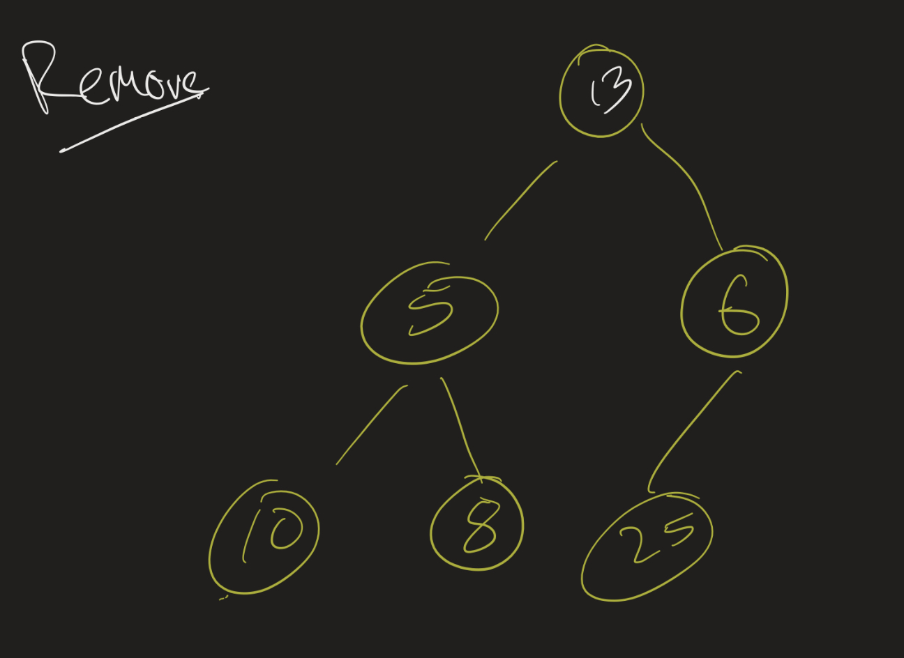
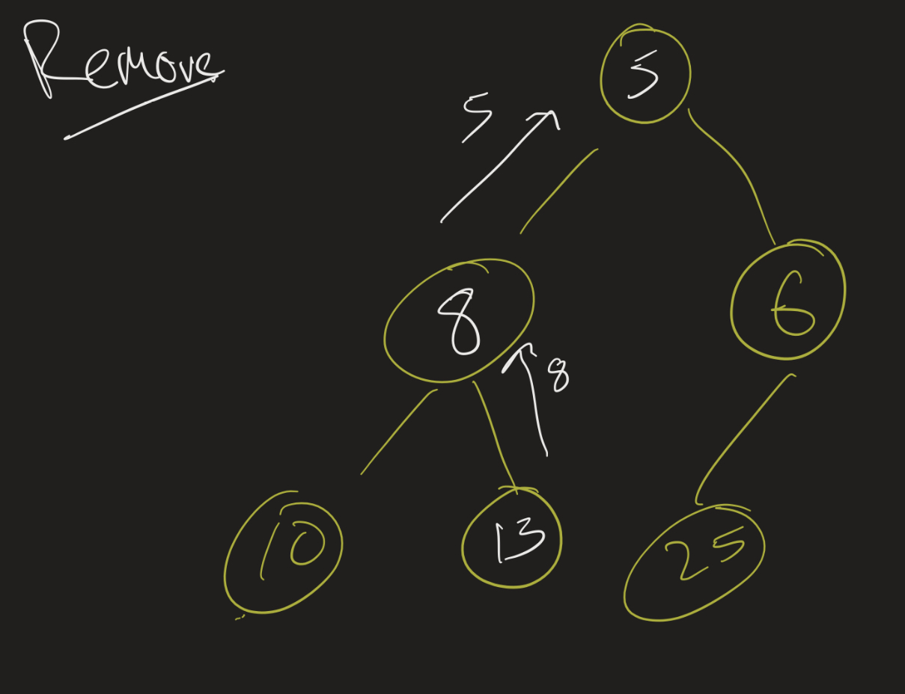

# Data Structures Lesson 13: Heapsort
{:.no_toc}

1. Table of Contents
{:toc}

# Inserting into a heap

    <iframe src="https://www.youtube.com/embed/98Y9IGljATg" frameborder="0" allow="accelerometer; autoplay; clipboard-write; encrypted-media; gyroscope; picture-in-picture" allowfullscreen></iframe>

In the above video, I talk through the idea of inserting into a heap, as well as look at some code for this. We saw, on Monday, that the idea is fairly simple:

* Put the new element into the next available position in the heap.
* As long as this element is smaller than its parent, swap it with its parent.

This is a simple idea, but we can improve on it. Instead of swapping the new element with its parent, we just "slide" the old elements down until we find the correct position of the new element.

That is, suppose we have the following heap, with the elements 1, 5, 6, 10, 8, 25, 13:

Then, when we want to insert 3, instead of immediately putting it below 10, we slide 10 down. Then we look at where 10 was: can we put 3 in that position? No, since its parent is 5, so we slide the 5 down. Then we look at the position where 5 was, and check if we can put 3 in there. We can, so we update that value, and we're done.

See you if you can implement this yourself. [Use this starter code](code/Heap.html).

# Removing from a heap

<iframe src="https://www.youtube.com/embed/k3ArniDSCKY" frameborder="0" allow="accelerometer; autoplay; clipboard-write; encrypted-media; gyroscope; picture-in-picture" allowfullscreen></iframe>

Similarly, when we remove from a heap, we swap the last element with the root, and then restore the heap property by going down one branch. We described an algorithm where we would swap the element with its smaller child (if needed) each time, but again, we can save some time by not doing any swaps. Suppose, again, we have the heap 1, 5, 6, 10, 8, 25, 13. When we remove 1, we put 13 at the beginning, and we have:

Then instead of swapping, we just slide the 5 up and check if 13 can go in 5's old position. It can't, so we slide the 8 up. We then check if 13 can go in 8's old position, and it can, since it does not have any children there, and so we are done: 5, 8, 6, 10, 13, 25.

# Application: selection

Last time we described an algorithm to solve the **selection problem**. The selection problem asks: given a list $l$ and a positive integer $k$, find the $k$-th largest (or $k$-th smallest) element of the list. One simple idea:

* Insert every element from $l$ into a max-heap.
* Remove $k$ elements from the heap.
* Return the last element removed.

This algorithm works fairly nicely, and runs in time $O(n \log n)$ (with a caveat that we may be able to improve the first bullet point to $O(n)$, and so it really would be $O(k \log n)$).

In the below video I present an alternative solution to this problem, using a min-heap instead of a max-heap. See if you can figure it out on your own, and then watch the video.

<iframe src="https://www.youtube.com/embed/jjZipYnCV60" frameborder="0" allow="accelerometer; autoplay; clipboard-write; encrypted-media; gyroscope; picture-in-picture" allowfullscreen></iframe>

**Exit ticket**: Draw out the heaps you end up getting if your list is [4, 1, 3, 5, 8, 2, 18] and k = 3. (Draw them out on paper and submit this on BrightSpace.)

# Heapsort

<iframe src="https://www.youtube.com/embed/YvU765JDoHY" frameborder="0" allow="accelerometer; autoplay; clipboard-write; encrypted-media; gyroscope; picture-in-picture" allowfullscreen></iframe>

Another application of heaps is to provide a good sorting algorithm. The **sorting** problem asks: given a list $l$, modify the list so that its contents are in increasing order.

Here is a simple algorithm that runs in $O(n \log n)$ time:

* Insert every element of $l$ into a min-heap.
* One by one remove from the heap and put into the correct position in $l$.

Can you figure out why this runs in $O(n \log n)$ time?

## Better version

<iframe src="https://www.youtube.com/embed/-97_xD4gpSw" frameborder="0" allow="accelerometer; autoplay; clipboard-write; encrypted-media; gyroscope; picture-in-picture" allowfullscreen></iframe>

The above algorithm has one major drawback: it requires $O(n)$ extra space. If our list is given to us as an array, we might as well just use that as our actual heap. That is: we can first turn the array into a heap, and then use that heap to put the elements into the correct place.

If we're using the array as a heap, it may make sense to use a max-heap instead of a min-heap. So then the steps are:

* Turn the array into a max-heap. (More on this later)
* For each $i = 0, 1, \ldots, n - 1$:
    * swap the max with the $i$-th element from the end of the array
    * Decrease the logical heap size by 1
    * Rebuild the heap

So the question is: how do we turn the array into a (max-)heap? The idea is similar to the ideas we've seen already (with the slight difference that we use a max-heap now, so each node should be *larger* than its children):

* For each element of the tree, check if it's smaller than either of its children.
* If so, move it down until it's in the right position.

We start at the end, and go backwards until we've put each element into the correct position. (We could start at the beginning, and slide its children up, but this way is faster). [It turns out that this algorithm runs in linear time!](https://stackoverflow.com/a/18742428)

On your own, see if you can write the code for the heapsort algorithm. Test it out yourself -- this will be on a future homework assignment at some point.

# Presentation 2

* This one will be in **pairs**. Find someone to work with and let me know as soon as you pick someone! 
* If you aren't in a pair by the end of next week (3/20), I will put you in one.
* Same idea though: go through a challenging problem (one of the interview-type questions, an implementation issue, from HW, leetcode, etc.)
* 4 pairs on (3/31), 5 on Thursday (4/3).
* No repeats: so each pair has to tell me what problem they will be going through.
  * Will post the pairs / problems on BrightSpace.