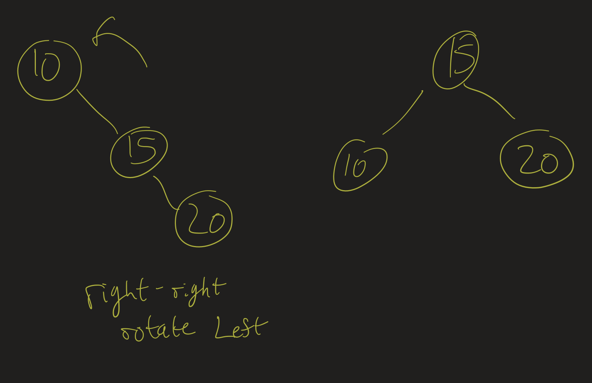
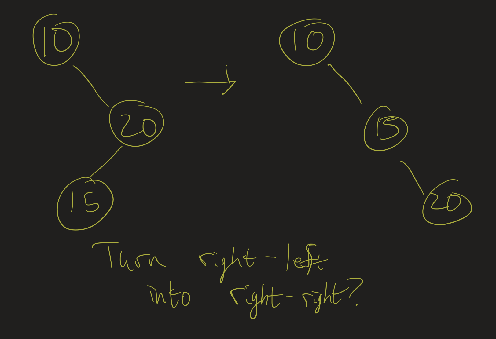
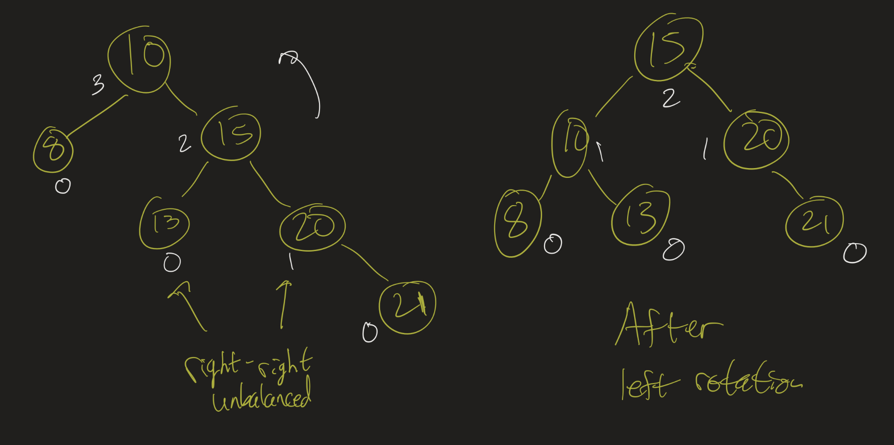

# Data Structures Lesson 7: AVL Trees / Wrap-Up
{:.no_toc}

1. Table of Contents
{:toc}

# Recap on Recursion

<div class="youtube-container">
<iframe src="https://www.youtube.com/embed/Jv9S545Snx4" frameborder="0" allow="accelerometer; autoplay; clipboard-write; encrypted-media; gyroscope; picture-in-picture" allowfullscreen></iframe>
</div>

As there is bound to be confusion about how the recursive steps work in the insert / remove methods for BinaryTree, I made a video where I go through some of the recursive steps and draw out the trees that form.

The (vague) idea (for insert) is:

* if our subtree is null, return a new subtree with the correct data item
* if the data item should go on our left subtree, modify our left subtree:
  * Recursively assume that "insert(subtree.left, data)" will return a valid "left" subtree with the data item inserted in there
  * Assign subtree.left to be the "left" subtree that was created in the previous step.
* Similarly, if the data item should go on our right subtree, modify our right subtree.
* When we are done, we need to return a valid subtree, representing the result of modifying the current subtree with the data item inserted.

# Rotations

Recall the [rotateLeft](https://atharaq.github.io/data-structures/lesson6.html#/left-rotation) and [rotateRight](https://atharaq.github.io/data-structures/lesson6.html#/right-rotation) algorithms. The code for these is quite simple. Try to implement them yourself, using the pseudocode then watch the video where I implement them. The method declaration should be:

```java
    private TreeNode<T> rotateRight(TreeNode<T> subtree)
```

And similarly for rotateLeft.

<div class="youtube-container">
<iframe src="https://www.youtube.com/embed/RN_J6PgmaNg" frameborder="0" allow="accelerometer; autoplay; clipboard-write; encrypted-media; gyroscope; picture-in-picture" allowfullscreen></iframe>
</div>

## Exercise

Before we look at self-balancing trees, let's go through an exercise. Draw the trees we obtain after the following sequence of operations:

* (Create a new tree)
* Insert 0, 4, 2
* Rotate right around 4
* Insert -1, 1
* Rotate left around 0

# Self-Balancing

Last class we talked a bit about how to implement the self-balancing algorithm. The pseudocode is roughly:

```java
// pseudocode
private TreeNode<T> insert(T item, TreeNode<T> subtree) {
   // code to insert
   int balance = height(subtree.left) - height(subtree.right);
   if (balance > 1) {
     // left-left or left-right?
     // what do we do here?
   } else if (balance < -1) {
     // right-right or right-left?
     // what do we do here?
   }
}
```

So what do we do in each of those situations? Two of the situations are fairly simple:

* If the subtree is "right-right" unbalanced, rotate it left around the root of that subtree.
* If the subtree is "left-left" unbalanced, rotate it right around the root of that subtree.



What should we do in the other situations? Hint: see if you can figure out how to turn a "right-left" tree into a "right-right" tree (using rotations).



## Exercise

Before we write any code, as an exercise, draw out the "self-balancing trees" we obtain when we insert in the following orders:

* 1, 2, 3, 4, 5, 6, 7
* 4, 2, 3, 1, 5, 7 ,6
* 2, 1, 5, 3, 4, 6, 7

If you do this right, you might not get the same tree after each of these. But, every tree you get should be "roughly" balanced.

<div class="youtube-container">
    <iframe src="https://www.youtube.com/embed/FECXVU1ZzqI" frameborder="0" allow="accelerometer; autoplay; clipboard-write; encrypted-media; gyroscope; picture-in-picture" allowfullscreen></iframe>
</div>

## Implementation

How do we complete the implementation for the balance method? How do we tell if the tree is "right-right" unbalanced? Suppose we know that the tree is "right" unbalanced, so it's either right-right or right-left. In that case, we check if **height(subtree.right.right) >= height(subtree.right.left)**.



Here is the code snippet:

```java
private TreeNode<T> balance(TreeNode<T> subtree) {
   int balance = height(subtree.left) - height(subtree.right);
   if (balance > 1) {
     // left-left
     if (height(subtree.left.left) >= height(subtree.left.right)) {
       subtree = rotateRight(subtree);
     } else {
       // left-right
       // left rotation turns this into left-left
       subtree.left = rotateLeft(subtree.left);
       // right rotation rebalances
       subtree = rotateRight(subtree);
     }

   } else if (balance < -1) {
     // right-right or right-left?
     // do the opposite as above
   }

   // update height
   subtree.height = 1 + Math.max(height(subtree.left), height(subtree.right));
   return subtree;
}
```

<div class="youtube-container">
<iframe src="https://www.youtube.com/embed/g8htJR5nu98" frameborder="0" allow="accelerometer; autoplay; clipboard-write; encrypted-media; gyroscope; picture-in-picture" allowfullscreen></iframe>
</div>

# Analysis / Wrap-up

What we have seen so far are referred to as **AVL Trees**. These are named after Adelson-Velsky and Landis, who described these trees in a publication in 1962.

AVL Trees have worst case $O(\log(n))$ running time for all of the operations. This is because, by keeping the tree roughly balanced, an AVL tree with $N$ nodes has height $O(\log(N))$. The proof of this is included in my video for this section.

In the 1962 paper, Adelson-Velsky and Landis actually proved that the worst case height of an AVL tree with $N$ nodes is about $1.44 \log(N)$, providing a better bound on the worst case than we look at in my video.

If we know that the height is $O(\log(N))$ is it obvious that the insert / contains / remove methods must run in $O(\log(N))$ time? I'm not sure that this is obvious: the regular "BST insert" method of course requires that you traverse down one branch of the tree, which is at worst $O(\log(N))$ steps in this case, but then there are possibly many rotations after that.

Luckily: if we do rotate, we only do so *up one branch of the tree*! That is, once we have inserted a node, we check its balance, and recursively check if we need to re-balance its parent, or grandparent, etc. Therefore we would backtrack up that same path, possibly rotating each time. At worst, we would need to do $O(\log(N))$ rotations. Each rotation, though, is a constant number of steps (a rotation does not depend on $N$!), and so if it takes $O(\log(N))$ steps to insert a node, and then $O(\log(N))$ steps to backtrack up and rebalance, it still is $O(\log(N))$ steps total.

<div class="youtube-container">
<iframe src="https://www.youtube.com/embed/vKWjts8JJWQ" frameborder="0" allow="accelerometer; autoplay; clipboard-write; encrypted-media; gyroscope; picture-in-picture" allowfullscreen></iframe>
</div>

# Trees Questions

Here are some "challenge" questions for trees. You may or may not wish to cover one of these in your next problem presentation.

## Level-order traversal

Given a tree T, output its nodes in *level-order*. That is, output the root first, then output the root's children, then the grandchildren, etc.

<details>
<summary>Click for a hint</summary>
<p>This has nothing to do with BSTs. This is actually the same problem as the "Counting in binary" problem. Can you see why? How can you think of the "counting in binary" problem as a trees question?</p>
</details>

## AVL Sort

Implement a method in the AVL Tree class which returns a List of its items in sorted order.

```java
public List<T> sort() {
  // your code here

}
```

* Determine the asymptotic running time of this method, if the tree has $N$ elements.
* Determine the asymptotic running time of the following pseudocode:

```java
public static List<T> sort(List<T> list) {
      AVLTree<T> tree = new AVLTree<>();
      for (T item : list) {
        tree.insert(item);
      }
      return tree.sort();
}
```

## Think About

Here are some problems that I expect we do not have the tools to fully solve, but maybe we can think about the solutions a little bit:

* Given a tree (not necessarily a BST, not necessarily even a binary tree), and a node N, output the path (list of vertices visited) from the root to N.
* Given a binary tree (not a BST), a node N and a height $h$, find the ancestor of N that is $h$ levels above N.
* Given a binary tree (not a BST) and two nodes on the tree, determine their lowest common ancestor.

Again, we may need to develop more data structures knowledge before we are able to solve these problems, but it's worth thinking about these now.

## Stacks and Queues

Just for fun:

* Implement a Stack using Queues
* Implement a Queue using Stacks

That is: suppose you have no access to the underlying "list" structure that a stack uses. Can you use the push / pop operations to simulate an "enqueue" / "dequeue"? How? Is the problem easier if you use multiple stacks?
