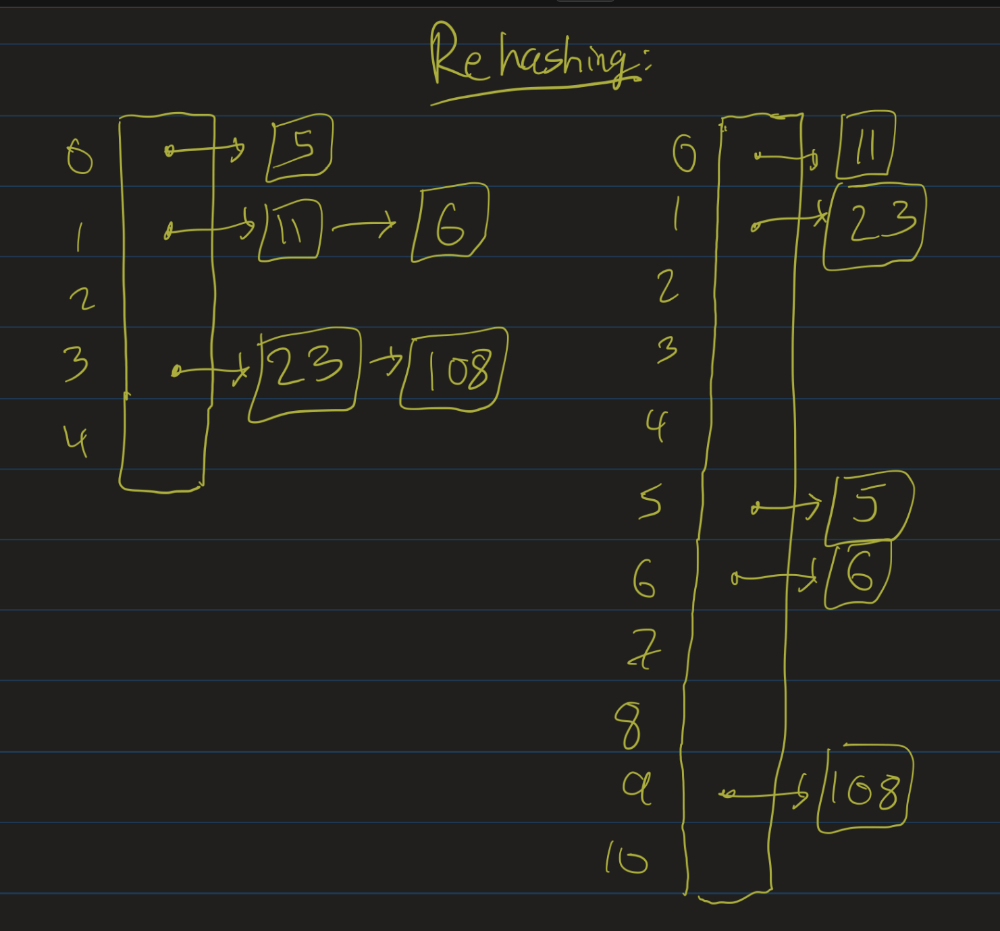

# Data Structures Lesson 9: Hashtables
{:.no_toc}

1. Table of Contents
{:toc}

# Exercise: Sort Uniques

**Problem**: Given a list of 2,000,000 unique 7-digit phone numbers, output them in order using no more than 4MB of additional memory.

Notice: if an integer requires 4 bytes of space, we cannot store all 2,000,000 phone numbers as integers, as that would require about 8MB of space.

Let's look at a simpler version of the problem. Suppose we know that we have a list of 100 integers, and we know all the numbers in our list will be *unique* integers between 1-200. Can you think of how you might output this list in order?

<details>
    <summary>Hint:</summary>
    <p><strong>Uniqueness</strong> is important here. We don't need to move things around in the list, we just need to know, for each $i$ from $1$ to $200$, if $i$ is in the list or now. In other words, we just need to look at the list as a set.</p>
    <p>Can you figure out how to do this in $200$ steps?</p>
    <p>Can you figure out how to do this with 200 bits of memory? Further hint: one bit can be used to answer a single yes/no question.</p>
    <p>Can you figure out how to generalize this to the case where we are working with 2 million unique integers between 1000000 and 9999999?</p>
</details>

# Hashing Idea

<div class="youtube-container">
<iframe src="https://www.youtube.com/embed/aMC0JtEeDXc" frameborder="0" allow="accelerometer; autoplay; clipboard-write; encrypted-media; gyroscope; picture-in-picture" allowfullscreen></iframe>
</div>

As we saw last time, if we want to implement a set of integers, and all we care about is whether or not an object is in the set, one idea we can use is to create a large array of booleans, and just look up whether or not the corresponding element of the array is true. This would be $O(1)$ for all operations.

Of course, this does have several caveats, as we started to think through last time:

1. What if we don't know the possibly range of the integers we are using?
2. More generally, what do we do for other data types?

So we can generalize this approach. Instead of just keeping a large array of booleans, we just keep a large array of generic objects, of size $s$. Then we use a **hash function**, $f : T \to [0, s-1]$, hopefully easy to compute, which converts from the generic data type to an index in the table.

Then to insert into the table, we set `table[f(item)] = item`: that is, we put in an object into the array. To check if an item is in the table, we check if `table[f(item)] == item`. To remove from the table, we set `table[f(item)]` to null.

Technically, this approach only works if $f$ is a one to one function. That is, if whenever $x$ and $y$ are two distinct objects of type $T$, then $f(x) \neq f(y)$. In practice, this is impossible to guarantee, particularly if we don't know the size of the table ahead of time. But broadly speaking, this is the idea behind a **hashtable**, which is an important data structure that will be useful to solving many different types of problems.

# Hash Functions

<div class="youtube-container">
<iframe src="https://www.youtube.com/embed/4FSjuvDJi5E" frameborder="0" allow="accelerometer; autoplay; clipboard-write; encrypted-media; gyroscope; picture-in-picture" allowfullscreen></iframe>
</div>

Suppose we have a table of size $s$. Let's make some definitions:

* **key**: the "lookup" value used as input to the hash function.
* **hash function**: a function which maps keys to a value between $0$ and $s - 1$.

For example, a simple hash function for integer keys would be $h(x) = x$ **mod** $s$. In general, for this to be a good hash function, we want $s$ to be a prime number. I go through the explanation for why in the video above. In general, though, we want our hash function to output values that are **uniformly distributed**: that is, for each $i < s$, the probability that a randomly chosen object hashes to $i$ should be $\frac{1}{s}$ (so there isn't a greater likelihood of hashing to any one particular hash code).

For words, a simple idea would be to think of a (lower-case) word as a "base 27" number, with a representing the base-27 digit 1, and z representing the base-27 digit 26. So "ab" would be $1 \times 27 + 2$. Of course, this does not work for actual Strings in Java, since Strings can have characters that are not a-z. [The actual String hashCode](https://docs.oracle.com/en/java/javase/15/docs/api/java.base/java/lang/String.html#hashCode()) uses a similar idea, though: take the "integer" value of each character, and multiply it by a power of $31$.

# Collisions

<div class="youtube-container">
<iframe src="https://www.youtube.com/embed/6fMx2RroO0g" frameborder="0" allow="accelerometer; autoplay; clipboard-write; encrypted-media; gyroscope; picture-in-picture" allowfullscreen></iframe>
</div>

A **collision** occurs when two objects hash to the same value (or the same index in the array). Suppose we insert $N$ items into a hashtable of size $s$. What is the probability that there is a collision? This is a hard question to answer, so let's go through some examples.

Suppose $N = 2$ and $s = 4$ (not a prime number, but let's just look at this as an example). Then the first object we insert can go into any of the 4 positions, and, assuming that the hash function distributes keys randomly, the second object will collide with the first one with probability $\frac{1}{4}$.

Suppose $N = 3$ and $s = 9$. Then we can put the first object into any position we like. Then the probability that there is no collision is $\frac{8}{9} \times \frac{7}{9}$, which is $\frac{56}{81}$. Therefore, the probability of (at least one) collision is $\frac{25}{81}$.

Suppose $N = 4$ and $s = 9$. Similarly, the probability of not having a collision is $\frac{8}{9} \times \frac{7}{9} \times \frac{6}{9}$, which is $\frac{336}{729}$. The probability of a collision, therefore, is $\frac{393}{729}$, or about 54%.

What if $N = 23$ and $s = 365$? This is the famous [birthday problem](https://en.wikipedia.org/wiki/Birthday_problem)! In a room with 23 people, there is a greater than 50% chance that two of them have the same birthday! (What does this have to do with hash collisions? What's the "hash function" here? What are the "keys" here?)

Even though $N$ is much smaller than $s$, there is a greater than 50% chance of a collision here! In general, if $N > \sqrt{s}$, there is a good chance of a collision.

# Separate Chaining

<div class="youtube-container">
<iframe src="https://www.youtube.com/embed/V3sj2TKagj0" frameborder="0" allow="accelerometer; autoplay; clipboard-write; encrypted-media; gyroscope; picture-in-picture" allowfullscreen></iframe>
</div>

So what do we do when we inevitably have a collision? There are two main strategies for handling this: **separate chaining** and **open addressing**.

As before, let $N$ be the number of elements inserted into the table and $s$ the size of the table. Let $\lambda = \frac{N}{s}$. $\lambda$ is referred to as the **load factor** of the table. If $\lambda$ is small, we have few collisions but waste a lot of space. Conversely, if $\lambda$ is large, we don't waste too much space, but we will likely have to deal with collisions.

For a separate chaining hashtable, instead of just a large array of elements, we keep a large array of **lists**. We think of each element of the array as being a *bucket* (or a *bin*). Elements which hash to the same value are put in the same "bucket". That is: when we insert $x$ into a table, we compute its hashcode $h$, and then add it to the $h$-th list.


Inserting into the table, then, is $O(1)$, since inserting into a linked list is $O(1)$. Checking if an element is in the table, though, might not be. In the worst case, it could be $O(N)$! This would happen if the keys are not nicely distributed, and everything ended up in the same bucket.

On average, if the keys are randomly distributed, then checking if an element is in the table would take about $\lambda$ steps, since there would be about $\lambda$ objects in each bucket. If we can control $\lambda$ (prevent it from growing without bound), we can ensure that this is constant.

# Rehashing

One way to control the load factor is to keep track of a threshold, and if $\lambda$ ever gets larger than that threshold, we create a new, larger hashtable, and re-insert everything into that table. Notice that objects that were in the same bucket in the smaller table will likely not be in the same bucket in the larger table.



Generally, for our table size, we would try to double the current size, but make sure that we still use a prime number. That is, we look for the next prime number $p > 2s$. Since this would not happen too often, we would get amortized $O(1)$ inserts.

# Open Addressing

<div class="youtube-container">
<iframe src="https://www.youtube.com/embed/BgU5fObyZq4" frameborder="0" allow="accelerometer; autoplay; clipboard-write; encrypted-media; gyroscope; picture-in-picture" allowfullscreen></iframe>
</div>

The other main method for resolving collisions is called open addressing. In this method, if the entry we want to put our key in is filled, we look for another open entry.

For example, the simplest idea would be to try to insert it into the very next entry. This is the method called **linear probing**. For example, suppose our table size is 7 and we want to insert the integers 16 and 2. Since 16 **mod** 7 = 2, we first put 16 in position 2. Since 2 **mod** 7 is also 2, we try to put 2 in position 2, but this fails. So we probe, and try to put 2 in position 3. If that's open, we are done!


More generally, the idea is to use another function $f(i)$, and then look at the sequence $h_0(x), h_1(x), h_2(x) \ldots$, defined by $h_i(x) = h(x) + f(i)$. The situation described above is when $f(i) = i$: that is:

* $h_0(x) = h(x)$
* $h_1(x) = h(x) + 1$
* $h_2(x) = h(x) + 2$

etc.

If $f$ is a linear function, like $f(i) = i$, we refer to this strategy as "linear probing". If $f$ is a quadratic function, like $f(i) = i^2$, we refer to this strategy as "quadratic probing". For both of these, we generally want $\lambda$ to be small (and therefore will need to rehash eventually), usually less than 0.5.

## Linear Probing

With a linear probing hashtable, if $s > N$ we can always find an open spot in our table. But it is possible that the search would take unreasonably long.

The main drawback of linear probing is **clustering**. This is the tendency of keys to cluster around a few spots in a hashtable. If a hashtable has some clustering already, then it is likely to cause even more clustering, as [this interactive demonstration shows](https://opendsa-server.cs.vt.edu/OpenDSA/Books/CS3/html/HashCSimple.html#the-problem-with-linear-probing).

On average, the number of steps it takes to insert into a linear probing hashtable is $\frac{1}{2}(1 + \frac{1}{(1 - \lambda)^2})$. To search for an element in a hashtable, if the element is not found, it is the same as inserting it (an insert roughly corresponds to doing an unsuccessful probe of the table, and then putting the object into that last place). If the element is found in the table, on average it will take $\frac{1}{2}(1 + \frac{1}{1 - \lambda})$ probes.

## Quadratic Probing

<div class="youtube-container">
<iframe src="https://www.youtube.com/embed/Y8MwaHJXeTw" frameborder="0" allow="accelerometer; autoplay; clipboard-write; encrypted-media; gyroscope; picture-in-picture" allowfullscreen></iframe>
</div>

Quadratic probing often uses the strategy $f(i) = i^2$. There is a major problem with quadratic probing, however.

**Exercise**: Let $s = 7$. Insert 0, 1, 2, 4, 14 using the strategy $f(i) = i^2$. What happens?

<details>
    <summary>Spoilers (if you didn't watch the video)</summary>
    <p>Since 14 mod 7 = 0, we try to insert it into position 0. That doesn't work.</p>
    <p>Since $f(1) = 1$, we then try to insert it into position 0 + 1. That doesn't work.</p>
    <p>Since $f(2) = 4$, we try to insert 14 into position 0 + 4. That doesn't work.</p>
    <p>Since $f(3) = 9$, and 9 mod 7 is 2, we try to insert 14 into position 2. That doesn't work.</p>
    <p>Since $f(4) = 16$ and 16 mod 7 is 2, we again try position 2.</p>
    <p>Since $f(5) = 25$ and 25 mod 7 is 4, we again try position 4.</p>
    <p>Since $f(6) = 36$ and 36 mod 7 is 1, we again try position 1.</p>
    <p>Since modular arithmetic is cyclical, trying anythingn above 6 won't change the result. We will never find an open spot!</p>
</details>

That is: if $\lambda > .5$ or the table size is not prime, it is possible that new elements might not be able to be inserted. So it is **necessary** that $\lambda \leq .5$ when we use quadratic probing. One can prove that if $s$ is prime and $\lambda \leq .5$, then quadratic probing will always successfully be able to find an open spot in the table.

## Removals

Suppose $s = 7$ and we insert 2 and 16. If we delete 2, how will the table know that 16 is in the table?

When we check the table for 16, we would see that there is nothing at position 2. Shouldn't that tell us not to probe?

The solution to this problem is **lazy deletion**. Instead of keeping track of just the keys, we keep track of the keys and a flag for whether or not that key is "active". If that flag is false, we think of it as having been "removed" from the table.


Then when we look for 16 in the table, we see that we do need to probe (until we either find 16 or see a "null" value). Similarly, if we look for 9 in the above table, we would check position 2, see that it is filled, check position 3, and then check position 4, and since we see a null, we know that 9 is not in the table.

# Map ADT

Hashtables are really nice ways to implement the Set and Map abstract data types. We discussed the [Set ADT](https://atharaq.github.io/data-structures/lesson8.html#/set-adt) last time. The Map ADT essentially asks the question: why do we insist that arrays must use integer indices? What if we generalized that so that our index could be any object?

A **map** is a set of key-value pairs. Therefore, one could implement a Map using a Set (though this is not what usually happens in practice). Maps support the following operations:

* `void put(K key, V value)`
* `V get(K key)`
* `boolean containsKey(K key)`

Hashtables are a really nice way to handle this. We use the key and the hashcode of the key to figure out where to put the key-value pair, and then insert the key-value pair into the appropriate bucket. This is implemented in Java using the `HashMap<K, V>` class (note that the generic type of the key does not need to be the same as the generic type of the value). For example:

```java
HashMap<String, Integer> namesToAgesMap = new HashMap<>();
namesToAgesMap.put("Bob", 27);
namesToAgesMap.put("Athar", 29); // yeah right
namesToAgesMap.put("James", 55);

// some other code
public int getAge(Map<String, Integer> agesMap, String name) {
  if (agesMap.containsKey(name)) {
    return agesMap.get(name);
  }
  // if we don't know their age:
  return -1;
}
```

There is also a `TreeMap<K, V>` as well. It supports the same operations, but uses a binary search tree instead of a hashtable.

Similarly, there are `HashSet<E>` and `TreeSet<E>` classes which implement the Set interface. Interestingly, HashSets and TreeSets use HashMaps and TreeMaps in their implementations (rather than the other way around).

## equals and hashCode

As mentioned, the standard Java library provides good implementations of the Map and Set ADTs using a hashtable. These are generic, and so can work with any class (including classes that you define), provided that `equals` and `hashCode` are implemented correctly. `equals` and `hashCode` are methods defined in the `Object` class. When one defines their own class, they should override these methods.

* `public boolean equals(Object o)` returns **true** if o is "equal" to your object, and **false** otherwise.
* `public int hashCode()`. Two objects that are equal (according to `equals`) **must** return the same hashCode; otherwise, HashMap might not work correctly.
    * Note: this is an "if-then" statement. If two objects are equal, they must have the same hashCode. The other direction is not necessary: two objects that have the same hashCode might not be equal.
    * We hope that hashCode distributes objects uniformly across integers. That is, the hashCode of an object should be roughly random.

# Problems

Using a HashMap and/or a HashSet, one can come up with good implementations for some of the following problems:

## Remove Duplicates

**Problem**: Given a list of data, remove all duplicates from the data. That is, if your list is [1, 2, 1, 4, 3, 1, 3, 4, 1, 2], you should return [1, 2, 4, 3].

Notice that the list returned should have the elements listed in the order that they *first* appeared in the original list.

```java

private static final int SIZE = 100;

public static void main(String[] args) {
    List<Integer> list = new ArrayList<>(SIZE);

    Random r = new Random();
    int num;

    for (int i = 0; i < SIZE; i++) {
        int num = r.nextInt(SIZE);
        list.add(num);
        System.out.println("Added " + num + " to list.");
    }

    System.out.println("Added " + SIZE + " random numbers");
    list = removeDuplicates(list);
    System.out.println("Removed the duplicates");
    System.out.println(list.size());
}

private static List<Integer> removeDuplicates(List<Integer> list) {
    // TODO: Change this implementation to return a new list
    // that contains all unique elements of the list
    return list;
}
```

There is a simple, naive implementation that uses nested for loops that runs in $O(n^2)$ time. Can you improve on that implementation by using a data structure? Try this out on your own,

<details>
<summary>Hint:</summary>
<p>Before inserting, check if you have already inserted. Is there a way to store that information so that checking if you inserted is $O(1)$?</p>
<p>Another hint: what is today's lesson about?</p>
</details>

What's the running time of your improved solution?

## Path to Node / Ancestors

These problems were mentioned [in last week's notes](https://atharaq.github.io/data-structures/lesson7.html#think-about):

* Given a tree (not necessarily a BST, not necessarily even a binary tree), and a node N, output the path (list of vertices visited) from the root to N.
* Given a binary tree (not a BST), a node N and a height $h$, find the ancestor of N that is $h$ levels above N.
* Given a binary tree (not a BST) and two nodes on the tree, determine their lowest common ancestor.

All of these are slightly different versions of the same problem. If you can solve the first one, you can have an idea of how to solve the second one.

As a hint for the first one, recall the "level-order traversal" of the tree we discussed last class. In order to print out all the nodes in a tree, we use a queue. Here is some pseudocode:

```java
enqueue(root)
while (queue is not empty) {
    dequeue a node
    print the node's data
    enqueue the node's children
}
```

Can you modify this algorithm to keep track of the path from the root to a node?

<details>
    <summary>Hint:</summary>
    <p>There are multiple possible ideas that might work here. The simplest one to implement is if each node keeps track of which node enqueued it. Then modify the while loop to exit as soon as we dequeue the node N that we are looking for.</p>
    <p>Then if each node keeps track of what enqueued it, we can "backtrack" from the node back up to the root.</p>
    <p>So how should a node keep track of who enqueued it? Use a map!</p>
</details>

Once you know how to determine the path from the root to a node, it's not hard to walk $h$ steps on that path to find its ancestor. Similarly, if you have two nodes and you have the paths from the root to each of those nodes, you can "walk along" those paths to see if you can find where the paths diverge.

## Shortest Path Problems

There are many "shortest path" problems that can be solved using a similar idea to the problems above. We will discuss, on Monday, one such variation of this problem, which I asked in CS2 last spring:


Given two positions on an empty chessboard, find the optimal (shortest) sequence of valid knight moves that one can take to travel from one position to the other. A **knight move** on a chessboard is a move where we move over by two columns and one row, or two rows and one column.

How might we solve this problem using ideas similar to the ones for the previous set of problems? Think through a similar idea: keep a queue, enqueue the start position, and whenever you dequeue a position, enqueue in its "next" positions (while keeping track of which position enqueued it). There are some subtleties, but using  we have access to now give us a much more robust solution that allows us to find the **shortest** path every single time.

This algorithm can be modified to handle many different types of shortest path problems, as we will discuss on Monday.
