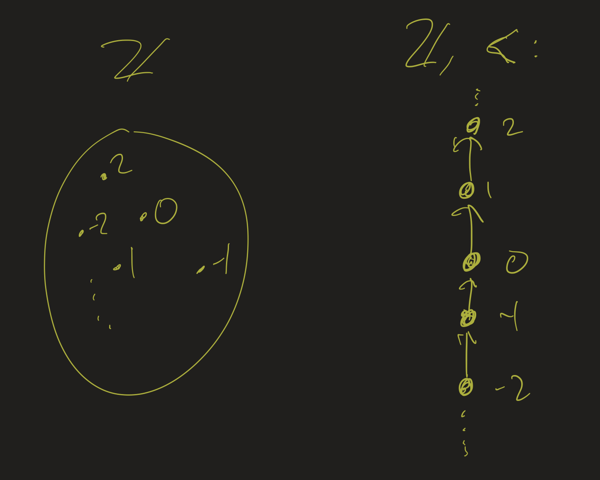
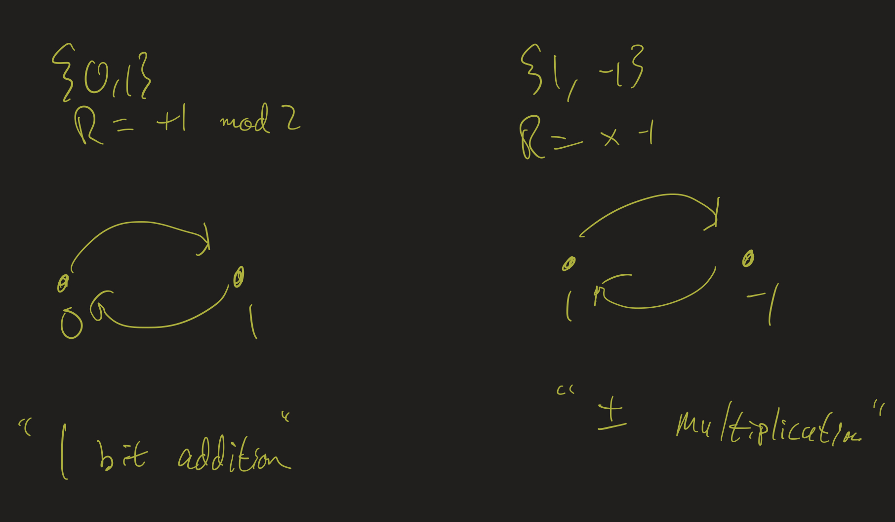
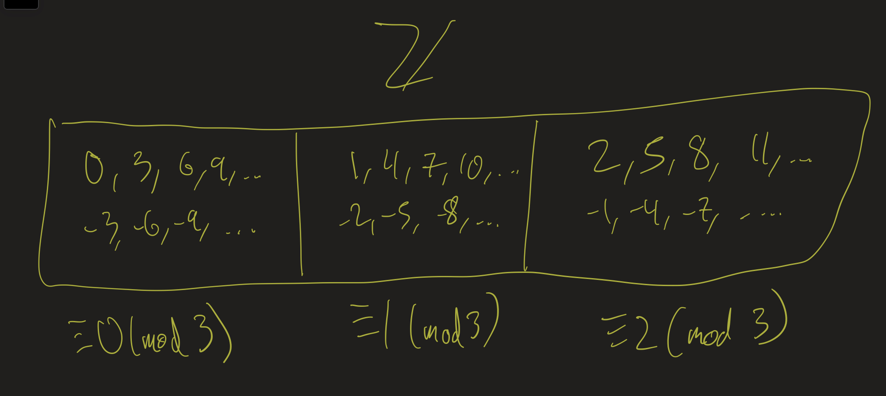

# Discrete Mathematics Lesson 17: Relations
{:.no_toc}

1. Table of Contents
{:toc}

# Upcoming

* Exam 2 posted today, due **next Friday** (4/21)
* Problem Presentations next week (4/17, 4/20).
* Problem Set 5: given 4/17, due 4/25 (Tuesday)
* Problem Set 6: given 4/24, due 5/1
  * Lowest grade dropped
* Final Project (Presentation + Paper / Group)
  * Choose a topic by 4/24
  * Group Presentation in class on 5/1
  * Paper due as a group 5/8
* Final Exam: given 5/1, due 5/8

# Video

Watch the recording of the online lecture I gave in Fall 2020 on this topic. It's about one hour. You can follow along with the notes below, or with the [slides from that lecture](https://atharaq.github.io/discrete/lesson16.html).

<iframe src="https://www.youtube.com/embed/wtEbpOD1Q-E" title="YouTube video player" frameborder="0" allow="accelerometer; autoplay; clipboard-write; encrypted-media; gyroscope; picture-in-picture; web-share" allowfullscreen></iframe>

You may also wish to consult the text [An Infinite Descent into Pure Mathematics](https://infinitedescent.xyz/). Below we mostly cover chapter 5 on relations. Later we will look at section 11.1.

# Relations

**Definition**: Let $X$ and $Y$ be sets. A **binary relation** $R$ from $X$ to $Y$ is a subset of $X \times Y$, that is, a set of ordered pairs $(x, y)$ where $x \in X$ and $y \in Y$.

* $X$ is the **domain** of $R$, $Y$ is the **codomain**
* If $X = Y$, we say $R$ is a "relation on $X$"
* Can think of it as a formula $R(x, y)$
* Write $x \mathrel{R} y$ for $(x, y) \in R$ or $R(x, y)$

## Ordering

Classical example: $x, y \in \mathbb{Z}$, $R$ is $<$:

* $0 < 1$
  * "How are the numbers 0 and 1 related? 0 is less than 1"
* Adds *structure* to $\mathbb{Z}$:
* Sets have no structure: just elements
  * Relations add structure: how are elements related to each other?

## Set vs Relation

Integers as a set vs integers as a relation: 

Two element relations:

## Rock, Paper, Scissors

Let $X = \{$ rock, paper, scissors $\}$. Let $x \mathrel{R} y$ mean "$x$ beats $y$ in a game of rock/paper/scissors". Describe $R$ completely:

Solution

<ul>
<li>rock beats scissors</li>
<li>scissors beats paper</li>
<li>paper beats rock</li>
</ul>

## Properties of Relations

* Reflexive: $\forall x (x \mathrel{R} x)$
* Symmetric: $\forall x \forall y (x \mathrel{R} y \rightarrow y \mathrel{R} x)$
* Transitive: $\forall x \forall y \forall z (x \mathrel{R} y \wedge y \mathrel{R} z \rightarrow x \mathrel{R} z)$
* Anti-symmetric: $\forall x \forall y (x \mathrel{R} y \wedge y \mathrel{R} x \rightarrow x = y)$
* Asymmetric: $\forall x \forall y (x \mathrel{R} y \rightarrow \lnot (y \mathrel{R} x))$

## Examples: Reflexive

Let $X$ be the set of all people. Are the following relations reflexive: $\forall x (x \mathrel{R} x)$?

* "$x$ and $y$ are siblings."
* "$x$ and $y$ share a parent."
* "$x$ and $y$ are the same age."
* "$x$ is older than $y$."
* "$x$ is no younger than $y$"

## Examples: Symmetric

Let $X$ be the set of all people. Are the following relations symmetric: $\forall x \forall y (x \mathrel{R} y \rightarrow y \mathrel{R} x)$?

* "$x$ and $y$ are siblings."
* "$x$ and $y$ share a parent."
* "$x$ and $y$ are the same age."
* "$x$ is older than $y$."
* "$x$ is no younger than $y$"

## Examples: Transitive

Are the following relations transitive: $\forall x \forall y \forall z (x \mathrel{R} y \wedge y \mathrel{R} z \rightarrow x \mathrel{R} z)$?

* $X = \mathbb{Z}$, $R$ is: $x \leq y$.
* $X = \mathbb{Z}$, $R$ is: $x \mid y$
* $X = \{$ rock, paper, scissors $\}$, $R$ is "$x$ beats $y$".
* $X$ is the collection of all finite subsets of $\mathbb{N}$, $R$ is "$|x| = |y|$".

# Equivalence Relations

Let $X$ be a set. A relation $\sim$ on $X$ is called an **equivalence relation** if it is reflexive, symmetric, and transitive.

## Definition

That is, $\sim$ is an equivalence relation on $X$ if:

* For all $x \in X$: $x \sim x$.
* For all $x, y \in X$, if $x \sim y$, then $y \sim x$.
* For all $x, y, z \in X$, if $x \sim y$ and $y \sim z$ then $x \sim z$.

The idea of an equivalence relation generalizes the following notions:

* $x = y$
* $x \equiv y$ (mod $n$) (Exam 2 Q2)
* Cardinality: $|A| = |B|$
* Any notion of "sameness" (congruent shapes, similar triangles, etc)

Congruence modulo 3 is an equivalence relation:

## Equivalence Classes

* Generalizing the notion of "congruence classes".
* Let $X$ be a set, $\sim$ an equivalence relation.
* Let $x \in X$. Then $[x]_{\sim} = \{ y \in X : x \sim y \}$ is the **equivalence class of $x$**.
* The **quotient** of $X$ by ${\sim}$ is the set $X / {\sim} = \{ [x]_{\sim} : x \in X \}$.
* $x$ is called a **representative** of its equivalence class $[x]_{\sim}$.
  * One equivalence class can have many representatives.

## Examples

* $X = \mathbb{Z}$, $\sim$ is $\equiv$ (mod 2).
  * Equivalence classes: evens and odds. $X / {\sim} = \{ E, O \}$.
* $X = \mathbb{Z}$, $\sim$ is $\equiv$ (mod 10).
  * Equivalence classes?
  * $x \equiv 0$ (mod 10) if its last digit is a 0.
  * $x \equiv 1$ (mod 10) if its last digit is a 1.
  * etc.
  * $X / {\sim} = \{ [0]_{\sim}, [1]_{\sim}, \ldots, [9]_{\sim} \}$

## Squares

Let $X = \mathbb{Z}$, and $x \sim y$ if $x^2 = y^2$. **Claim**: $\sim$ is an equivalence relation.

* Sketch a proof.
* What is the equivalence class of $0$? What is the equivalence class of $1$?
* How many equivalence classes are there?
* Find a good set of representatives.

Solution

<ul>
<li>Proof: Each follows from reflexivity, symmetry, and transitivity of =</li>
<li>$[0]_{\sim} = \{ 0 \}, [1]_{\sim} = \{1, -1 \}$</li>
<li>One equivalence class for each non-negative number!</li>
<li>Can represent using the elements of $\mathbb{N}$!</li>
</uL>

## Sine

Let $X = \mathbb{R}$, and $x \sim y$ if $\sin(x) = \sin(y)$. **Claim**: $\sim$ is an equivalence relation.

* Sketch a proof.
* What is the equivalence class of $0$? What is the equivalence class of $\pi/2$?
* Find a good set of representatives.

Solution

<ul>
<li>Proof: Again follows from reflexivity / symmetry / transitivity of =</li>
<li>$[0]_{\sim} = \{0, \pi, 2\pi, -\pi, -2\pi, \ldots \} = \{ k\pi : k \in \mathbb{Z} \}$. For $\pi/2$: $[\pi/2]_{\sim} = \{ \pi/2 + 2\pi\cdot k : k \in \mathbb{Z} \}$.</li>
<li>Before answering, look at the graph below:
</ul>

<iframe src="https://www.desmos.com/calculator/nu2npsc6le?embed" style="border: 1px solid #ccc" frameborder=0></iframe>

Notice that every $y$-value on the graph of $y = \sin(x)$ appears in the interval from $x = -\pi/2$ to $x = \pi/2$. Therefore, a good set of representatives would be the interval $[-\pi/2, \pi/2]$.

