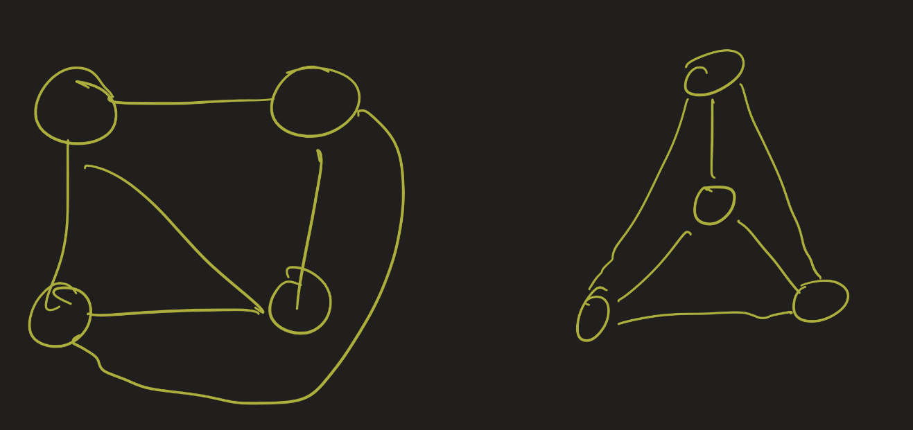

# Discrete Mathematics Lesson 21: Automorphisms, Connectivity, and Planarity
{:.no_toc}

1. Table of Contents
{:toc}

Before we begin, try out these problems on graph isomorphisms, and take a look at the video if you're stuck.

Are these graphs isomorphic?

Are these graphs isomorphic? (This one will be on the problem set. The video should help you get an idea of how you might find an isomorphism.)

<iframe src="https://www.youtube.com/embed/phXRMu8G9dA" frameborder="0" allow="accelerometer; autoplay; clipboard-write; encrypted-media; gyroscope; picture-in-picture" allowfullscreen></iframe>

# Automorphisms

<iframe src="https://www.youtube.com/embed/0kTqvLPiaow" frameborder="0" allow="accelerometer; autoplay; clipboard-write; encrypted-media; gyroscope; picture-in-picture" allowfullscreen></iframe>

An **automorphism** of a graph $G = (V, E)$ is an isomorphism from $G$ to itself. One example: the identity function $id : V \to V$, given by $id(v) = v$ is always an automorphism! This is because, of course, if $(u, v)$ is an edge, then so is $(id(u), id(v))$, and vice versa, since the identity function does nothing to the vertices.

Last class we looked at the star graph $S_3$

It has 6 automorphisms, each representing a kind of geometric symmetry exhibited by this graph:

* 3 rotations (including the identiy, when we rotate by 360 degrees)
* 3 reflections

So often these geometric notions of symmetry give rise to automorphisms!

## Rigid Graphs

Some graphs don't have many automorphisms. A graph whose only automorphism is the identity function is called **rigid**. This graph is rigid:

Notice that vertex 0 is the only vertex of degree 1, so for any automorphism $f$, $f(0) = 0$.

Since vertex 1 is the unique vertex adjacent to 0, it must be the case that $f(1) = 1$ (otherwise, $(0,1 )$ is an edge but $(f(0), f(1))$ would not be).

Now let's look at vertex 1's neighbors: 2 and 3. These must still be neighbors of 1 after an automorphism, since $f(1) = 1$. But $f(2) \neq 3$, since 2 and 3 have different degrees. This means $f(2) = 2$ and $f(3) = 3$.

Now all that's left are 4 and 5, and again $f(4) \neq 5$ since 4 and 5 have different degrees. Taking all of this into account, the only possibility is that $f(v) = v$ for each $v \in \\{ 0, 1, 2, 3, 4, 5 \\}$.

## Automorphisms of Complete Graphs

On the other hand, some graphs have lots of automorphisms. A graph with $n$ vertices has $n!$ permutations of its vertices. In general, not all of these are automorphisms, but for **complete graphs** this is the case.

The graph $K_4$, the complete graph on 4 vertices, is given below:

Any bijection from $\\{1, 2, 3, 4 \\}$ to itself is an automorphism, because it's just always true that $(x, y)$ is an edge for any $x \ neq y \in V$. For example, here is the result of the graph after the automorphism which flips 1 and 2, but keeps 3 and 4 the same:

In general, some of these bijections might not preserve a kind of geometric symmetry. Perhaps there is no geometric way to move the graph as a whole around, so that 1 and 2 flip positions but 3 and 4 don't, but this is besides the point for graph theory. Graph theory studies the abstraction where we only care about adjacencies and non-adjacencies, rather than the geometric shape.

That is: every geometric symmetry is an automorphism, but not every automorphism needs to be a geometric symmetry.

# Connectivity

<iframe src="https://www.youtube.com/embed/UkKP50TeK60" frameborder="0" allow="accelerometer; autoplay; clipboard-write; encrypted-media; gyroscope; picture-in-picture" allowfullscreen></iframe>

The notion of **connectivity** is fairly simple to observe from a graph itself:

To formalize this, let's make some definitions:

**Definition**: Recall that a **walk** in a graph is a sequence of vertices in which consecutive vertices are adjacent. A **path** is a walk with no repeated vertices. A graph $G$ is **connected** if each pair of vertices has a path between them.

Another important notion about graphs is the idea of **components**:

**Definition**: A **component** of a graph is a maximal subset of the vertices closed under paths. That is, $C \subseteq V$ is a component if for each $x \in C$, if $y \in V$ is such that there is a path from $x$ to $y$, then $y \in C$.

## Isomorphisms

Isomorphisms preserve many properties of graphs. Here I mention two theorems: isomorphisms preserve connectivity, and isomorphisms preserve connected components.

**Theorem**: Suppose $G = (V_G, E_G)$ is connected. Then if $H = (V_H, E_H)$ is isomorphic to $G$, then $H$ is connected also.

Instead of a formal proof, I'll just give the idea: let $f : V_H \to V_G$ be the isomorphism. We have to show that we can find a path between any two vertices in $H$. So let $v_1$ and $v_2$ be two vertices in $H$. Then look at $f(v_1)$ and $f(v_2)$, which are vertices in $G$. Since $G$ is connected, you find a path between them. For each vertex $v$ on that path, since $f$ is a bijection, there is a vertex in $H$ that is mapped to $v$, and so looking at those vertices in $H$ will give you a path between $v_1$ and $v_2$.

**Theorem**: Suppose $G = (V_G, E_G), H = (V_H, E_H)$, and $G \cong H$. Then $G$ and $H$ have the same number of connected components.

Again, I'll just give a sketch of the proof. Let $f : V_G \to V_H$ be an isomorphism. Let $C_1, C_2, \ldots, C_n$ be the connected components of $G$. This is, as we mentioned earlier, a partition of the vertices of $G$. Look at the corresponding partition of the vertices of $H$: that is, look at $f(C_1) = \{ f(v) : v \in C_1 \}$, $f(C_2) = \{ f(v) : v \in C_2 \}$, etc.

The claim is that these sets partition the vertices of $H$, and that these are all connected components. The fact that they partition the vertices is because $f$ is a bijection: so every element of $H$ will show up exactly once as $f(v)$ for some $v \in V_G$. The fact that these are connected components is a result of $f$ being an isomorphism: if $v, w$ are in the same connected component of $G$, then there is a path from $v$ to $w$. Using the isomorphism, you can find a path from $f(v)$ to $f(w)$.

## Complements

Given two graphs, of course if one graph is connected and the other isn't, the graphs are obviously not isomorphic. Less obvious is that we can look at the *complement* of the graphs to determine if the graphs are isomorphic.

**Definition**: Let $G = (V, E)$ be a simple, undirected graph. The **complement** (or **edge-complement**) graph $\bar{G} = (V, \bar{E})$ is the graph with the same vertices $V$ such that there is an edge $(u, v) \in \bar{E}$ if and only if $(u, v) \not \in E$ (that is: adjacencies in the old graph become non-adjacencies in the new graph, and non-adjacencies become adjacencies).

Consider the following graphs:

These both have 6 vertices, and each vertex has degree 3, so it's not obvious if they are isomorphic. Maybe you can spot something right away, but if you can't, one thing we can do is draw their complements:

Now it should be obvious: the complement of one graph is connected while the other is not. Therefore the graphs are not isomorphic.

# Planarity

<iframe src="https://www.youtube.com/embed/QuKjAa8rFo8" frameborder="0" allow="accelerometer; autoplay; clipboard-write; encrypted-media; gyroscope; picture-in-picture" allowfullscreen></iframe>

A graph is called **planar** if it can be drawn on a plane without edge crossings. To be clear: it may be possible that a graph is planar, but it looks like it has edge crossings. For example:

This is $K_4$, the complete graph on 4 vertices. We can draw this without edge crossings in two ways:

There is a more general question than planarity: given a surface $S$ and a graph $G$, can $G$ be drawn on $S$ without any edge crossings? This is a question that intersects the field of algebraic topology, which studies abstract notions of surfaces. We won't get into this for now, but if you are interested, this may be an exciting topic to research as a group or as part of an independent senior project.

For now, we will show that the graphs $K_{3,3}$ and $K_5$ are not planar. We will give a geometric explanation for $K_{3,3}$, and a more algebraic one for $K_5$.

## $K_{3,3}$

No matter how we draw this graph, we have a 4 cycle 0-1-2-3, and so let's draw that first.

Then vertex 4 is either on the inside or outside of the cycle. It actually makes no difference, the argument will work either way, so let's draw it on the inside.

Notice we now have three regions that we could possibly put vertex 5 in. I've labeled these A, B, and C. Consider each of the cases:

* A: if vertex 5 goes here, then it will not be able to connect to 4 without crossing an edge.
* B: if vertex 5 goes here, it will not be able to connect to 2 without crossing an edge.
* C: if vertex 5 goes here, it will not be able to connect to 1 without crossing an edge.

So there is no way to place vertex 5. There was one choice we made earlier: to put 4 on the inside of the cycle. I suggest trying this again, but putting 4 on the outside, and seeing which regions you end up with this time. You will still find it impossible to place vertex 5.

## $K_5$

Next we look at the complete graph $K_5$. This proof will be more algebraic. It turns out that if a graph can be drawn in a planar way, there is a relationship between the number of vertices, edges, and faces that the graph has. By "faces", here we mean "regions enclosed by a curve":

Note that we count the outside region as a face also.

For $K_4$, we have 4 vertices, 6 edges, and 4 faces. In general, a graph drawn on the plane without edge crossings will satisfy Euler's formula: $\|V\| - \|E\| + \|F\| = 2$. [The textbook provides a nice justification](http://discrete.openmathbooks.org/dmoi3/sec_planar.html) of this fact.

So we don't know how many faces $K_5$ has since we haven't drawn it without edge crossings, but we can figure out how many faces it *should* have, if we were able to do so. $K_5$ has 5 vertices and 10 edges, and so the formula says $5 - 10 + \|F\| = 2$ means that there should be 7 faces.

Notice, though, that a face has to be bounded by at least three edges:

That means we need at least 3 edges per face. But, each edge borders two faces (remember, we always count the outside region as a face):

Putting these two facts together means $2\|E\| \geq 3\|F\|$. In this case, with 10 edges and 7 purported faces, we have $20 \geq 21$, which is false! That means there cannot be 7 faces here, and so this graph is not planar.

## Planarity Game

There are several games which generate graphs with edge crossings, and ask you to move the vertices around so there are no crossings. [Planarity](https://www.jasondavies.com/planarity/) is a nice example of this. (This is actually a new version of an older game that used to be in Flash).

This is a screenshot of a graph I found from this game. Notice that this graph has:

* 8 Vertices
* 15 Edges
* 9 Faces

And $8 - 15 + 9 = 2$, confirming this satisfies the Euler equation.

# Next time:

* Coloring
* Trees
