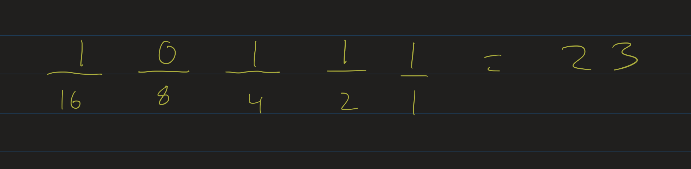
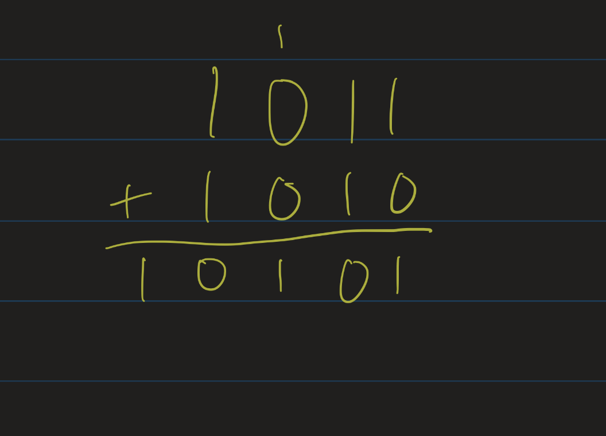
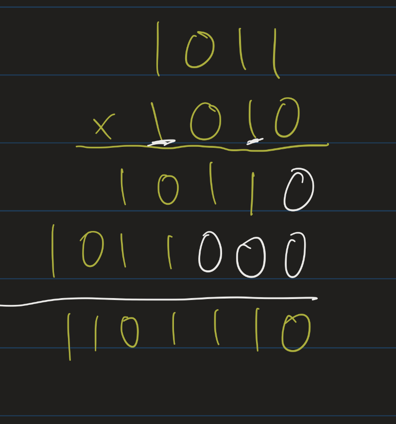

# Discrete Mathematics Lesson 13: Binary, Octal, and Hexadecimal Representations of Numbers
{:.no_toc}

1. Table of Contents
{:toc}

# Binary Representations

Recall that in the *binary* numeral system, we represent numbers as strings of 0s and 1s. Each symbol is called a *bit*, or binary digit. The rightmost bit represents the "ones" place ($2^0$). Going to the left, the next place is the "twos" place ($2^1$), then the "fours" ($2^2$), then the "eights" ($2^3$), etc.

To distinguish between numbers written in binary and in other systems like decimal, we use the subscript 2 to denote binary, and 10 to denote decimal. For example: ${100_2} = {4_{10}}$.

**More Examples**:

1. The number \\( 1001\_2 \\) represents the number $8 + 1$, or $ 9\_{10} $.
2. The number $1101\_2$ represents the number $8 + 4 + 1$, or ${13_{10}}$.
3. The number ${1110_2}$ represents $8 + 4 + 2$, or ${14_{10}}$.

## Algorithm: Converting from Binary

Above I describe the method for converting numbers from binary to decimal: count the number of bits, and, going left to right, label the bits as representing the place values (using increasing powers of 2). Then add up the powers of 2 that have a "1" in their column.

There is another, somewhat clever algorithm that goes from "left to right":

* Start at the leftmost bit.
* Whenever you see a 1, add a 1 to your current number.
* Every time you move to the right one place, double your number.
* Continue the above two steps until you run out of bits to check.

When you run out of bits, you are done.

For example: let's look at the number $1010_2$.

* Starting at the leftmost bit, we see a 1, so our number is now 1.
* Move to the right: double it, so our number is now 2.
* We see a 0: our number is still 2.
* Move to the right: double it, so our number is now 4.
* We see a 1: add 1, so our number is now 5.
* Move to the right: double it, our number is now 10.
* We see a 0: our number is now 10.
* We run out of bits: so our number is $10_{10}$.

## Algorithm: Converting to Binary

Converting *to* binary is a little more challenging. Before we do this, let's recall some easy facts about our usual, decimal system:

* If you take a number $n$, written in base 10, and multiply it by ten, you only need to add a zero at the end of the representation. ie $234 \times 10 = 2340$.
* Conversely, if you divide a number $n$ by ten (ignoring remainder), you just cut off the last digit: 234 **div** 10 = 23.
* A number is a multiple of ten if and only if its last digit is zero.

Binary is similar: if we know how to write a number in binary, then if we divide that number by two, we just cut off the last bit. If we multiply that number by two, we just tack on a zero at the end. And lastly, a number is a multiple of two if and only if its last bit is a zero.

We can use these facts and work backwards to figure out the binary representation of a number. First I'll start with a number in binary: $1011_2$. This is equal to $11_{10}$. It's odd, since the last bit is 1. Divide it by 2: $1011_2 / 2 = 101_2$ (or $5_{10}$). This is odd, its last bit is 1. Divide it by 2: $101_2 / 2 = 10_2$ (or $2_{10}$). This is even, its last bit is 0. Divide it by 2: $10_2 / 2 = 1_2$ (or just $1$). Now we're done.

Notice that every time we divide the number by 2, the binary representation changes by just cutting off the last bit. We can use this to help us figure out the binary representation in the first place: repeatedly divide the number by 2 and write down the remainders. Let's look at the number $12_{10}$:

$$
\begin{align}
12 \div 2 = 6 \mbox{ r} 0 \\
6 \div 2 = 3 \mbox{ r} 0 \\
3 \div 2 = 1 \mbox{ r} 1 \\
1 \div 2 = 0 \mbox{ r} 1
\end{align}
$$

Now that we've gotten to 0, we just read off the remainders in reverse order. So $12_{10} = 1100_2$. You can verify that this is correct on your own.

So the steps for converting a number from decimal to binary:

* Start at the rightmost output bit.
* Check if the number is even or odd. If it's even, write down a 0, if it's odd, write a 1.
* Divide the number by 2 and move to the left.
* Repeat the previous two steps until the number you're checking is now a 1.

**Exercise**: Convert the following numbers to binary:

1. 15
2. 16
3. 17
4. 18
5. 19
6. 20

## Alternative algorithm

Another algorithm to convert a number $n$ to binary:

* Find the largest power of 2 less than (or equal to) $n$. Put a 1 in that column.
* Subtract that power of 2 from $n$ and repeat the above step.
* Fill in 0s for all missing powers of 2.

For example, look at the number $105_{10}$:

* The largest power of 2 less than 105 is 64 ($2^6$)
* 105 - 64 = 41
* The largest power of 2 less than 41 is 32 ($2^5$).
* 41 - 32 = 9
* The largest power of 2 less than 9 is 8 ($2^3$).
* 9 - 8 = 1.
* The largest power of 2 less than or equal to 1 is 1 ($2^0$).
* 1 - 1 = 0, so we're done.

That means we need 1's in the $2^6$, $2^5$ and $2^0$ columns: $105_{10} = 1100001_2$.

# Octal and Hexadecimal

Very similarly to base 2 (binary) and base 10 (decimal), we can represent numbers in **octal** (base 8) and hexadecimal (base 16). In general, for a base $b$, we have powers of $b$ as the "place values", and we need $b$ symbols to represent numbers from 0 to $b - 1$:

* Octal uses powers of 8 as its place values, and the symbols 0 through 7 as its "octal digits".
* Hexadecimal uses powers of 16 as its place values, and the symbols 0 through 9, A, B, C, D, E, and F as its "hex" digits.
  * A represents 10, B is 11, C is 12, D is 13, E is 14, and F is 15

## Hex / Octal to Decimal

Similar to converting numbers from binary to decimal, we can convert from hexadecimal or octal to decimal just using the place value algorithm:

* $271_8$ is $2 \times 64 + 7 \times 8 + 1 = 185_{10}$
* $A3_{16}$ is $10 \times 16 + 3 = 163_{10}$.
* $1A1_{16}$  is $1 \times 256 + 10 \times 16 + 1 = 417_{10}$
* $6000_8$ is $6 \times 8^3 = 3072_{10}$.

**Exercise**: Convert the following numbers to decimal:

1. $2112_8$
2. $21_{16}$
3. $AA_{16}$
4. $FF_{16}$

**Exercise**: Can you describe the algorithms for converting numbers from decimal to hex or octal? These would be similar to our algorithms for converting from decimal to binary, except instead of dividing by 2 and checking remainders, we would divide by 8 or 16.

## Binary to / from Octal / Hex

To convert between binary and hexadecimal, we could take a roundabout way of first converting between binary and decimal, and then decimal to hexadecimal. But this is actually much more work than we need to do.

It turns out that there is a very simple algorithm to convert numbers between binary and octal or hex: one "octal digit" represents three bits, and one "hex" digit represents four bits.

For example:

* $11101011_2$: in hex, we look at each group of 4 bits individually:
  * $1110_2 = 14_{10}$, which is E in hex.
  * $1011_2 = 11_{10}$, which is B in hex.
  * So $11101011_2$ = $EB_{16}$
  * $EB_{16}$ represents $14 \times 16 + 11 = 235_{10}$.
* What about in octal? Add 0s on the left to look at three bits at a time. So instead of $11101011_2$, we write it as $011101011_2$:
  * $011_2 = 3$
  * $101_2 = 5$
  * $011_2 = 3$
  * So $11101011_2 = 353_8$.
  * $353_8 = 3 \times 64 + 5 \times 8 + 3 = 235_{10}$

Now let's convert from hex to binary:

* $AF_{16}$: convert each hex digit into 4 bits individuall:
  * $A$ represents ten, which is 1010_2$
  * $F$ represents fifteen which is $1111_2$
  * So $AF_{16} = 10101111_2$

In general, converting between hex and binary requires you to know the conversion table just for each individual hex digit:

  * $0 \mapsto 0000$
  * $1 \mapsto 0001$
  * $2 \mapsto 0010$
  * $3 \mapsto 0011$
  * $4 \mapsto 0100$
  * $5 \mapsto 0101$
  * $6 \mapsto 0110$
  * $7 \mapsto 0111$
  * $8 \mapsto 1000$
  * $9 \mapsto 1001$
  * $A \mapsto 1010$
  * $B \mapsto 1011$
  * $C \mapsto 1100$
  * $D \mapsto 1101$
  * $E \mapsto 1110$
  * $F \mapsto 1111$

Then you can convert from hexadecimal to binary just using this conversion table: one hex digit converts to 4 bits in exactly the way above, no matter where those hex digits show up in the (hexadecimal representation of the) number.

Similarly, you can convert from octal to binary using the convesion table for the numbers 0 through 7, written with three bits (instead of 4). So the number $717_8$ is $111001111_2$.

**Exercises**: Convert these numbers to binary:

1. $ABBA_{16}$
2. $FFFF_{16}$
3. $377_8$
4. $200000_8$

## Number Theory

It's worth investigating: why is it that every integer has a unique binary representation? Or a unique decimal representation? Or octal / hexadecimal / etc?

**Theorem**: Let $b > 1$ be an integer. Every natural number $x$ has a unique "base-$b$" representation: that is, there is some $n$ and $a_0, \ldots, a_n$ such that:

* $x = \sum\limits_{i = 0}^n a_i b^i$
* For each $i$, $0 \leq a_i < b$, and
* $a_n \neq 0$
* These $a_i$ are unique: if $x = \sum\limits_{i=0}^m c_i b^i$ for some integers $c_i$, with $0 \leq c_i < b$ and $c_m \neq 0$, then $m = n$ and each $c_i = a_i$.

**Proof**:

We will prove this using **strong** induction. That is, let $x$ be a natural number, and assume that every natural number $k < x$ has a unique base-$b$ representation (in the sense above). Then we show that $x$ has a unique base-$b$ representation.

There are several base cases to consider: first notice that every natural number less than $b$ has a unique base-$b$ representation using just $0, 1, \ldots, (b - 1)$.

Let $x = a_0 + a_1 b + \ldots + a_n b^n$, where $0 \leq a_i < b$ and $a_n \neq 0$. Then notice that $x - a_0 = a_1 b + \ldots + a_n b^n = b(a_1 + \ldots + a_n b^{n-1}$: that is, $x - a_0$ is a multiple of $b$. Or: $x \equiv a_0$ (mod $b$). Recall the [division theorem from Lesson 11](https://atharaq.github.io/discrete/lesson11.html#div-and-mod-operators): there are unique integers $q$ and $r$ such that $x = qb + r$ and $0 \leq r < b$. Since $0 \leq a_0 < b$ that means $x = qb + a_0$, with $q = a_1 + \ldots + a_nb^{n-1}$.

Notice that $q < x$, since $b > 1$ and $x - a_0 = qb$. Therefore, by strong induction, $q$ has a unique base-$b$ representation: $q = c_0 + c_1 b + \ldots + c_{k}b^{k}$, for some integer $k$, with $c_k \neq 0$ and $0 \leq c_i < b$. But also $q = a_1 + \ldots + a_nb^{n-1}$ also satisfies the same properties: so that means, by uniqueness, $k = n - 1$, and $a_1 = c_0, a_2 = c_1, \ldots, a_n = c_{n-1}$.

So: since $q$ has a unique base-$b$ representation, that means $a_1, \ldots, a_n$ are determined uniquely, and $a_0$ is determined uniquely by the division theorem, so those $a_0, a_1, \ldots, a_n$ are the only numbers satisfying $x = a_0 + a_1 b + \ldots + a_n b^n$ with $0 \leq a_i < b$ and $a_n \neq 0$.

# Binary Arithmetic

As we've mentioned, numbers are represented in computers in binary, using two states of electricity ("on" or "off", or "high" or "low" voltage) to represent 0s and 1s. But how do computers actually *compute* anything? We won't get into digital logic in this class, but it's worth studying the algorithms for adding and multiplying numbers in binary.

## Addition

Adding numbers in binary is similar to our traditional algorithm for adding decimals: just add them bitwise, carrying 1s if you need to. In other words, the only tricky case is $1_2 + 1_2 = 10_2$.

**Example**: Add $1011_2 + 1010_2$:

**Exercise**:

Add the following numbers, making sure to carry:

1. $111_2 + 1_2$
2. $101_2 + 10_2$
3. $1001_2 + 11_2$

## Multiplication

Multiplication can also be done similarly to the standard multiplication algorithm. However, in binary it's even easier, since the only numbers we have to worry about multiplying are 1s and 0s, and these are really easy to multiply.

It turns out, then, that the standard algorithm, using just 1s and 0s, really boils down to a fairly simple sequence of steps:

* Say we are multiplying $a \times b$, with the bits of $b$ are $b_0, \ldots, b_n$.
  * That is: $b = b_0 + b_1 \cdot 2 + \ldots + b_n \cdot 2^n$.
* For each $i$ from $0$ to $n$:
  * If $b_i = 1$, then mutiply $a \times 2^i$ (add $i$ 0s at the end of the representation of $a$), and keep track of this as our $i$-th *partial product*, call it $p_i$.
  * If $b_i = 0$, then $a \times 0$ = 0, so $p_i = 0$.
* At the end: add $p_0 + p_1 + \ldots + p_n$.

**Example**:

Let's multiply $1011 \times 1010$:

* The only bits we have to worry about are in the $2^1$ and $2^3$ places.
* $1011 \times 2^1 =   10110$
* $1011 \times 2^3 = 1011000$
* Add $10110 + 1011000 = 1101110$

# Representing Data

All data is represented in a computer using binary numbers. This includes integers, decimals, images, colors, text, etc. We will not get into how all of these are represented using binary, but I do want to talk a bit about storage and how many objects can be represented in different amounts of storage.

One **byte** is 8 bits of data. As we know from counting principles, there are $2^8$, or 256, different numbers that can be represented using 8 bits. But of course, we could represent other things: old computers (circa late 80s / early 90s) that only had "8 bit graphics" could only display 256 different colors. Those computers would represent a color using a single byte.

But let's stick to numbers for now: if we represent the numbers using the usual binary representation, 00000000 represents the number 0, 00000001 represents the number 1, etc until we get to 11111111, which represents the number 255. That is: with one byte of data, we can represent the numbers from 0 to 255 (those are the 256 different numbers we can represent: the 255 numbers from 1 to 255, plus the number 0).

What if we want to represent negative numbers? Again, we can only represent 256 numbers using 8 bits, and so if we wanted negatives, we could roughly split that 256 in half between positives and negatives. I say "roughly", because we also need to represent 0. Usually what is done is that 8 bits would represent the numbers from -128 to 127: half the numbers we represent are negative, and the other half are 0 or positive, and so we can represent one more negative than positive.

What if we had more bits? In the Java programming language, an **int** is a data type representing integers. **int**s are represented by 4 bytes, or 32 bits. That means there are $2^{32}$, or over 4 billion different integers that can be represented. Half of those, or $2^{31}$ would be negative, and the other half would be 0 or positive. That is: the range of integers represented in Java by an **int** is the numbers from $-2^{31}$ up to $2^{31} - 1$.

The nitty gritty of how negative numbers are represented is beyond the scope of this class, but it might be interesting to research this independently for those looking for either topics for their problem presentation or their final project.

## Data Sizes

The standard metric prefixes:

* 1 **byte** = 8 bits
* 1 **kilobyte** (KB) = 1000 bytes
* 1 **megabyte** (MB) = 1000000 bytes
* 1 **gigabyte** (GB) = $10^9$ bytes (1 billion bytes)
* 1 **terabyte** (TB) = $10^12$ bytes

Historically, data was kept in powers of 2 amounts, which causes some confusion: sometimes "1 KB" means 1024 bytes ($2^{10}$), not 1000 bytes. The SI system now uses the prefixes "kibi" (KiB), "mebi" (MiB), "gibi" (GiB), and "tebi" (TiB) to refer to $2^{10}$, $2^{20}$, $2^{30}$ and $2^{40}$, respectively. Notice that $2^{10} \approx 1000$, $2^{20} \approx 1,000,000$, and $2^{30} \approx 1,000,000,000$.

## Lengths of Representations

Suppose I give you a number $n$, written in decimal. How many bits would it take to represent that number? Let's go through a couple of specific examples first:

* The number 100 can be represented as 64 + 32 + 4, or $1100100_2$, which has 7 bits.
* The nubmer 200 can be represented as 128 + 64 + 8, or $11001000_2$, which has 8 bits.

Let's try some bigger numbers:

* The number 1000 can be represented as 512 + 256 + 128 + 64 + 8, or $1111001000_2$, which has 10 bits.
* The number 2000 can be represented as 1024 + 512 + 256 + 128 + 16$, or $11110010000_2$, which has 11 bits.

The pattern is that doubling a number increases its length, in binary, by only a single bit. This is the *inverse* of the pattern we have seen before: increasing the number of bits by one doubles the amount of numbers you can represent. In other words, if, with $n$ bits, we can represent $2^n$ numbers, then if we have a number $n$, we need **about** $\log_2(n)$ bits to represent it. (Notice that the rules of logarithms tell us that $\log_2(2n) = \log_2(2) + \log_2(n)$, which is $\log_2(n) + 1$.)

I say "about" in the previous paragraph for technical reasons:

* $\log_2(64) = 6$, but the number 64 is written as $1000000_2$, that is, it has 7 bits.
* $\log_2(63) \approx 5.977$, but the number 63 is written as $111111_2$, which has 6 bits.
* $\log_2(65) \approx 6.022$, but the number 65 is written as $1000001_2$, which has 7 bits.

In general, the number $2^n$ takes $n + 1$ bits to write. All numbers between $2^n$ and $2^{n+1}$, not including $2^{n+1}$, will need $n + 1$ bits. That means that the formula for finding the number of bits to represent a number $n$ is $\lfloor \log_2(n) \rfloor + 1$, where the function $\lfloor x \rfloor$ outputs the greatest integer less than or equal to $x$. In other words, if $k$ is an integer such that $k \leq \log_2(n) < k + 1$, then $n$ takes $k + 1$ bits to write in binary.
