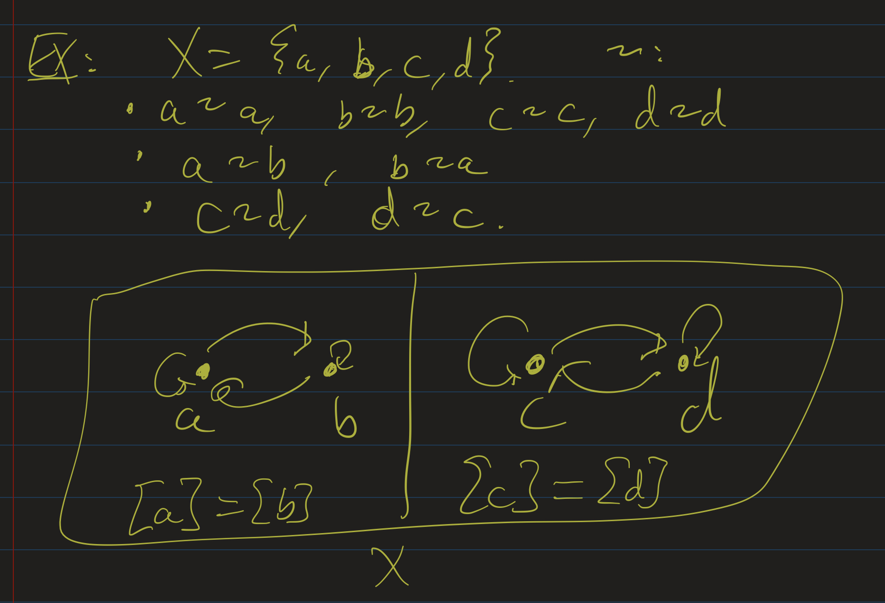
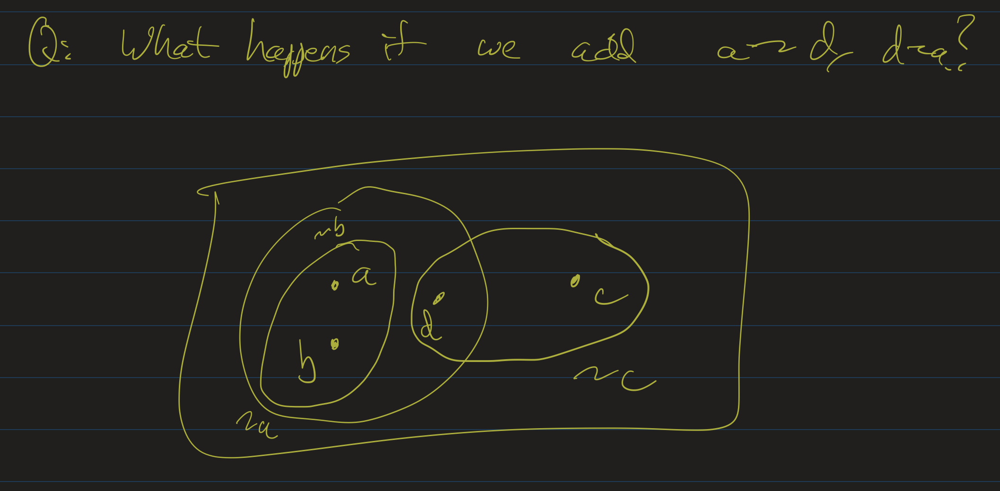

# Discrete Mathematics Lesson 17: Equivalence Relations and Partial Orders
{:.no_toc}

1. Table of Contents
{:toc}

# Equivalence Relations

  <iframe src="https://www.youtube.com/embed/EfF9TK03uHk" frameborder="0" allow="accelerometer; autoplay; clipboard-write; encrypted-media; gyroscope; picture-in-picture" allowfullscreen></iframe>

Recall that a relation $\sim$ on a set $X$ is called an **equivalence relation** if it satisfies the following properties:

1. $\forall x (x \sim x)$
2. $\forall x \forall y (x \sim y \rightarrow y \sim x)$
3. $\forall x \forall y \forall z (x \sim y \wedge y \sim z \rightarrow x \sim z)$

This generalizes the notion of "equals". Of course, equality really is an equivalence relation: everything is equal to itself, if $x = y$, then $y = x$, and if $x = y$ and $y = z$, then $x = z$. These are basic properties of equality: they justify many of the usual algebraic operations we do with equations. We never think twice about flipping equations around, or substituting identical expressions. For example, if we know $x = 25$, and we know $2x + y = 25$, we can happily conclude that $2x + y = x$. We are applying the transitive property here!

Equivalence relations are often a way to express the notion that two objects can be seen as the same in some sense. As mentioned last time, this includes the notions of cardinality, congruent shapes, similar triangles, congruence mod n, etc.

Some other examples. of equivalence relations:

* Let $X$ be the set of words in the English language and, for words $w_1, w_2 \in X$, define $w_1 \sim_E w_2$ iff $w_1$ and $w_2$ start with the same letter.
    * For example, "cat" $\sim_E$ "call", but $\lnot$ "cat" $\sim_E$ "dog".
* On the set of real numbers $\mathbb{R}$, let $x \sim y$ iff $x$ and $y$ are both positive, both negative, or both equal to 0.
    * You will show that this is an equivalence relation on the check-in.
    * You'll need to show: $x \sim x$ (this should be obvious: $x$ has the same +/- sign as $x$)
    * If $x \sim y$, then $y \sim x$: if $x$ and $y$ have the same +/- sign (or are both 0), then $y$ and $x$ have the same +/- sign (or are both 0).
    * And similarly transitivity: if $x \sim y$ and $y \sim z$, you'll show why we can conclude that $x \sim z$.

Recall the following definitions. Given a set $X$ and an equivalence relation $\sim$ on $X$:

1. For each $x \in X$, the set $[x]_{\sim} = \\{ y \in X : x \sim y \\}$ is the equivalence class of $x$. $x$ is called a **representative** of its class.
2. The set $X / {\sim} = \\{ [x]_{\sim} : x \in X \\}$ is called the **quotient** of $X$ by the relation $\sim$.

## Exercise

Which of the following are equivalence relations? For those that are, describe the equivalence classes as best as you can.

1. On $X = \mathbb{Z}$, $x \sim y$ iff $xy \geq 0$.
2. On $X = \mathbb{N}$, $x \sim y$ iff either ($x \leq 100$ and $y \leq 100$) or ($x > 100$ and $y > 100$).
3. On $X = \mathbb{Q}$, $x \sim y$ iff $x - y \in \mathbb{N}$.
4. On $X = \mathbb{Q}$, $x \sim y$ iff $xy \in \mathbb{Z}$.

    
Check your answers

    <ol>
        <li>This is <strong>not transitive</strong>. Notice that $-1(0) \geq 0$, and $0(1) \geq 0$, but $(-1)(1) \lt 0$, so $x = -1$, $y = 0$, and $z = 1$ gives our counterexample.</li>
        <li>
This <strong>is</strong> an equivalence relation. For any $x \in \mathbb{N}$, either $x \leq 100$ or $x > 100$, and so either way $x \sim x$. If $x \sim y$, then either both are less than 100, or both are greater than 100, and so changing the order of $x$ and $y$ will not change that fact. If $x \sim y$ and $y \sim z$, then check if $x \leq 100$. If so, then $y \leq 100$ and therefore $z \leq 100$, and so $x \sim z$. If $x > 100$, then $y > 100$ and therefore $z > 100$, and so $x \sim z$ as well. Therefore $\sim$ is transitive.

        
There are exactly two equivalence classes here: all numbers from $0, \ldots, 100$ are in one class, and all numbers from $101$ and on are in a second class.

        
Notice that this one has a kind of "sameness" property: $x$ and $y$ are considered "the same" if they are both "small" or both "large" (where we set $100$ as our cutoff point for thinking of numbers as small or large).

        </li>
        <li>This is <strong>not symmetric</strong>, since $3 - 2 \in \mathbb{N}$ but $2 - 3$ is not.</li>
        <li>This is <strong>not reflexive</strong>: $\frac{1}{2} \cdot \frac{1}{2} \not \in \mathbb{Z}$.</li>
    </ol>

## Images of functions

  <iframe src="https://www.youtube.com/embed/VS5XZji3x8Q" frameborder="0" allow="accelerometer; autoplay; clipboard-write; encrypted-media; gyroscope; picture-in-picture" allowfullscreen></iframe>

On the check-in, you will show that on $\mathbb{R}$, the relation defined by $x \sim y$ iff $\sin(x) = \sin(y)$ is an equivalence relation. Similarly, last time we saw that the relation $x \sim y$ iff $x^2 = y^2$ is an equivalence relation. There is a more general result here:

**Theorem**: Let $f : X \to Y$ be *any function*. Then the relation $\sim$ on $X$ defined by $x \sim y$ iff $f(x) = f(y)$ is an equivalence relation.

This is not hard to prove, and so you will do so on a problem set. For now, I wanted to look at some examples that we've either seen already:

1. This example gives us one of the equivalence relations on the check-in (you can take a quick look at it if you'd like). $sgn : \mathbb{R} \to \\{ -1, 0, 1 \\}$, the "signum" function, defined by
$$
sgn(x) = \begin{cases}
-1 & \mbox{ if } x < 0 \\
0 & \mbox{ if } x = 0 \\
1 & \mbox{ if } x > 0
\end{cases} \\
$$
2. Let $n > 1$ be a natural number, and $f : \mathbb{N} \to \mathbb{N}$ given by $f(x) = x$ **mod** $n$. This gives us the equivalence relation of congruence modulo $n$. (Can you prove this? That is: show that $x \equiv y$ (mod $n$) if and only if $x$ **mod** $n$ = $y$ **mod** $n$)

**Exercise**

Let $f : \mathbb{N} \to \mathbb{N}$ be defined by $f(n) = n$ **div** $2$. Recall that **div** is the "integer division" operator: $n$ **div** $2$ gives the quotient (dropping the remainder). So for example, 11 **div** 2 = 5, since $11 = 2 \times 5 + 1$. For natural numbers $n$ and $m$, let $n \sim m$ iff $f(n) = f(m)$.

Determine the elements of the following equivalence classes:

1. $[0]$
2. $[3]$
3. $[4]$.
3. $[2k]$, for some integer $k$.
4. $[2k+1]$, for some integer $k$.

How many equivalence classes are there? How large is each class?

## Partitions

  <iframe src="https://www.youtube.com/embed/prEQFD50bHE" frameborder="0" allow="accelerometer; autoplay; clipboard-write; encrypted-media; gyroscope; picture-in-picture" allowfullscreen></iframe>

Let's look at a couple of finite examples.

**Example 1**: Let $X = \\{ a, b, c, d \\}$ and define $\sim$ as the following relations:

* $a \sim a$, $b \sim b$, $c \sim c$, and $d \sim d$ (so it's reflexive)
* $a \sim b$ and $b \sim a$
* $c \sim d$ and $d \sim c$
* No other relations hold: ie, $\lnot (a \sim c)$.

Claim: this is an equivalence relation. Justify this to yourself: I've shown that it's reflexive, and now you should show that it's symmetric and transitive. That is: take a relation $x \sim y$ described above, and check and make sure that $y \sim x$. Similarly, take any two relations $x \sim y$ and $y \sim z$ above (here it's okay if two of $x, y$ or $z$ are the same element) and check that $x \sim z$.

The picture of this relation looks like $a$ and $b$ are together, and $c$ and $d$ are together. In other words: the equivalence relation somehow *separated* $a, b$ from $c, d$. We have two equivalence classes, and they are disjoint from each other.

**Example 2**: Start with the same relations above, and add in $a \sim d$ and $d \sim a$. This is no longer an equivalence relation! (What goes wrong now?) We can still look at the picture of this relation:

Here now, $a$ is connected to $b$ and $d$, and $d$ is connected to $a$ and $c$, but $a$ and $c$ are not directly connected to one another, nor are $b$ and $d$. This relation doesn't neatly put each element into one, specific class. Is $d$ in $a$'s class or in $c$'s? The classes overlap!

**Exercise**: Let $X = \\{a, b, c, d \\}$. Here we will look at the "reverse" problem: I will tell you what equivalence classes I want, and you will give me an equivalence relation. Describe an equivalence relation so that $[a] = \\{ a, c \\}$, $[b] = \\{ b \\}$. What must $[d]$ be in this case?

  
Check your answer

  
For any equivalence relation, we must have that it is reflexive, so we get the relations of $a \sim a$, $b \sim b$, $c \sim c$, and $d \sim d$.

  
If $[a] = \\{a, c \\}$, this means $a \sim c$. By symmetry, this also means $c \sim a$. This also tells us that $\lnot (a \sim b)$ and $\lnot (a \sim d)$.

  
If $[b] = \\{ b \\}$, we similarly know that $\lnot (b \sim a), \lnot (b \sim c)$, and $\lnot (b \sim d)$.

  
Putting all of that together, the only $x$ such that $d \sim x$ is $x = d$ itself. So that means $[d] = \\{ d \\}$, the equivalence class of $d$ is itself!

In general, an equivalence relation *partitions* the elements of a set into the different equivalence classes. A **partition** of a set $X$ is a collection of subsets $\\{ U_i \\}$ (where $i$ is some index variable) so that the following hold:

* if $i \neq j$, then $U_i \cap U_j = \emptyset$ (that is, different sets in the collection are disjoint), and
* for all $x \in X$, there is some $i$ such that $x \in U_i$

These two properties together imply that for each $x$, there is one and only one $i$ such that $x \in U_i$. The subscripts refer to indices: we may need only a few sets (in the case of congruence mod $2$, for example, we just need two sets: the evens and the odds), or we may need infinitely many (in the case of $\sin(x) = \sin(y)$, there are infinitely many equivalence classes).

Moreover, if we start with a partition of a set, we can recover an equivalence relation. For example, let $X = \\{ a, b, c, d \\}$ and partition it into the sets $U_1 = \\{ a \\}$, $U_2 = \\{ b, d \\}$, and $U_3 = \\{ c \\}$. This gives us our equivalence relation: all the reflexive rules ($a \sim a$, $b \sim b$, etc), along with $b \sim d$ and $d \sim b$.

More generally: given a partition of a set $X$, we can define $x \sim y$ to mean "$x$ and $y$ are in the same set in the partition." This is an equivalence relation: reflexivity and symmetry are obvious by definition, and if $x \sim y$ and $y \sim z$, then $x$, $y$, and $z$ are all in the same part of the partition.

## Putting it all together

An equivalence relation on a set $X$ partitions the elements into different classes. Pick one element from each class, and now you have a set of representatives; in other words, you have a quotient set. That is: the *quotient set* is what you get when you "collapse" all points in each class into one, single point.

# $\mathbb{Q}$

  <iframe src="https://www.youtube.com/embed/fXFP_ZFAFWk" frameborder="0" allow="accelerometer; autoplay; clipboard-write; encrypted-media; gyroscope; picture-in-picture" allowfullscreen></iframe>

In this section I want to argue that we have learned a bit about equivalence relations all the way back in elementary school.

When we first learned about fractions, we learned that, for example, $\frac{2}{4} = \frac{1}{2}$. This of course was justified using diagrams and arguments about splitting up slices of a pie or a cake, but abstractly we were introduced to a specific kind of equivalence relation: that $\frac{a}{b} \sim \frac{c}{d}$ if and only if $ad = bc$ (that is: if two fractions are equal, we can cross multiply).

So we can formalize this: let $X = \mathbb{Z} \times (\mathbb{Z} \setminus \\{ 0 \\})$. Note that the elements of $X$ are ordered pairs $(a, b)$, where $b \neq 0$. This is, roughly, what a fraction is: a pair of integers, where the second integer is not 0.

Define $\sim$ on $X$ as $(a, b) \sim (c, d)$ iff $ad = bc$. This is, again, the exact equivalence relation we use to determine if two fractions are equal. Notice that the equivalence class of $(1, 1)$ contains exactly those numbers of the form $(x, x)$, for $x \neq 0$. This is because $(1, 1) \sim (c, d)$ if and only if $d = c$ (and neither is 0). That is, the only numbers equivalent to $(1, 1)$ are of the form $(x, x)$ (where the two coordinates are equal).

Similarly, what is the equivalence class of $(1, 2)$? $(1, 2) \sim (c, d)$ if and only if $d = 2c$. That is, the only numbers equivalen to $(1, 2)$ are of the form $(x, 2x)$, where $x \neq 0$.

So in other words, for any ordered pair $(a, b) \in X$, the equivalence class $[(a, b)]$ represents the fraction $\frac{a}{b}$, and so **any fraction** $\frac{c}{d}$ that is equal to $\frac{a}{b}$ (as fractions), is equivalent to $(a, b)$ according to $\sim$.

## Some Philosophy

In studying philosophy of mathematics, we encounter the question: what really **are** the mathematical structures that we use all the time? What are natural numbers, integers, rational numbers, and real numbers?

One way to answer this question is to keep reducing the more complex objects to simpler objects. That is: if it's too much of a commitment to believe that complex numbers exist, we can define complex numbers as ordered pairs of real numbers $(a, b)$, so that each complex number $a + bi$ is represented as $(a, b)$.

Similarly, to justify, philosophically, that real numbers exist, one can construct real numbers from rational numbers. I won't go into that here, as this construction is much more involved, but one of these constructions also involves equivalence relations. (The construction using equivalence relations is due to Augustin Cauchy, and the other one uses subsets of $\mathbb{Q}$, due to Richard Dedekind.)

And as we've seen, we can construct the rational numbers as a quotient of a particular equivalence relation on ordered pairs of integers. This is not how we learned about rational numbers, but it does correspond to what we know about "equivalent fractions."

This means that, philosophically, if we believe in the existence of integers, we can then use those integers to construct rational numbers, and then real numbers, and then complex numbers. Moreover, integers, themselves, can be constructed as equivalence classes of ordered pairs of natural numbers!

For ordered pairs of natural numbers $(a, b)$ and $(c, d)$, define $(a, b) \sim (c, d)$ iff $a + d = b + c$. We define it this way, instead of the more natural $a - b = c - d$ to avoid the circularity of defining $a - b$ for all natural numbers. That is, we need integers to define subtraction (otherwise, what is 1 - 2?), but we are using this equivalence relation to define integers. That technical point aside, notice: $(0, 1) \sim (1, 2) \sim (2, 3)$, etc: this equivalence class would represent the number $-1$. Similarly, $(1, 0) \sim (2, 1) \sim (3, 2)$, etc: this equivalence class represents the number $1$. Every equivalence class represents a unique integer, and so, in a sense, we can think of $\mathbb{Z}$ as the quotient of this equivalence relation on the set $\mathbb{N}^2$.

So all of this brings us down to $\mathbb{N}$. How do we philosophically justify the existence of natural numbers? Are there "simpler" objects that we can use to construct natural numbers out of? The answer is yes: we can define the natural numbers set-theoretically, starting with $\emptyset$ to represent 0, and building from there. I won't go into it, but this is a [construction due to Von Neumann](https://en.wikipedia.org/wiki/Set-theoretic_definition_of_natural_numbers#Definition_as_von_Neumann_ordinals).

What do we do then? How do we justify that those basic sets, like $\emptyset$ exist? It is at this point that one needs to resort to axioms asserting their existence. That is: at some point, we need to make an ontological commitment (believe that some object exists). Philosophically, it's preferable to commit to the simplest things possible, and then from there we can build up the more complex, ordinary mathematical structures like $\mathbb{N}, \mathbb{Z}, \mathbb{Q}, \mathbb{R}$, and functions and other operations.
