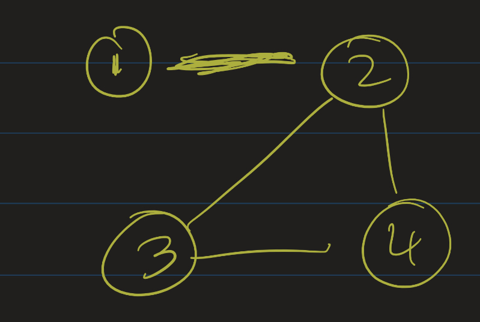
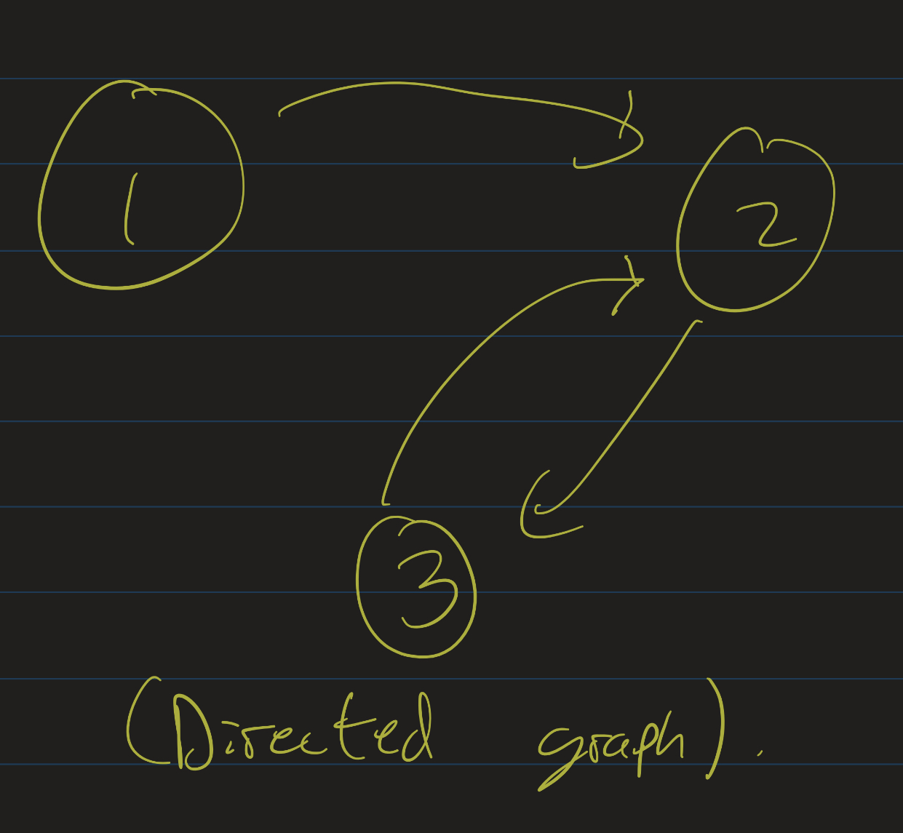
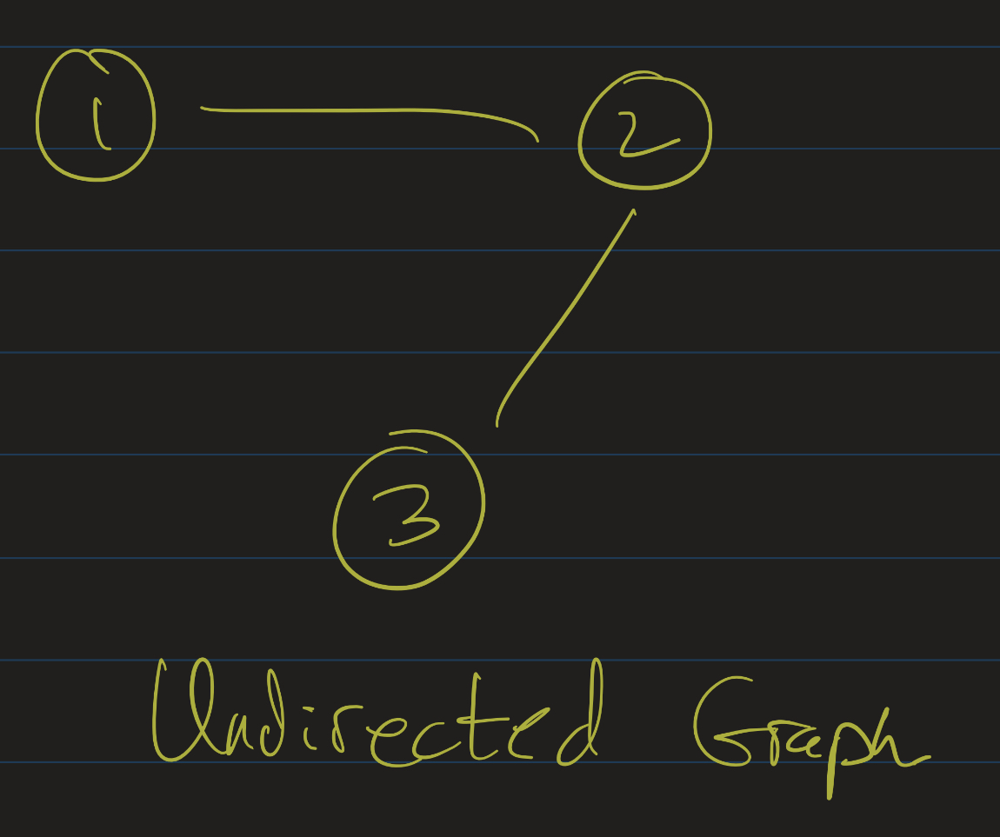
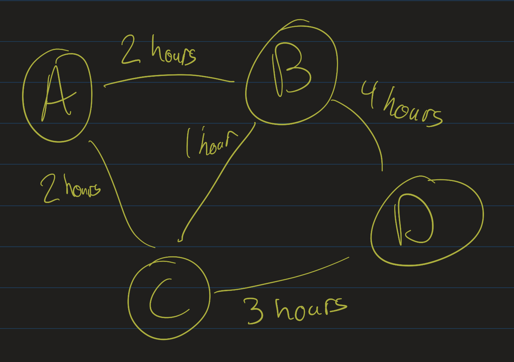
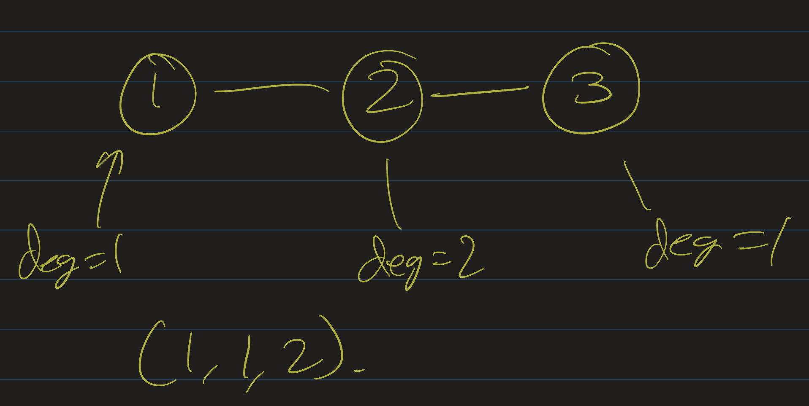
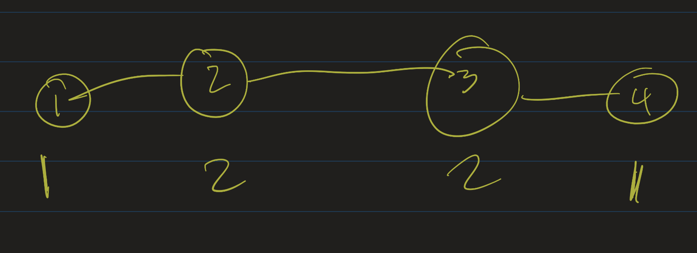
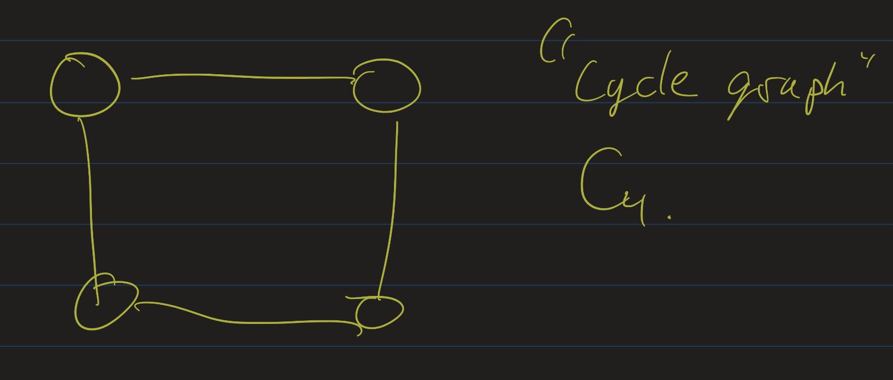
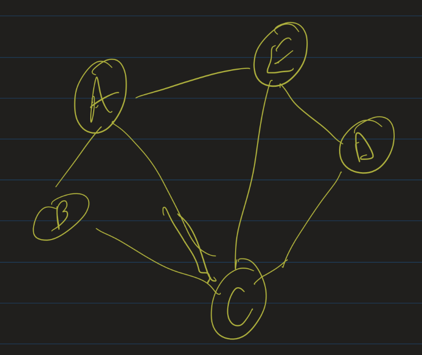
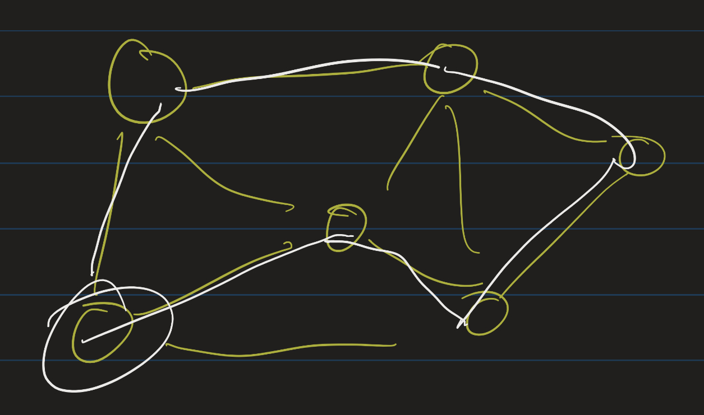
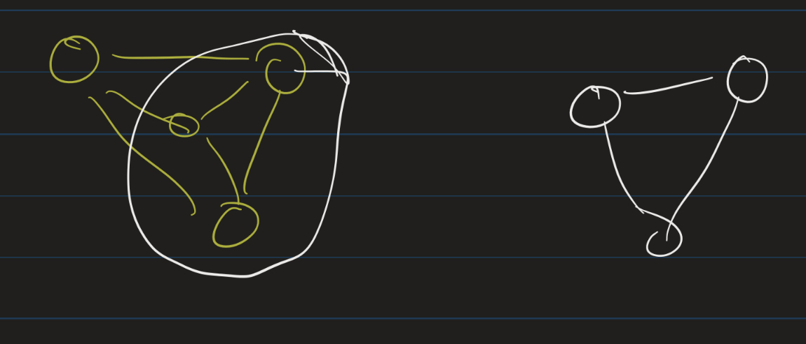

# Discrete Mathematics Lesson 19: Graph Theory
{:.no_toc}

1. Table of Contents
{:toc}

# Seven Bridges of Königsberg

<iframe src="https://www.youtube.com/embed/ifv5ukuJ1qQ" frameborder="0" allow="accelerometer; autoplay; clipboard-write; encrypted-media; gyroscope; picture-in-picture" allowfullscreen></iframe>

Königsberg, Prussia (now known as Kaliningrad, Russia) is the setting for one of the most important problems in the development of modern mathematics. The city was laid out as pictured above, with seven bridges connecting several landmasses around the Pregel River. A tale is told about how the citizens of this city used to walk around the bridges and wonder how one might plan a walk around the city crossing each bridge **exactly once**.

In 1736, Leonhard Euler proved that this would be impossible! In his proof, he recognized some simplifying assumptions that led to the modern development of graph theory and topology. In particular, he recognized that the relative shapes of each region is not really important, but what is only important are the connections between each region (the number of bridges connecting different regions). Mathematicians now recognize this as a graph-theoretic problem: given a set of vertices and some edges between those points, is there a path one can take that crosses each edge exactly once?

# Definitions

Mathematically, we formalize the notion of graphs (vertices and edges between them) using set theory. A **graph** is an ordered pair $(V, E)$, where $V$ is a set, denoting the **vertices** of the graph, and $E$ is a set of **edges**, consisting of pairs of vertices. There are a few ways to refer to edges:

* "Unordered pairs", or sets of size 2
* Ordered pairs $(a, b)$.

I usually will use ordered pairs as it generalizes to several situations, but you may see either notation in different textbooks. Either way, for each $e \in E$, we associate one or two vertices, known as its **endpoints**. Two endpoints of an edge are **adjacent**: that is, two vertices $v$ and $u$ are called adjacent if there is an edge connecting $v$ and $u$.

A vertex is most often depicted as a point in space ($\mathbb{R}^2$ or $\mathbb{R}^3$), and an edge is depicted as a curve joining the endpoints.

A graph is called **simple** if it has no self-loops and there is at most one edge between any two pair of vertices. (Note: the "Königsberg" graph is not simple).

Graphs can be either **directed** or **undirected**.

* In a directed graph, each edge has a direction. This is usually formalized as each edge being an ordered pair $(a, b)$, where $a$ is the start vertex and $b$ is the terminal vertex.
* In an undirected graph, edges are bidirectional. That is, two vertices are either connected by an edge or they are not. As mentioned, this can be formalized using "unordered pairs" or ordered pairs. If we used ordered pairs to represent an undirected graph, we must insist that the edge relation is **symmetric**: that is, if $(a, b) \in E$, then $(b, a) \in E$.

Directed graph:

Undirected graph:

Graphs can be **weighted** and/or **labeled**. We can label vertices and/or edges, and we can weight vertices and/or edges. Often this is done for path-finding algorithms, where the vertices are labeled by locations, and edges are weighted by the time (or distance) it would take to travel between those locations.

Given a graph $G = (V, E)$, the **degree** of a vertex $v$ is the number of edges connected to $v$.

* If an undirected $G$ contains self-loops, we count that as two edges connected to $v$.
* If $G$ is a directed graph, we can define the **in-degree** and **out-degree** of $v$:
  * The **in-degree** of $v$ is the number of edges that point **toward** $v$.
  * The **out-degree** of $v$ is the number of edges that start at $v$.

The **degree-sequence** of a graph $G$ is a sequence of all degrees in non-decreasing order. For example:

The degree sequence of this graph is $(1, 1, 2)$.

## Exercises

At least one of the following problems is impossible! Can you figure out which one?

1. Find an undirected graph whose degree sequence is $(1, 1, 2, 2)$.
2. Find an undirected graph whose degree sequence is $(1, 1, 1, 2)$.
3. Find an undirected graph whose degree sequence is  $(2, 2, 2, 2)$.
4. Find a simple undirected graph whose degree sequence is $(0, 1, 2, 3)$.

    
Check your answers

    
The second one is impossible! Take the vertex of degree 2. It is connected to two other vertices, each has degree one. Then there is no room for a third vertex of degree one to be placed anywhere: it must be connected to <emph>some</emph> other vertex, but all the other vertices have been exhausted!

    
The fourth one is also impossible. If our vertices have no self-loops, and one vertex has degree 3, it must be connected to three others. That would mean none of the vertices can have degree 0.

    
Graph 1: 

    
Graph 3: 

# Some Quick Theorems

<iframe src="https://www.youtube.com/embed/sMsB8orl5SA" frameborder="0" allow="accelerometer; autoplay; clipboard-write; encrypted-media; gyroscope; picture-in-picture" allowfullscreen></iframe>

One of the benefits of formalizing graphs as vertices and edges is that the combinatorics of graph theory is sometimes quite simple. For example, in the previous exercise, we saw that it was not possible for a graph to have exactly three vertices of degree one and one vertex of degree 2. We can actually see a more general property using a counting argument.

Take any graph $G = (V, E)$. What can we say about the degrees of all the vertices? If we count vertices, it's hard to say, but instead we can count edges. For each edge $e$, we see that it counts toward the degree of two vertices: each of its endpoints (or, if it's a self-loop, by definition it counts twice toward the degree of one vertex). That means each edge is counted *twice* when we add up all the degrees. Which gives us the following result:

**Theorem**: The sum of the degrees of a graph is equal to twice the number of edges.

This is a fairly innocent theorem, but it has some important consequences. First of all, that means that the sum of the degrees is even.

**Corollary**: For any graph $G = (V, E)$, there is an even number of vertices of odd degree.

**Proof**: Since the sum of the degree is even, we can really think of this as a question of adding numbers mod 2. If we add an odd number of odd numbers, we get an odd number. Adding any even number after that would keep it as an odd number. Therefore, there must be an even number of odd numbers in that sum.

## Eulerian Paths and Cycles

Before we tackle the Bridges of Königsberg problem, let's make a few more definitions:

**Definition**: Let $G = (V, E)$ be an undirected graph.

1. A **walk** in $G$ is a sequence of vertices $v_1, v_2, \ldots, v_n$ such that, for each $i < n$, the vertices $v_i$ and $v_{i+1}$ are adjacent (connected by an edge).

2. A **trail** is a walk in which no edge is repeated.

3. An **Eulerian path** is a walk in which every edge is used exactly once.

4. An **Eulerian circuit** or an **Eulerian tour** is an Eulerian path that starts and ends at the same vertex.

We now have enough information to explain Euler's proof that there is no solution to the Seven Bridges of Königsberg problem. Given a graph $G = (V, E)$, we ask: does this graph contain an Eulerian path? Does this graph contain an Eulerian circuit?

It turns out that these are questions that can be answered entirely by looking at the degree sequence of the graph. How would we use up all the edges at a particular vertex? Suppose that a vertex has degree 3. If we start at that vertex and take one of the edges, we have two more edges left to visit from that vertex. That means we have to return, which will will use one more edge, and leave it again, which will use the other edge. What if we didn't start at that vertex? If we take an edge in, we take one out, and then we still have one edge left to use. That means that we would need to *end* at that vertex!

We can generalize this. If a vertex has odd degree, we would need to either start or end at that vertex. This is because, besides the beginning or end of the walk, every time we enter a vertex through one edge, we would leave through another. That means visiting a vertex in the "middle" of the walk would use up an even number of its edges. If a vertex has odd degree, then, it has to use one edge to leave at the beginning of the walk, or it has to use one edge to return at the end of the walk.

**Theorem**: A graph $G = (V, E)$ has an Eulerian path if and only if it has exactly two vertices of odd degree.

In particular, any Eulerian path would start at one of the vertices that has odd degree, and end at the other.

What about Eulerian circuits? If we are starting and ending at the same vertex, then **every** vertex must have even degree. Do you see why? If every vertex has even degree, then there is an Eulerian circuit starting and ending at any vertex.

**Exercise**: Determine if this graph has an Eulerian path and/or an Eulerian circuit. If so, find one.

    
Check your answer

    
Notice that the degree seqeunce of this graph is $(2, 2, 3, 3, 4)$. So this should have an Eulerian path!

    
One Eulerian path is: A - B - C - D - E - C - A - E.

## Non-theorem: Hamiltonian Cycles

One of the amazing results in graph theory is that, while the Eulerian path problem has an easy solution involving just counting degrees, a related problem is not known to have any easy solution.

**Definition**: Let $G = (V, E)$. A **Hamiltonian path** is a walk in which every vertex in $V$ is visited exactly once. A **Hamiltonian circuit** is a walk starting and ending in the same vertex, in which every vertex other than the starting vertex is visited exactly once.

From the definition it appears to be quite similar to the Eulerian path / circuit problem, but this problem is [NP-complete](https://atharaq.github.io/discrete/lesson2.html#algorithms-and-p-vs-np). There is no known "efficient" algorithm which determines if a graph with $n$ vertices has a Hamiltonian path or circuit whose running time is a polynomial function in $n$.

# Special Kinds of Graphs

<iframe src="https://www.youtube.com/embed/F7g_MCshVFM" frameborder="0" allow="accelerometer; autoplay; clipboard-write; encrypted-media; gyroscope; picture-in-picture" allowfullscreen></iframe>

At this point, we should survey some examples of graphs so we have some language to describe kinds of graphs.

## Complete Graphs

The **complete** graph on $n$ vertices is the graph obtained by putting edges between all pairs of vertices. Here are some examples.

$K_3$:

$K_4$:

$K_5$:

Counting edges, you can determine that $K_3$ has 3 edges, $K_4$ has 6, and $K_5$ has 10. Notice that to go from $K_n$ to $K_{n+1}$, you add in one vertex and connect it to all of the previous vertices. That is, $K_{n+1}$ has $n$ more edges than $K_n$ (so $K_4$ has 3 more than $K_3$, $K_5$ has 4 more than $K_4$, etc).

**Exercise**: Come up with a formula, in terms of $n$, for the number of edges in $K_n$. Prove that your formula is correct.

Note: This formula gives an upper bound for the number of edges in *any* simple undirected graph, since $K_n$ will have the most possible edges out of any $n$ vertex graph.

## Cycle Graphs

A **cycle graph** on $n$ vertices is a simple, $n$-vertex cycle. That is, it has vertices $v_0, v_1, \ldots, v_{n-1}$, and edges between $v_0$ and $v_1$, $v_1$ and $v_2$, $\ldots$, $v_{n-2}$ and $v_{n-1}$, and $v_{n-1}$ and $v_0$.

Example: $C_6$:

**Exercise**: Draw $C_3, C_4, C_5, C_6$, and $C_7$. How many edges are in each of these graphs?

## Bipartite Graphs

A **bipartite** graph is a graph in which the vertices are partitioned into two sets, $V_1$ and $V_2$, so that there are no edges between vertices in the same set in that partition. That is, if $x, y \in V_1$, then there is no edge between $x$ and $y$, and similarly, if $x, y \in V_2$, there is no edge between $x$ and $y$.

The **complete bipartite** graph $K_{n,m}$ is the bipartite graph where $\|V_1\| = n$, $\|V_2\| = m$, and every vertex in $V_1$ is adjacent to every vertex in $V_2$.

$K_{3,5}$:

Not every bipartite graph is one of these "complete" bipartite graphs. For example, let's look at the cycle $C_6$ again:

This is bipartite! Starting at the top left and cycling around clockwise, number the vertices $v_0, v_1, v_2, v_3, v_4, v_5$. Then we can partition this into sets $V_1 = \{ v_0, v_2, v_4 \}$ and $V_2 = \{ v_1, v_3, v_5 \}$. Since it's a cycle, each vertex $v_i$ is adjacent to $v_{i+1 \mathbf{ mod} 6}$ and $v_{i-1 \mathbf{ mod} 6}$. Checking each $i$, you can see that there are no edges between vertices in $V_1$ or between vertices in $V_2$.

This isn't true for *every* cycle though. The cycle graph $C_3$ is **not** bipartite:

Numbering the vertices, starting at the top and going clockwise, as $v_0, v_1, v_2$, we see that if $v_0 \in V_1$, then $v_1$ and $v_2$ must be in $V_2$. But $v_1$ and $v_2$ are adjacent, so this does not work.

**Question**: Which cycle graphs are bipartite? Is $C_4$ bipartite? $C_5$? $C_7$? $C_8$?

## Subgraphs

Given a graph $G = (V, E)$, a **subgraph** $H = (U, D)$ is a graph where $U \subseteq V$ and $D \subseteq E$. That is, a subgraph is formed from an original graph by possibly deleting some vertices and/or some edges (with the rule that if you delete a vertex, you must delete any edge connected to it).

# Further reading and exercises

1. [Graph Theory Intro](http://discrete.openmathbooks.org/dmoi3/ch_graphtheory.html) from *Discrete Mathematics: An Open Introduction*.
2. [Graph Theory Definitions](http://discrete.openmathbooks.org/dmoi3/sec_gt-intro.html) from *Discrete Mathematics: An Open Introduction*. Please pay attention to the glossary at the end of this section!
    * Take a look at exercises 1-2, 6-8, 10(a,c), 12, 14, 16.
3. [Professor Gross' Graph Theory Notes](http://www.cs.columbia.edu/~cs3203/files/DM-Ch10.pdf) So far we have covered sections 10.1, 10.2, and parts of 10.4 and 10.5. Some of the terminology here is different from what we use in our notes / textbook.
