# Discrete Mathematics Lesson 22: Graph Coloring and Trees
{:.no_toc}

1. Table of Contents
{:toc}

# Coloring

<iframe src="https://www.youtube.com/embed/MkkxLYG7Mdk" frameborder="0" allow="accelerometer; autoplay; clipboard-write; encrypted-media; gyroscope; picture-in-picture" allowfullscreen></iframe>

Let $G = (V, E)$ be a simple undirected graph. A **proper coloring** of $G$ (more specifically a **proper vertex-coloring**) is an assignment of colors to the vertices of $G$ such that no adjacent vertex is given the same color.

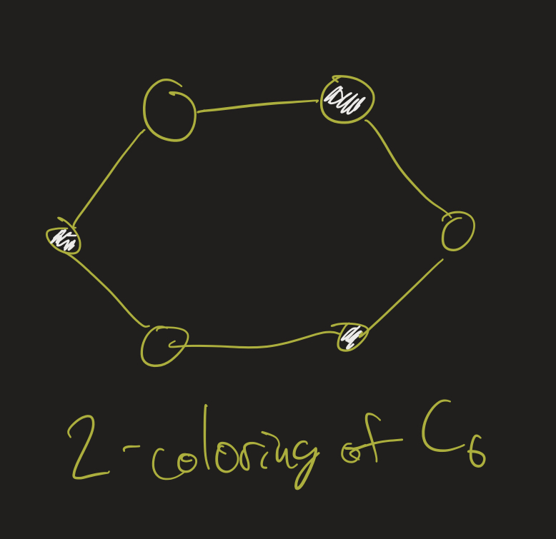

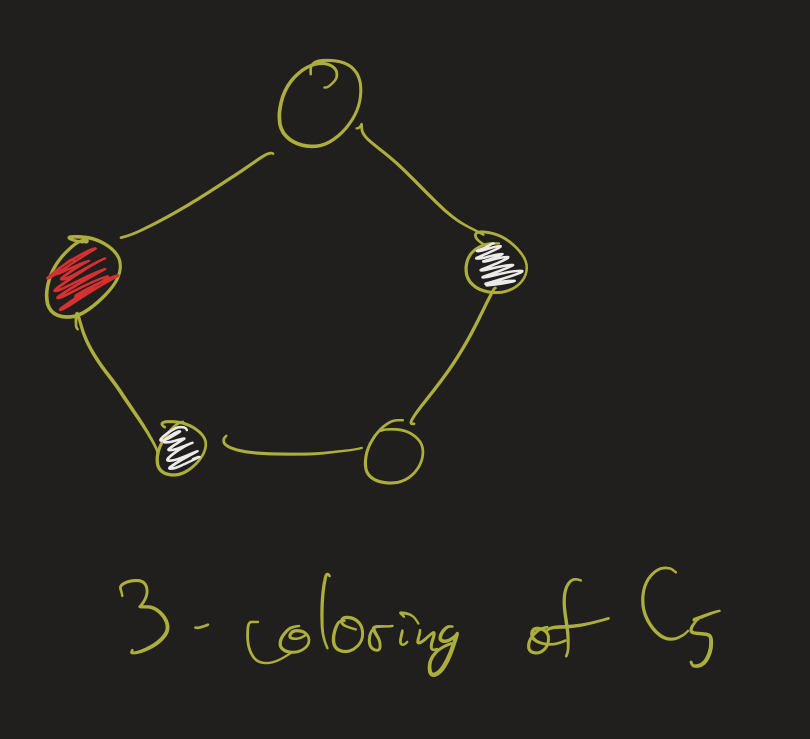

A **proper $k$-coloring** of $G$ is a proper coloring where we only alow $k$ different colors. Sometimes this is thought of as a function $f : V \to \\{ 1, 2, \ldots, k \\}$, with the property that if $(u, v) \in E$, then $f(u) \neq f(v)$. The numbers $1$ to $k$ are called the colors, and $f$ is the coloring. (We use the word proper, here, because one could, in general, think of colorings where we don't require that adjacent vertices get different colors).

A graph is **$k$-colorable** if it has a proper $k$-coloring. The **chromatic number** of a graph, $\chi(G)$, is the least $k$ such that $G$ has a proper $k$-coloring. One says that $G$ is **$k$-chromatic** if $\chi(G) = k$.

**Exercise**: Determine the chromatic number of the following graphs:

<ol>
<li>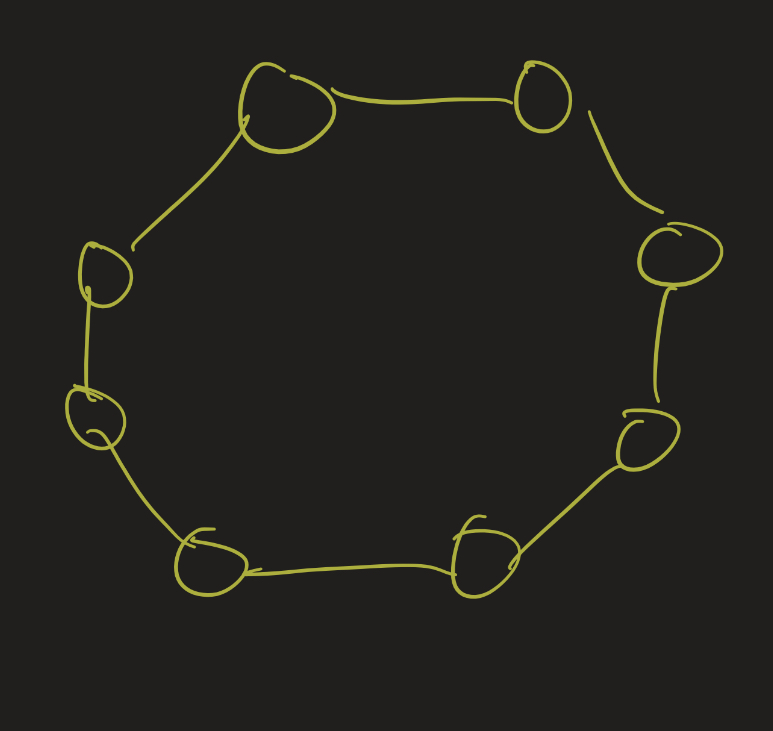</li>
<li>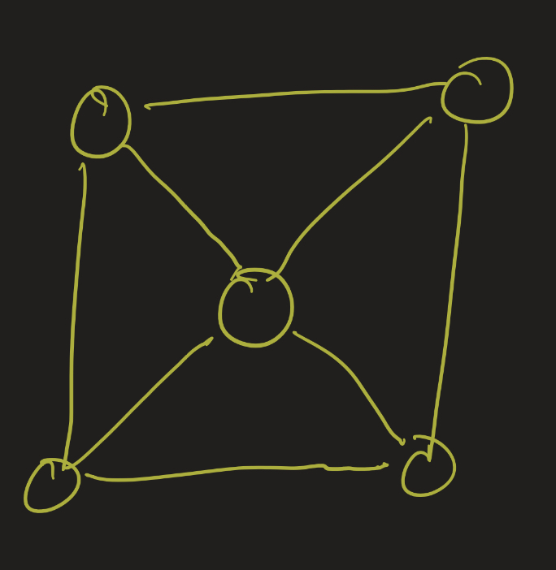</li>
<li>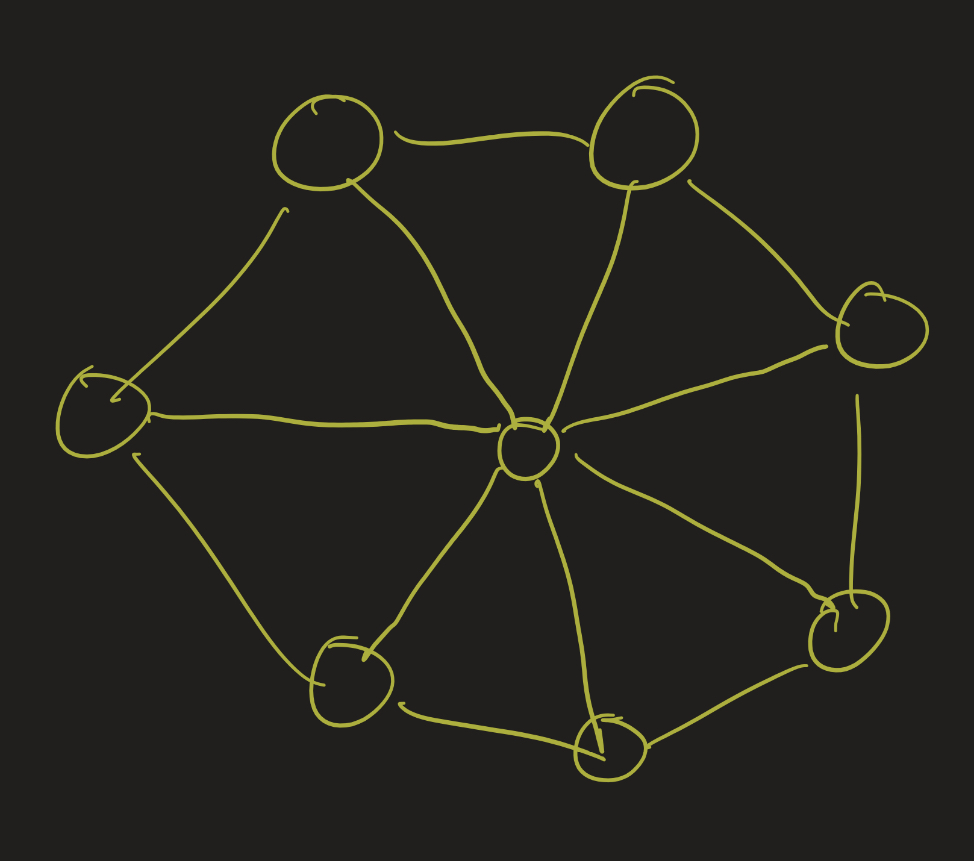</li>
</ol>

    
Check your answers.

    <ol>
        <li>2: every even cycle is 2-colorable.</li>
        <li>3: 2 color the outside cycle, and then a 3rd for the middle vertex.</li>
        <li>4: the outside cycle is odd, so it needs 3 colors. 4th for the middle vertex.</li>
    </ol>

## Applications: Sudoku, Scheduling

Graph coloring problems have some interesting applications. Let's go through two examples: **Sudoku** and **Scheduling**.

Sudoku is a game played on a 9 x 9 board. You have to fill in the squares so that the numbers 1 through 9 appear exactly once in each row, column, and section (the smaller 3x3 sections). We can represent this as a graph theory problem: make a graph with 81 vertices, one for each square on the board. Two vertices are adjacent if they represent positions in the same row, column, or section.

Then the Sudoku game turns into: can you 9-color this graph? Or more specifically, if some of the vertices are already colored in, can you extend this to a 9-coloring of the whole graph?

It's interesting to see this example because it's different from the kind of graphs we have seen before. Instead of edges representing distances or steps, the edges just represent a relationship. More generally, graphs can represent any kind of relationship. If the graph is a simple, undirected graph, then the only restriction on that relationship is that we need it to be symmetric and not reflexive.

Scheduling problems can similarly be modeled as graph coloring problems. Suppose we some number of students at a large school. Each student takes a certain number of courses, and $N$ courses are offered total. How can we schedule meetings (ie final exams) for these courses without causing conflicts?

This can be modeled as a graph coloring problem as follows: have one vertex for each course. Two courses are related (joined by an edge) if there is a student in both courses. Then a minimal coloring of this graph will give us the minimum number of non-overlapping time slots we will need to have to make a schedule with no conflicts.

Again, notice here that the edge relation isn't a kind of distance or "closeness" relation.

## Greedy Coloring

    <iframe src="https://www.youtube.com/embed/BYR-N4JSTvs" frameborder="0" allow="accelerometer; autoplay; clipboard-write; encrypted-media; gyroscope; picture-in-picture" allowfullscreen></iframe>

The **greedy coloring algorithm** is a simple algorithm for finding a proper coloring. It doesn't necessarily always find a coloring with the least number of colors though.

The algorithm works as follows (here we refer to our colors as the numbers $1$ to $k$):

* order the vertices in some way (randomly works fine).
* For each vertex, try to assign it to the least color (1 if possible, or 2 if that's not possible, etc) possible.

Let's go through an example:

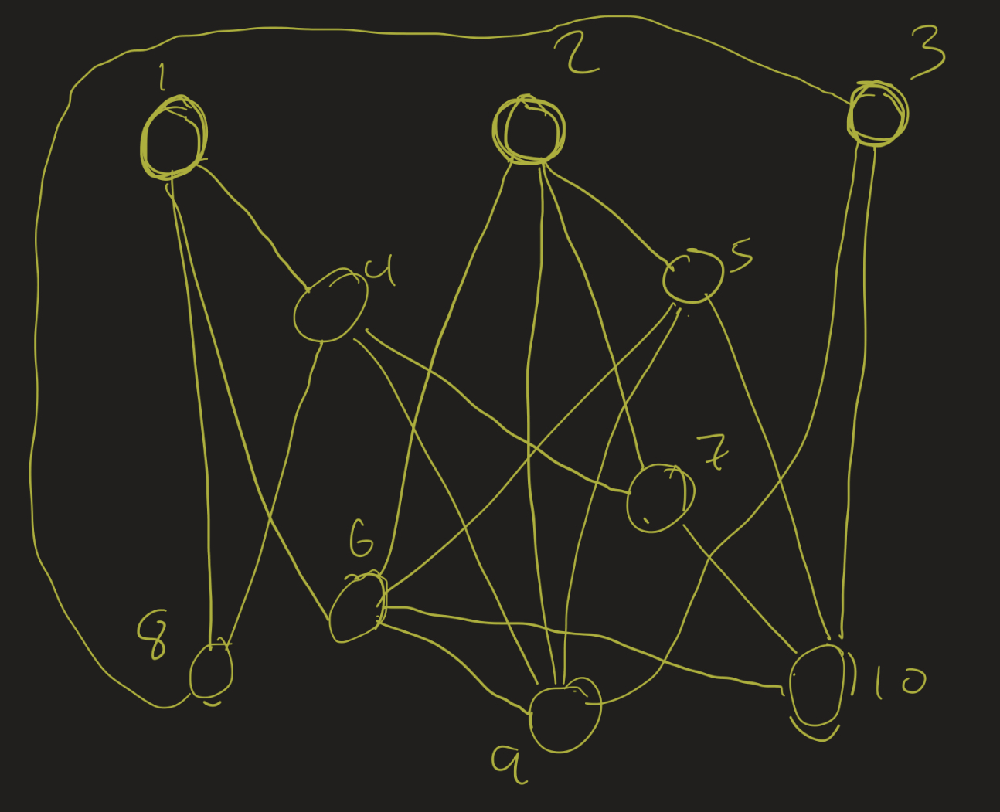

* Color vertex 1 with the color 1
* Vertex 2 is not adjacent to 1, so also color it 1.
* 3: also color it 1
* 4: color it 2, since it's adjacent to a vertex of color 1
* 5: color 2
* 6: color 3
* 7: color 3
* 8: color 3
* 9: color 4
* 10: color 4

We have 4-colored this graph. It turns out that this is a minimal coloring.

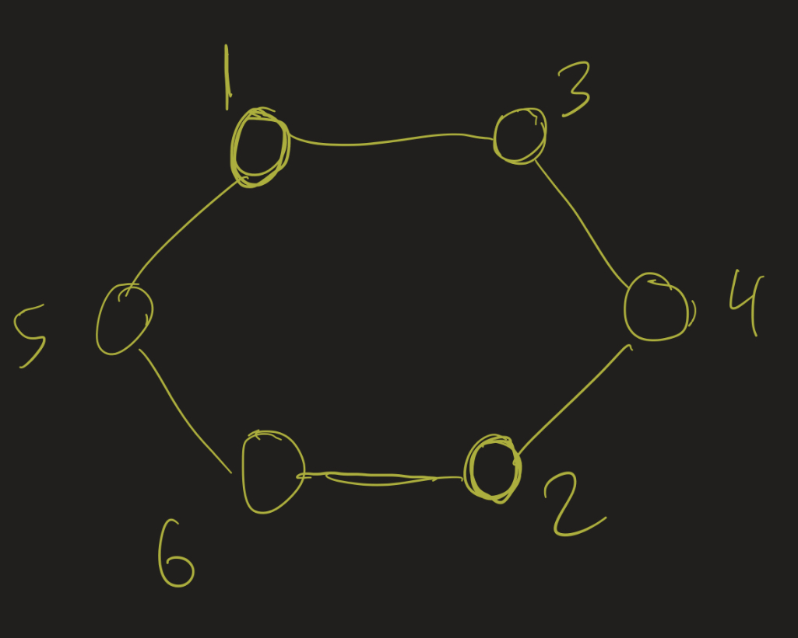

* 1: color 1
* 2: color 1
* 3: color 2
* 4: color 3
* 5: color 2
* 6: color 3

This is a 3-coloring of this graph. But this graph can also be 2-colored!

## NP Completeness

Recall that the complexity class NP is the set of all problems for which any purported solution can be verified in time asymptotically bounded by some polynomial function (ie $O(n^k)$ for some integer $k$).

**Theorem**: 3-colorability is in the complexity class NP.

**Proof**:

Given a graph $G = (V, E)$ with $n$ vertices, and a purported 3-coloring $f : V \to \\{1, 2, 3 \\}$, we can verify if $f$ is actually a 3-coloring in at most $O(n^2)$ steps:

* For each $x, y \in V$, check if $(x, y)$ is an edge. If so, check if $f(x) = f(y)$. If so, this is not a valid coloring (output "FALSE" and end).
* If we can get through all possible pairs of vertices without outputting "FALSE", we have verified that the 3-coloring is proper. So output "TRUE" at the end.

Since there are $\dfrac{n(n-1)}{2} = \frac{1}{2} (n^2 - n)$ possible edges, this algorithm runs in $O(n^2)$ steps.

Moreover, the 3-colorability problem is actually **NP-complete**. This means, roughly, that if one can show that this problem is in the class P, then P = NP. That is: if one can find an algorithm which, given a graph with $n$ vertices, determines if it has a 3-coloring in $O(n^k)$ steps for some $k$, then one will have solved the Millennium Prize Problem P = NP.

## Four Color Map Theorem

This is a fascinating problem in the history of graph theory. Francis Guthrie, in 1852, noticed that a map of England can be colored with 4 colors so that adjacent regions get different colors. It makes sense, for coloring maps, to want adjacent regions to be different colors so that we can highlight those boundaries. He conjectured that this would be true about *any* map: any map is 4-colorable.

It turns out that this is equivalent to a graph theory question: given a map, we can turn it into a graph by making a vertex for each region, and edges between vertices if the corresponding regions share a border on the map.

So the conjecture can be stated in two ways:

* 4 colors suffice to color any map so that adjacent regions get different colors
* Every planar graph is 4-colorable.

There is some interesting history here:

* With elementary methods, one can show that every planar graph has a vertex with degree 5 or less.
* With this result, you can show that every planar graph is 6-colorable.
* Heawood 1892: every planar graph is 5-colorable.
* Many failed proofs / counterexamples
* Appel-Haken 1976: computer assisted proof of the four color theorem.
    * Involved many cases that were infeasible to check by hand.

[Here is a good writeup about this history and an outline of a "newer" proof of this result.](https://people.math.gatech.edu/~thomas/FC/fourcolor.html) Note that "newer" here means from the 1990s.

# Trees (in Graph Theory)

<iframe src="https://www.youtube.com/embed/B2f8ivixW8c" frameborder="0" allow="accelerometer; autoplay; clipboard-write; encrypted-media; gyroscope; picture-in-picture" allowfullscreen></iframe>

We have seen trees previous in terms of partial orders: a tree was defined as a partial order where each branch is linearly ordered. One could turn such a tree into a graph: the vertices are the elements of the partial order, and two vertices are adjacent if one is the immediate successor or predecessor of the other. (Like we do in Hasse diagrams)

In that case, we would end up with a graph. Which graphs are trees in this way? This brings us to the graph-theoretic definition of a tree:

**Definition**: A **tree** (in graph theory) is a connected graph with no cycles.

There are several nice results about trees that we can prove. I will just list them here, but please look at the [proofs from the textbook](http://discrete.openmathbooks.org/dmoi3/sec_trees.html).

**Theorem**: A graph is a tree if and only if there is a unique path between any pair of vertices.

**Theorem**: If $T$ is a tree with at least 2 vertices, then it has at least two vertices of degree one.

**Theorem**: If $T$ is a tree with $n$ vertices, then it has exactly $n - 1$ edges.

**Exercise**: Determine all isomorphism classes of trees with 5 vertices.

Hint: for 5 vertices, there must be only 4 edges. Think about the degree sequences of graphs with 4 edges: recall that the sum of the degrees must be 8. So try to list out all the possible degree sequences, and then try to draw graphs for each sequence.

Solution:

First: a tree with $n$ vertices has exactly $n - 1$ edges. So this must have 4 edges. That means the sum of the degrees must be 8. Let's look at all possible degree sequences with the sum being 8. We can start with one vertex of maximal degree (4):

<ul>
<li>(1, 1, 1, 1, 4)</li>
<li>(1, 1, 1, 2, 3)</li>
<li>(1, 1, 2, 2, 2)</li>
</ul>

And that's it! We cannot increase the degree of any vertex in this last stage without ending up in one of the three scenarios above.

For the degree sequence (1, 1, 1, 1, 4), we only have the following graph:

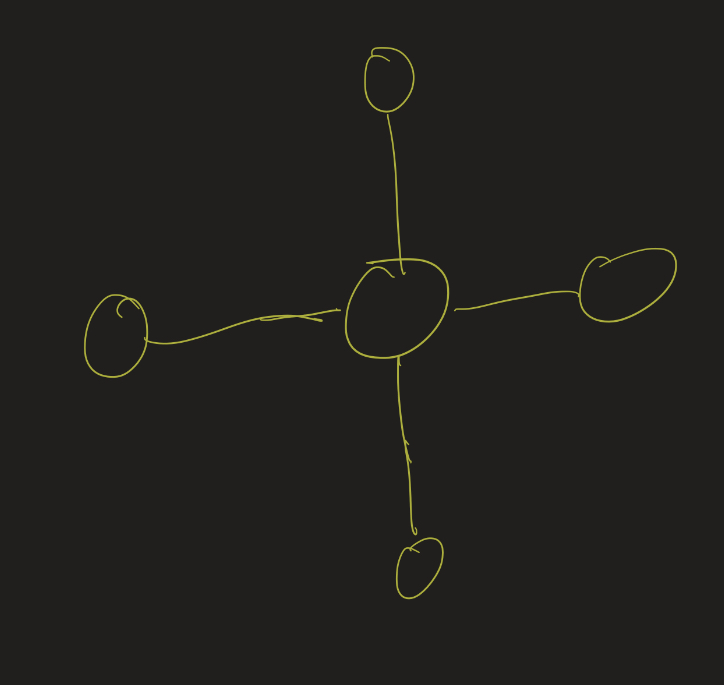

On the other extreme, the degree sequence (1, 1, 2, 2, 2) only gives the "path" graph:

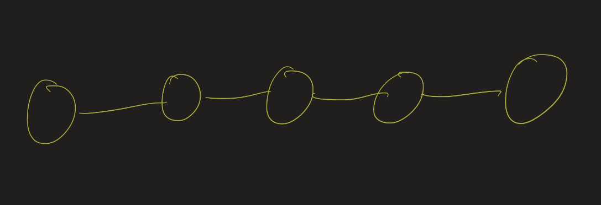

The middle case also only has one isomorphism class. To see this, notice that if $a$ has degree 3, it is adjacent to vertices $b$, $c$, and $d$. One of those vertices must be adjacent to a fifth vertex, $e$. If you draw out each of the three possibilities, you can easily see that they are all isomorphic:

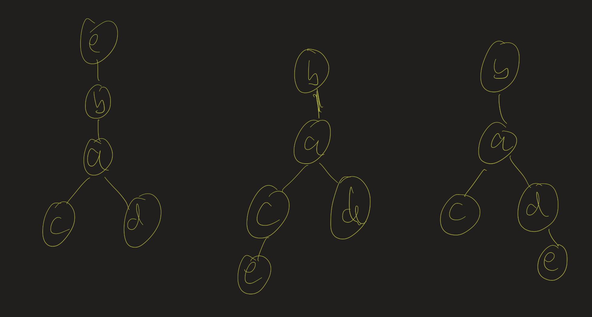

So there are only 3 isomorphism classes for trees with 5 vertices.

## Spanning Trees

<iframe src="https://www.youtube.com/embed/7yF-JCwpb4s" frameborder="0" allow="accelerometer; autoplay; clipboard-write; encrypted-media; gyroscope; picture-in-picture" allowfullscreen></iframe>

Given a graph $G$, a **spanning tree** is a subgraph $T$ that is a tree and which contains all vertices of $G$. This might be useful for cycle detection in networks:

Imagine that you send a request to a server over a network. That request needs to be routed through several possible hubs. If the network has a cycle (which most likely it does), you need to make sure that the request doesn't loop around one of those cycles ad infinitum.

**Theorem**: Every connected graph has a spanning tree.

This is a fairly simple result to prove, since there are actually several algorithms one could use. I will describe two of these:

**Breadth-first search**: Start at some vertex. Add edges to each of its adjacent vertices. Then, for each one of those, add edges to each of their adjacent vertices *that have not already been visited*. If one vertex cannot add new edges, backtrack and go to another vertex.

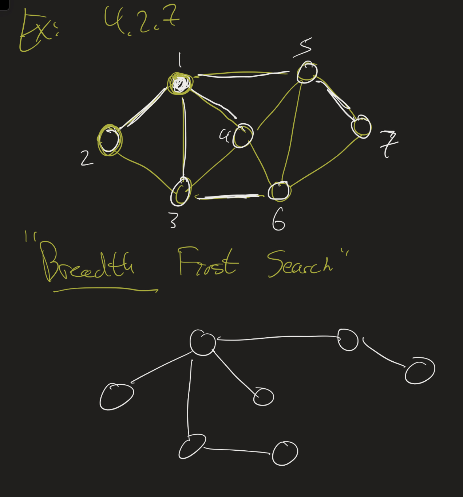

**Depth-first search**: Start at some vertex. Pick any adjacent vertex that has not already been visited, and add an edge to that vertex. Go to that vertex and recursively continue. If, at some point, all adjacent vertices of a vertex have been visited, so we can't add anything new at that step, we back up one step.

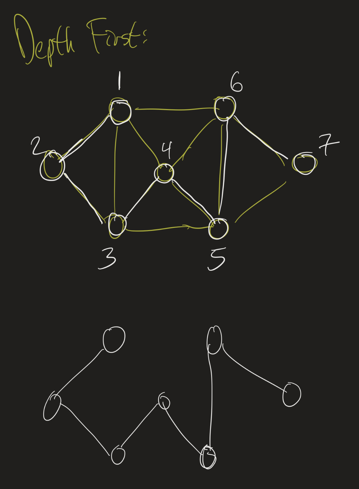

## Rooted Trees and Binary Trees

<iframe src="https://www.youtube.com/embed/PARDgLg10_c" frameborder="0" allow="accelerometer; autoplay; clipboard-write; encrypted-media; gyroscope; picture-in-picture" allowfullscreen></iframe>

Our discussion of trees in graph theory has lost a little bit of the hierarchical structure that we notice from trees from the partial order perspective. To fix this, we can introduce new terminology: a **rooted tree** is a tree with a special vertex denoted as the root. Then its adjacent vertices are referred to as its **children**, and so we can restore a notion of direction (going out from the root), so that **descendants** of a vertex are further from the root, and **ancestors** are closer to the root.

A **leaf** is a vertex with 0 children. The **height** of a vertex is the length of the longest path from the vertex to a leaf, and the **depth** of a vertex is the length of the path from the root to that vertex. The **height** of the tree is the height of the root.

A **binary tree** is a rooted tree where each vertex has at most two children. I want to explore two particular types of binary trees: **full** and **complete** binary trees.

A **full** binary tree has the property that every vertex has exactly 2 children, except for the leaves.

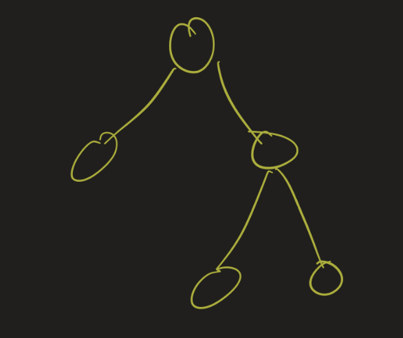

A **complete binary tree** has the property each level of the tree is completely filled except for the last level, and in the last level all nodes are as far left as possible.

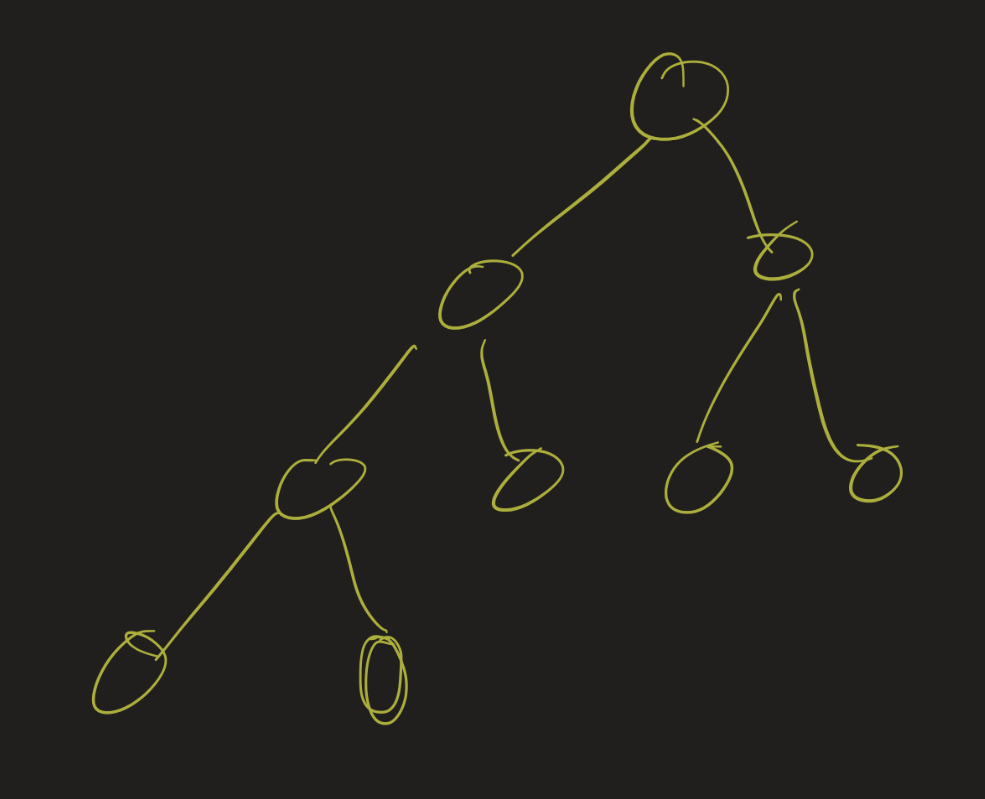

In the video, I mention the following result: for a complete binary tree with height $n$, there are between $2^n$ and $2^{n+1} - 1$ vertices in the tree in total. Can you prove this? (Hint: induction on the height, and assume the last level is completely filled as well. Then relax that constraint to see what happens if that last level is not completely filled).
