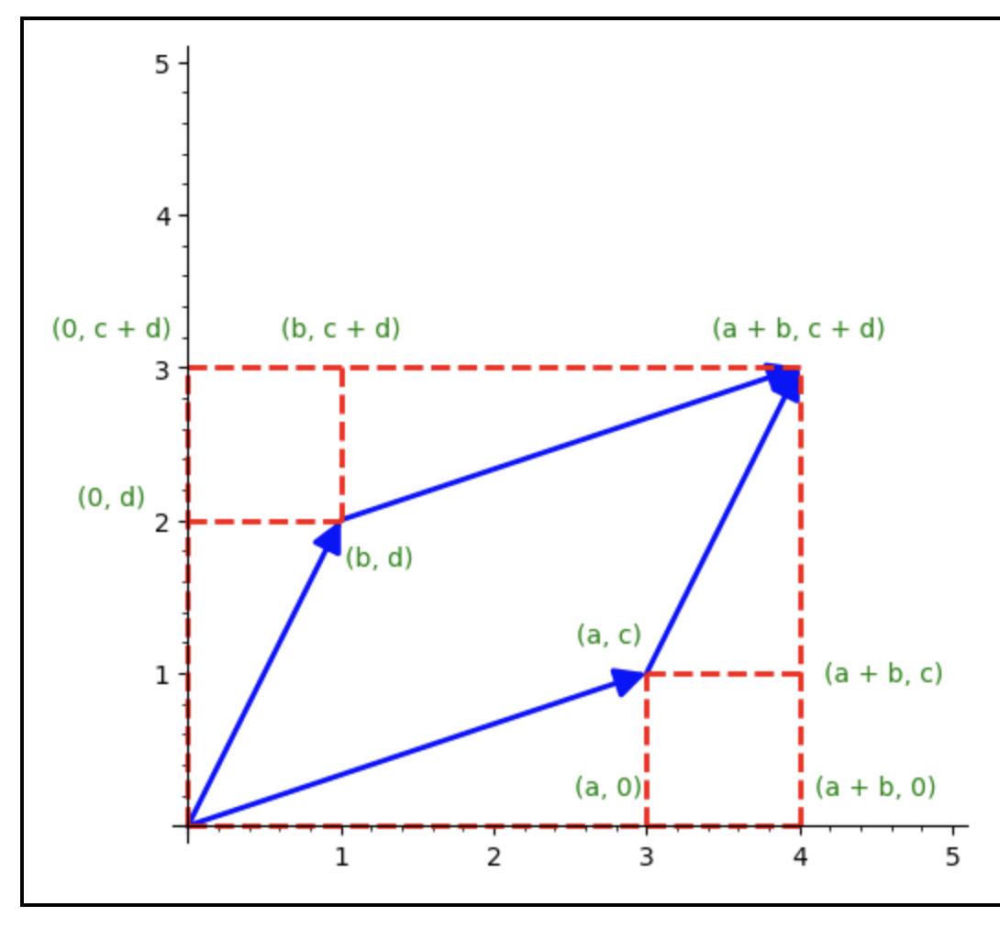

# Linear Lesson 11: Exam Recap / Determinants
{:.no_toc}

1. Table of Contents
{:toc}

# Inconsistency

How can you show that a system is *inconsistent*? You put it in RREF and find a row of all zeros (on the left) that is non-zero on the right.

## Example

**Question**: Show that $\begin{pmatrix}0 \\\ 0 \\\ 1 \end{pmatrix}$ is not in the image of $M = \begin{pmatrix}1 & 0 \\\ 1 & 1 \\\ 0 & 1 \end{pmatrix}$.

How would we do this? Set up an augmented system and use Gaussian Elimination:

$$
\left(\begin{matrix}1 & 0 \\ 1 & 1 \\ 0 & 1 \end{matrix} \: \right| \: \left.\begin{matrix} 0 \\ 0 \\ 1 \end{matrix}\right)
$$

Remember: **eliminate the first column first!** Use -1R1 + R2:

$$
\left(\begin{matrix}1 & 0 \\ 0 & 1 \\ 0 & 1 \end{matrix} \: \right| \: \left.\begin{matrix} 0 \\ 0 \\ 1 \end{matrix}\right)
$$

Now eliminate the second column: -R2 + R3:

$$
\left(\begin{matrix}1 & 0 \\ 0 & 1 \\ 0 & 0 \end{matrix} \: \right| \: \left.\begin{matrix} 0 \\ 0 \\ 1 \end{matrix}\right)
$$

That last row shows the inconsistency: it represents the equation 0 = 1.

## Similar question

Now what if I asked the similar question: *find* a vector that is not in the span of $M = \begin{pmatrix}1 & 0 \\\ 1 & 1 \\\ 0 & 1 \end{pmatrix}$? What would we do? (This was **question 4(a)** on the exam, with different vectors). Again, set up an augmented system and use Gaussian Elimination, but this time, we set it up with the vector $\begin{pmatrix}x \\\ y \\\ z\end{pmatrix}$ as the "right hand side":

$$
\left(\begin{matrix}1 & 0 \\ 1 & 1 \\ 0 & 1 \end{matrix} \: \right| \: \left.\begin{matrix} x \\ y \\ z \end{matrix}\right)
$$

Similarly, we eliminate the first column with -R1 + R2

$$
\left(\begin{matrix}1 & 0 \\ 0 & 1 \\ 0 & 1 \end{matrix} \: \right| \: \left.\begin{matrix} x \\ y - x\\ z \end{matrix}\right)
$$

Now eliminate column 2 with -R2 + R3:

$$
\left(\begin{matrix}1 & 0 \\ 0 & 1 \\ 0 & 0 \end{matrix} \: \right| \: \left.\begin{matrix} x \\ y - x\\ z - (y - x) \end{matrix}\right)
$$

Now we just need to find an inconsistency. That is, we need to find values of $x$, $y$, and $z$ that make the bottom row non-zero. Just plug in zeros for $x$ and $y$ and then find *anything* for $z$ that will make it non-zero: $z - (0 - 0) \neq 0$, just let $z$ be anything that's not zero!

For example, the vector $\begin{pmatrix}0 \\\ 0 \\\ 1\end{pmatrix}$ gives us an inconsistency (as demonstrated earlier). But so does $\begin{pmatrix}0 \\\ 0 \\\ 4 \end{pmatrix}$, and many other vectors.

## Spanning

So we have shown that the vector $\begin{pmatrix}0 \\\ 0 \\\ 1\end{pmatrix}$ is not in the image of $M = \begin{pmatrix}1 & 0 \\\ 1 & 1 \\\ 0 & 1 \end{pmatrix}$. This means that $\begin{pmatrix}0 \\\ 0 \\\ 1\end{pmatrix} \not \in \mathrm{Span}\left( \begin{pmatrix}1 \\\ 1 \\\ 0\end{pmatrix}, \begin{pmatrix} 0 \\\ 1 \\\ 1 \end{pmatrix} \right)$.

**Question**: Add in the vector $\begin{pmatrix}0 \\\ 0 \\\ 1\end{pmatrix}$ to $\mathrm{Span}\left( \begin{pmatrix}1 \\\ 1 \\\ 0\end{pmatrix}, \begin{pmatrix} 0 \\\ 1 \\\ 1 \end{pmatrix} \right)$. Are there any vectors not in this span?

That is: the two vectors $\begin{pmatrix}1 \\\ 1 \\\ 0\end{pmatrix}$ and $\begin{pmatrix} 0 \\\ 1 \\\ 1 \end{pmatrix}$ span a plane in $\mathbb{R}^3$. The vector $\begin{pmatrix}0 \\\ 0 \\\ 1\end{pmatrix}$ is not on that plane. If I add in this third vector, will we now span all of $\mathbb{R}^3$?

The answer should be **yes**, since we are adding a third "dimension" to our set. But how would we prove it? By showing that the matrix $A = \begin{pmatrix}1 & 0 & 0 \\\ 1 & 1 & 0 \\\ 0 & 1 & 1 \end{pmatrix}$ is invertible! This is **question 4(c)** on the exam.

As an aside: what is this matrix $A$? It's the function that we get by letting $A\begin{pmatrix}1 \\\ 0 \\\ 0 \end{pmatrix} = M\binom{1}{0}$, $A\begin{pmatrix}0 \\\ 1 \\\ 0\end{pmatrix} = M\binom{0}{1}$, and $A\begin{pmatrix}0 \\\ 0 \\\ 1\end{pmatrix} = \begin{pmatrix}0 \\\ 0 \\\ 1\end{pmatrix}$.

## Extra Credit

**Due Thursday** on Moodle...

# Areas

Let's think about linearity geometrically again. Think about the "unit square", the square with vertices at the origin, $\binom{1}{0}$, $\binom{0}{1}$, and $\binom{1}{1}$. If $T : \mathbb{R}^2 \to \mathbb{R}^2$ is linear, then $T(\binom{1}{0} + \binom{0}{1}) = T\binom{1}{0} + T\binom{0}{1}$. That means that the unit square is mapped to a parallelogram:

(image of T mapping the unit square to a parallelogram)

What is the area of this parallelogram? For example, consider the matrix $M = \begin{pmatrix}3 & 1 \\\ 1 & 2 \end{pmatrix}$. What is the area of the image of the unit square under $M$? In other words, what's the area of the parallelogram whose vertices are the origin, $\binom{3}{1}$, $\binom{1}{2}$, and $\binom{4}{3}$? [See the graph here.](https://sagecell.sagemath.org/?z=eJxlzb8KgzAQBvBd8B1ujHgUbeno7OQThAxRCmawllOS-Pb9SNMidDq-3_0bqKPB7uKi0vrG1BrWLdPVmKosysKj7R_Tvor6dKHhZGkUZmFWZA1KN0yNYfLQ8U8DtIf2Yl-zmzaVco2xXMdvTmsed6jOWz8NJ71sMyQu7tkRfsTFRpy_Mx0gSnZkq97jXDyy&lang=sage&interacts=eJyLjgUAARUAuQ==)

We could use the area of a parallelogram formula from geometry, but instead of trying to remember that, let's just try to figure it out ourselves. This parallelogram sits inside of a 4 x 3 rectangle. We can draw that rectangle, and slice it up into rectangular and triangular regions whose areas we know how to calculate, and then find the area of the parallelogram:

To find the area of the parallelogram, we first will need to find the following areas:

1. The area of the big rectangle: this is $4 \times 3 = 12$.
2. The area of the small rectangle on the top left: this is $1 \times 1 = 1$.
3. The area of the triangle on top: this is $\frac{1}{2}(3 \times 1) = \frac{3}{2}$.
4. The area of the triangle on the bottom: $\frac{1}{2}(3 \times 1) = \frac{3}{2}$. (Notice?)
5. The area of the left triangle: $\frac{1}{2}(2 \times 1) = 1$.
6. The area of the right triangle: $\frac{1}{2}(2 \times 1) = 1$. (Notice?)
7. The area of the rectangle on the bottomr right: $1 \times 1 = 1$.

Subtract all those smaller areas from the big rectangle, and we get that the area is $12 - (1 + \frac{3}{2} + \frac{3}{2} + 1 + 1 + 1)$, which is $5$.

## Exercise

Consider the rectangle with vertices at the origin, $\binom{2}{0}$, $\binom{0}{3}$ and $\binom{2}{3}$. What is the area of this rectangle? What is the image of this rectangle? What is the area of the image of this rectangle?

Check your answers

<ul>
<li>The area of the rectangle is $2 \times 3 = 6$.</li>
<li>The image of the rectangle is the parallelogram with vertices at the origin, $\binom{6}{2}$, $\binom{3}{6}$, and $\binom{9}{8}$.</li>
<li>To find the area: first take the area of the big rectangle ($9 \times 8 = 72$). Then the following areas are:
<ol>
<li>Top rectangle: $3 \times 2 = 6$.</li>
<li>Top triangle: $\frac{1}{2}(2 \times 6) = 6$.</li>
<li>Bottom triangle: $\frac{1}{2}(2 \times 6) = 6$.</li>
<li>Left triangle: $\frac{1}{2}(3 \times 6) = 9$.</li>
<li>Right triangle: $\frac{1}{2}(3 \times 6) = 9$.</li>
<li>Bottom rectangle: $3 \times 2 = 6$.</li>
</ol>
So the area of the parallelogram is $72 - (6 + 6 + 6 + 9 + 9 + 6) = 30$.</li>
</ul>

Notice that the area of the parallelogram is 5 times the area of the original rectangle! This is the same amount by which we re-scaled the area of the unit square as well!

## Determinants

For any 2D shape in the plane, in general, this  $\begin{pmatrix}3 & 1 \\\ 1 & 2\end{pmatrix}$ will re-scale *every* shape by the same factor of 5. This might not be immediately obvious, but it boils down to the idea of linearity. Remember the "Essence of Linear Algebra" videos, and how they depicted linear functions changing the "gridlines" of a plane? That's exactly the image we should have in mind: that the "coordinate grid" is transformed in some way, and there is this one, constant scaling factor that tells you the area of the parallelograms we get in those gridlines. In this case, each of the parallelograms in the gridlines would have an area of 5.

This is not unique to this particular matrix. Every single matrix $A = \begin{pmatrix} a & b \\\ c & d\end{pmatrix}$ will similarly have a scaling factor. We call this scaling factor the **determinant**.

**Definition**: The determinant of a $2 \times 2$ matrix $A$ is the area of the image of the unit square under $A$. That is, it is the area of the parallelogram whose vertices are the origin, $A\binom{1}{0}$, $A\binom{0}{1}$, and $A\binom{1}{1}$.

How do we compute this area? Again, suppose $A = \begin{pmatrix}a & b \\\ c & d\end{pmatrix}$. Then the image of the unit square would be:

Let's come up with a formula the same way we did before. First, the area of the big rectangle is $(a + b) \times (c + d)$ (length times width). Do a little bit of algebra to get $ac + ad + bc + bd$.

Next, we compute the following areas:

1. The top left rectangle: $b \times c$.
2. The top triangle: $\frac{1}{2}(a \times c)$.
3. The bottom triangle: $\frac{1}{2}(a \times c)$.
4. The left triangle: $\frac{1}{2}(b \times d)$.
5. The right triangle: $\frac{1}{2}(b \times d)$.
6. The bottom right rectangle: $b \times c$.

Add these up: $bc + \frac{1}{2}(ac) + \frac{1}{2} ac + \frac{1}{2}bd + \frac{1}{2}bd + bc = 2bc + ac + bd$.

Now subtract this from the larger area: $A = (ac + ad + bc + bd) - (2bc + ac + bd)$. The $ac$ and $bd$ terms cancel, and we are left with $ad - bc$. This is the formula for the **determinant**!

$\mathrm{det}(A) = ad - bc$.

**Notation**: We use vertical bars (absolute value notation) to denote the determinant of a matrix.

## Areas of parallelograms

This actually gives us a formula for the area of *any* parallelogram with one corner at the origin. Suppose we have vectors $\vec{v} = \binom{v_1}{v_2}$ and $\vec{w} = \binom{w_1}{w_2}$. Then the area of the parallelogram with vertices at the origin, $\vec{v}$, $\vec{w}$ and $\vec{v} + \vec{w}$ is $v_1 w_2 - v_2 w_1$!

Consider the matrix $T = \begin{pmatrix}2 & 1 \\\ 1 & 2 \end{pmatrix}$. The determinant of $T$ is $2 \times 2 - 1 \times 1 = 3$. I claim that $T$ rescales *every* parallelogram by a factor of $3$ (I said this earlier, but let's do the algebra now to reassure ourselves). That is, let's look at the vectors $T(\vec{v})$, $T(\vec{w})$ and $T(\vec{v} + \vec{w})$, and look at the area of that parallelogram:

* $T(\vec{v}) = \binom{2v_1 + v_2}{v_1 + 2v_2}$.
* $T(\vec{w}) = \binom{2w_1 + w_2}{w_1 + 2w_2}$.

The area of the the parallelogram whose vertices are at the origin, $T(\vec{v})$, $T(\vec{w})$, and $T(\vec{v}) + T(\vec{w})$ would then be found by the same formula: $(2v_1 + v_2)(w_1 + 2w_2) - (v_1 + 2v_2)(2w_1 + w_2)$. Let's do some algebra:

$$
\begin{align}
(2v_1 + v_2)(w_1 + 2w_2) - (v_1 + 2v_2)(2w_1 + w_2) \\
= (2v_1 w_1 + 4v_1 w_2 + v_2 w_1 + 2 v_2w_2) - (2v_1w_1 + v_1 w_2 + 4 v_2 w_1 + 2 v_2 w_2) \\
= 3v_1 w_2 - 3 v_2 w_1 \\
= 3(v_1 w_2 - v_2 w_1)
\end{align}
$$

That is: it's just 3 times the area of the original parallelogram. We've shown that this matrix $T$ always rescales parallelograms by a factor of 3!

## Negative Determinants

...

## Zero Determinant

...

## Product of Determinants

...

# Homework
