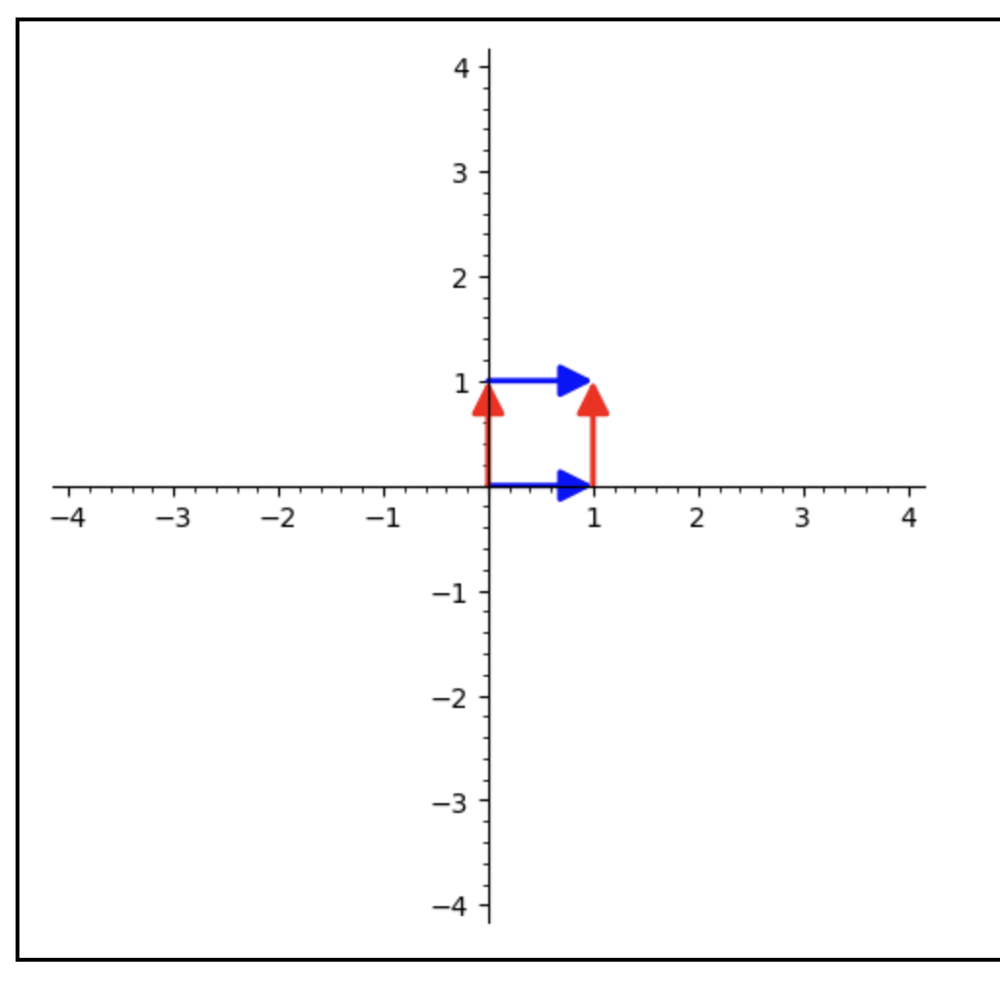
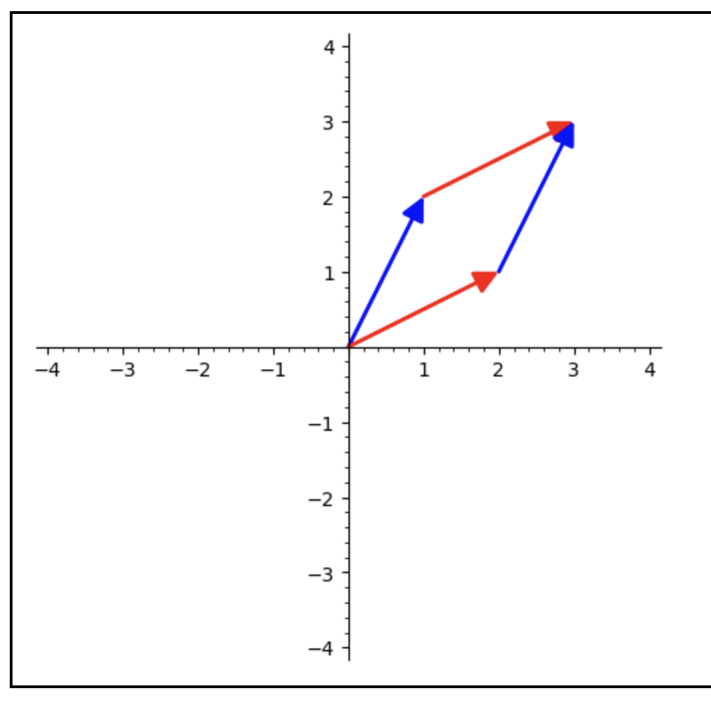
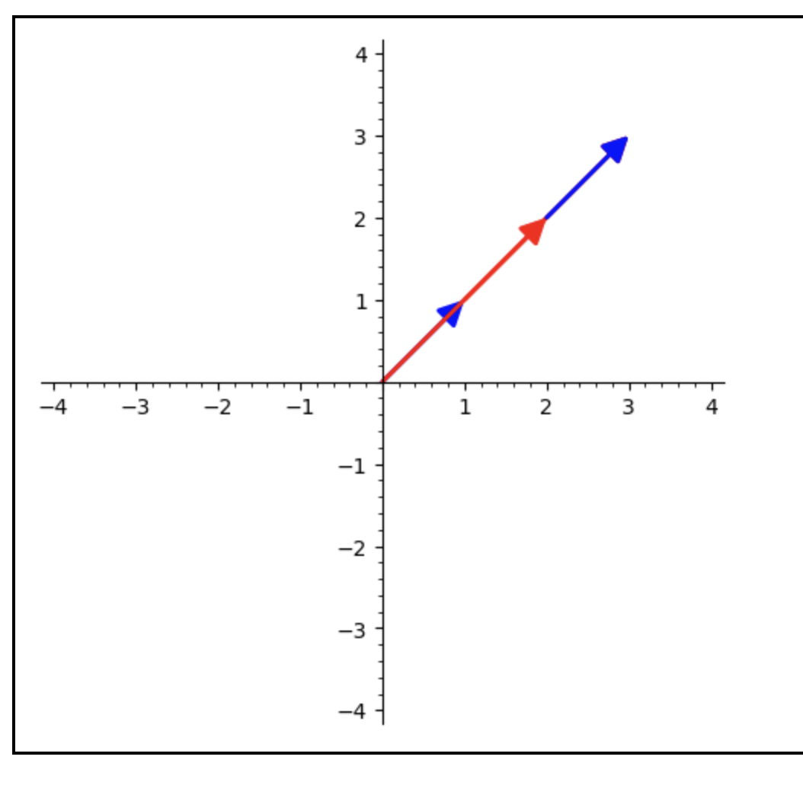

# Linear Lesson 12: Determinants, generalized
{:.no_toc}

1. Table of Contents
{:toc}

# Pre-work

1. What does a negative determinant mean (for a 2 x 2 matrix)
2. What would a determinant of zero mean? (For a 2 x 2 matrix)
3. What does the determinant of a 3 x 3 matrix mean?

**Negative determinant**: Consider the matrix $A = \begin{pmatrix}1 & 2 \\\ 2 & 1 \end{pmatrix}$. What does it do to the unit square?

In this picture, the "blue" arrow is what happens to the "x" vector $\binom{1}{0}$, and the "red" one is the image of the "y" vector $\binom{0}{1}$:

Notice that the blue arrow is now "on the wrong side" of the red arrow. This is why the detemrinant of this matrix is negative: it represents the "orientation" of the parallelogram being changed.

**Zero determinant**: For a matrix $B = \begin{pmatrix}a & b \\\ c & d\end{pmatrix}$, if $ad - bc = 0$, then $ad = bc$. When can this happen?

* If either $a = 0$ or $d = 0$ and either $b = 0$ or $c = 0$, or
* If $\frac{a}{c} = \frac{b}{d}$.

In the first case, we would either have a row of all zeros or a column of all zeros. If it's a column of all zeros, then the matrix maps the unit square to a single vector. In other words, it maps a 2D area to a 1D line.

In the second case, both vectors $\binom{a}{c}$ and $\binom{b}{d}$ are on the same line! We can tell because if $\frac{a}{c} = \frac{b}{d}$, then that means there is some number $k$ that you can "reduce" the numerator and denominator on one side to get to the other. In other words: $ak = b$ and $ck = d$, so the *vectors* $\binom{a}{c}$ and $\binom{b}{d}$ are scalar multiples of each other!

But in both of these cases, we get the same picture: the unit square is mapped onto a line! This means that the area would be zero, since we no longer have a 2D shape! For example, consider the matrix $M = \begin{pmatrix}1 & 2 \\\ 1 & 2\end{pmatrix}$. This is what happens to the unit square:

This is interesting geometrically, but it also tells us something deep about the function itself: *all* of the outputs of $M$ will lie on that same line. So that means the image of $M$ is one-dimensional! Since $M$ maps a 2D space into a 1D space, it cannot be invertible (would the inverse of $\binom{2}{2}$ be $\binom{0}{1}$ or $\binom{2}{0}$? There are many things that are mapped to the same vector!). **In general**: a matrix $A$ is invertible if and only if $mathrm{det}(A) \neq 0$.

**3 x 3**: This is what we will talk about today! The determinant of a $3 \times 3$ matrix is still supposed to represent a scaling factor. But since we're in three dimensions, instead of talking about what happens to the unit square, we will talk about what happens to the **unit cube**. And instead of it becoming a parallelogram, it can becomes a 3D shape known as a *parallelepiped*. Let's go through some examples to figure out how to compute it.

# Volumes

Consider the unit cube:

(picture)

The volume is $1 \times 1 \times 1 = 1$.

What is the volume of the image of the unit cube under the following transformations?

First: $A = \begin{pmatrix}2 & 0 & 0 \\\ 0 & 1 & 0 \\\ 0 & 0 & 1 \end{pmatrix}$

(picture / link)

Notice that multiplying one row by a scalar re-scales the volume. (This makes sense, right? $V = l \times w \times h$ for a rectangular prism?)

What if we add a scalar multiple of one row to another?

$B = \begin{pmatrix}1 & 0 & 0 \\\ 2 & 1 & 0 \\\ 0 & 0 & 1 \end{pmatrix}$

(picture)

The formula for volume is $Area(base) \times height$. So first we need to find the area of the base. That base is just in the $xy$-plane, it's a parallelogram:

(picture)

We know the area of a parallelogram with sides at $\binom{1}{2}$ and $\binom{0}{1}$: this is $1 \times 1 - 0 \times 2 = 1$. The height of this shape is $1$, so the volume is $1 \times 1 = 1$.

This will generalize: adding a scalar multiple of one row to another will not change the resulting volume!

What if we swap rows?

$C = \begin{pmatrix}0 & 1 & 0 \\\ 1 & 0 & 0 \\\ 0 & 0 & 1 \end{pmatrix}$

(picture / link?)

We still get a unit cube, but **orientation** changes. Instead of "right" / "forward" / "up" orientation ($\hat{i}$ / $\hat{j}$ / $\hat{k}$), the cube is *oriented* a different way: $\hat{j}$ / $\hat{i}$ / $\hat{k}$. If you remember something about the "right-hand rule" (point your right hand in the direction of the first vector, then curl in the direction of the second), this has a "negative" orientation!

In other words: swapping rows *negates* the "signed" volume of the cube, where the sign represents a "positively" or "negatively" oriented cube.

## Examples

Using these rules, let's do some examples, before working our way to some generalizations. What is the volume of the image of the unit cube under the transformation $M = \begin{pmatrix}1 & 0 & 1 \\\ 0 & 1 & 1 \\\ 1 & 1 & 0 \end{pmatrix}$

Let's try to get this to the identity matrix, but keep track of what we do at each step!

$$
\begin{pmatrix}1 & 0 & 1 \\ 0 & 1 & 1 \\ 1 & 1 & 0 \end{pmatrix}
$$

Start by doing -1 R1 + R3:

$$
\begin{pmatrix}1 & 0 & 1 \\ 0 & 1 & 1 \\ 0 & 1 & -1 \end{pmatrix}
$$

Now -1 R2 + R3:

$$
\begin{pmatrix}1 & 0 & 1 \\ 0 & 1 & 1 \\ 0 & 0 & -2 \end{pmatrix}
$$

Now multiply R3 by $-\frac{1}{2}$:

$$
\begin{pmatrix}1 & 0 & 1 \\ 0 & 1 & 1 \\ 0 & 0 & 1 \end{pmatrix}
$$

Now add -1R3 + R1 and -1R3 + R2 to finally get the identity:

$$
\begin{pmatrix}1 & 0 & 0 \\ 0 & 1 & 0 \\ 0 & 0 & 1 \end{pmatrix}
$$

So we have the identity matrix. We know that this keeps the unit cube as it is, so the volume of its unit cube is 1. To find the volume of the image of the unit cube under $M$, we work backwards (opposite steps in the opposite order):

* We can ignore all of the times we added scalar multiples of one row to another, since that doesn't change the volume.
* We only need to worry about "interchanging rows" (which we never did), and "multiplying a row by a scalar".
* The only time we multiplied a row by a scalar was when we multiplied by $-\frac{1}{2}$. So working backwards, we should divide $1 \div -\frac{1}{2} = -2$

So the volume of the cube under this transformation is -2!

Another example:

$$A = \begin{pmatrix}1 & 2 & 0 \\\ 3 & 4 & 2 \\\ 5 & 6 & 4\end{pmatrix}$$

Start with -3R1 + R2 and -5R1 + R3:

$$\begin{pmatrix}1 & 2 & 0 \\\ 0 & -2 & 2 \\\ 0 & -4 & 4\end{pmatrix}$$

Multiply R2 by $-\frac{1}{2}$:

$$\begin{pmatrix}1 & 2 & 0 \\\ 0 & 1 & 1 \\\ 0 & -4 & 4\end{pmatrix}$$

Now add 4R2 + R3:

$$\begin{pmatrix}1 & 2 & 0 \\\ 0 & 1 & 1 \\\ 0 & 0 & 0\end{pmatrix}$$

This matrix maps the entire unit cube to the $xy$-plane! That is, the $z$ component of every vector is zero! So it maps a 3D cube into a 2D parallelogram! It has no volume!

This is the image of the unit cube under this transformation:

(picture)

## Triangular and Diagonal Matrices

As another example, what if our matrix looks like $A = \begin{pmatrix} a_{1, 1} & a_{1, 2} & a_{1, 3} \\\ 0 & a{2, 2} & a_{2, 3} \\\ 0 & 0 & a_{3, 3} \end{pmatrix}$?

(picture)

Again, we would look at the area of the base (which would be $a_{1,2} \times a_{2, 2}$) times the height ($a_{3, 3}$). So the volume is $a_{1, 1} \times a_{2, 2} \times a_{3, 3}$!

**Definition**: An $n \times n$ matrix $A = (a_{i, j})$ is called **upper-triangular** if whenever $i > j$, then $a_{i, j} = 0$.

(picture from notes)

(We can similarly define *lower triangular* matrices.)

**Definition**: An $n \times n$ matrix $D = (d_{i, j})$ is called a **diagonal matrix** if whenever $i \neq j$, then $a_{i, j} = 0$.

A diagonal matrix basically rescales a cube into a rectangular prism: the first number on the diagonal tells you how to stretch the "x"-direction, the second number tells you how to stretch the "y"-direction, etc. So that means that the "volume" should be re-scaled by the product of all of those diagonal entries.

# Determinants

The real notion of determinant should generalize the "scaling factors" we've seen in the 2D and 3D cases. For example, it *should* make the determinant of a diagonal matrix equal to just the product of the diagonal entries (similar to the determinant of a triangular matrix). Before we find the formula for the determinant of a general $n \times n$ matrix, we need a definition:

**Definition**: For an $n \times n$ matrix $A = (a_{i, j})$, the **$(i, j)$-minor** $A^{(i, j)}$ is the $(n-1) \times (n - 1)$ matrix with row $i$ and column $j$ deleted.

For example, if $A = \begin{pmatrix}1 & 4 \\\ 0 & 1\end{pmatrix}$, the $(2, 1)$-minor is the $1 \times 1$ matrix $(4)$.

For the matrix $B = \begin{pmatrix}1 & 2 & 5 \\\ 0 & 0 & 7 \\\ 1 & 0 & 0\end{pmatrix}$, the $(3, 2)$-minor $B^{(3, 2)} = \begin{pmatrix}1 & 5 \\\ 0 & 7\end{pmatrix}$.

We then can define the determinant "inductively":

If $A = ( a )$ is a $1 \times 1$ matrix, then $\mathrm{det}(A) = a$.

## Aside: $n = 1 \implies n = 2$

Consider a $2 \times 2$ matrix $A = \begin{pmatrix} a_{1,1} & a_{1, 2} \\\ a_{2, 1} & a_{2, 2} \end{pmatrix}$. We already know that the determinant is $a_{1, 1} a_{2, 2} - a_{2, 1} a_{1, 2}$. But this is $a_{1, 1} \cdot det(A^{(1, 1)}) - a_{2, 1} \cdot det(A^{(2, 1)})$.

Similarly, from $n = 2$ to $n = 3$:

$$
\left|\begin{matrix} a_{1, 1} & a_{1, 2} & a_{1, 3} \\ a_{2, 1} & a_{2, 2} & a_{2, 3} \\ a_{3, 1} & a_{3, 2} & a_{3, 3} \end{pmatrix} \right| = a_{1, 1} det(A^{(1, 1)}) - a_{2,1} det(A^{(2, 1)}) + a_{3, 1} det(A^{(3, 1)})
$$

We start at the top left entry, multiply that entry by the determinant of the matrix you get by deleting row 1 and column 1, and then go down, switch signs, and multiply the second entry with the determinant you get by deleting row 2 and column 1, etc.

Every time we "go down" one row, we switch signs.

## Inductive Definition

Inductively assume that $det(B)$ is defined for all $(n - 1) \times (n - 1)$ matrices $B$. Let $A = (a_{i, j})$ for $1 \leq i, j \leq n$. Then:

$$
det(A) = \sum_{i = 1}^{n} (-1)^{i - 1} a_{i, 1} det(A^{(i, 1)})
$$

For example, let's compute the following determinants:

1. $A = \begin{pmatrix}1 & 2 & 3 \\\ 0 & 1 & 2 \\\ 0 & 0 & 1\end{pmatrix}$.
2. $B = \begin{pmatrix}1 & 0 & 0 \\\ 2 & 1 & 0 \\\ 3 & 2 & 1\end{pmatrix}$.

$B$ is the **transpose** of $A$: the matrix we get by switching rows with columns.

For $A$: $1 det(\begin{pmatrix}1 & 2 \\\ 0 & 1\end{pmatrix}) - 0 + 0 = 1(1 - 0) = 1$.

For $B$: $1 det(\begin{pmatrix}1 & 0 \\\ 2 & 1\end{pmatrix}) - 2det(\begin{pmatrix}0 & 0 \\\ 2 & 1\end{pmatrix}) + 3det(\begin{pmatrix}0 & 0 \\\ 1 & 0\end{pmatrix})$. But this is just $1(1 \times 1 - 0) - 2(0 - 0) + 3(0 - 0) = 1$.

These two matrices have the same determinant! This is true in general: if $A^T$ is the transpose of $A$, then $det(A) = det(A^T)$!

# Properties

1. $det(AB) = det(A) det(B)$. Can you figure out why? Think about what the matrix $AB$ does to the unit square / cube / etc.
2. $det(A) = det(A^T)$.
3. $det(A) = 0$ if and only if $A$ is not invertible (sometimes called "singular")
   * This happens if and only if the columns are linearly *dependent* (some column is in the span of the others),
   * This is also true if and only if the *rows* are linearly dependent
4. If $A$ is invertible, then $det(A^{-1}) = det(A)^{-1}$ (that is, it's $\frac{1}{det(A)}$!

For (4): can you see you? If $A$ is invertible, then $AA^{-1} = I$. By property (1), $det(AA^{-1}) = det(A) det(A^{-1})$. But since $det(I) = 1$, then $det(A) det(A^{-1}) = 1$. Now divide both sides by $det(A^{-1})$!

## Checkerboard of signs

**Important**: We defined the determinant by "going down column 1". But we didn't have to do it that way. Column 1 isn't special. We can go down any column or even across any row, as long as we keep track of plus / minus signs:

$$
\left|\begin{matrix}+ & - & + & \ldots \\ - & + & - & \ldots \\ + & - & + \\ ldots \\ \vdots & \vdots & \vdots & \vdots \right|
$$

For example, let's compute the following:

$$
\left| \begin{matrix}1 & 0 & 1 \\ 3 & 0 & 0 \\ 0 & 2 & 1\end{matrix} \right|
$$

We could go down column 1, but actually the computation is easier if we either go down column 2 or across row 2. Let's go across row 2. Using our checkerboard, we know that we need to start with a negative:

$$
-3 \cdot det(\begin{pmatrix}0 & 1 \\\ 2 & 1\end{pmatrix}) + 0 + 0
$$

This simplifies the problem, since we only need to look at *one* determinant! Keep going and you'll get $-3(0 - 2) = 6$. The determinant is 6!

Let's check again, going down column 2. Since we have two zeros there, we only need to look at that bottom 2. Looking at our checkerboard, we start with a negative:

$$
-2 \cdot det(\begin{pmatrix}1 & 1 \\\ 3 & 0 \end{pmatrix}) = -2 \cdot (0 - 3) = 6
$$

Same answer!

# Problem Set 3

...

# Presentation 2

...
