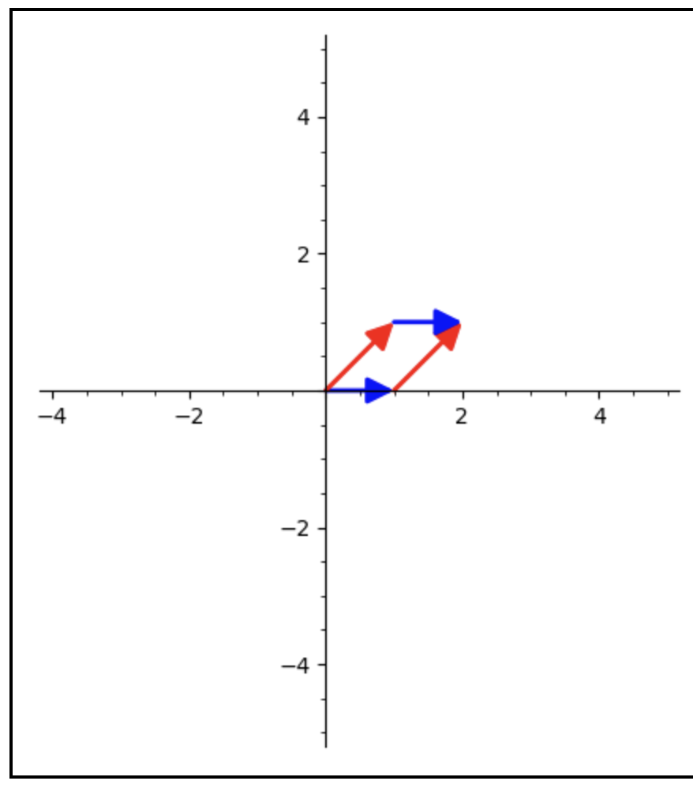
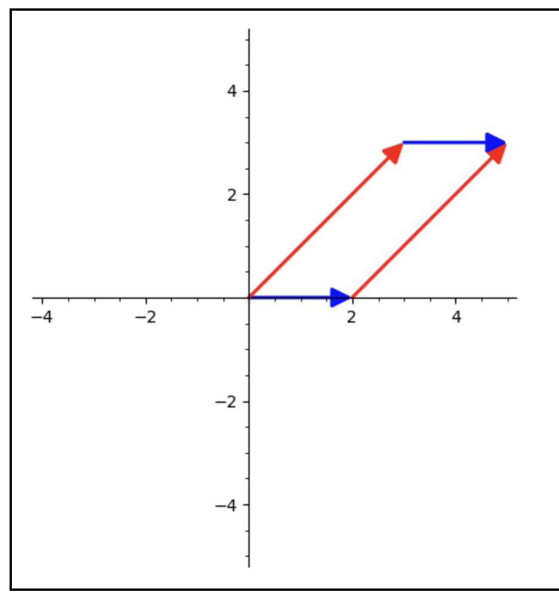

# Linear Lesson 13: Vector Spaces (Introduction)
{:.no_toc}

# Warm-up

Compute the following determinants:

1. $\left\| \begin{matrix} 1 & 4 & 5 \\\ 0 & 0 & 2 \\\ 1 & 5 & 1 \end{matrix} \right\|$. Remember that this is easier if you use a row or column that has as many zeros as possible, and remember the "checkerboard of signs".
2. $\left\| \begin{matrix} 2 & 1 \\\ 0 & 3 \end{matrix} \right\|$

## Invariant Subspaces

Let's examine this second matrix a bit more closely. Call this matrix $A$. Its determinant is $6$. That means it re-scales the unit square by a factor of 6. But it doesn't literally stretch the unit square into a $1 \times 6$ rectangle, or even a $2 \times 3$ rectangle. So what is it doing?

It turns out: it's stretching out a *different set of axes*! So instead of looking at $\binom{1}{0}$ and $\binom{0}{1}$, let's look at $\binom{1}{0}$ and $\binom{1}{1}$.

Notice that $A\binom{1}{0} = \binom{2}{0}$ and $A \binom{1}{1} = \binom{3}{3}$. That is: $A$ stretches vectors out on the $\binom{1}{0}$ direction by a factor of 2, and stretches vectors out in the $\binom{1}{1}$ direction by a factor of 3! In other words, $A$ turns this parallelogram:

into this one:

As we will see later in the semester, often it is nice to try to find the directions, if any, that a matrix might "stretch out". This will have some really interesting applications, and also just tell us a lot about the transformation.

# Problem Set Questions

Let $A$ be an $m \times n$ matrix with entries $a_{i,j}$, for $1 \leq i \leq m$ and $1 \leq j \leq n$. (That is: $a{i,j}$ is the entry in the $i^{\text{th}}$ row and $j^{\text{th}}$ column.) Let $B$ be an $n \times r$ matrix with entries $b_{j,k}$, for $1 \leq j \leq n$ and $1 \leq k \leq r$, and let $C$ be an $r \times s$ matrix with entries $c_{k,l}$, for $1 \leq k \leq r$ and $1 \leq l \leq s$.
  * What is the entry in the $i^\text{th}$ row and $k^\text{th}$ column of the matrix $AB$? Use $\Sigma$ notation to express this as compactly as possible.
  * What is the entry in the $j^\text{th}$ row and $l^\text{th}$ column of $BC$?
  * Show that $A(BC) = (AB)C$. This shows that matrix multiplication is associative.

The point of this problem is to show that matrix multiplication is associative. This problem turns out to be a bit of a slog, but it's a valuable exercise anyway since it teaches us something about the right way to look at a problem in mathematics.

The matrix $A$ is:

$$
\begin{pmatrix}
a_{1, 1} & a_{1, 2} & \ldots & a_{1, n} \\
a_{2, 1} & a_{2, 2} & \ldots & a_{2, n} \\
\vdots & \vdots & \ldots & \vdots \\
a_{m, 1} & a_{m, 2} & \ldots & a_{m, n}
\end{pmatrix}
$$

And $B$ is:

$$
\begin{pmatrix}
b_{1, 1} & b_{1, 2} & \ldots & a_{1, r} \\
b_{2, 1} & b_{2, 2} & \ldots & a_{2, r} \\
\vdots & \vdots & \ldots & \vdots \\
b_{n, 1} & b_{n, 2} & \ldots & a_{n, r}
\end{pmatrix}
$$

So what happens when we multiply $AB$? Let's look at the first row. We first need to multiply the first row of $A$ by the first column of $B$, and we get $a_{1, 1} b_{1, 1} + a_{1, 2} b_{2, 1} + \ldots + a_{1, n} b_{n, 1}$. That will be the top-left entry of $AB$! In $\Sigma$ notation, this is $\sum\limits_{j = 1}^{n} a_{1, j} b_{j, 1}$, and this would go in position $(1, 1)$ of the matrix $AB$.

What would go in position $(1, 2)$? Still we use the first row of $A$, but now we use the second column of $B$, and we get $a_{1, 1} b_{1, 2} + a_{1, 2} b_{2, 2} + \ldots + a_{1, n} b_{n, 2}$. In other words:

* the $(1, 1)$ entry of $AB$ is $\sum\limits_{j = 1}^{n} a_{1, j} b_{j, 1}$.
* the $(1, 2)$ entry of $AB$ is $\sum\limits_{j = 1}^{n} a_{1, j} b_{j, 2}$.

What would the $(i, k)$ entry of $AB$ be? Once we have these, we can then multiply by the matrix $C$. The algorithm should be similar: the $(i, l)$ entry would be the the $i$-th row of $AB$ times the $l$-th column of $C$.

To show that $(AB)C = A(BC)$, then, we would need to also first find the entries of the matrix $BC$. Then we would need to take the $i$-th row of $A$ and the $l$-th column of $BC$ and use the dot product of those to get the $(i, l)$ entry of $A(BC)$. We would then inspect and see that the answers should be the same.

## Easier Way

The next problem in the problem set is meant to prove the same exact result *without* using matrix multiplication at all. Instead, you just use the fact that matrix multiplication is function composition, and show that for every $x$ $((h \circ g)\circ f)(x) = (h \circ (g \circ f))(x)$. To show this, let $x \in A$. Then by definition, what is $((h \circ g) \circ f)(x)$? It is $(h \circ g)(f(x))$. That means: plug $f(x)$ into $g$, then plug all of that back in to $h$.

Similarly, what is $(h \circ (g \circ f))(x)$? It means plug $(g \circ f)(x)$ into $h$. That is, it's $h( (g \circ f)(x))$. Then use the definition of function composition to show that both sides are the same.

This proof should be significantly simpler, and should not involve any multiplication. The point is that the right way of looking at this "associativity" problem is that it's really a problem about function composition, rather than about matrix multiplication.

<!--
# Dimensions

[Who's at higher risk for COVID](https://www.mayoclinic.org/diseases-conditions/coronavirus/in-depth/coronavirus-who-is-at-risk/art-20483301)

[Association between Social / Demographic Factors and COVID case / death rates](https://jamanetwork.com/journals/jamanetworkopen/fullarticle/2775732)

Talk about this?

What are some "risk factors" for sever COVID?

* age,
* lung conditions
* diabetes
* weight

social / demographic factors:

* race
* economic status
* etc.

Are these all "independent"? Are they all different "dimensions" of the risk profile?
-->

# Vector Spaces

We have seen sets of vectors before. For example, $\mathbb{R}^2, \mathbb{R}^3$, etc. These sets all satisfy certain properties:

* Vectors can be added ($\vec{v} + \vec{w}$ is a vector if $\vec{v}$ and $\vec{w}$ are).
* Vectors can be re-scaled ($a \cdot \vec{v}$ is a vector if $\vec{v}$ is a vector and $a$ is a scalar).

But there are many other properties, we just didn't state them all. For example, the existence of a "zero vector" which does nothing when added to any other vector, or the existence of "additive inverses" which cancel each other out (vectors pointing in exact opposite directions, getting back to the origin). We'll list all these properties now for future reference (there are 10 of them):

**Definition**: A **vector space** (over the real numbers $\mathbb{R}$) is a set $V$ with operations $+$ (vector addition) and $\cdot$ (scalar multiplication) satisfying:

1. $V$ is **closed** under addition. That is, if $v, w \in V$, then $v + w \in V$.
2. $V$ is **closed** under scalar multiplication. That is, if $v \in V$ and $\alpha \in \mathbb{R}$, then $\alpha \cdot v \in V$.
3. $+$ is **associative**: $v + (w + z) = (v + w) + z$.
4. $+$ is **commutative**: $v + w = w + v$.
5. There is a **zero vector** $\vec{0} \in V$ such that for all vectors $v \in V$, $v + \vec{0} = v$.
6. Every $v \in V$ has an **additive inverse**: ie, for each $v$, there is $w \in v$ such that $v + w = \vec{0}$.
7. If $\alpha, \beta \in \mathbb{R}$ (scalars) and $v \in V$, then $(\alpha + \beta) \cdot v = \alpha \cdot v + \beta \cdot v$.
   * Note that $\alpha + \beta$ is "addition in $\mathbb{R}$", while $\alpha \cdot v + \beta \cdot v$ is "addition in $V$".
   * These notions of addition are not the same!
   * This property says that "scalar multiplication distributes over scalar addition".
 8. If $\alpha \in \mathbb{R}$ and $v, w \in V$, then $\alpha \cdot (v + w) = \alpha \cdot v + \alpha \cdot w$.
   * Here the "+" on both sides is in $V$.
   * This means "Scalar multiplication distributes over vector addition."
 9. If $\alpha, \beta \in \mathbb{R}$ and $v \in V$, then $\alpha \cdot (\beta \cdot v) = (\alpha \beta) \cdot v$.
   * On the left, we do scalar multiplication $\beta \cdot v$ first, then do another scalar multiplication.
   * On the right, we multiply the real numbers first, and then re-scale $v$ by that amount.
10. $1 \cdot v = v$ for all vectors $v \in V$.

## Examples

Of course, providing appropriate definitions for addition and scalar multiplication for each $n$, $\mathbb{R}^n$ satisfies all of these properties. But there are many other interesting examples of vector spaces.

First, let's consider the polynomials of degree at most $2$, $\mathcal{P}_2 = \\{ ax^2 + bx + c : a, b, c \in \mathbb{R} \\}$. First we need to define addition and scalar multiplication.

We define addition the same way we normally add polynomials: $(a_1 x^2 + b_1 x + c_1) + (a_2 x^2 + b_2 x + c_2) = (a_1 + a_2) x^2 + (b_1 + b_2) x + (c_1 + c_2)$. Since $\mathbb{R}$ is closed under addition, this definition ensure that $\mathcal{P}_2$ is closed under addition, satisfying property (1).

Similarly, we define scalar multiplication so that $\alpha \cdot (ax^2 + bx + c) = (\alpha a)x^2 + (\alpha b) x + (\alpha c)$. This is always going to be in $\mathcal{P}_2$ as well.

For example: if $p(x) = x^2 - 2x + 1$ and $\alpha = 5$, then $\alpha \cdot p = 5x^2 - 10x + 5 \in \mathcal{P}_2$.

3. This property says that $p(x) + (q(x) + r(x)) = (p(x) + q(x)) + r(x)$ for all polynomials $p(x), q(x), r(x) \in \mathcal{P}_2$. To show this, let $p(x) = a_1 x^2 + b_1 x + c_1$, let $q(x) = a_2 x^2 + b_2 x + c_2$, and let $r(x) = a_3 x^2 + b_3 x + c_3$. Then from the associativity of regular addition, we can get that both sums are equal to $(a_1 + a_2 + a_3)x^2 + (b_1 + b_2 + b_3) x + (c_1 + c_2 + c_3)$.

I'll skip property 4 as it's simpler than property 3.

For property 5: what should the zero vector be in this case? What would the polynomial $0(x)$ be so that $0(x) + (ax^2 + bx + c) = ax^2 + bx + c$? This should just be the polynomial $0(x) = 0 x^2 + 0x + 0$, or just $0(x) = 0$ (the identically zero function).

Notice then, that it's not too hard to define additive inverses: $(ax^2 + bx + c) + ( (-a) x^2 + (-b) x + (-c)) = 0$! So every polynomial here has an additive inverse (property 6).

I'll skip properties 7-10, but one can also verify those.

## Twice Differentiable Functions

Consider the set $\mathcal{F} = \\{ f(x) : f : \mathbb{R} \to \mathbb{R}$ is twice-differentiable, and $f^{\prime\prime}(x) = -f(x) \\}$.

Can you think of some functions in $\mathcal{F}$?

* $\sin(x) \in \mathcal{F}$, since $(\sin(x))^\prime = \cos(x)$ and $(\cos(x))^\prime = -\sin(x)$.
* $\cos(x) \in \mathcal{F}$ since $(\cos(x))^\prime = -\sin(x)$ and $(-\sin(x))^\prime = -\cos(x)$.

Are these all of them? Let's sit on that for a bit.

I claim that $\mathcal{F}$ is a vector space! This is because if $f$ and $g$ are any functions, then $(f + g)^\prime = f^\prime + g^\prime$, and $(f + g)^{\prime\prime} = f^{\prime\prime} + g^{\prime\prime}$. But if $f, g \in \mathcal{F}$, then this is equal to $-f + -g$, so $(f + g) \in \mathcal{F}$. Similarly, if $f \in \mathcal{F}$, and $a \in \mathbb{R}$, then $(a \cdot f(x))^{\prime\prime} = a \cdot f^{\prime\prime}(x) = -(a \cdot f)(x)$.

(We just verified properties 1 and 2, but we can also verify a few others. For example: if $z(x) = 0$ is the zero function, then $z^{\prime\prime}(x) = 0$ as well, but $0 = -0$, so $z(x) \in \mathcal{F}$.)

So what does this mean? $\sin(x)$ and $\cos(x)$ cannot possibly be *all* the functions in $\mathcal{F}$, since it's closed under addition and scalar multiplication. So for example, $3\sin(x) + 2\cos(x) \in \mathcal{F}$! (Check it!) In fact, for any scalars $A$ and $B$, $A \sin(x) + B \cos(x) \in \mathcal{F}$.

Question: are $\sin(x)$ and $\cos(x)$ "independent"? In other words, is one of these a "scalar multiple" of the other? Another way of saying this is: is there a scalar $a$ such that $\cos(x) = a\sin(x)$, no matter what $x$ is? The answer is pretty clearly no, since at $x = 0$:

* $\sin(0) = 0$
* $\cos(0) = 1$
* So no matter what $a$ is, $a \sin(0) \neq \cos(0)$.

Similarly, there is no $b$ such that $\sin(x) = b \cos(x)$, for all $x$. In terms that we will define soon, that means that the *dimension* of $\mathcal{F}$ is at least 2. In fact, if we study differential equations, we will learn that for a "second-order" differential equation, the maximum degree of the set of all solutions is 2, and so in fact this vector space is "spanned" by $\sin(x)$ and $\cos(x)$.

# Some Basic Results

The nice thing about isolating these properties of vector spaces is that if we prove theorems just with these properties (ie, not restricting to $\mathbb{R}^2$ or $\mathbb{R}^3$), then we know these results for all kinds of vector spaces. If we prove something, we will know it for any space with the same properties, even ones we didn't think of! That's really powerful.

**Theorem**: Let $V$ be a vector space. Then:

1. $v + (-1) \cdot v = \vec{0}$. In other words, the additive inverse of $v$ is $(-1) \cdot v$.
2. $2 \cdot v = v + v$.

These may seem obvious, but they are not directly stated by the vector space axioms, so we should prove them. In particular, the second one says that re-scaling by $2$ really does just means "add the vector to itself".

**Proof**:

1. Since $v = 1 \cdot v$ (Property 10), we have $v + (-1) \cdot v = 1 \cdot v + (-1) \cdot v$. By Property 7, $1 \cdot v + (-1) \cdot v = (1 + (-1)) \cdot v$. Just by normal (real number) addition, this is $0 \cdot v$. On your homework, you will prove that $0 \cdot v = \vec{0}$ for every vector $v$.
2. $2 \cdot v = (1 + 1) \cdot v$, and by Property 7 again, this is $1 \cdot v + 1 \cdot v$. And since $1 \cdot v = v$ (Property 10), this is $v + v$.

Note that we can of course do the same thing for $3 \cdot v = v + v + v$, and so on. By induction, we could figure out $n \cdot v$ for each integer $n$. Similarly, we can say something about $\frac{1}{2} \cdot v$, since we know that $\frac{1}{2} \cdot v + \frac{1}{2} \cdot v = v$. More generally, there usually isn't much choice for how something like $\frac{p}{q} \cdot v$ would be defined.

What about something like $\sqrt{2} \cdot v$ or $\pi \cdot v$? The vector space properties are all *algebraic* properties; they don't really mention anything about limits (or continuity). So there really is actually no need for this to match up what we think it should be (ie should $\sqrt{2} \cdot v$ somehow be "between" $1.4 \cdot v$ and $1.5 \cdot v$? What does "between" even mean here?).

...but often, most vector spaces are defined with some hidden *additional* structure, that usually does say something about limits / continuity, and so these irrational scalar multiples end up begin what we expect anyway.

# Upcoming

* PS3 due Thursday (3/24).
* Quiz 2 Monday (3/28).
* PS4 assigned Thursday, due following Monday (4/4).
* Spring break 4/11 - 4/15.
  * Last lecture before spring break is asynchronous (4/7).
  * Take home exam.
