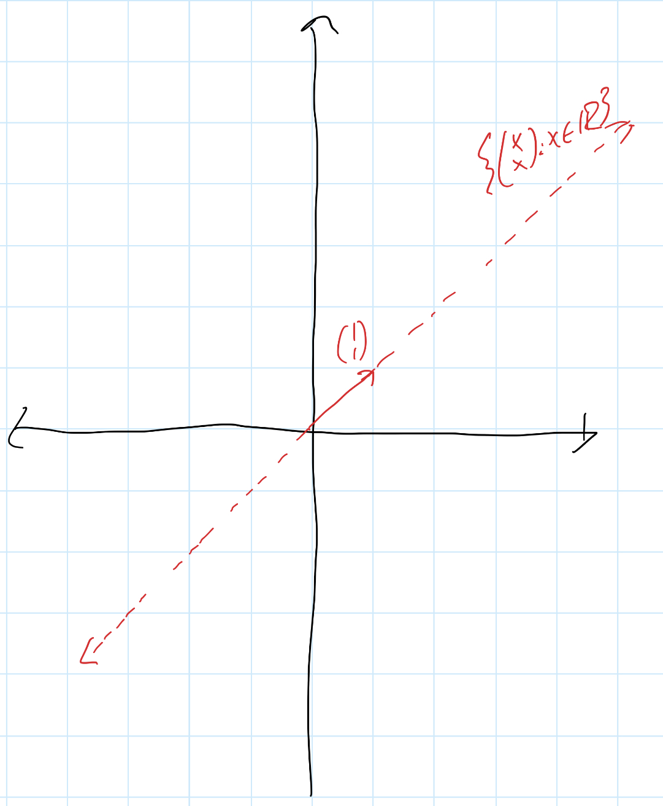

# Linear Lesson 17: Linear Combinations and Spans
{:.no_toc}

1. Table of Contents
{:toc}

# Last time

We looked at the function $A = \begin{pmatrix}0 & 1 & 0 \\\ 0 & 0 & 1 \end{pmatrix}$. We saw that its kernel is the set $\\{ \begin{pmatrix} x \\\ 0 \\\ 0 \end{pmatrix} : x \in \mathbb{R} \\}$ and its image, $A(\mathbb{R}^3) = \\{ \binom{x}{y} : x \in \mathbb{R}, y \in \mathbb{R} \\}$. In other words, $A(\mathbb{R}^3) = \mathbb{R}^2$.

The kernel is a line (one dimensional) and the image is a plane (2D). It's not a coincidence that the *domain* of $A$ is three-dimensional! We will see a major theorem in the course that relates the dimensions of the kernel, the image, and the domain of a linear function. We won't study this today, but just as an idea: out of the three dimensions of $\mathbb{R}^3$, one dimension, the $x$-axis, is sent to $\vec{0}$. The other two dimension are then mapped to $\mathbb{R}^2$.

## Image is a subspace

Last time we stated the theorem: for any linear transformation between vector spaces $L : V \to W$, $ker(L)$ is a subspace of $V$ and $L(V)$ is a subspace of $W$. I gave a hint about why $ker(L)$ is a subspace, but let's look at the image.

What do we need to show?

*Closure under vector addition*: Suppose $w_1 \in L(V)$ and $w_2 \in L(V)$. How can we be sure that $w_1 + w_2 \in L(V)$?

What do we know about $w_1$ and $w_2$? Since they are in $L(V)$, that means there are $v_1$ and $v_2 \in V$ such that $L(v_1) = w_1$ and $L(v_2) = w_2$. To show $w_1 + w_2 \in L(V)$, we need to find some $v \in V$ such that $L(v) = w_1 + w_2$. Can you figure out what the correct $v$ would be?

*Closure under scalar multiplication*: Similarly suppose $w \in L(V)$ and $a \in \mathbb{R}$ is a scalar. Then there is $v \in V$ such that $L(v) = w$.

**Claim**: $L(a \cdot v) = a \cdot w$. To see this, just use linearity, so that $L(a \cdot v) = a \cdot L(v)$, and since $L(v) = w$, this is $a \cdot w$. Therefore $a \cdot w \in L(V)$!

*Zero vector*: Since $L(\vec{0}\_V) = \vec{0}\_W$, we know that $\vec{0}\_W \in L(V)$.

So the image $L(V)$ is a subspace of $W$!

# Spans

Consider the set $\mathbb{R}^2$ and the vector $\vec{0} = \binom{0}{0}$. Notice that the set $\\{ \vec{0} \\}$ is a subspace!

1. $a \cdot \vec{0} = \vec{0}$ (we proved this last time), so this set is closed under scalar multiplication.
2. $\vec{0} + \vec{0} = \vec{0}$ by property 5 of vector spaces, so this set is closed under vector addition.
3. $\vec{0}$ is clearly in this set.

Because it satisfies these three conditions, this set is a subspace of $\mathbb{R}^2$!

**Theorem**: For any vector space $V$, if $\vec{0}_V$ is the "zero vector", then $\\{ \vec{0} \\}$ is a subspace of $V$.

(The proof is the same for any vector space!)

Now let's think about another point: $v = \binom{1}{1}$. Is the set $\\{ \binom{1}{1} \\}$ a subspace of $\mathbb{R}^2$? No! It doesn't contain the zero vector!

Okay: so is the set $\\{ \vec{0}, \binom{1}{1} \\}$ a subspace? It has the zero vector, but it's not closed under scalar multiplication (or vector addition): in particular, $2 \cdot \binom{1}{1}$ is not in this set.

In fact, we need *every* scalar multiple of $\binom{1}{1}$. These look like $\binom{a}{a}$, for some $a \in \mathbb{R}$. So now let's ask: is the set $\\{ \binom{a}{a} : a \in \mathbb{R} \\}$ a subspace of $\mathbb{R}^2$?

1. Is $b \cdot (\binom{a}{a})$ in the set? Yes, since $b \cdot \binom{a}{a} = \binom{ab}{ab}$, and $ab \in \mathbb{R}$.
2. Is $\binom{a}{a} + \binom{b}{b}$ in this set? Yes, since this sum is $\binom{a + b}{a + b}$, and $a + b \in \mathbb{R}$.
3. Is $\vec{0}$ in this set? Yes, since we can let $a = 0$.

What does this set look like?

## Two vectors

Consider the vector space $\mathbb{R}^3$ and the vectors $\vec{v_1} = \begin{pmatrix}1 \\\ 1 \\\ 0 \end{pmatrix}$ and $\vec{v_2} = \begin{pmatrix}0 \\\ 1 \\\ 1 \end{pmatrix}$.

Clearly, the set $\\{ \vec{v}_1, \vec{v}_2 \\}$ is not a subspace: we need at least $\vec{0}$, $\vec{v_1}$, all scalar multiples of $\vec{v_1}$ ($\alpha \cdot \vec{v_1}$ for all $\alpha \in \mathbb{R}$), $\vec{v_2}$, and all scalar multiples of $\vec{v_2}$ ($\beta \cdot \vec{v_2}$ for each $\beta \in \mathbb{R}$).

But that's not all! Since $2 \cdot \vec{v_1}$ and $\sqrt{3} \cdot \vec{v_2}$ are each scalar multiples of $\vec{v_1}$ and $\vec{v_2}$, and any subspace has to be closed under scalar multiplication and vector addition, we would need to allow $2 \cdot \vec{v_1} + \sqrt{3} \cdot \vec{v_2}$.

Similarly, for any scalars $a$ and $b$, we will need all vectors of the form $a \cdot \vec{v_1} + b \cdot \vec{v_2}$ in our set. But if we have all of these, then we finally do have a subspace! That is, if $W = \\{ a \cdot \vec{v_1} + b \cdot \vec{v_2} : a, b \in \mathbb{R} \\}$, then $W$ is a subspace!

To see this:

1. Let $\alpha$ be a scalar and $v = a \cdot \vec{v_1} + b \cdot \vec{v_2} \in W$. Then $\alpha \cdot v = \alpha \cdot (a \cdot \vec{v_1} + b \cdot \vec{v_2})$. Using the properties of vector spaces, we can simplify this into $(\alpha \times a) \cdot \vec{v_1} + (\alpha \times b) \cdot \vec{v_2}$, and this is in $W$ since it's a sum of scalar multiples of $\vec{v_1}$ and $\vec{v_2}$.
2. Let $a_1 \cdot \vec{v_1} + b_1 \vec{v_2} \in W$ and $a_2 \cdot \vec{v_1} + b_2 \cdot \vec{v_2} \in W$. Can you explain why their sum is in $W$?
3. Can you see which scalars $a$ and $b$ we can use to show that $\vec{0} \in W$? (That is, which $a$ and $b$ are such that $a \cdot \vec{v_1} + b \cdot \vec{v_2} = \vec{0}$, no matter what $\vec{v_1}$ and $\vec{v_2}$?)

In other words, the set $W = \\{ \begin{pmatrix}a \\\ a \\\ 0 \end{pmatrix} + \begin{pmatrix}0 \\\ b \\\ b \end{pmatrix} : a, b \in \mathbb{R} \\}$ is a subspace. We can also write this as $W = \\{ \begin{pmatrix} a \\\ a + b \\\ b \end{pmatrix} : a, b, \in \mathbb{R} \\}$.

## Generality

What we have seen is this: since subspaces have to be closed under scalar multiplications and vector additions, if $W$ is a subspace and we have some vectors $v_1, v_2, \ldots, v_n \in W$, then **all linear combinations** of $v_1, v_2, \ldots, v_n$ must be in $W$! Recall, how do we define linear combinations?

**Definition**: Let $V$ be a vector space and $v_1, \ldots, v_n \in V$. Then:

1. A **linear combination** of $v_1, \ldots, v_n$ is a vector of the form $a_1 \cdot v_1 + \ldots + a_n \cdot v_n$, where $a_1, \ldots, a_n$ are scalars.
2. The **span** of $v_1, \ldots, v_n$, denoted $Span(v_1, \ldots, v_n)$, is the set of all linear combinations of $v_1, \ldots, v_n$.
3. We say that $\\{ v_1, \ldots, v_n \\}$ **spans** $V$ if $Span(v_1, \ldots, v_n) = V$. We also refer to $\\{ v_1, \ldots, v_n \\}$ as a **spanning set** for $V$.

**Theorem**: Let $V$ be a vector space and $v_1, \ldots, v_n \in V$. Then:

1. $Span(v_1, \ldots, v_n)$ is a subspace of $V$.
2. If $W \subseteq V$ is a subspace of $V$ and $v_1, \ldots, v_n \in W$, then $Span(v_1, \ldots, v_n) \subseteq W$.

In other words: the span of a set of vectors in a vector space $V$ is the *smallest* subspace of $V$ containing those vectors!

**Proof**:

We need to show that $Span(v_1, \ldots, v_n)$ is closed under vector addition, scalar multiplication, and contains the zero vector.

First, let's show closure under scalar multiplication. Suppose $u \in Span(v\_1, \ldots, v\_n)$. By definition this means that there are scalars $a_1, \ldots, a_n$ such that $u = a_1 v_1 + \ldots + a_n v_n$. Suppose and $a \in \mathbb{R}$ is a scalar. Then what is $a \cdot u$?

$$
a \cdot u = a \cdot (a_1 v_1 + \ldots + a_n v_n) = (aa_1) v_1 + (a a_2)v_2 + \ldots + (a a_n) v_n
$$

Since each of $aa_1, aa_2, \ldots, aa_n \in \mathbb{R}$, this shows that $a \cdot u \in Span(v_1, \ldots, v_n)$.

**Exercise**: Let $u = a_1 v_1 + \ldots + a_n v_n$, and $v = b_1 v_1 + \ldots + b_n v_n$. Show that $u + v \in Span(v_1, \ldots, v_n)$.

Now for the zero vector: can you find scalars $a_1, \ldots, a_n$ so that $a_1 \cdot v_1 + \ldots + a_n \cdot v_n = \vec{0}$, no matter what $v_1, \ldots, v_n$ are?

Lastly, to show that $Span(v_1, \ldots, v_n) \subseteq W$, we just need to show that if $u$ is a linear combination of the vectors $v_1, \ldots, v_n$, then $u \in W$. Suppose $u = a_1 v_1 + \ldots + a_n v_n$. Since $W$ is closed under scalar multiplication, each of the scalar multiples $a_1 v_1, \ldots, a_n v_n \in W$. Then since $W$ is closed under vector addition, the sum of all of those vectors in $W$ is still in $W$! So $u \in W$.

# Independence

There is one major ingredient left to talk about "dimension". Consider the following examples:

**Example 1**: $\mathbb{R}^2$ is two-dimensional since the vectors $\binom{1}{0}$ and $\binom{0}{1}$ span it.

The set $\\{ \binom{1}{1}, \binom{2}{3}, \binom{-1}{1} \\}$ is a set of three vectors which also spans $\mathbb{R}^2$. So should it be three dimensional? Why not?

**Example 2**: $\mathbb{R}^3$ is three-dimensional. The set $\\{ \begin{pmatrix}1 \\\ 0 \\\ 1 \end{pmatrix}, \begin{pmatrix} 0 \\\ 1 \\\ 1 \end{pmatrix}, \begin{pmatrix} 2 \\\ -1 \\\ 1 \end{pmatrix} \\}$ is a set of three vectors, but it does **not** span $\mathbb{R}^3$: for example, the vector $\begin{pmatrix}-1 \\\ -1 \\\ 1\end{pmatrix}$ is not in its span. What goes wrong here? Why doesn't every set of three vectors span $\mathbb{R}^3$?

The issue is that the three vectors are not **independent**. One can write one vector as a linear combination of the others.

In general, if we have vectors $v_1, \ldots, v_n$ in a vector space, we might want to say that they are independent if none of them is in the span of the others. This is the right idea, but it's not the easiest notion to formalize into a definition. Instead we will use the following idea:

Suppose $v_1, v_2, v_3$ are *dependent*. One of them can be written as a linear combination of the others. We're not sure which one, but either: $v_1 = a_2v_2 + a_3 v_3$, or $v_2 = a_1 v_1 + a_3 v_3$, or $v_3 = a_1 v_1 + a_2 v_2$. In other words, one of the following is true:

* $-1 v_1 + a_2 v_2 + a_3 v_3 = \vec{0}$,
* $a_1 v_1 + (-1)v_2 + a_3 v_3 = \vec{0}$, or
* $a_1 v_1 + a_2 v_2 + (-1) v_3 = \vec{0}$.

In other words, there is some way of making the zero vector using $v_1, v_2$ and $v_3$, without just using the zero scalars everywhere. This is exactly the definition we will use for independence!

**Defintion**: Let $V$ be a vector space and $v_1, \ldots, v_n \in V$. We say $v_1, \ldots, v_n$ are **linearly dependent** if there are scalars $a_1, \ldots, a_n$ that are *not all zero* such that $a_1 v_1 + \ldots + a_n v_n = \vec{0}$. We say $v_1, \ldots, v_n$ are **linearly independent** if they are not dependent.

So now we can explain what went wrong in the above examples: neither set was linearly independent! It turns out our notion of dimension will require both the notions of spans and independence. We will see that every "linearly independent spanning set" will be the same size! So for $\mathbb{R}^2$, every linearly independent spanning set will have size 2. Moreover, every linearly independent set of size 2 will be a spanning set!

Because this concept of "linearly independent spanning set" is so important, we give it its own name: a basis!

**Definition**: If $V$ is a vector space and $v_1, \ldots, v_n \in V$, we says the set $\\{ v_1, \ldots, v_n \\}$ is a **basis** for $V$ if $Span(v_1, \ldots, v_n) = V$ and $v_1, \ldots, v_n$ are linearly independent.

