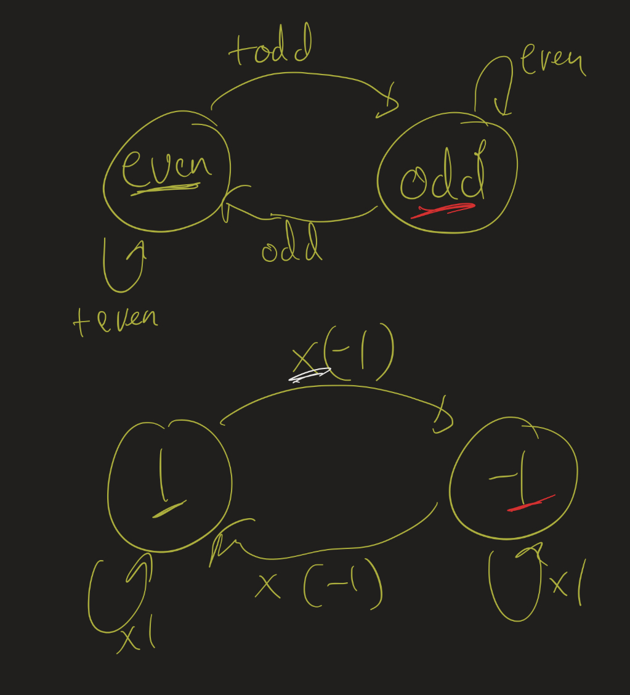

# Linear Lesson 18: Linear Independence, Bases, and Dimension
{:.no_toc}

1. Table of Contents
{:toc}

# Mathematical Structures

<iframe src="https://www.youtube.com/embed/tWuj7FnIyw8" title="YouTube video player" frameborder="0" allow="accelerometer; autoplay; clipboard-write; encrypted-media; gyroscope; picture-in-picture" allowfullscreen></iframe>

> Mathematics is the art of giving the same name to different things. (Henri Poincaré)

Mathematics is really the study of *structures*. By "structure", I mean that we study sets, and the ways in which the objects in those sets are related to one another. Vector spaces are one kind of structure: the objects are related with each other by these operations of scalar multiplication and vector addition.

Mathematicians develop these structures as they realize that certain common patterns are found in many disparate areas. If we look at just the *properties* that those structures have, we can start to see that things that appear to be very different, at first, might actually have the same structure!

So for example, consider the following two-element structures:

1. $even$ and $odd$, with the operation of addition.
2. $1$ and $-1$, with the operation of multiplication.

By (1), I mean the following addition table:

$$
\begin{array}{c|c|c}
+ & even & odd \\
\hline
even & even & odd \\
odd & odd & even
\end{array}
$$

That is, if we add an even number and an even number, we get an even number. If we add an even number and an odd number, we get an odd number. But if we add an odd number and an odd number, we get an even number.

Similarly, positive and negative 1, under multiplication, form the following table:

$$
\begin{array}{c|c|c}
\times & 1 & -1 \\
\hline
1 & 1 & -1 \\
-1 & -1 & 1
\end{array}
$$

Do you see how these are the same, structurally?

This semester, we are focusing on one particular class of structures: vector spaces. We have seen that there are many different kinds of vector spaces. But they are all structurally similar, and in fact, if they have the same *dimension*, they will end up having the exact same structural properties. The structure of a vector space is entirely dependent on its dimension!

# Independence and bases

<iframe src="https://www.youtube.com/embed/P3K0zyF9tvY" title="YouTube video player" frameborder="0" allow="accelerometer; autoplay; clipboard-write; encrypted-media; gyroscope; picture-in-picture" allowfullscreen></iframe>

Last time we saw the following definition:

**Defintion**: Let $V$ be a vector space and $v_1, \ldots, v_n \in V$. We say $v_1, \ldots, v_n$ are **linearly dependent** if there are scalars $a_1, \ldots, a_n$ that are *not all zero* such that $a_1 v_1 + \ldots + a_n v_n = \vec{0}$. We say $v_1, \ldots, v_n$ are **linearly independent** if they are not dependent.

We will see that every "linearly independent spanning set" will be the same size! So for $\mathbb{R}^2$, every linearly independent spanning set will have size 2. Moreover, every linearly independent set of size 2 will be a spanning set! Because this concept of "linearly independent spanning set" is so important, we give it its own name: a basis!

**Definition**: If $V$ is a vector space and $v_1, \ldots, v_n \in V$, we says the set $\\{ v_1, \ldots, v_n \\}$ is a **basis** for $V$ if $Span(v_1, \ldots, v_n) = V$ and $v_1, \ldots, v_n$ are linearly independent.

## Examples

**Example 1**: $V = \mathbb{R}^2$, $v_1 = \binom{1}{2}$ and $v_2 = \binom{2}{3}$.

$v_1$ and $v_2$ are linearly independent because they are not on the same line. In other words, if $a \cdot \binom{1}{2} + b \cdot \binom{2}{3} = \binom{0}{0}$, you can work out that the system of equations is only solvable for $a = 0$ and $b = 0$, so they're independent.

Moreover, $v_1$ and $v_2$ span $\mathbb{R}^2$. To see this, let $\binom{x}{y}$ be any vector in $\mathbb{R}^2$, and consider the matrix $A = \begin{pmatrix}1 & 2 \\\ 2 & 3 \end{pmatrix}$. Can you show that there is $\vec{v}$ such that $A \vec{v} = \binom{x}{y}$? There are two ways you could do this:

1. Set up an augmented system and use Gaussian Elimination, or,
2. Use the fact that $det(A) \neq 0$ to show that $A$ has an inverse, so the vector $\vec{v} = A^{-1} \binom{x}{y}$ is a solution to this system.

So all of this means that $\\{ v_1, v_2 \\}$ is a basis for $\mathbb{R}^2$!

**Question**: Can you find a basis for $\mathbb{R}^2$ which includes the vector $\binom{2}{1}$?

**Example 2**: $V = \mathbb{R}^3$, $v_1 = \begin{pmatrix}1 \\\ 2 \\\ 3 \end{pmatrix}$, $v_2 = \begin{pmatrix}1 \\\ 2 \\\ 4 \end{pmatrix}$ and $v_3 = \begin{pmatrix}1 \\\ 3 \\\ 3 \end{pmatrix}$.

Are these vectors linearly independent? How would we determine this? We check: if $a \cdot v_1 + b \cdot v_2 + c \cdot v_3 = \vec{0}$, does that mean $a = 0$, $b = 0$ and $c = 0$?

To check this, we have to set up an augmented matrix system:

$$
\left(\begin{matrix}1 & 1 & 1 \\ 2 & 2 & 3 \\ 3 & 4 & 3 \end{matrix}\: \right|\left. \: \begin{matrix}0 \\ 0 \\ 0 \end{matrix} \right)
$$

We would then check if the *only* solution is $\begin{pmatrix}0 \\\ 0 \\\ 0 \end{pmatrix}$. Similarly, to check if these vectors span $\mathbb{R}^3$, we would ask: which $x$, $y$, and $z$ are such that the system

$$
\left(\begin{matrix}1 & 1 & 1 \\ 2 & 2 & 3 \\ 3 & 4 & 3 \end{matrix}\: \right|\left. \: \begin{matrix}x \\ y \\ z \end{matrix} \right)
$$

is solvable? In fact, the answers to both of these are going to be yes: these vectors are linearly independent, and they do span $\mathbb{R}^3$. This isn't a coincidence, and in fact, you can answer both of these questions by computing the determinant and showing it's not zero!

**Example 3**: Consider the set $\mathcal{P}_2 = \\{ p(x) : p(x)$ is a polynomial of degree $\leq 2 \\}$.

This case is slightly different from the previous ones, because we don't already know ahead of time what the dimension *should* be. But still, if we have a set of vectors, we can check if they're independent, and check if they span.

Consider the set $\\{ x, x^2 \\}$. Are these independent? In other words, if $a \cdot x + b \cdot x^2 = \vec{0}$, then must $a = 0$ and $b = 0$?

What is $\vec{0}$ here anyway? Remember, this is a set of polynomial functions, so $\vec{0}$ is the function $z(x) = 0$ for all $x$. So in other words, if $ax + bx^2 = 0$ for every single $x$, can we conclude that $a = 0$ and $b = 0$? In fact, yes:

* If $x = 1$, then we get that $a + b = 0$.
* If $x = 2$, then we get that $2a + 4b = 0$.

If we solve that system of equations, we get that $a = 0$ and $b = 0$!

Does $\\{ x, x^2 \\}$ span $\mathcal{P}_2$? That is, if $p(x)$ is a polynomial of degree at most 2, then are there scalars $a$ and $b$ such that $ax + bx^2 = p(x)$?

What is $p(x)$ has a constant term? In other words, what about the polynomial $p(x) = x^2 + 1$? This is a polynomial of degree 2, but you cannot write it as a linear combination of $x$ and $x^2$. So this is **not** a spanning set!

If we want constant terms, we will need to throw in the constant function $f(x) = 1$ in there as well! Then the set $B = \\{1, x, x^2 \\}$ spans $\mathcal{P}_2$: if $p(x)$ is a polynomial of degree 2, then it's of the form $ax^2 + bx + c$, and so $p(x) = c \cdot 1 + b \cdot x + a \cdot x^2$ is a linear combination of $1$, $x$, and $x^2$!

Is this set $B$ linearly independent? Let's check: if $a \cdot 1 + b \cdot x + c \cdot x^2 = \vec{0}$, does this mean $a = 0$, $b = 0$ and $c = 0$?

Again, we assume, for every $x$, that $a + bx + cx^2 = 0$. Then plug in:

* If $x = 0$, we get $a = 0$.
* If $x = 1$, we get $a + b + c = 0$.
* If $x = 2$, we get $a + 2b + 4c = 0$.

**Exercise**: Solve this system of equations and verify that yes, in fact, $B$ **is** linearly independent, and therefore is a basis!

## Uniqueness

<iframe src="https://www.youtube.com/embed/quluSlpuFJ0" title="YouTube video player" frameborder="0" allow="accelerometer; autoplay; clipboard-write; encrypted-media; gyroscope; picture-in-picture" allowfullscreen></iframe>

Suppose $V$ is a vector space and $v_1, \ldots, v_n$ spans $V$. Then every vector $v \in V$ can be written as a linear combination of $v_1, \ldots, v_n$. You can think of this as a way of *decomposing* $v$ into these $n$ components.

**Question**: Is there always a **unique** way to write $v$ as this kind of a linear combination? In other words, does $v$ always have one and only one decomposition into the $v_1, \ldots, v_n$ components?

Let's look at an example: let $V = \mathbb{R}^2$ and consider the "standard basis" vectors $\vec{e_1} = \binom{1}{0}$ and $\vec{e_2} = \binom{0}{1}$. Notice that of course, each $v = \binom{x}{y}$ decomposes uniquely as $x \cdot \vec{e_1} + y \cdot \vec{e_2}$.

Now let's add in $\vec{v_3} = \binom{1}{1}$ to our spanning set. Then the set $\\{ \vec{e_1}, \vec{e_2}, \vec{v_3} \\}$ is a spanning set, but we lose this "unique decomposition". For example, how do we "decompose" the vector $\binom{2}{1}$? It could be:

* $1 \cdot \vec{e_1} + 1 \cdot \vec{v_3}$, or
* $2 \cdot \vec{e_1} + \vec{e_2}$, or
* $-1 \cdot \vec{e_1} - 2 \cdot \vec{e_2} + 3 \cdot \vec{v_3}$, ...

There are many ways to decompose it in fact. And so we lose the idea of saying that the *components* of $v$ are $2$ and $1$.

In general:

* If a set $S = \\{ v_1, \ldots, v_n \\}$ *spans* $V$, then every vector in $V$ can be written as a linear combination of $v_1, \ldots, v_n$ in **at least** one way.
* If a set $I = \\{ v_1, \ldots, v_n \\}$ is *linearly independent*, then vectors in $V$ can be written as a linear combination of $v_1, \ldots, v_n$ in **at most** one way. (Some vectors might not be reachable at all using linear combinations of $v_1, \ldots, v_n$.)
* If a set $B = \\{ v_1, \ldots, v_n \\}$ is a *basis*, then every vector in $V$ can be written as a linear combination of $v_1, \ldots, v_n$ in **exactly** one way. So if $v = a_1 v_1 + \ldots + a_n v_n$, you can think of the scalars $a_1, \ldots, a_n$ as the "component parts" of $v$.

## Linear functions

**Theorem**: Let $L : V \to W$ be any linear function. Then $L$ is one to one (injective) if and only if $ker(L) = \\{ \vec{0}_V \\}$.

Recall:

* $L$ is "one to one" means that if $v_1 \neq v_2$, then $L(v_1) \neq L(v_2)$.
* $ker(L) = \\{ v \in V : L(v) = \vec{0}_W \\}$.

There are two things to prove:

1. If $L$ is one to one, then $ker(L) = \\{ \vec{0}_V \\}$. Certainly, $\vec{0}_V \in ker(L)$, since we already proved that $L(\vec{0}_V) = \vec{0}_W$. But you need to show that nothing else can be in this kernel. In other words, if $v \neq \vec{0}_V$, then $L(v) \neq \vec{0}_W$. (You can show this using the definition of "one to one")
2. If $L$ is **not** one to one, then there is $v \neq \vec{0}_V$ in the kernel.

The idea for the second one is that if $L$ is not one to one, then there are vectors $v_1 \neq v_2 $such that $L(v_1) = L(v_2)$. Use linearity to show that $L(v_1 - v_2) = \vec{0}_W$. (Here $v_1 - v_2$ is of course shorthand for adding $v_1$ and the "additive inverse" of $v_2$).

**Note**: Let vectors $v_1, \ldots, v_n \in \mathbb{R}^m$ for some $n$ and $m$. Let $A$ be the $m \times n$ matrix whose columns are $v_1, \ldots, v_n$. Then $v_1, \ldots, v_n$ are linearly independent if and only if the kernel of $A$ *only* has the zero vector. (That's the definition of linear independence!)

So for example, let's look at the vectors $\binom{1}{1}, \binom{1}{-1}, \binom{3}{5}$, and the matrix $A = \begin{pmatrix}1 & 1 & 3 \\\ 1 & -1 & 5 \end{pmatrix}$. It's not hard to see that the kernel of $A$ is not just $\\{ \vec{0} \\}$ (try doing Gaussian elimination and see if you can figure out the kernel here).

Then by the theorem, since $A$ is a linear function with a non-trivial kernel, it can't be one to one, so there are vectors $v_1 \neq v_2$ such that $A(v_1) = A(v_2)$. But what does this mean? Suppose $v_1 = \begin{pmatrix}a_1 \\\ a_2 \\\ a_3 \end{pmatrix}, v_2 = \begin{pmatrix}b_1 \\\ b_2 \\\ b_3 \end{pmatrix}$. Then:

$$
\begin{pmatrix}1 & 1 & 3 \\ 1 & -1 & 5 \end{pmatrix} \begin{pmatrix}a_1 \\ a_2 \\ a_3 \end{pmatrix} = \begin{pmatrix}1 & 1 & 3 \\ 1 & -1 & 5 \end{pmatrix} \begin{pmatrix}b_1 \\ b_2 \\ b_3 \end{pmatrix}
$$

But this just means that $a_1 \binom{1}{1} + a_2 \binom{1}{-1} + a_3 \binom{3}{5} = b_1 \binom{1}{1} + b_2 \binom{1}{-1} + b_3 \binom{3}{5}$! In other words, we have found a vector that can be written as a linear combination of the vectors $\binom{1}{1}, \binom{1}{-1}, \binom{3}{5}$ in multiple different ways! Like many things in this course, the connection between linear independence and the kernel of a particular matrix is not a coincidence.

# Dimension

<iframe src="https://www.youtube.com/embed/MaY13aK_zCo" title="YouTube video player" frameborder="0" allow="accelerometer; autoplay; clipboard-write; encrypted-media; gyroscope; picture-in-picture" allowfullscreen></iframe>

**Definition**: A vector space $V$ is **finite dimensional** if it is spanned by a finite set of vectors. $V$ is **infinite dimensional** if no finite set spans $V$.

The main theorem about dimension is the following:

**Theorem**: Let $V$ be a vector space. Then **every** basis of $V$ has the same size.

Therefore, we define dimension in the following way:

**Definition**: Let $V$ be a vector space. If $B = \\{ b_1, \ldots, b_n \\}$ is a basis for $V$, then we say $V$ is $n$-dimensional, and we write $\dim(V) = n$.

**Example**: Consider the complex numbers $\mathbb{C} = \\{ a + bi : a, b \in \mathbb{R} \\}$. This forms a vector space! I won't go through the properties, but in particular, $\vec{0} = 0 + 0i$.

**Claim**: $\\{ 1, i \\}$ is a basis for $\mathbb{C}$, so $\dim(\mathbb{C}) = 2$.

**Proof**:

* Linear independence: if $a \cdot 1 + b \cdot i = 0 + 0i$, then $a = 0$ and $b = 0$.
* Spanning: If $a + b i \in \mathbb{C}$, then just use those real numbers $a$ and $b$ as the scalars for the linear combination $a \cdot 1 + b \cdot i$.

The set $\\{1 + i, 1 - i \\}$ is also a basis! In fact, if you can prove that it's linearly independent, then since it has the right size, you know that it's a spanning set!

**Exercise**: Let $V = \mathcal{P}_2 = \\{ p(x) : p(x)$ is a polynomial of degree 2 $\\}$. Show that $B_2 = \\{ x + 1, x + 2, x^2 \\}$ is a basis for $\mathcal{P}^2$.

Notice that $\\{1, x, x^2 \\}$ is a basis for $\mathcal{P}_2$, so its dimension is $3$.

* Can you show that $1, x$ and $x^2$ are each in the span of $B_2$?
* Can you then make an argument that *every* $p(x) \in \mathcal{P}_2$ must also then be in the span of $B_2$?
* Can you show that $B_2$ is linearly independent?

## Reading

Please read the "Basis and dimension" handout on Moodle. It goes through several results we need in order to prove the main theorem about dimension above.
