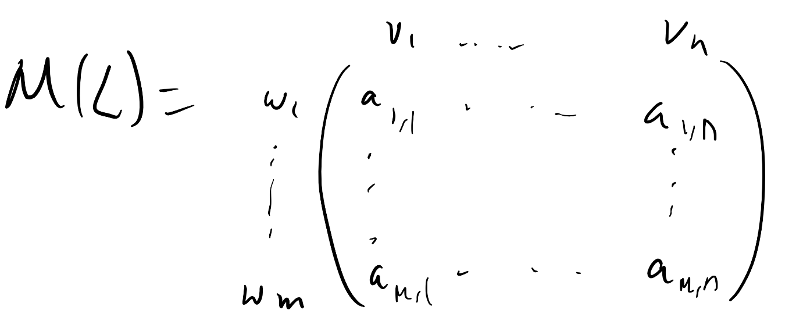
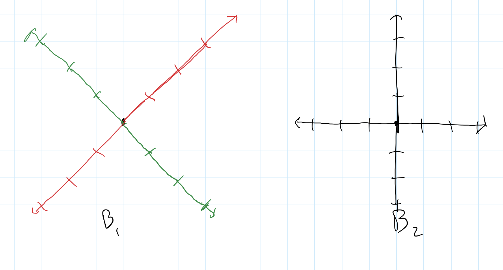

# Linear Lesson 20: Change of Basis
{:.no_toc}

1. Table of Contents
{:toc}

# Warm Up

1. Suppose $\dim(V) = n, \dim(W) = m$ and $T : V \to W$ is linear. What are the dimensions of $M(T)$?

2. Suppose $\dim(V) = 2$ and $\dim(W) = 4$, and $v_1, v_2$ is a basis for $V$, and $w_1, w_2, w_3, w_4$ is a basis for $W$. Let $T : V \to W$ be defined by $T(v_1) = w_1$ and $T(v_2) = w_2$. What is the matrix representation of $T$?

3. Let $P_3$ be the vector space of polynomials of degree at most 3, and $P_2$ the vector space of polynomials of degree at most 2. Let $D : P_3 \to P_2$ be the differentiation function $D(p(x)) = p^\prime(x)$. Find bases for $P_3$ and $P_2$ such that the matrix representation of $D$ with respect to those bases $M(D)$ is $\begin{pmatrix}1 & 0 & 0 & 0 \\\ 0 & 1 & 0 & 0 \\\ 0 & 0 & 1 & 0 \end{pmatrix}$.

# Matrix Representations

Recall: $L : V \to W$, $V$ has basis $v_1, \ldots, v_n$, $W$ has basis $w_1, \ldots, w_m$. Write:

* $L(v_1) = a_{1,1} w_1 + \ldots + a_{m,1} w_m$
* $L(v_2) = a_{1,2} w_1 + \ldots + a_{m,2} w_m$
* $\vdots$
* $L(v_n) = a_{1, n} w_1 + \ldots + a_{m, n} w_m$

Then the matrix representation of $L$, $M(L)$, is:

We've seen that there are lots of different bases for the same vector spaces. Let's look at $\mathbb{R}^2$ and use the basis $B = \\{ \binom{2}{1}, \binom{-1}{1} \\}$ for our "inputs", and the standard basis $\binom{1}{0}$ and $\binom{0}{1}$ for our "outputs". Suppose $T(v) = v$ is the identity function. What is the matrix representation of $T$?

Since $T\binom{2}{1} = \binom{2}{1}$, and $\binom{2}{1} = 2 \binom{1}{0} + 1 \binom{0}{1}$, our first column is just $\binom{2}{1}$. And since $T\binom{-1}{1} = \binom{-1}{1}$, the second column is $\binom{-1}{1}$. That is, $M(T) = \begin{pmatrix}2 & -1 \\\ 1 & 1 \end{pmatrix}$.

What if we went the other way around? If $I : \mathbb{R}^2 \to \mathbb{R}^2$ is the identity function, with "input basis" $\binom{1}{0}, \binom{0}{1}$, and "output basis" $\binom{2}{1}, \binom{-1}{1}$, how would we figure out the matrix representation here? $I\binom{1}{0} = \binom{1}{0}$, but how do we express $\binom{1}{0}$ in terms of $\binom{2}{1}$ and $\binom{-1}{1}$?

This is exactly the idea behind the **change of basis** matrix. In fact, what we need to do is take the matrix for $T$ above, and invert it (because we are literally just going the other way around)!

**Exercise**: Find the inverse of $M(T) = \begin{pmatrix}2 & -1 \\\ 1 & 1 \end{pmatrix}$.

## Diagonal Matrix Representations

Suppose $L : \mathbb{R}^2 \to \mathbb{R}^2$ is a linear function given by $L\binom{2}{1} = 2\binom{2}{1}$ and $L\binom{-1}{1} = \frac{1}{2}\binom{-1}{1}$. What is the matrix representation of $L$?

This is kind of a trick question: it depends on what "input" and "output" basis sets we use for $\mathbb{R}^2$. Suppose we use the basis $v_1 = \binom{2}{1}, v_2 = \binom{-1}{1}$. Then our matrix representation is $M(L) = \begin{pmatrix}2 & 0 \\\ 0 & \frac{1}{2} \end{pmatrix}$. This matrix is quite nice to work with:

1. What is $(M(L))^2$?
2. What is $(M(L))^3$?
3. What is $det(M(L))$?

These questions are all fairly easy to answer because it's a diagonal matrix. That is, computing with $M(L)$ is easy once we have written our vectors according to the basis $v_1, v_2$. Consider $v = \binom{0}{1}$ using the standard basis. First, let's re-write $v$ in terms of $\binom{2}{1}$ and $\binom{-1}{1}$:

$$
\binom{0}{1} = \frac{1}{3} \binom{2}{1} + \frac{2}{3} \binom{-1}{1}
$$

Since $L(v_1)) = 2v_1$ and $L(v_2) = \frac{1}{2}v_2$, and $L$ is linear, that means

$$
L(\frac{1}{3}v_1 + \frac{2}{3}v_2) = \frac{2}{3}v_1 + \frac{1}{3}v_2.
$$

What is $L(L(v))$? Again, using the decomposition into $v_1$ and $v_2$, we get $L(L(v)) = L(L(\frac{1}{3}v_1 + \frac{2}{3}v_2)) = L(\frac{2}{3}v_1 + \frac{1}{3}v_2) = \frac{4}{3}v_1 + \frac{1}{6} v_2$.

What about $L^3(v)$? $L^4(v)$? etc? What happens to $L^n(v)$ as $n \rightarrow \infty$?

So if there is a way to express a linear map as a diagonal matrix, we can apply this kind of analysis to think about long-term behavior. This can be useful when making predictions; that is, if some kind of data changes linearly over time, and we know the state of the data now, we can predict what will happen in the future.

## Change of Basis

Most of the time, unfortunately, we are given matrices that use the standard basis. So what if we used the standard basis? Then we'd need to *change coordinates* so that we could figure out what $L\binom{1}{0}$ is and what $L\binom{0}{1}$ is.

**Definition**: Let $V$ be a vector space, $\dim(V) = n$, and $B_1 = \\{ b_1, \ldots, b_n \\}$, $B_2 = \\{ v_1, \ldots, v_n \\}$ are two bases. Then there are *change of basis matrices* ($n \times n$) $A$ and $A^{-1}$ which convert between vectors $v$ written as linear combinations of $b_1, \ldots, b_n$ and its description as a linear combination of the vectors $v_1, \ldots, v_n$.

In other words, this is actually the matrix representation of the identity map $I : V \to V$, where $B_1$ is the "input" basis and $B_2$ is our "output" basis!

How do we find these matrix representations? If one of our bases is a standard basis, then it's usually fairly easy. Let's look at an example:

**Example**: In $\mathbb{R}^2$, let $B_1 = \\{ \binom{1}{1}, \binom{1}{-1} \\}$ and let $B_2$ be the standard basis.

Then the change of basis matrix to go from vectors $\binom{a}{b}$ using $B_1$ coordinates to $\binom{x}{y}$ using $B_2$ coordinates is $A = \begin{pmatrix}1 & 1 \\\ 1 & -1 \end{pmatrix}$. That is, $\binom{3}{4}$, using the basis $B_1$, really means $3 \binom{1}{1} + 4 \binom{1}{-1}$. Using the change of basis matrix, that becomes

$$
\begin{pmatrix}1 & 1 \\ 1 & -1 \end{pmatrix} \begin{pmatrix}3 \\ 4 \end{pmatrix} = \begin{pmatrix}7 \\ -1 \end{pmatrix}
$$

If we had a vector $\binom{2}{-3}$ in standard coordinates, what would it look like in $B_1$ coordinates? In order to figure this out, we have to invert the matrix!

The inverse of $A$ is $\begin{pmatrix}\frac{1}{2} & \frac{1}{2} \\\ \frac{1}{2} & -\frac{1}{2} \end{pmatrix}$ (there's a trick for inverting 2x2 matrices), so that means $\binom{2}{-3}$, in $B_1$ coordinates, is

$$
\begin{pmatrix}\frac{1}{2} & \frac{1}{2} \\ \frac{1}{2} & -\frac{1}{2} \end{pmatrix} \begin{pmatrix}2 \\ -3 \end{pmatrix} = \begin{pmatrix} -\frac{1}{2} \\ \frac{5}{2} \end{pmatrix}
$$

**Exercise**: Double check that $-\frac{1}{2} \binom{1}{1} + \frac{5}{2} \binom{1}{-1} = \binom{2}{-3}$.

# Problem Set 5

Problem Set 5 will be posted on Moodle by tonight, and will be due **Monday, May 2**.
