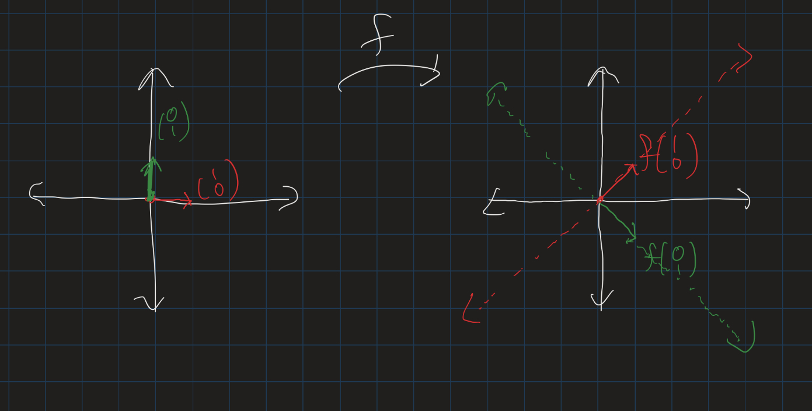
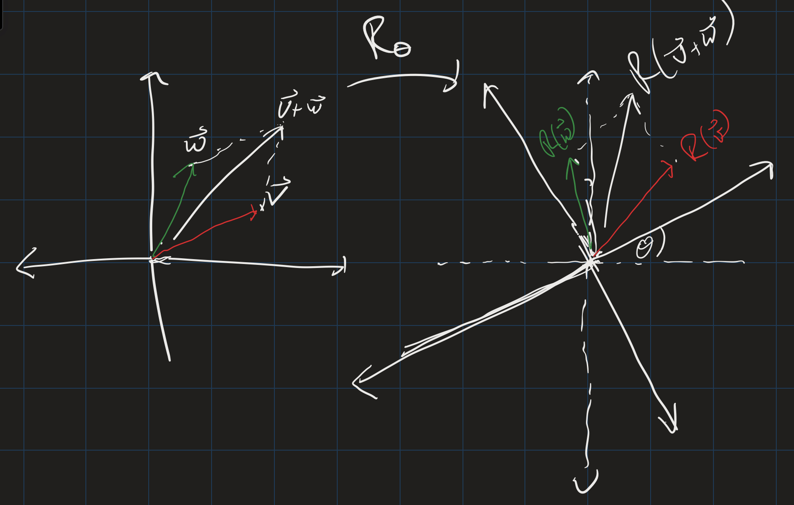
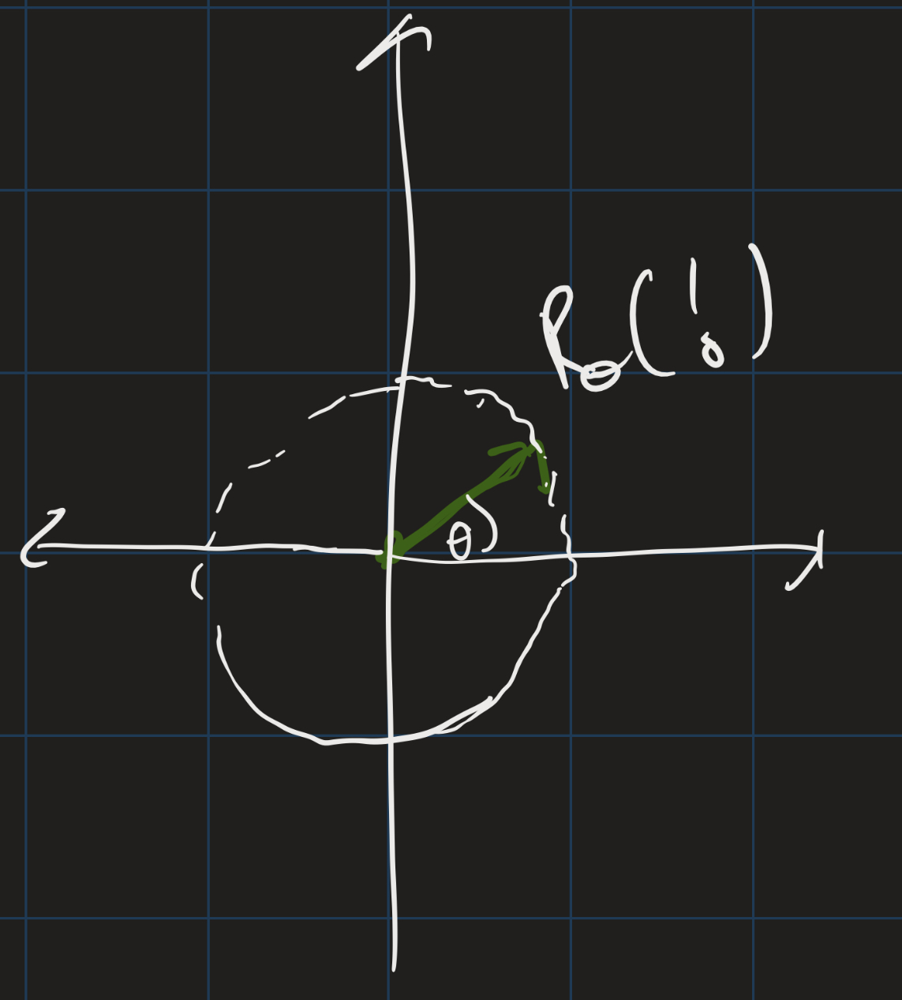
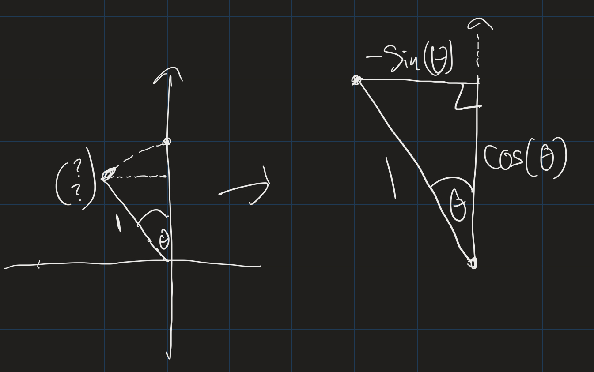

# Linear Lesson 4: Matrix Notation
{:.no_toc}

1. Table of Contents
{:toc}

# Warm Up

Consider the function $f : \mathbb{R}^2 \to \mathbb{R}$ defined by $f(\binom{x}{y}) = x + 2y$.

1. Show that $f$ is a surjection. That is: let $z \in \mathbb{R}$, and find $x$ and $y$ so that $x + 2y = z$. (Hint: pick one of $x$ or $y$ to be 0.)
2. Is $f$ an injection? Hint: when is $f(\binom{x}{y}) = 0$?

## Another Example

Consider the function $f : \mathbb{R}^2 \to \mathbb{R}^2$ defined by $f(\binom{x}{y}) = \binom{x + y}{x - y}$.

* What is $f(\binom{1}{0})$?
* What is $f(\binom{0}{1})$?
* What is the image of the $x$-axis?
* What is the image of the $y$-axis?

$f$ is a linear function (I won't prove that here). The nice thing about linearity is that once we know the images of $f(\binom{1}{0})$ and $f(\binom{0}{1})$, we can figure out $f(\binom{x}{y})$ for any $x$ and any $y$. If $f$ is linear, then $f(\binom{x}{y})$ is always some linear combination of $f(\binom{1}{0})$ and $f(\binom{0}{1})$! In particular, the image of $f$ will be the **span** of $f(\binom{1}{0})$ and $f(\binom{0}{1})$! (Do you see why?)

**Question**: Is $f$ a surjection? That is, if $\vec{u} = \binom{a}{b}$, are there $x$ and $y$ such that $f(\binom{x}{y}) = \binom{a}{b}$? Let's think of this geometrically first. Since $f(\binom{1}{0}) = \binom{1}{1}$ and $f(\binom{0}{1} = \binom{1}{-1}$, and these two vectors do not lie on the same plane, we can conclude that their span is the entire plane $\mathbb{R}^2$.

Algebraically, we can prove our answer by showing that for every $\binom{a}{b}$, there are $x$ and $y$ so that the system

$$
\begin{align}
x + y &= a \\
x - y &= b
\end{align}
$$

has a solution. (How do we show this? Solve for $x$ and $y$ in terms of $a$ and $b$)

**Injectivity**: This is a bit harder. We will look at this once, but in the future we will have a better method to show injectivity later on in the semester.

The question is: if $T(\vec{u}) = T(\vec{v})$, does this mean that $\vec{u} = \vec{v}$? Let's let $\vec{u} = \binom{u_1}{u_2}$ and $\vec{v} = \binom{v_1}{v_2}$. Suppose that $\
binom{u_1 + u_2}{u_1 - u_2} = \binom{v_1 + v_2}{v_1 - v_2}$. Then $u_1 + u_2 = v_1 + v_2$ and $u_1 - u_2 = v_1 - v_2$. Does this mean that $u_1 = v_1$ and $u_2 = v_2$? It's not immediately clear. If you do some algebra, though, you might see:

$$
\begin{align}
u_1 - v_1 &= v_2 - u_2 \\
u_1 - v_1 &= u_2 - v_2
\end{align}
$$

That means we can set $v_2 - u_2 = u_2 - v_2$, and solve. If you solve this you get that $u_2 = v_2$. **Exercise**: Plug this in, and show that $u_1 = v_1$, therefore showing that $f$ is injective.

**Notice**: The definition of "injective function" is that if $x \neq y$, then $f(x) \neq f(y)$. What we actually proved is that if $f(x) = f(y)$, then $x = y$. Logically, this is equivalent to the original definition, since it's just the *contrapositive* of the original statement.

# Problem Set Questions

## Question 1

**Problem**: Consider the vectors $\vec{v} = \binom{1}{1}$ and $\vec{w} = \binom{1}{-1}$.  
   a. Is $\binom{1}{0} \in \textrm{Span}(\vec{v}, \vec{w})$? If so, find scalars $a$ and $b$ so that $\binom{1}{0} = a \cdot \vec{v} = b \cdot \vec{w}$. If not, explain why no such scalars exist.  
   b. Is $\binom{0}{1} \in \textrm{Span}(\vec{v}, \vec{w})$? If so, find scalars $a$ and $b$ so that $\binom{0}{1} = a \cdot \vec{v} = b \cdot \vec{w}$. If not, explain why no such scalars exist.  

This is, essentially, the "reachability"" question we studied in week one. We solved these types of questions by setting up systems of equations. In other words, we try to solve for $a$ and $b$ in $a \cdot \binom{1}{1} + b \cdot \binom{1}{-1} = \binom{1}{0}$. This gives us a system of equations:

$$
\begin{align}
a + b &= 1 \\
a - b &= 0
\end{align}
$$

If you can solve this system, then $\binom{1}{0} \in \textrm{Span}(\vec{v}, \vec{w})$. If you cannot, then you have shown that $\binom{1}{0} \not \in \textrm{Span}(\vec{v}, \vec{w})$.

Similarly, for part (b), you can set up another system of equations and determine if that system is solvable.

## Question 2

**Problem**: In this problem, we will determine the functions from $\mathbb{R}^2$ to $\mathbb{R}$ that are linear. Let $f : \mathbb{R}^2 \to \mathbb{R}$.  
   a. Suppose $f(\binom{1}{0}) = a$. Use the fact that $f$ respects scalar multiplication to determine the value of $f(\binom{x}{0})$.  
   b. Suppose $f(\binom{0}{1}) = b$. Use the fact that $f$ respects scalar multiplication to determine the value of $f(\binom{0}{y})$.  
   c. Suppose both $f(\binom{1}{0}) = a$ and $f(\binom{0}{1}) = b$. Use the fact that $f$ respects vector addition to determine the value of $f(\binom{1}{1})$.  
   d. Suppose both $f(\binom{1}{0}) = a$ and $f(\binom{0}{1}) = b$. Use the fact that $f$ respects scalar multiplication and vector addition to determine the value of $f(\binom{x}{y})$. Hint: $\binom{x}{y} = x\binom{1}{0} = y\binom{0}{1}$.  

These types of problems illustrate the strength of the notion of linearity. We can write $f(\binom{x}{0})$ as $f(x \cdot \binom{1}{0})$, and then use linearity. Similarly, we can write $f(\binom{0}{y})$ as $f(y \cdot \binom{0}{1})$ and use linearity, and we can write any $f(\binom{x}{y})$ and $f(x \cdot \binom{1}{0} + y \cdot \binom{0}{1})$.

In other words: every vector in $\mathbb{R}^2$ can be written as a linear combination of $\binom{1}{0}$ and $\binom{0}{1}$! These two vectors are called the **standard basis vectors** for $\mathbb{R}^2$. Similarly, there are standard basis vectors for $\mathbb{R}^3$, $\mathbb{R}^4$, and for $\mathbb{R}^n$, for any $n$.

## Question 4

**Problem**: Suppose $T : \mathbb{R}^2 \to \mathbb{R}^2$ is linear. If $T(\binom{1}{1}) = \binom{0}{1}$ and $T(\binom{1}{-1}) = \binom{1}{0}$, what, if anything, can be determined about the values of the following:  
   a. $T(\binom{1}{0})$.  
   b. $T(\binom{0}{1})$.  
   c. $T(\binom{x}{y}$.  

This problem gives us an example of how we can use linearity to figure out a formula for a function, even if we don't know what it does to the standard basis vectors. As long as we know what it does to *any* "spanning" set of vectors, we can figure out what it does to everything else.

In particular, since $\binom{1}{0} \in \mathrm{Span}(\binom{1}{1}, \binom{1}{-1}$, we can write $\binom{1}{0} = a \cdot \binom{1}{1} + b \cdot \binom{1}{-1}$. So then by linearity, $T(\binom{1}{0}) = a \cdot T(\binom{1}{1}) + b \cdot T(\binom{1}{-1})$. So if we can figure out those $a$ and $b$, we shold be able to figure out $T(\binom{1}{0})$. (We already know these $a$ and $b$, since we did this in Question 1!)

# Rotations

Let $\theta$ be any angle. Let $R_\theta : \mathbb{R}^2 \to \mathbb{R}^2$ be the "rotation by $\theta$ function."

The picture shows that $R_\theta$ is linear! That means, again, we only need to know what $R_\theta(\binom{1}{0})$ and $R_\theta(\binom{0}{1})$ are in order to figure out what $R_\theta(\binom{x}{y})$ is for any $x$ and any $y$.

So, what is $R_\theta(\binom{1}{0})$? This is unit circle trig!

$R_\theta(\binom{1}{0}) = \binom{\cos(\theta)}{\sin(\theta)}$! What about $R_\theta(\binom{0}{1})$?

Here, again, we can figure out the coordinates using trig, and we get $R_\theta(\binom{0}{1}) = \binom{-\sin(\theta)}{\cos(\theta)}$. Now we can figure out $R_\theta(\binom{x}{y})$ using these two values!

**Exercise**: Find $R_\theta(\binom{2}{1}$. Hint: write $\binom{2}{1}$ as a linear combination of $\binom{1}{0}$ and $\binom{0}{1}$, and then use linearity.

**Solution**: Since $\binom{2}{1} = 2 \cdot \binom{1}{0} + \binom{0}{1}$, we get $R_\theta(\binom{2}{1}) = 2 \cdot R_\theta(\binom{1}{0}) + R_\theta(\binom{0}{1})$. Then plug in the values we had before, so $R_\theta(\binom{2}{1}) = 2 \cdot \binom{\cos(\theta)}{\sin(\theta)} + \binom{-\sin(\theta)}{\cos(\theta)}$. Then add these vectors and we get $\binom{2\cos(\theta) - \sin(\theta)}{2 \sin(\theta) + \cos(\theta)}$.

In general, *every* vector in $\mathbb{R}^2$ can be written as a linear combination of $\binom{1}{0}$ and $\binom{0}{1}$. So because of linearity, if we know $R_\theta(\binom{1}{0})$ and $R_\theta(\binom{0}{1})$, we know $R_\theta(\binom{x}{y})$ for every $x$ and $y$! This is what we do below:

First, we know that $R_\theta(\binom{x}{0}) = x \cdot \binom{\cos(\theta)}{\sin(\theta)}$, and $R_\theta(\binom{0}{y}) = y \cdot \binom{-\sin(\theta)}{\cos(\theta)}$. And because rotations respect vector addition, $R_\theta(\binom{x}{y}) = R_\theta(\binom{x}{0}) + R_\theta(\binom{0}{y})$. Putting these together: $R_\theta(\binom{x}{y}) = x \cdot \binom{\cos(\theta)}{\sin(\theta)} + y \cdot \binom{-\sin(\theta)}{\cos(\theta)}.$

Again: these two values of $R_\theta$ are all we need to know in order to determine every output of this function!

# Matrices

To keep track of these two special values that tell us everything we need to know about this function, we use **matrix notation**:

$$
\begin{pmatrix}
\cos(\theta) & -\sin(\theta) \\
\sin(\theta) & \cos(\theta)
\end{pmatrix}
$$

We say that this matrix **represents** the linear function $R_\theta$. Every linear function has a matrix representation! This will be the chief object of study in this course.

For example, the linear function $R_{\pi/3}$ is represented by:

$$
\begin{pmatrix}
\frac{1}{2} & -\frac{\sqrt{3}}{2} \\
\frac{\sqrt{3}}{2} & \frac{1}{2}
\end{pmatrix}
$$

As another example, consider the function $L : \mathbb{R}^2 \to \mathbb{R}$ defined by $L(\binom{x}{y}) = x - 3y$.

First, notice that $L$ is **linear**. To see this, we first check that $L$ respects scalar multiplication. Let $\binom{x}{y}$ be a vector and $a$ be a scalar. Then $L(\binom{x}{y}) = x - 3y$, and $L(a \cdot \binom{x}{y}) = ax - 3ay$, or $a(x - 3y)$. That is, $L(a \cdot \binom{x}{y}) = a \cdot L(\binom{x}{y})$.

Next, we see that $L$ respects vector addition. Let $\binom{u_1}{u_2}$ and $\binom{v_1}{v_2}$ be two vectors. Then $L(\binom{u_1}{u_2}) + L(\binom{v_1}{v_2}) = (u_1 - 3u_2) + (v_1 - 3v_2)$. Re-arranging, this is $(u_1 + v_1) - 3(u_2 + v_2)$, which is $L(\binom{u_1}{u_2} + \binom{v_1}{v_2})$.

Now, since $L$ is linear, we can write it as a matrix:

1. What is $L(\binom{1}{0})$?
2. What is $L(\binom{0}{1})$?

Since $L(\binom{1}{0}) = 1$, and $L(\binom{0}{1}) = -3$, the matrix representation of $L$ is:

$$
\begin{pmatrix}
1 & -3
\end{pmatrix}
$$

This matrix has 1 **row** and 2 **columns**. That is, it is a $1 \times 2$ matrix. It represents the linear function $L \mathbb{R}^2 \to \mathbb{R}$! In general, if a matrix is $m \times n$ (m rows, n columns), what kind of function does it represent?

## Exercise

Let $L : \mathbb{R}^2 \to \mathbb{R}^3$ be defined by the function $L(\binom{x}{y}) = \begin{pmatrix}x - y \\\ x + y \\\ 2x \end{pmatrix}$.

1. Show that $L$ respects scalar multiplication. That is, show that $L(a \cdot \binom{x}{y}) = a \cdot L(\binom{x}{y})$.
2. Show that $L$ respects vector addition. That is, show that $L(\binom{u_1}{u_2}) + L(\binom{v_1}{v_2}) = L(\binom{u_1}{u_2} + \binom{v_1}{v_2})$.
3. Determine $L(\binom{1}{0})$ and $L(\binom{0}{1})$.
4. Write down the matrix representation of $L$. What are the dimensions of this matrix? (How many rows, how many columns)

## Non-Example

Consider the function $f : \mathbb{R}^2 \to \mathbb{R}$ given by $f(\binom{x}{y}) = xy$. Is this function linear?

If it is, we have to get that $f(a \cdot \binom{x}{y}) = a \cdot f(\binom{x}{y})$ for every scalar $a$ and vector $\binom{x}{y}$. Since $a \cdot \binom{x}{y} = \binom{ax}{ay}$, we check $f(\binom{ax}{ay})$. Plugging in, we get $f(\binom{ax}{ay}) = (ax)(ay) = a^2 xy$. In particular, if $x = y = 1$, and $a = 2$, this is not equal to $a \cdot f(\binom{x}{y})$.

That is: $f(\binom{1}{1}) = 1$, but $f(\binom{2}{2}) = 4$, so this function is **not** linear!

## Matrix Notation

Every **linear** function $L : \mathbb{R}^n \to \mathbb{R}^m$ has a matrix representation. How do we find it? First, write down the "standard basis vectors" for $\mathbb{R}^n$. There are exactly $n$ of these: $\begin{pmatrix}1 \\\ 0 \\\ \vdots \\\ 0 \end{pmatrix}, \begin{pmatrix}0 \\\ 1 \\\ vdots \\\ 0 \end{pmatrix}, \ldots, \begin{pmatrix}0 \\\ 0 \\ vdots \\\ 1 \end{pmatrix}$. Call these vectors $\vec{e_1}, \vec{e_2}, \ldots, \vec{e_n}$.

Then the **columns** of the matrix representing $L$ are exactly given by $L(\vec{e_1}), L(\vec{e_2}), \ldots, L(\vec{e_n})$! There are $n$ columns. Each column is a vector in $\mathbb{R}^m$, so there are $m$ rows!

# Practice Quiz Questions

## True / False

For the following, find a vector that is not in the required span, or show that no such vector exists.
1. True or false: there is a vector $\vec{v} \in \mathbb{R}^2$ that is **not** in the span of $\binom{1}{1}$ and $\binom{1}{0}$.
2. True or false: there is a vector $\vec{v} \in \mathbb{R}^2$ that is **not** in the span of $\binom{1}{1}$ and $\binom{2}{2}$.

For the following: show that every vector is in the required span, or find a vector that isn't.

3. True or false: every vector in $\mathbb{R}^3$ is in the span of $\begin{pmatrix}1\\\ 0 \\\ 1\end{pmatrix}$ and $\begin{pmatrix}0 \\\ 1 \\\ 1 \end{pmatrix}$.  
4. True or false: every vector in $\mathbb{R}^3$ is in the span of $\begin{pmatrix}1 \\\ 0 \\\ 0\end{pmatrix}, \begin{pmatrix}0 \\\ 1 \\\ 1\end{pmatrix}$, and $\begin{pmatrix}1 \\\ 0 \\ 1\end{pmatrix}$.

## Definitions

Define the following as precisely as possible:

1. Linear combination.
2. Span.
3. Image of a function.
4. Function
5. Injective function / surjective function / bijection
6. Linear function

## Linear functions

Determine if the following functions are linear (either *prove* that they are linear, or give a *counterexample*, showing which property of linearity they fail):

1. $f : \mathbb{R} \to \mathbb{R}$ given by $f(x) = 2x + 3$.
2. $g: \mathbb{R} \to \mathbb{R}^2$ given by $g(x) = \binom{x}{1}$.
3. $H : \mathbb{R}^2 \to \mathbb{R}$ given by $H(\binom{x}{y}) = x - y$.
4. $z : \mathbb{R}^2 \to \mathbb{R}^2$ given by $z(\binom{x}{y}) = \binom{0}{0}$.
