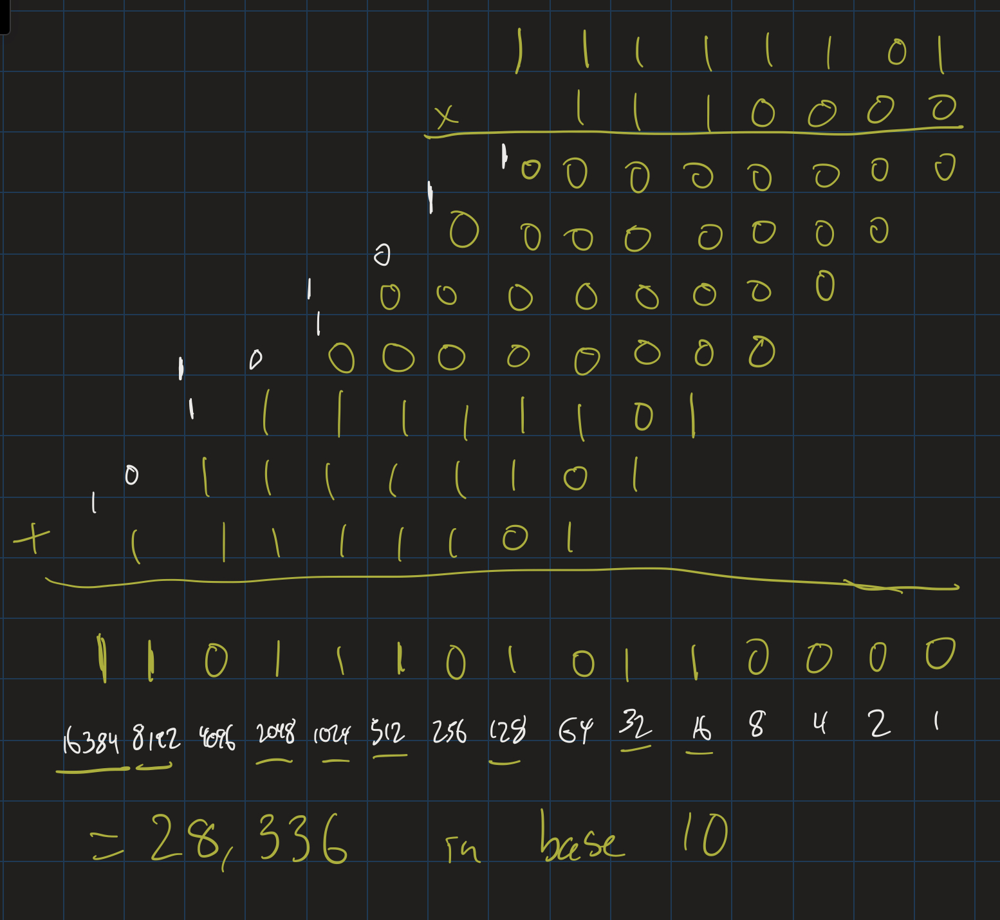
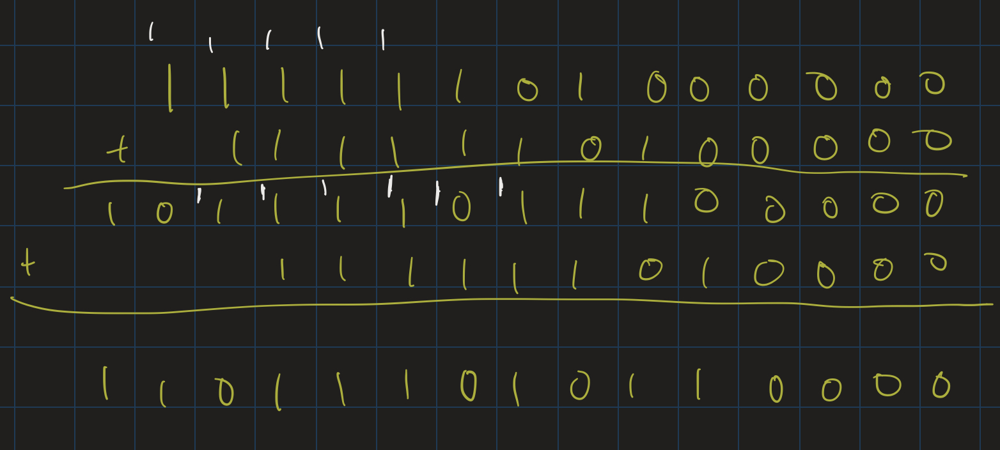

# Topics in Advanced Computing Lesson 0: Welcome!
{:.no_toc}

1. Table of Contents
{:toc}

# Incomplete map of CS

After the "fundamentals", computer science research can be in any of a number of topics. The below are very incomplete, but give an idea of how things might break down. These categories are not rigid: research in one of these areas may affect all the other categories, for example.

## Foundations

* Computability
* Complexity
* Analysis of algorithms
* Graph theory
* Learning theory
* Logic
* ...

## Software systems

* Programming Languages
* Compilers
* Operating Systems
* Networks
* Databases
* ...

## Intelligent Systems

* Artificial Intelligence
* Machine Learning
* Natural Language Processing
* Computer Vision

## Application Development

* Graphics
* UI Design
* Software architecture
* ...

## Computer Engineering

* Computer architecture
* Digital Logic
* ...

All of these assume the basic fundamentals: programming, algorithms, the basics of running time and Big Oh analysis, data structures, etc. As mentioned before, these are all interconnected. This is incomplete, but it's a decent approximation. You can, for example, see some of the "tracks" available in the [Columbia University CS curriculum](https://mice.cs.columbia.edu/c/d.php?d=271) or the [Cornell University CS curriculum](https://www.cs.cornell.edu/undergrad/csmajor/electivesCS).

# This course

* Interleaved lectures (by me) and student Presentations
* 3 presentations per student (roughly 15-20 minutes per student)
* 2 short papers (2-5 pages and 5-8 pages)

## Lecture portion

* **Complexity theory**.
* Entirely mathematics based, but studying computer science problems / algorithms
* Won't cover everything, but get a broad introduction to the topic and major research trends.

## Student presentations and papers

Pick **any** CS topic. We've seen the possible list above and [on the syllabus](syllabus.html), but there are many other things that one can talk about.

* Talks and papers should be **pedagogical**. We should learn from them. Give us a glimpse of what that field or topic is about, why it's important, etc.
* Let me know what topic you are interested in via email by **Friday, September 9**. If you have no idea, come to office hours this week or schedule a Zoom call with me next week.
* Come to office hours **at least one week** before your talks! That will give me time to evaluate whether you have the appropriate resources for the talk, and to suggest other resources if you need them.

**Note for the seniors**: your research topic here may overlap with your senior project, but the focus is different. Here, we are not focusing on producing original work, but on learning and teaching something deeply. For example, if you are working on an idea about quantum computing, your senior project might be a new quantum algorithm, while your papers / talks here might focus on "What is quantum computing?" from a big picture perspective.

## Tentative schedule for workload:

* Pick a topic: weeks 1-2
* Problem set 1: week 2-3
* Presentation 1: weeks 5-6
* Problem set 2: weeks 7-8
* Presentation 2: weeks 8-9
* Midterm paper: week 10
* Problem set 3: weeks 11-12
* Presentation 3: last week of the semester
* Problem set 4: last week of the semester
* Final paper: due during finals week

# Complexity theory

1. What is computation?
2. What is an algorithm?
3. How do we understand the efficiency of an algorithm?
4. What is the difference between an algorithm and its various implementations?

## Example

**Problem**: Given two positive integers $a$ and $b$ (how do we represent them?), compute their product.

There are many ways one can do this. For example, the first time we learn about multiplication, we are told that it is "repeated addition". $4 \times 5 = 20$ because $5 + 5 + 5 + 5 = 20$. This algorithm takes, roughly, 4 steps. (Perhaps you can say it takes a few more, since you have to store the sums we get along the way). In general, though, what's the running time of mutliplying $a \times b$ by doing $b + b + b + \ldots + b$ ($a$ times)?

**Semi-formal definition**: The running time of an algorithm is given by a function $T(n)$ such that $T(n)$ is the maximum amount of "steps" the algorithm takes to compute on *any* input of *size* $n$.

Questions about this definition:

1. What is a "step"?
2. What do we mean by the "size" of an input? If we are multiplying $253 \times 112$, what is the size of the input?

To really understand this, we need to think about representations. As we know, computers represent everything in binary. $253 \times 112$ would look like $11111101 \times 1110000$. (Aside: [binary representations of numbers](https://atharaq.github.io/discrete/lesson13.html)) What is the size of the input? Roughly $8$ bits for $253$ and $7$ bits for $112$. That is, our input has about $15$ bits of data in it.

For the algorithm described above, we would end up adding $112$ to itself $253$ times. Assuming we could quickly compute these individual sums, this is still significantly more steps than the size of the input. What if we double the size of the input? Instead of looking at an 8-bit integer and a 7-bit integer, what if we multiplied two 16-bit integers? What would be the longest running time for that? What are the largest 16-bit integers?

Aside:  
* the largest 1-bit integer is 1.
* the largest 2-bit integer is 3. ($11$ in binary is $2 + 1$).
* the largest 3-bit integer is 7. ($111$ in binary is $4 + 2 + 1$).
* the largest 4-bit integer is 15. ($1111 = 8 + 4 + 2 + 1$).
* Pattern?
* The largest $n$-bit integer is $2^n - 1$.

So in general, this algorithm will take $T(n) = 2^n - 1$ additions (assuming we can add $n$-bit integers to each other quickly; that is probably not a safe assumption, but it's fine for now). That is, we have described an **exponential** algorithm. Is there a better one?

## Better algorithm

Certainly: we all use it all the time. We never multiply numbers by doing repeated addiiton. Instead we do "grade school" long multiplication. So let's multiply $11111101 \times 1110000$ using long multiplication and figure out how many steps this takes:

So it looks like for each bit in $b$, we have a corresponding row that we need to write down. That row always ends up either being all zeros, or just $11111101$ with a bunch of zeros (represented by blanks) after it. If we forget about the rows that are just zeros, we have a simpler way of multiplying the numbers. In binary, $1110000$ means $2^6 + 2^5 + 2^4$. So to multiply $11111101 \times 1110000$, we just need 3 multiplications:

* $11111101 \times 2^6 = 11111101000000$ (just add 6 zeros at the end)
* $11111101 \times 2^5 = 1111110100000$
* $11111101 \times 2^4 = 111111010000$

Then we add those three numbers together: 11111101000000 + 1111110100000 + 111111010000:

This actually still required $6$ additions, we just didn't write all of them down since many of them were just adding 0. So let's generalize: suppose $a$ and $b$ both have $n$-bits. For each bit in $b$, we write down either $a$ with some extra zeros, or just $0$. Then we add together all of those numbers.

* The intermediate steps are very quick to write down, they just amount to copying over the $n$ bits of $a$ and adding over some number of zeros (or just writing down 0). (That is, the intermediate steps may take about $n$ steps to copy over the $n$ bits).
* How many of these intermediate numbers do we end up with? $n$: one for each bit of $b$.

So that's about $n^2$ steps to get all of the intermediate numbers written down: we copy over $n$ bits about $n$ times. Now we add them.

* How many additions do we end up doing? $n - 1$: when we added three numbers, we needed to do two additions. Same concept.
* How many steps would one of the individual additions take? Also about $n$ steps (technically, maybe $2n$).

So that's another roughly $n \times (n - 1)$ steps for the addition. In total, that's about $2n^2 - n$ steps for this algorithm.

How does this compare to the other algorithm? Remember, the "repeated addition" algorithm would take $2^n - 1$ additions. I didn't even get into how long each addition would take, but if each one takes about $n$ steps, then that's $n \times (2^n - 1)$ steps in total. Therefore:

* Repeated addition: $n \times (2^n - 1)$.
* Grade school algorithm: $2n^2 - n$.

These are *rough* estimates, as we are ignoring things that could come up depending on the type of hardware used. But this could give us a good idea. For example, in Java, integers are stored using 32 bits of memory. How many steps would these respective algorithms take?

* Repeated addition: $32 \times (2^32 - 1) \approx$ 100 billion.
* Grade school algorithm: $2 \times 32^2 - 32 \approx 2000$.

The second algorithm is *insanely* faster, to the point where the textbook says:

> a pocket calculator running the grade-school algorithm would beat the best current supercomputer running the repeated addition algorithm. For slightly larger numbers even a fifth grader with pen and paper would outperform a supercomputer.

(Page 4 of the textbook)

That is: if we solve a problem using a poor algorithm, no matter how good our hardware is, we will have suboptimal performance. And vice versa: if we find the best possible algorithm for a problem, we improve performance significantly more than by simply buying better hardware. There are limits to this logic, though: cutting the running time of an algorithm in half probably would not have as much of an effect as buying a computer with more RAM, a larger cache, and a more powerful CPU. So how do we determine when one algorithm truly beats another, from an efficiency standpoint?

Questions to consider:

* What do you consider to be an *efficient* running time for an algorithm?
* Are there some running times that are clearly "inefficient"?
* If you write a program that only performs "efficient" computations, and calls other functions that are "efficient", is your program still efficient?

# Readings

Read pages 1-14 of the textbook. That is, the Introduction and Section 1.1. Come prepared with any questions you have!
