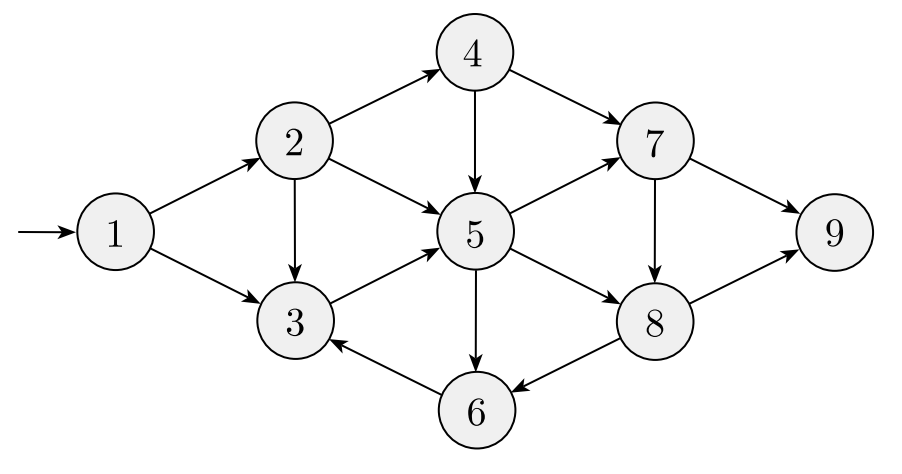

# Topics in Advanced Computing Lesson 12: PSPACE-completeness
{:.no_toc}

1. Table of Contents
{:toc}

# Correction

Last time we looked at the recursive algorithm for solving the formula game. We said that if the formula has length $m$ and contains $n$ quantified variables, our algorithm would take $O(mn)$ space. In fact, we can do better:

* For each recursive call, just use **a single extra bit** of memory, corresponding to whether you set the new variables to $1$ or $0$.
* If you have a formula $\phi$, with variables $x_1, \ldots, x_n$ in it, and you have a sequence of $n$ bits, you can, essentially, run the "SAT verifier" algorithm: is $\phi$ true with this sequence of $n$ bits?

In other words: we don't need to copy the *whole* formula over each time.

# Geography Game

A simple two player game for children: players alternate naming cities. Player one picks any city, then player two must respond with a city which starts with the last name of player one's city. Then play continues in this manner:

* Purchase -> Edison -> Newark -> Kalamazoo -> Oxford -> ...

Play continues until one player can no longer name a city. In the *generalized* version of this game, we abstract away the notion of a city and letters to a (directed) graph.

We pick one specific node to act as our "start node". Players alternate picking "next nodes". Let's play this game. Who has a winning strategy (for this graph)?

The **geography game**, in general, asks: given a directed graph $G$ and a designated start node $v$, does player I have a winning strategy in the geography game for $(G, b)$? This game is also PSPACE-complete.

## $GG \in PSPACE$

First we show that the game is in PSPACE. Suppose we are given a directed graph $G$ and a start node $v$. What might our algorithm be? Hint: think recursively, again!

M: On input $(G, v)$:

1. If $v$ has no out-edges, then player I has no initial move, so halt and output **FALSE**.
2. For each $w$ that $v$ points to:
  * Remove $v$ and all edges (in or out of $v$) to get a new graph $G^\prime$.
  * Run $M(G^\prime, w)$. If this outputs **FALSE**, then player II has no winning strategy for the game starting at $w$, so player I will win: output **TRUE**.
  * If it outputs **TRUE**, continue (the for loop).
3. If all of the above output **TRUE**, then player II has a winning strategy, so output **FALSE**.

How much space is required for this algorithm? In the recursion, we again don't need to copy over all of the graph, we just need to keep track of which vertices we have deleted.

**Exercise**: Suppose $G$ has $n$ vertices. How much space does this algorithm require?

## $GG$ is $PSPACE$-hard

Now we show that $FORMULA$-$GAME \leq_P GG$. That is, given a QBF $\phi$, we construct a graph $G$ and designated start vertex $v$ so that $\exists$ has a winning strategy for the formula game for $\phi$ if and only if player I has a winning strategy for the geograph game for $(G, v)$. Moreover, this construction should be done in polynomial time.

First, we make a couple of assumptions:

* Assume that the first and last quantifiers in $\phi$ are both $\exists$.
* Assume that the quantifiers alternate between $\exists$ and $\forall$.
* Assume that, after the block of quantifiers, the formula is in CNF.

This is possible: for example, if $\phi = \exists x_1 \exists x_2 (x_1 \vee x_2) \wedge (\lnot x_1 \vee \lnot x_2)$, we can add in an extra quantifier over a dummy variable, so that we have an equivalent formula: $\theta = \exists x_1 \forall y \exists x_2 (x_1 \vee \x_2) \wedge (\lnot x_1 \vee \lnot x_2)$. Then $\theta$ is true if and only if $\phi$ is true, and it only take linear time to make this change.

Given $\phi$, we construct a graph in two stages. First, we build a specific pattern that represents the blocks of alternating quantifiers:

* We start at the top with a node $v$. $v$ should have two edges: a "TRUE" and a "FALSE" edge, representing whether $\exists$ plays $x_1$ is TRUE or FALSE.
* Each of those vertices connect to another vertex below $v$ to make a diamond structure.
* Then this vertex connects to a single vertex below it.
* This then leads into another "diamond" pattern for $x_2$ and then this pattern continues.

If you're following, player I would pick T/F for $x_1$, then player II would be forced to connect the diamond, and I would be forced to lead into the next diamond, allowing II to choose T/F for $x_2$)

After all of these diamonds, the bottom node connects to some fixed node $c$, which will represent the clauses. For each clause $\phi_1, \ldots, \phi_m$, we create corresponding nodes $c_1, \ldots, c_m$, with $c$ having edges to each of these clause nodes.

For each clause, we create nodes that correspond to each literal in the clause. For example, if $\phi$ is $\exists x_1 \forall x_2 (x_1 \vee x_2) \wedge (x_1 \vee \lnot x_2)$, we would have two clause nodes $c_1$ and $c_2$. $c_1$ would point to two vertices labeled $x_1$ and $x_2$, and $c_2$ would point to two *other* vertices, labeled $x_1$ and $\lnot x_2$. Then we connect each $x_i$ node to the "TRUE" label for $x_i$, and $\lnot x_i$ node to the FALSE label for $x_i$.

**Exercise**: Explain why, if $\exists$ has a winning strategy, then Player I has a winning strategy in this game, and vice versa.

# Polynomial Time Hierarchy

# Upcoming

...
