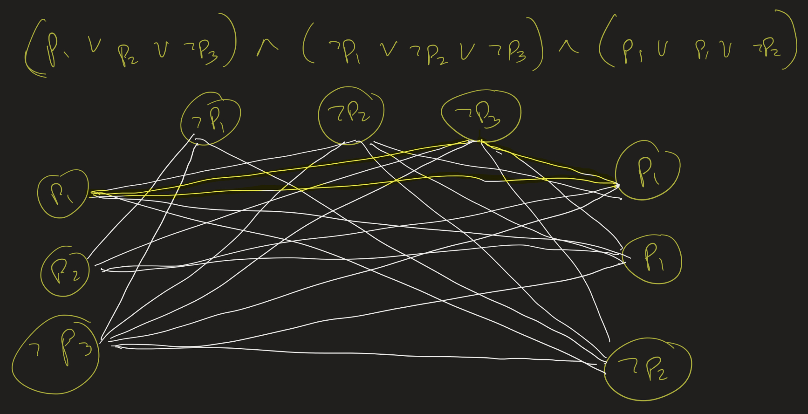

# Topics in Advanced Computing Lesson 8: co-NP, EXP, NEXP
{:.no_toc}

1. Table of Contents
{:toc}

# Warm Up: CLIQUE

Given a graph $G$ and a number $k$, a $k$-clique is a subset of vertices of size $k$ which are all connected to one another. For example the following graph has a 3-clique:

The problem $CLIQUE$ is, given a graph $G$ and a number $k$, determine if $G$ contains a $k$-clique.

**Theorem**: $CLIQUE \in NP$.

**Exercise**: Prove this theorem.

1. What is the "certificate"?
2. What's the verifier algorithm?
3. What's the running time of your algorithm?

# SAT vs IPROG

Recall that we have already seen that $SAT \leq_P IPROG$. This means that if the integer programming problem has a polynomial time solution, then $SAT$ does as well. Therefore, if $IPROG \in P$, then $P = NP$, and so $IPROG$ is also NP-complete!

# CLIQUE is NP-Complete

The problem **3-SAT** is similar to SAT but all the clauses for the input formula are required to have at most 3 literals in them. 3-SAT is known to be NP-complete as there is a simple algorithm which reduces SAT to 3-SAT. We will not go over this now.

**Theorem**: $3-SAT \leq_P CLIQUE$.

**Proof**:

Suppose $\phi(p_1, \ldots, p_n)$ is a formula with $n$ variables and $m$ clauses. We build a graph $G$ with $m$ groups of triples (three vertices); the triples correspond to the clauses of $\phi$. For example, if we have a clause $p_1 \vee p_1 \vee \lnot p_2$, we put three nodes labeled $p_1$, $p_1$ and $\lnot p_2$ in our graph.

We put edges between all vertices except if they are in the same triple (if they correspond to two literals from the same clause), or if they are contradictory (if one corresponds to $p$ and one to $\lnot p$, for some variable $p$).

For example, if we start with the formula
$$
\begin{align}
(p_1 \vee p_2 \vee \lnot p_3) \wedge (\lnot p_1 \vee \lnot p_2 \vee \lnot p_3) \\
\wedge (p_1 \vee p_1 \vee \lnot p_2),
\end{align}
$$ we get a graph with 9 vertices (3 triples). A satisfying assignment for $\phi$ would correspond to a 3-clique in this graph.

**Claim**: $\phi$ is satisfiable if and only if $G$ has an $m$-clique.

# co-NP

Suppose $X$ is a problem, described set-theoretically. By $\bar{X}$ we mean the *complement* of $X$, meaning the set of those inputs $x$ such that $x \not \in X$.

**Exercise**: Show that if $A \in P$, then $\bar{A} \in P$.

**Definition**: The class **co-NP** consists of the problems $X$ such that $\bar{X} \in NP$.

In particular, this does not mean that $X \not \in NP$. For example, if $X \in P$, then $\bar{X} \in P$, and since $P \subseteq NP$, that means both $X$ and $\bar{X}$ are in NP.

One way to show that a problem $X$ is in co-NP is to show that there is a verifier for the complement. In other words, show that there is a polynomial time machine $M$, such that for all $x$, if $x \in X$, then for every certificate $c$, $M(x, c) = 1$, and if $x \not \in X$, then there is a certificate $c$ such that $M(x, c) = 0$.

**Example**: A *tautology* in Boolean logic is a formula which evaluates to *true* under all possible assignments. For example, the formula $(p_1 \vee \lnot p_1) \wedge (p_2 \vee \lnot p_2)$ is a tautology.

The TAUTOLOGY problem asks: given a formula $\phi$ with $n$ variables and $m$ clauses, is $\phi$ true under every possible assignment?

**Exercise**: Show that $TAUTOLOGY \in co$-$NP$. (Hint: suppose $\phi$ is a formula and a certificate is a possible assignment for $\phi$. What should we do?)

**Theorem**: TAUTOLOGY is co-NP-complete. That is, for every problem $A$, if $A \in co$-$NP$, then $A \leq_P TAUTOLOGY$.

The proof is just that $\bar{A} \leq_P SAT$. That is, there is a polynomial time computable function $f$ such that on input $x$, $f(x)$ outputs a formula $\phi$ such that $\phi$ is satisfiable if and only if $x \not \in A$. In particular, $\phi$ evaluates to false under **all** assignments if and only if $x \in A$. That means that $\lnot \phi$ is a tautology if and only if $x \in A$!

**Theorem**: Suppose $P = NP$. Then $NP = co$-$NP$.

(Can you prove this? What about the converse? If $NP = co$-$NP$, does this mean $P = NP$?)

It turns out that this is still an open question: does $NP = co$-NP?

## Integer Factoring

The **integer factoring** problem asks: given inputs $x$ and $y$ (positive integers), determine if $x$ has a factor in the interval $(1, y)$.

**Claim**: The integer factoring problem is in both NP and co-NP.

* To see it's in NP: given input $x$, let the certificate $c$ be a factor in the correct interval. Then show that $c$ is a factor of $x$ by dividing (polynomial time?).
* To see it's in co-NP? What does this even mean?
   * Given inputs $x$ and $y$, we need to certify that $x$ has *no* factors in the interval $(1, y)$.
   * Let the certificate $c$ be an increasing list of non-negative prime factors of $x$.
   * Certify that these multiply together to get $x$, that they are all greater than $y$, and that they are all prime.
   * The last part requires the fact that $PRIMES \in P$ (Agrawal-Kayal-Saxena 2002, aka the "AKS Primality Test").

# Problem Set 2

**Due Thursday, October 20**.

1. Show that $\leq_P$ is *transitive*: that is, suppose $A \leq_P B$ and $B \leq_P C$ (that is, that $A$ is polynomial-time reducible to $B$, and $B$ is polynomial-time reducible to $C$). Show that $A \leq_P C$.
2. Suppose $A$ is NP-complete and $A \leq_P B$. Explain why this means that $B$ is NP-complete. (Hint: Use question 1.)
3. Assume that $P \neq NP$ for this problem. Suppose $A$ is NP-complete. If $B \leq_P A$, is $B$ necessarily NP-complete?
4. Show that $SAT \in NP$ by giving a verifier algorithm for SAT. Make sure to explain the following:
   * What is the certificate?
   * What is your verifier algorithm?
   * Why does your verifier run in polynomial time (in terms of the length of your input)?
